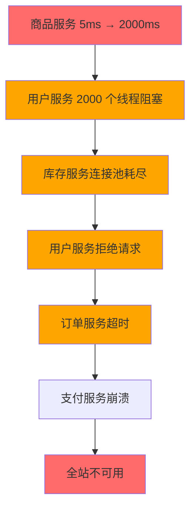
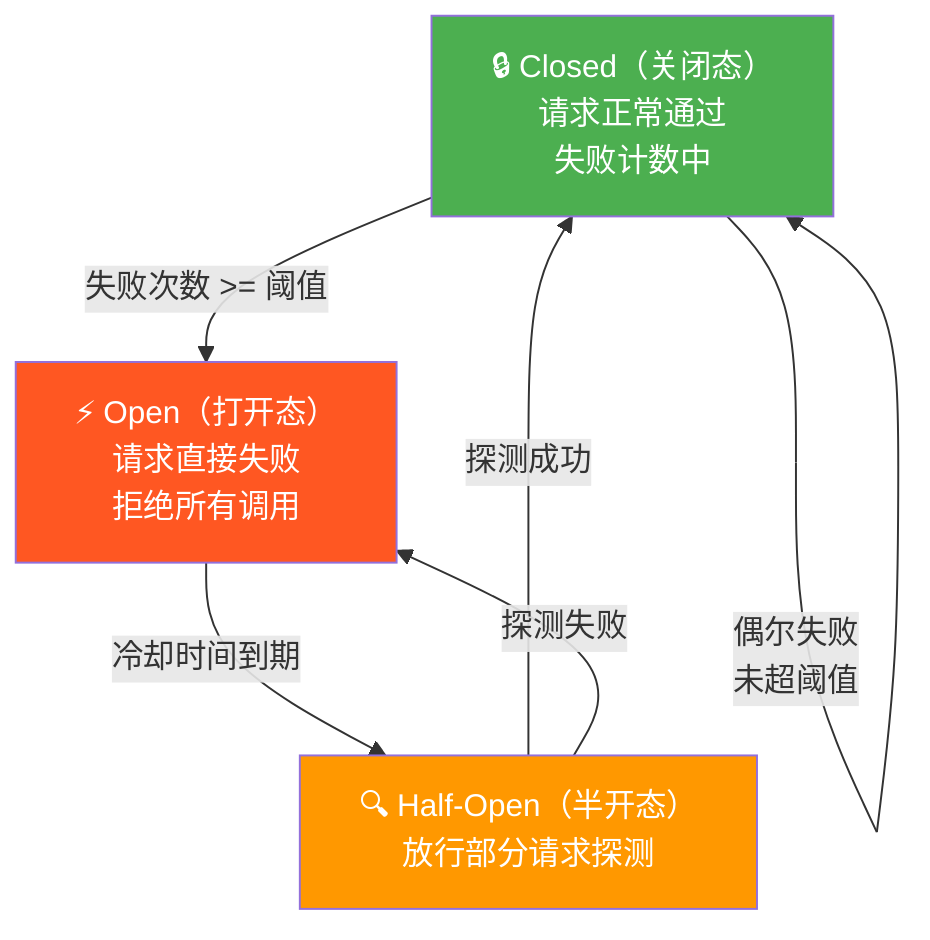

# 降级与熔断

2018年双十一，我们的商品服务因为一次 GC 停顿导致响应时间从 5ms 飙升到 2000ms。

这 2 秒的超时不只是拖慢了商品服务——下游的用户服务、库存服务、促销服务都在等待商品服务的响应。由于都是同步调用，2000 个线程全部阻塞在商品服务的连接池上。

库存服务撑不住了，开始拒绝用户服务的请求。用户服务开始拒绝订单服务的请求。订单服务开始拒绝支付服务的请求。

整个链路，从商品服务一个点，扩散到了全站不可用。

这就是经典的**雪崩效应（Cascading Failure）**。

事后我们复盘，结论是：服务 A 的故障拖垮了服务 B，服务 B 的故障拖垮了服务 C，最终整个系统崩溃。这次事故教会我们一件事——**在分布式系统中，保护自己比依赖别人更重要**。

降级和熔断，就是保护自己的手段。

## 问题定义

### 雪崩的根因：同步等待

雪崩的形成需要三个条件：

1. **同步调用**：调用方等待被调用方返回后才继续，超过阈值就超时
2. **共享资源**：多个服务共享同一批线程池、连接池
3. **无兜底方案**：被调用方超时/失败后，调用方没有降级逻辑



### 降级 vs 熔断：两个不同的防线

| 概念 | 降级（Degradation） | 熔断（Circuit Breaker） |
| --- | --- | --- |
| **目标** | 放弃非核心功能，保证核心功能可用 | 快速失败，防止故障扩散 |
| **触发条件** | 被调用方响应慢/出错 | 被调用方错误率超过阈值 |
| **表现** | 返回兜底数据（缓存/默认值/错误码） | 直接返回失败，不发请求 |
| **恢复方式** | 被调用方恢复后自动切换回来 | 熔断器半开后探测，成功才关闭 |
| **解决的问题** | "可用性"：服务降级但不离线 | "保护性"：停止调用避免拖垮自己 |

【架构权衡】

降级和熔断不是二选一，而是两道防线。熔断是第一道：检测到下游故障后，停止调用，避免资源耗尽。降级是第二道：熔断后或主动切换时，返回兜底数据，保证业务不中断。没有熔断的降级是裸奔——下游故障时降级请求还是会打到下游，只是返回了错误数据；没有降级的熔断是自杀——熔断后直接返回失败，用户体验极差。两者配合，才是完整的保护体系。

## 熔断器模式：三态自动机

熔断器的核心是一个三态自动机：Closed（关闭）、Open（打开）、Half-Open（半开）。



### 三态详解

**Closed（关闭态）**

正常状态，所有请求都能通过。失败计数器记录失败次数：
- 失败次数 `<` 阈值：继续统计
- 失败次数 `>=` 阈值：切换到 Open

**Open（打开态）**

熔断触发，所有请求直接返回降级结果，不发往下游。等待冷却时间（如 60 秒）后切换到 Half-Open。

**Half-Open（半开态）**

放行少量请求（通常是 1 个）进行探测：
- 探测成功：切换到 Closed，计数器归零
- 探测失败：切换回 Open，重新计时

【架构权衡】

熔断器的三个参数（失败阈值、冷却时间、半开探测数）不是一次配好的，而是在生产环境中不断调优的。上线初期建议保守：阈值设低一点，冷却时间设长一点，宁可误熔断也不能不熔断。稳定运行 2-4 周后，根据监控数据逐步放宽。上线第一个月就因熔断导致用户体验下降的团队，往往是把阈值设得太激进。

## 关键参数配置

### 失败阈值

**快照窗口（Rolling Window）**

失败率不是针对所有请求计算的，而是在一个滑动时间窗口内统计。例如：10 秒内 100 个请求中失败超过 50 个，就触发熔断。

```java
// Resilience4j 的滑动窗口配置
CircuitBreakerConfig config = CircuitBreakerConfig.custom()
    .slidingWindowType(SlidingWindowType.COUNT_BASED)  // 基于请求数
    .slidingWindowSize(100)                            // 窗口内 100 个请求
    .minimumNumberOfCalls(10)                         // 最少 10 个请求才统计
    .failureRateThreshold(50)                         // 50% 失败率触发熔断
    .slowCallRateThreshold(80)                         // 80% 慢调用率触发熔断
    .slowCallDurationThreshold(Duration.ofSeconds(3))  // >3 秒算慢调用
    .build();
```

**最小请求数**

如果当前窗口内请求数太少（比如只有 5 个），失败率计算没有意义。设置 `minimumNumberOfCalls`（如 10）后，失败率才生效。

### 冷却时间

冷却时间（Wait Duration In Open State）太短：故障还没恢复就又放请求过去，容易"抖动"。
冷却时间（Wait Duration In Open State）太长：下游恢复了但熔断器不开，用户体验持续下降。

建议：`>= 30 秒`，首次上线设 60 秒，运行稳定后逐步缩短到 30 秒。

### 半开探测数

半开态时放行多少请求进行探测？

```java
// Sentinel 的半开配置
DegradeRule rule = new DegradeRule("userService")
    .setGrade(CircuitBreardStrategy.SLOW_REQUEST_RATIO)  // 慢调用比例
    .setCount(0.5)                                         // 50% 算慢
    .setSlowRatioThreshold(0.5)
    .setMinRequestAmount(5)                                // 最小请求数
    .setStatIntervalMs(1000)                              // 统计周期 1 秒
    .setTimeWindow(10);                                    // 熔断持续 10 秒
```

【架构权衡】

探测数的选择是一个权衡：放行太多，故障还没恢复就被打垮了；放行太少，误判的概率高。建议设置为 1-5 个请求。如果对可用性要求极高（如核心交易链路），可以把半开态的探测成功率阈值设低一点，宁可多试几次也不轻易关闭。

## 三框架实现对比

### Hystrix（已停止维护，但仍在大量使用）

Netflix 的 Hystrix 是熔断器的"祖师爷"，2018 年宣布停止维护，但很多遗留系统仍在使用它。

```java
@HystrixCommand(
    fallbackMethod = "getUserFallback",
    commandProperties = {
        @HystrixProperty(name = "circuitBreaker.requestVolumeThreshold", value = "20"),
        @HystrixProperty(name = "circuitBreaker.sleepWindowInMilliseconds", value = "10000"),
        @HystrixProperty(name = "circuitBreaker.errorThresholdPercentage", value = "50")
    },
    threadPoolProperties = {
        @HystrixProperty(name = "coreSize", value = "10"),
        @HystrixProperty(name = "maxQueueSize", value = "100")
    }
)
public User getUser(Long userId) {
    return userClient.getUser(userId);
}

// 兜底方法
public User getUserFallback(Long userId, Throwable t) {
    log.warn("getUser fallback, userId={}, error={}", userId, t.getMessage());
    return userCache.get(userId);  // 从缓存获取
}
```

Hystrix 的核心设计是**线程池隔离**（每个依赖服务一个独立线程池），而不是信号量隔离。

### Sentinel（阿里开源）

Sentinel 是阿里的流量控制和熔断组件，与 Hystrix 相比更轻量，且支持更多降级策略。

```java
// Sentinel 熔断配置
DegradeRule rule = new DegradeRule("getUser")
    .setGrade(CircuitBreakerStrategy.ERROR_RATIO)  // 按错误比例熔断
    .setCount(0.5)                                  // 50% 错误率
    .setMinRequestAmount(10)                        // 最小 10 个请求
    .setTimeWindow(10);                             // 熔断 10 秒

DegradeRuleManager.loadRules(Collections.singletonList(rule));

// 编程式使用
try (Entry entry = SphU.entry("getUser")) {
    return userClient.getUser(userId);
} catch (BlockException e) {
    // 触发熔断/限流，进入降级逻辑
    return getUserFallback(userId);
}
```

### Resilience4j（Spring Cloud Alibaba 主流选择）

Resilience4j 是目前 Spring Cloud 生态中最活跃的熔断组件，轻量、支持函数式 API。

```java
// Resilience4j 配置
CircuitBreaker circuitBreaker = CircuitBreakerRegistry.ofDefaults()
    .circuitBreaker("userService");

// 编程式使用
Supplier<User> decoratedSupplier = Decorators
    .ofSupplier(() -> userClient.getUser(userId))
    .withCircuitBreaker(circuitBreaker)
    .withFallback(List.of(Exception.class), e -> getUserFallback(e))
    .decorate();

return decoratedSupplier.get();

// 配置式
@CircuitBreaker(name = "userService", fallbackMethod = "getUserFallback")
public User getUser(Long userId) {
    return userClient.getUser(userId);
}
```

| 特性 | Hystrix | Sentinel | Resilience4j |
| --- | --- | --- | --- |
| **维护状态** | 已停止维护（2021 年） | 活跃维护 | 活跃维护 |
| **隔离方式** | 线程池隔离 | 信号量/线程池 | 信号量/线程池 |
| **熔断策略** | 错误比例 + 慢调用比例 | 错误比例/慢调用比例/异常数 | 错误比例/慢调用比例 |
| **降级策略** | Fallback 方法 | 降级规则（预定义 + 自定义） | Fallback 方法 |
| **QPS 限流** | 不支持（需配合 Zuul/Ribbon） | 支持 | 支持 |
| **学习曲线** | 中 | 中高 | 低 |
| **典型使用者** | 遗留系统、Netflix 生态 | 阿里系、Spring Cloud Alibaba | Spring Cloud 现代化项目 |

## 降级策略：五种兜底方案

### 策略一：返回缓存数据

```java
public User getUserFallback(Long userId) {
    // 从本地缓存获取
    User cached = localCache.get(userId);
    if (cached != null) return cached;

    // 从 Redis 获取
    cached = redis.get("user:" + userId);
    if (cached != null) {
        localCache.put(userId, cached); // 回填本地缓存
        return cached;
    }

    return User.DEFAULT; // 返回默认值
}
```

**适用场景**：读多写少、数据变更不频繁的业务。

### 策略二：返回历史数据

```java
public OrderList getOrderHistoryFallback(Long userId) {
    // 返回最近一次成功查询的历史数据
    OrderList history = orderHistoryStore.getLastSuccess(userId);
    if (history != null) {
        history.setStale(true); // 标记为"可能过期"
        return history;
    }
    return OrderList.EMPTY;
}
```

**适用场景**：列表查询类业务，用户能接受看到"可能过期"的数据。

### 策略三：返回友好错误码

```java
// 不返回 500，返回业务友好的错误码
public Result<Order> createOrderFallback(OrderRequest req, Throwable t) {
    return Result.fail("服务繁忙，请稍后重试（错误码：S001）");
}
```

**适用场景**：所有外部 API，错误信息需要用户友好。

### 策略四：返回降级数据 + 异步补偿

```java
public ProductDetail getProductFallback(Long productId, Throwable t) {
    // 先返回基础信息（异步任务去加载完整信息）
    ProductDetail base = productBaseCache.get(productId);

    // 触发异步补偿
    asyncExecutor.submit(() -> {
        try {
            ProductDetail full = productClient.getProduct(productId);
            productBaseCache.put(productId, full);
        } catch (Exception e) {
            log.error("补偿加载失败 productId={}", productId, e);
        }
    });

    return base;
}
```

**适用场景**：详情页类业务，用户可以先看到部分信息。

### 策略五：切换备用数据源

```java
public Weather getWeatherFallback(String city) {
    try {
        // 主数据源（气象局 API）不可用
        // 切换到备用数据源（第三方天气 API）
        return backupWeatherClient.getWeather(city);
    } catch (Exception e) {
        // 备用也不可用，返回默认天气
        return Weather.DEFAULT;
    }
}
```

**适用场景**：有多数据源的业务，主数据源不可用时切换到备用。

## 线程池隔离 vs 信号量隔离

这是 Hystrix 和 Sentinel 中最核心的设计决策之一。

| 维度 | 线程池隔离 | 信号量隔离 |
| --- | --- | --- |
| **实现原理** | 每个依赖服务一个独立线程池 | 使用 `Semaphore`，无真正线程 |
| **并发控制** | 线程池大小限制并发数 | 许可数限制并发数 |
| **超时控制** | 可设置线程等待超时 | 无法细粒度控制单请求超时 |
| **故障隔离** | 强隔离，一个服务慢不影响另一个 | 弱隔离，共享同一线程 |
| **开销** | 线程创建/切换有开销 | 无线程开销，性能更好 |
| **适用场景** | 下游服务延迟不可控（HTTP 调用） | 下游是快速本地操作（内存计算） |

```java
// Hystrix 的线程池隔离
@HystrixCommand(
    threadPoolKey = "userServicePool",      // 独立线程池
    threadPoolProperties = {
        @HystrixProperty(name = "coreSize", value = "10"),
        @HystrixProperty(name = "maxQueueSize", value = "100"),
        @HystrixProperty(name = "keepAliveTimeMinutes", value = "1")
    }
)
public User getUser(Long userId) { ... }

// Sentinel 的信号量隔离
@SentinelResource(value = "getUser",
    blockHandler = "getUserFallback",
    fallback = "getUserFallback")
public User getUser(Long userId) { ... }
// 信号量隔离（默认方式）
```

【架构权衡】

选线程池隔离还是信号量隔离，本质上是在问：下游服务会不会拖垮我？下游延迟不可控（HTTP 调用、RPC 调用）→ 用线程池隔离，因为可以通过线程池超时保护自己。下游是本地操作（Redis、内存计算）→ 用信号量隔离，因为延迟可控，线程池开销反而是浪费。Hystrix 默认用线程池隔离，Sentinel 默认用信号量隔离——两者各有适用场景，不要盲目套用。

## 生产配置建议

### 阈值怎么定

不要拍脑袋，用数据说话：

1. **收集基线数据**：上线前在压测环境测量各服务的正常响应时间（P50/P95/P99）
2. **设置慢调用阈值**：P99 响应时间的 1.5-2 倍作为慢调用阈值
3. **设置熔断比例**：初期保守（30%），稳定后放宽（50%）
4. **设置最小请求数**：至少 50-100 个请求才有统计意义

```yaml
# Resilience4j 生产配置示例
resilience4j:
  circuitbreaker:
    instances:
      userService:
        slidingWindowType: COUNT_BASED
        slidingWindowSize: 100
        minimumNumberOfCalls: 50
        failureRateThreshold: 50
        slowCallRateThreshold: 80
        slowCallDurationThreshold: 3s
        waitDurationInOpenState: 60s
        permittedNumberOfCallsInHalfOpenState: 3
        automaticTransitionFromOpenToHalfOpenEnabled: true
```

### 如何避免误熔断

**问题**：业务高峰期，部分请求变慢是正常的，但如果触发了熔断，会放大故障。

**解决方案**：

1. 设置 `minimumNumberOfCalls`，避免低流量时期误触发
2. 慢调用阈值要基于 P99，不要基于平均值
3. 熔断后要立即告警，值班人员确认状态
4. 熔断比例不要设太低（低于 30% 会导致频繁抖动）

### 监控关键指标

| 指标 | 告警条件 | 含义 |
| --- | --- | --- |
| 熔断触发次数 | `> 1/分钟` | 下游服务不稳定 |
| 降级调用次数 | `> 10%/总调用` | 下游服务大规模故障 |
| 线程池队列积压 | `> 80% 容量` | 下游服务响应超时 |
| 熔断器状态变更 | 任意变更触发 | 配置变更或故障恢复 |

## 落地 Checklist

- [ ] 梳理服务依赖链路，识别核心链路和非核心链路
- [ ] 确定每个下游服务的慢调用阈值（基于 P99）
- [ ] 确定每个下游服务的熔断触发条件（错误率/慢调用率）
- [ ] 实现降级兜底方法（缓存、历史数据、错误码）
- [ ] 线程池隔离 vs 信号量隔离选型确认
- [ ] 配置熔断器参数（阈值、冷却时间、半开探测数）
- [ ] 添加熔断/降级触发监控告警
- [ ] 混沌工程演练：模拟下游故障，验证熔断行为
- [ ] 制定熔断后的值班响应流程
- [ ] 全链路压测，验证降级后系统的最大承载能力
