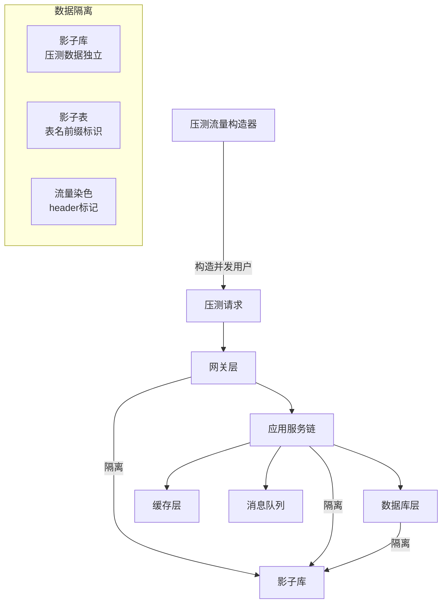
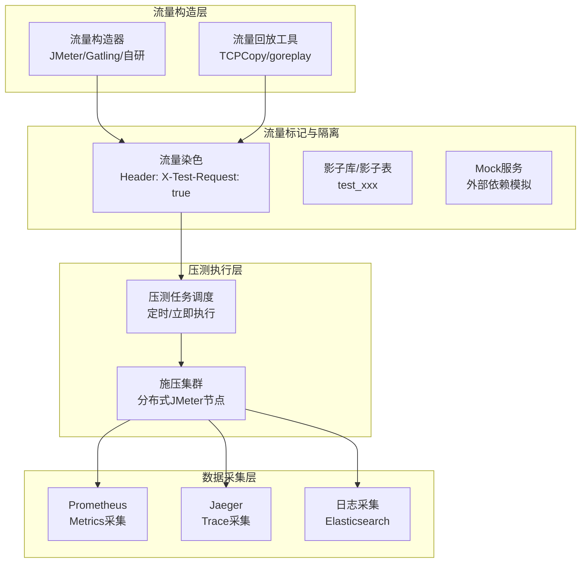
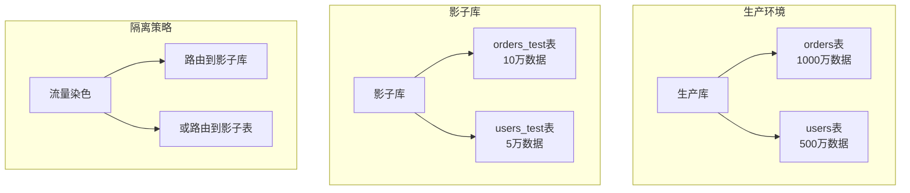
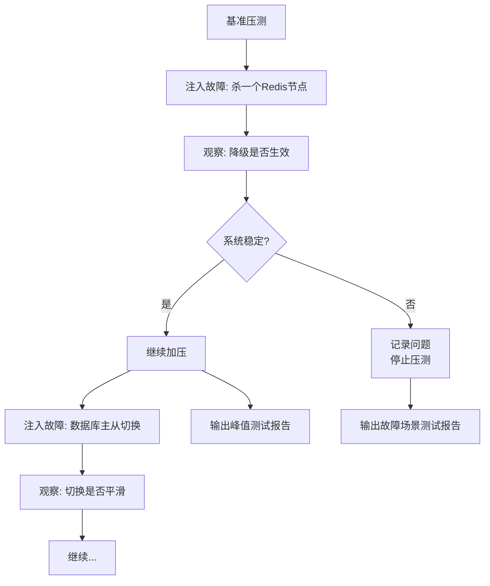
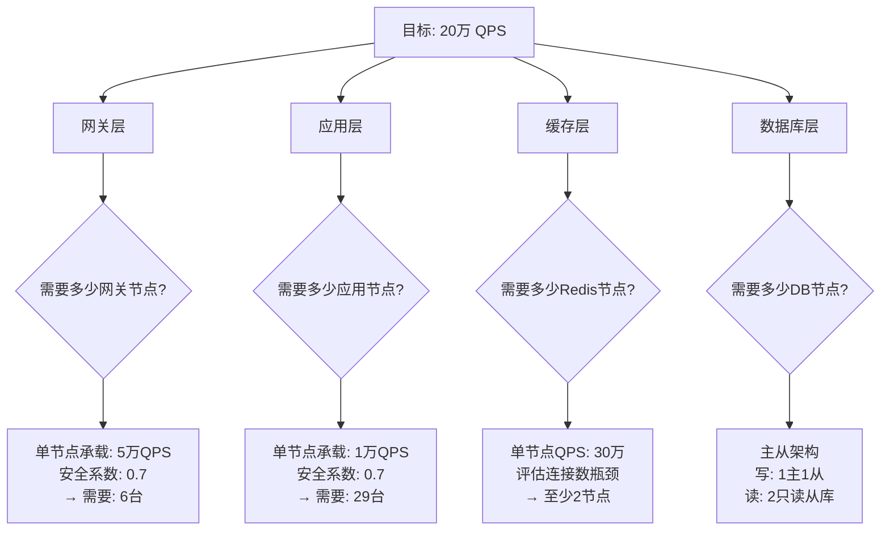

# 全链路压测

## 问题背景

2023年双十一前两周，某电商平台的 SRE 团队信心满满地发布了全链路压测报告：系统在 10 万 QPS 下一切正常，P99 延迟稳定在 120ms。

双十一零点，流量峰值冲到 15 万 QPS（比压测时高 50%）。系统在第 7 分钟开始出现连锁反应：Redis 连接池耗尽 → 商品服务超时 → 订单服务降级 → 支付服务雪崩。20 分钟后系统才逐步恢复。

事后复盘发现两个关键问题：
1. 压测时的 Redis 集群是新扩容的节点，连接数上限比生产环境低 40%，但压测报告没有记录这个差异
2. 压测流量只有"下单"一个链路，但生产流量中"查询订单"占了 60%，查询链路的并发度被严重低估

这次事故说明：**单链路压测不够，全链路压测做错了方向**。

【架构权衡】
全链路压测的成本很高——需要压测平台、影子库、专门的压测时间窗口。建议先用单链路压测定位瓶颈，全链路压测作为上线前的最终验证。把钱花在刀刃上：与其做一次覆盖全链路的"面子工程"压测，不如做 10 次精准定位瓶颈的单链路压测。

## 问题定义

全链路压测（Full-Link Pressure Testing）是对整个请求链路（从入口网关到后端数据库）进行真实的流量压测，验证系统在生产环境或接近生产环境的压力下的真实表现。

它要回答的问题：
- 当前系统能承受的最大 QPS 是多少？
- 在峰值流量下，P50/P90/P99 延迟是多少？
- 哪个子系统是瓶颈？
- 扩容方案是否有效？



## 为什么单链路压测不够

单链路压测只测试单个服务或子系统。但系统性能取决于整条链路中最薄弱的一环。

```mermaid
graph LR
    subgraph 单链路压测["单链路压测（不够）"]
        A1[服务A: 10万QPS] --> B1[服务B: 8万QPS]
        B1 --> C1[服务C: 12万QPS]
        A1 --> B1
    end

    subgraph 实际表现["实际链路表现"]
        A2[服务A: 10万QPS] --> B2[服务B: 8万QPS]
        B2 --> C2[服务C: ?]
        A2 --> B2
    end

    Note over B2: 实际QPS被限制在8万<br/>瓶颈在服务B
```

**木桶效应**：系统的最大吞吐量由最短板决定。单链路压测可以找到每个服务的瓶颈，但无法验证整条链路在叠加压力下的真实表现。

## 全链路压测的实现原理

### 核心组件



### 1. 流量标记（流量染色）

在请求 Header 中注入压测标记，整个链路透传这个标记：

```java
// 网关层注入压测标记
@Component
public class TestTrafficFilter extends ZuulFilter {

    @Override
    public Object run() {
        RequestContext ctx = RequestContext.getCurrentContext();
        // 如果是压测请求，注入标记
        if (isTestTraffic()) {
            ctx.addZuulRequestHeader("X-Test-Request", "true");
            ctx.addZuulRequestHeader("X-Test-Timestamp", String.valueOf(System.currentTimeMillis()));
        }
        return null;
    }
}

// 业务层识别压测流量
public class TestTrafficInterceptor {

    public boolean isTestTraffic(HttpServletRequest request) {
        String testFlag = request.getHeader("X-Test-Request");
        return "true".equals(testFlag);
    }
}
```

### 2. 影子库（Shadow Database）

压测数据写入独立的数据库，避免污染生产数据：

```java
@DataSourceRouter
public class DataSourceSelector {

    public String selectDataSource(JoinPoint point) {
        // 如果是压测流量，切换到影子库
        if (TestTrafficContext.isTestTraffic()) {
            return "shadow-datasource";
        }
        return "primary-datasource";
    }
}

// 影子库表命名规范
// 生产表: orders
// 影子表: orders_test 或 shadow_orders
```

### 3. Mock 外部依赖

第三方支付、短信网关等不可压测的外部服务需要 Mock：

```java
@ConditionalOnProperty(name = "test.mode", havingValue = "true")
@Service
public class MockPaymentService implements PaymentService {

    @Override
    public PaymentResult pay(PaymentRequest request) {
        // 模拟支付成功，延迟 50~100ms
        try {
            Thread.sleep(50 + new Random().nextInt(50));
        } catch (InterruptedException e) {
            Thread.currentThread().interrupt();
        }
        return PaymentResult.success(
            "TEST_TXN_" + UUID.randomUUID().toString().substring(0, 8),
            request.getAmount()
        );
    }
}
```

## 数据隔离方案

数据隔离是全链路压测中最核心也最容易出错的部分。

| 方案 | 原理 | 优点 | 缺点 |
| --- | --- | --- | --- |
| 影子库 | 独立数据库实例 | 完全隔离，无数据污染 | 成本高，维护复杂 |
| 影子表 | 同库不同表名（`_test` 后缀） | 成本低，改造小 | 共享存储，有风险 |
| 影子数据 | 生产数据 + 测试标记 | 接近真实 | 需要数据清洗，脱敏复杂 |



【架构权衡】
**不建议使用生产数据做全链路压测**。即使做了脱敏，生产数据的字段分布、关联关系和真实压测场景也有差异。更推荐的做法是：构造一个和生产数据结构相同但规模更小的影子数据集（通常为生产数据的 1%~10%），通过影子库或影子表隔离存储。

## 压测场景设计

### 基准测试

确定系统在正常负载下的性能基线。

```
场景：基准测试
目标：获取系统在 1万 QPS 下的 P50/P90/P99 延迟
持续时间：30分钟
预热时间：10分钟
```

### 峰值测试

模拟大促、秒杀等流量峰值。

```
场景：峰值测试
目标：验证系统在 15万 QPS 下的表现
施压策略：阶梯加压（5万 → 10万 → 15万 → 20万，每阶段5分钟）
终止条件：P99延迟 > 500ms 或 错误率 > 1%
```

### 异常测试

验证系统在故障场景下的降级和恢复能力。



## 容量规划

从压测数据推导机器数量，是全链路压测的核心价值之一。

### 核心计算公式

```
最大支持QPS = 单机QPS × 机器数量 × 安全系数
安全系数 = 0.7（预留30%的冗余容量）
```

### 单机 QPS 推导

```
假设压测结果：
- 5台机器支撑 10万 QPS
- 单机 QPS = 2万
- P99 延迟 = 120ms

则：
- 目标 20万 QPS → 需要 20万 / 2万 × 1.43 ≈ 15台机器
```

### 分层容量规划



## 全链路压测的风险

1. **对生产环境的影响**：即使有数据隔离，压测流量仍会占用网络带宽、连接池、CPU 等资源。压测时间窗口要避开业务高峰期。
2. **第三方依赖被压垮**：如果压测流量打到了真实的短信、支付网关，会产生真实费用或触发风控。
3. **数据残留**：压测数据如果清理不彻底，可能在生产环境留下垃圾数据。
4. **监控误判**：压测期间的大量超时/错误可能被监控误判为真实故障，触发不必要的告警。

:::warning ⚠️
全链路压测**不要在生产环境做**，除非你已经做好了完整的隔离和应急回滚预案。推荐在预发布环境（灰度环境）进行，该环境与生产环境配置相同但不处理真实流量。
:::

## 工程代价

| 维度 | 评估 |
| --- | --- |
| 平台建设成本 | 需要压测平台、流量构造、监控系统，投入 `+` 2~3 人月 |
| 环境成本 | 影子库占用额外存储和计算资源 |
| 执行成本 | 压测需要专业团队配合，一次完整压测可能需要 1~2 天 |
| 排障复杂度 | 压测期间的性能问题需要快速定位 |

【架构权衡】
全链路压测的价值不在于"测出了多少 QPS"，而在于**发现那些单链路压测无法发现的系统性瓶颈**——比如连接池配置不合理、线程池饥饿、热点 key 竞争、跨服务调用链路过长等等。这些问题只有在全链路叠加压力下才会暴露。

## 生产避坑

1. **压测前必须检查依赖**：确认所有外部依赖（支付、短信）已 Mock，确保不会产生真实费用。
2. **压测数据必须脱敏**：用户手机号、身份证号、银行卡号等敏感信息必须脱敏或使用虚构数据。
3. **压测时关闭定时任务**：压测期间的定时任务（如数据清理、报表生成）可能与压测流量产生干扰。
4. **压测后必须清理**：压测结束后立即清理影子库中的测试数据，避免积累垃圾数据影响后续压测准确性。
5. **压测结果要可重现**：记录压测环境的精确配置（机器规格、网络拓扑、依赖版本），下次压测才能对比。

## 落地 Checklist

- [ ] 评估是否真的需要全链路压测（目标 QPS 是否超过单链路压测能覆盖的范围）
- [ ] 搭建压测平台（JMeter 集群 / Gatling / 自研流量构造器）
- [ ] 设计数据隔离方案（影子库或影子表）
- [ ] 实现流量染色机制（Header 注入，链路透传）
- [ ] Mock 所有不可压测的外部依赖（支付、短信等）
- [ ] 准备压测数据集（影子数据构造，脱敏处理）
- [ ] 配置压测监控大盘（QPS、延迟、错误率、资源利用率）
- [ ] 设计压测场景（基准测试 → 峰值测试 → 异常测试）
- [ ] 压测前通知相关团队，压测期间配置静默告警
- [ ] 执行预发布环境压测，验证隔离方案有效性
- [ ] 执行生产前最终压测，验证扩容方案
- [ ] 输出压测报告：包含瓶颈分析、扩容建议、RTO/RPO 验证
- [ ] 压测后清理所有测试数据
- [ ] 建立压测 SOP，确保每次大促前都能快速执行压测
