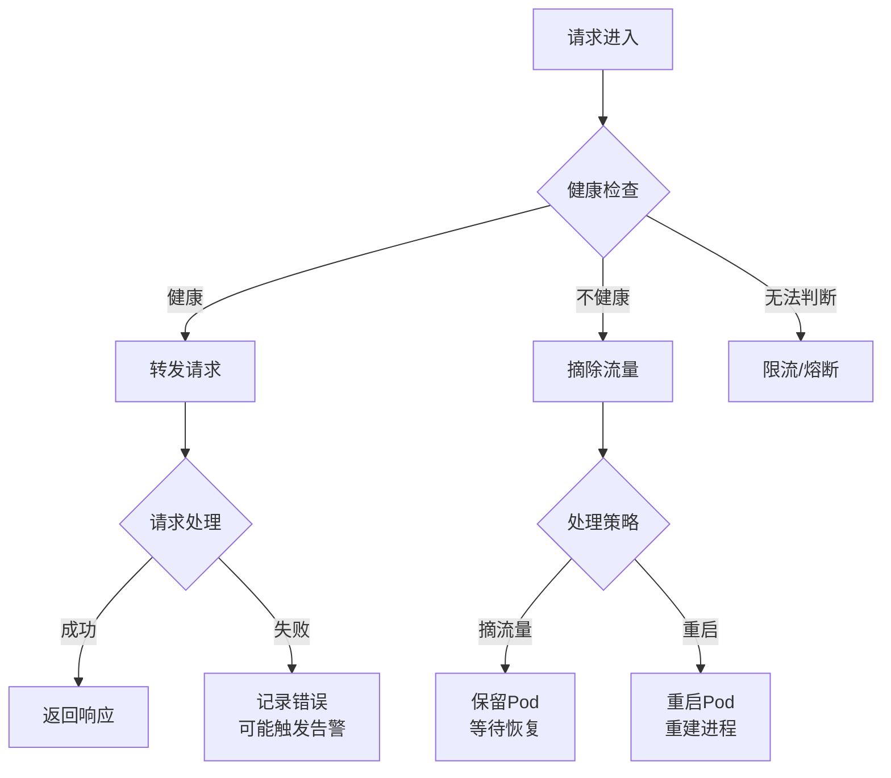
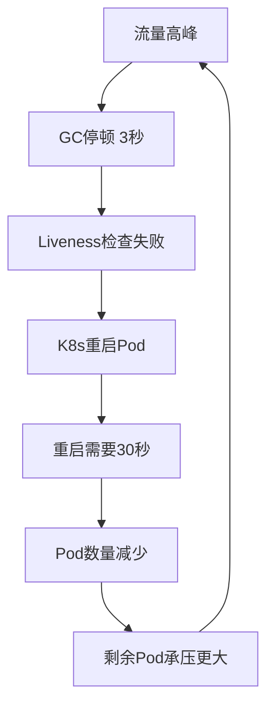
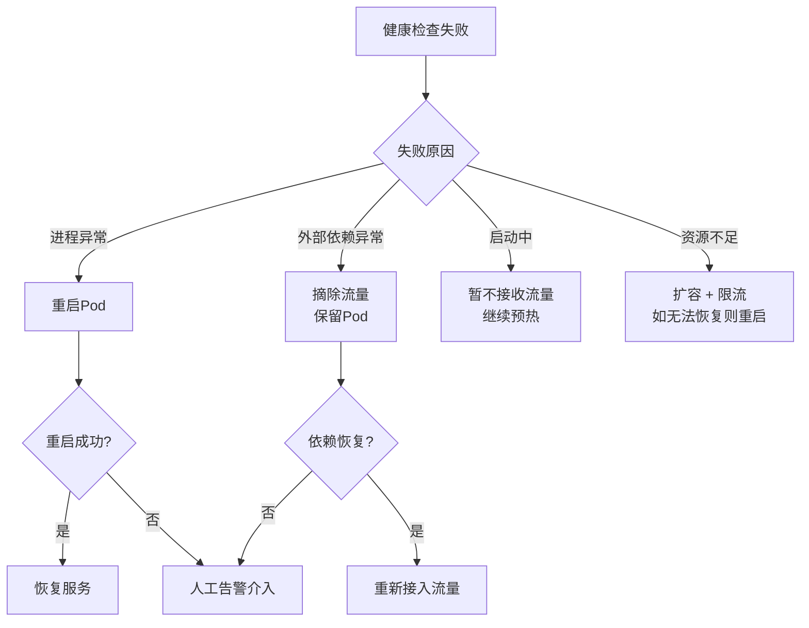

# 健康检查与自愈

## 问题背景

2023年双十二，某电商平台的商品详情页服务在流量高峰时出现了"假健康"现象：

服务的 `/health` 端点返回 HTTP 200，Kubernetes 认为服务正常，继续将流量转发过来。但实际上，商品数据都来自依赖的下游商品服务，此时商品服务已经因为超时而阻塞了所有请求——线程池被占满，新请求排队等待，最终导致商品详情页全面超时。

Kubernetes 的健康检查以为一切正常，继续往这个"假健康"的 Pod 里塞流量，GC 停顿中的 Pod 也被判断为健康。结果：故障从一个服务蔓延到整个链路。

这次事故的根因是**只检查了进程存活，没有检查业务可用性**。

【架构权衡】
健康检查太敏感会导致频繁重启（对，K8s 频繁重启的 Pod 其实是系统不健康，是系统发出的求救信号）。太迟钝会导致故障请求被转发。阈值需要通过生产监控不断调优——这是一个"经验公式"，没有标准答案，必须结合业务的实际负载和响应时间来确定。

## 问题定义

健康检查（Health Check）是通过主动探测判断服务是否能够正常处理请求的机制。它是自动化的基础：没有健康检查就没有自动恢复，没有自动恢复就没有高可用。



## 活性探针 vs 就绪探针

Kubernetes 提供了两种探针，它们解决的问题完全不同。

| 维度 | 活性探针（livenessProbe） | 就绪探针（readinessProbe） |
| --- | --- | --- |
| **目的** | 判断容器是否需要重启 | 判断 Pod 是否应该接收流量 |
| **失败后果** | 重启容器 | 从 Service 摘除流量 |
| **适用场景** | 进程卡死、死锁 | 启动预热、外部依赖不可用 |
| **误判代价** | 频繁重启，服务震荡 | 流量损失，但容器存活 |
| **推荐策略** | 保守（避免误重启） | 相对激进（避免分发到不健康 Pod） |

### Liveness Probe：进程还活着吗？

Liveness 检查的是"容器内的进程是否还活着"。如果进程进入死锁或无限循环，Liveness 会触发重启。

```yaml
livenessProbe:
  httpGet:
    path: /health/live
    port: 8080
  initialDelaySeconds: 30    # 启动后等待30秒再检查
  periodSeconds: 10          # 每10秒检查一次
  failureThreshold: 3         # 连续3次失败才重启
  successThreshold: 1         # 成功1次即恢复
  timeoutSeconds: 5           # 超时5秒算失败
```

:::warning ⚠️
Liveness 探针设置过于激进是生产中最常见的错误。如果 `initialDelaySeconds` 太小，应用还没启动完就被判定为不健康，然后被重启——形成死亡螺旋。建议 `initialDelaySeconds` 设为应用实际启动时间的 **1.5~2 倍**。
:::

### Readiness Probe：准备好接收流量了吗？

Readiness 检查的是"容器是否准备好处理请求"。应用可能进程正常，但还没预热完成、依赖的数据库还没连上——此时应该先不接收流量。

```yaml
readinessProbe:
  httpGet:
    path: /health/ready
    port: 8080
  initialDelaySeconds: 5
  periodSeconds: 5            # Readiness 应该比 Liveness 检查更频繁
  failureThreshold: 2          # 2次失败就摘流量
  successThreshold: 1
  timeoutSeconds: 3
```



```mermaid
gantt
    title Pod 生命周期中的探针行为
    dateFormat X
    section 启动
    容器启动: 0, 10
    section Liveness
    initialDelay等待: 0, 30
    开始检查: 30, 100
    section Readiness
    initialDelay等待: 0, 5
    开始检查: 5, 100
    section 流量
    无流量: 0, 5
    开始接收: 5, 100
```

## 健康检查方式

### HTTP GET 探针

最常用，向 `/health` 端点发送 HTTP GET 请求，返回 2xx 即为健康。

```java
// Spring Boot 健康检查端点
@RestController
public class HealthController {

    @GetMapping("/health/live")
    public ResponseEntity<String> liveness() {
        return ResponseEntity.ok("OK");
    }

    @GetMapping("/health/ready")
    public ResponseEntity<Map<String, Object>> readiness() {
        Map<String, Object> checks = new HashMap<>();

        // 检查数据库连接
        try {
            jdbcTemplate.execute("SELECT 1");
            checks.put("database", "UP");
        } catch (Exception e) {
            checks.put("database", "DOWN");
            return ResponseEntity.status(503).body(checks);
        }

        // 检查 Redis 连接
        try {
            redisTemplate.opsForValue().get("health_check");
            checks.put("redis", "UP");
        } catch (Exception e) {
            checks.put("redis", "DOWN");
            return ResponseEntity.status(503).body(checks);
        }

        checks.put("overall", "UP");
        return ResponseEntity.ok(checks);
    }
}
```

### TCP Socket 探针

尝试建立 TCP 连接到指定端口。适合非 HTTP 服务（如 MySQL、Redis）。

```yaml
livenessProbe:
  tcpSocket:
    port: 3306
  periodSeconds: 10
```

### Exec 探针

执行自定义脚本或命令。适合需要执行复杂检查逻辑的场景。

```yaml
readinessProbe:
  exec:
    command:
      - sh
      - -c
      - "redis-cli ping | grep PONG"
  periodSeconds: 5
```

| 方式 | 适用场景 | 优点 | 缺点 |
| --- | --- | --- | --- |
| HTTP GET | HTTP 服务 | 实现简单，语义清晰 | 需要改造应用 |
| TCP Socket | 非 HTTP 服务 | 不侵入应用 | 无法检测应用层问题 |
| Exec | 复杂检查逻辑 | 灵活 | 额外进程开销，排查困难 |

## 健康检查的常见陷阱

### 1. 依赖外部服务的健康检查

如果健康检查依赖下游服务，可能导致连锁反应：

```java
// ❌ 错误：依赖下游服务的健康检查
@GetMapping("/health")
public ResponseEntity<String> health() {
    // 依赖商品服务
    productClient.getById(1L);  // 如果商品服务挂了，这里也挂
    // 依赖库存服务
    inventoryClient.checkStock(1L);  // 库存服务挂了，这里也挂
    return ResponseEntity.ok("OK");
}
```

正确做法：**只检查进程自身状态和核心依赖**，不要把整条链路的健康状态都串进来。

```java
// ✅ 正确：只检查直接依赖
@GetMapping("/health/ready")
public ResponseEntity<Map<String, Object>> readiness() {
    Map<String, Object> result = new HashMap<>();

    // 核心依赖：数据库必须可用
    if (!checkDatabase()) {
        return ResponseEntity.status(503).body(Map.of("status", "DOWN", "reason", "db"));
    }

    // 非核心依赖：缓存不可用时降级，不影响就绪
    if (!checkCache()) {
        result.put("cache", "degraded");
    }

    return ResponseEntity.ok(result);
}
```

### 2. 阈值太敏感导致误杀

GC 停顿、预热过程、高负载瞬时超时——这些都可能导致健康检查失败。如果阈值太激进，会产生以下死亡螺旋：



**解决思路**：`failureThreshold` 设大一些（`>` 5），`periodSeconds` 设小一些（频繁检查但容忍瞬时抖动）。

### 3. 检查路径被缓存

如果 `/health` 端点被 Nginx 或 CDN 缓存，可能永远返回缓存的健康状态。

**解决思路**：
- `/health` 端点添加 `Cache-Control: no-cache` 头
- 健康检查路径独立于业务路径，不走公共代理

## 服务注册与发现

健康检查的结果需要通知到负载均衡器和调用方，这依赖服务注册与发现机制。

### Eureka（已停止维护）

Netflix 开源的服务注册中心，采用 AP 模型（可用性优先）。

```yaml
# Eureka 客户端配置
eureka:
  instance:
    health-check-url-path: /health/ready
    lease-renewal-interval-in-seconds: 30
    lease-renewal-interval-in-seconds: 90  # 连续3次心跳未收到才剔除
```

### Consul

HashiCorp 开源的分布式服务发现，支持健康检查和 KV 存储。

```hcl
# Consul 健康检查配置
{
  "Check": {
    "ID": "web-health",
    "Name": "HTTP API on port 8080",
    "HTTP": "http://localhost:8080/health/ready",
    "Interval": "10s",
    "Timeout": "5s",
    "DeregisterCriticalServiceAfter": "2m"
  }
}
```

### Nacos（推荐用于国内团队）

阿里巴巴开源的服务发现和配置管理，支持 AP 和 CP 模式。

```yaml
# Nacos 服务实例配置
spring:
  cloud:
    nacos:
      discovery:
        health-check-interval: 10s
        health-check-enabled: true
        ephemeral: false  # true=临时实例, false=永久实例
```

:::tip 💡
**Eureka vs Consul vs Nacos 的选择**：
- 如果你已经在 Spring Cloud 生态中，用 Nacos（国内团队）或 Eureka（海外团队）
- 如果你需要服务网格（Istio/Envoy），用 Consul
- 如果你在 Kubernetes 环境中，K8s Service + kube-proxy 本身就是服务发现，配合 Headless Service 可以实现更精细的控制

【架构权衡】
在 Kubernetes 环境中，K8s 原生的 Service 和 Endpoint 控制器已经提供了基础的健康检查和服务发现能力。在 K8s 之上叠加额外的服务注册中心（如 Consul）会引入额外的运维复杂度和数据一致性问题。除非有特殊需求（如跨 K8s 集群的服务发现），否则应该优先使用 K8s 原生方案。
:::

## 摘流量 vs 重启

不健康的服务需要被隔离，但处理方式取决于不健康的原因：

| 情况 | 推荐处理 | 说明 |
| --- | --- | --- |
| 进程卡死/死锁 | 重启 | Liveness 触发重启 |
| 依赖服务不可用 | 摘流量 | Readiness 触发，保留 Pod |
| 启动预热中 | 暂不接收 | Readiness 暂不通过 |
| 资源耗尽（OOM） | 重启 | Liveness 触发 |
| GC 停顿 | 暂不处理 | 等 GC 完成，阈值调优 |
| 配置错误 | 摘流量 + 告警 | 人工介入 |



## 自愈机制

### Kubernetes 自愈

K8s 提供了多层次的自愈能力：

```yaml
# Deployment 副本控制器
spec:
  replicas: 3
  strategy:
    type: RollingUpdate
    rollingUpdate:
      maxSurge: 1        # 最多超出1个Pod
      maxUnavailable: 0  # 不能有不可用的Pod
  template:
    spec:
      terminationGracePeriodSeconds: 30  # 优雅终止等待时间
```

- **自动重启**：Liveness 失败时自动重启 Pod
- **自动驱逐**：Node 不可用时自动将 Pod 调度到其他 Node
- **副本保障**：Deployment 确保始终维持指定数量的健康 Pod

### 应用层自愈

```java
// 熔断器模式（CircuitBreaker）
@RestController
public class ProductController {

    private final CircuitBreaker circuitBreaker =
        CircuitBreaker.ofDefaults("productService");

    @GetMapping("/product/{id}")
    public Product getProduct(@PathVariable Long id) {
        return circuitBreaker.executeSupplier(() -> {
            // 调用可能失败的商品服务
            return productService.getById(id);
        });
    }
}
```

## 生产避坑

1. **健康检查路径要和业务路径分离**：不要让 Nginx/网关的健康检查和 K8s 的探针混在一起，容易出现"网关说正常，但 K8s Pod 不健康"的混乱。
2. **GC 停顿期间的健康检查要特殊处理**：如果 GC 停顿时间超过健康检查超时，Pod 会被误判。可以考虑在 GC 期间暂时屏蔽健康检查。
3. **就绪探针失败不等于立即告警**：Pod 被摘除流量后应该先观察一段时间，如果持续不健康再告警，避免告警风暴。
4. **健康检查也需要监控**：健康检查本身也可能失败（网络抖动），如果健康检查系统出问题，需要有告警。
5. **跨环境检查阈值要不同**：生产环境的流量波动比测试环境大得多，`failureThreshold` 和 `periodSeconds` 在生产环境需要调大。

## 工程代价

| 维度 | 评估 |
| --- | --- |
| 开发成本 | 需要实现健康检查端点，改造数据访问层 |
| 运维成本 | 阈值调优需要持续观察和迭代 |
| 监控成本 | 健康状态指标需要采集和可视化 |
| 误判代价 | 过度敏感导致服务震荡，太迟钝导致故障扩大 |

## 落地 Checklist

- [ ] 实现 `/health/live` 和 `/health/ready` 两个端点
- [ ] Liveness 探针只检查进程存活，不依赖外部服务
- [ ] Readiness 探针检查核心依赖（数据库），排除非核心依赖
- [ ] 合理设置 `initialDelaySeconds`（应用启动时间的 1.5~2 倍）
- [ ] 配置 `failureThreshold` 和 `periodSeconds`（根据实际场景调优）
- [ ] 上线后观察 2 周，根据监控数据调整阈值
- [ ] 配置服务注册与发现（Eureka/Consul/Nacos）
- [ ] 引入熔断器（CircuitBreaker）防止故障蔓延
- [ ] 配置自愈策略（重启次数限制、优雅终止）
- [ ] 建立健康检查监控大盘（探针成功率、失败原因分布）
- [ ] 定期演练：手动触发健康检查失败，观察 Pod 行为是否符合预期
