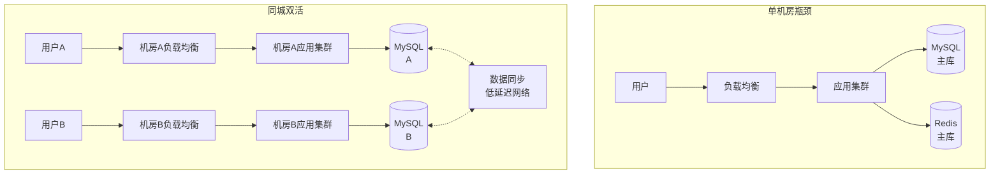
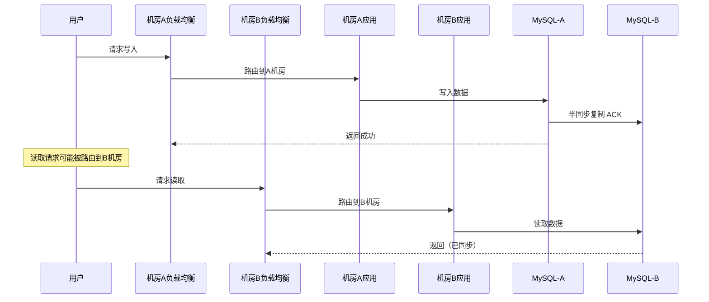
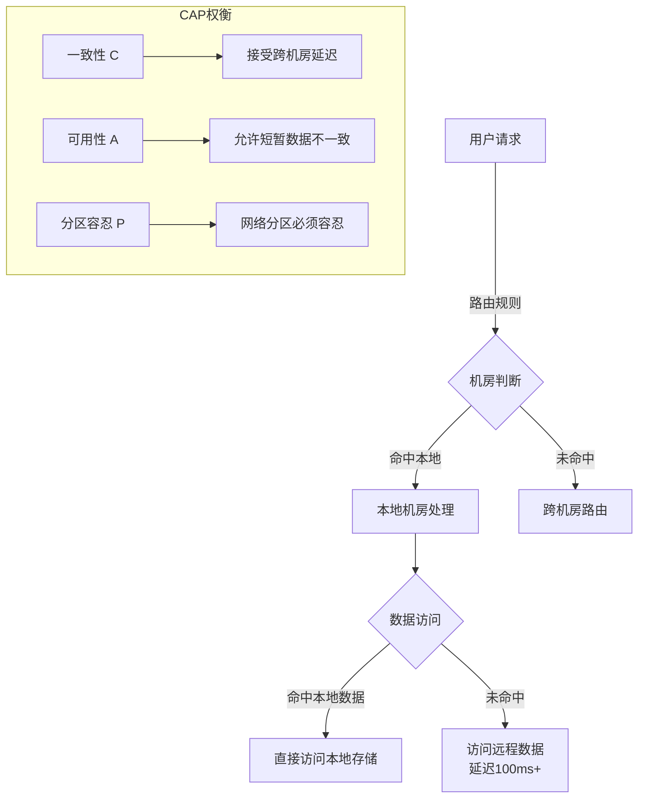
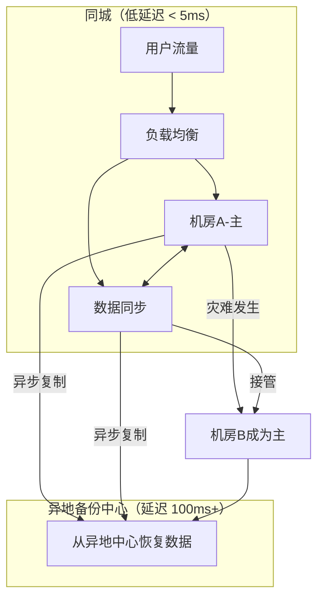
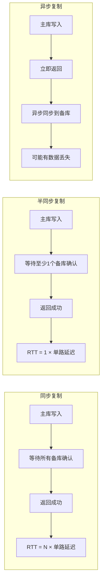
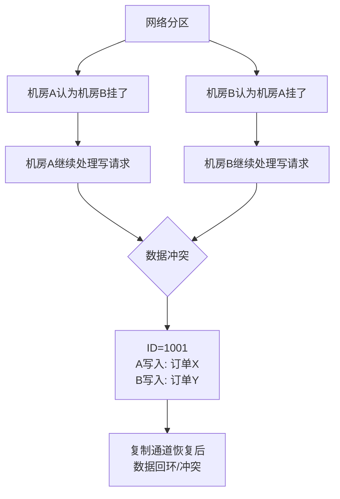

# 多活架构

## 问题背景

2024年6月，某头部直播平台的 SRE 团队在双十一前做了一次精心策划的"同城双活"演练：模拟 A 机房断电，验证流量能否在 30 秒内切换到 B 机房。

21:00，断电模拟启动。
21:01，DNS 解析结果还未更新，大量用户请求仍然打到已下线的 A 机房。
21:03，DBA 发现两个机房的数据出现了数据冲突——因为应用层的"自动切换"逻辑没有关闭写流量，导致两个机房同时写入，MySQL Binlog 出现数据回环。
21:12，勉强完成回滚，比计划的 30 秒切换窗口超出了 42 分钟。

这次演练暴露了一个核心问题：**多活架构不只是"多部署几个机房"那么简单"**。流量切换、数据同步、状态一致性——每一个环节都可能成为灾难扩大的引爆点。

【架构权衡】
多活架构的复杂度是指数级增长的，而不是线性增长。两个机房的多活，其复杂度远不止两个单机房之和。建议在决定做多活之前，先确认三件事：核心业务是否真的需要多活？业务 SLA 是否已经无法通过单机房高可用满足？团队是否具备多活架构的运维经验？

## 问题定义

多活（Multi-Active）是在地理位置上分离的多个机房同时对外提供服务，任何一个机房的故障不会导致全站不可用。

与"多机房部署"的本质区别：

| 维度 | 多机房部署（主备） | 多活 |
| --- | --- | --- |
| 流量分布 | 一个机房处理所有流量，另一个待机 | 多个机房同时处理流量 |
| 故障影响 | 主机房故障时全局不可用 | 单机房故障时部分流量自动切换 |
| 数据同步 | 主从异步复制 | 同步或强一致复制 |
| 复杂度 | 低 | 高 |
| 成本 | 1x | 2x~3x |



## 同城双活

两个机房部署在同一城市，网络延迟通常在 **1~5ms** 以内，适合同步复制。

### 优势

- 延迟对用户无感知（同一城市，往返延迟 `<` 10ms）
- 同步复制保证数据强一致，任一机房数据完整
- 故障时流量切换对用户影响小

### 挑战

1. **数据同步一致性**：双写时需要保证数据不冲突（全局 ID 分配、冲突合并策略）
2. **会话亲和性**：用户一次会话最好固定在一个机房，减少跨机房请求
3. **分布式事务**：跨机房事务的 CAP 约束更明显——延迟增加后，强一致事务的代价更大



## 异地多活

两个机房部署在不同的城市，网络延迟通常在 **30~100ms**（同城跨AZ）或 **100~200ms**（跨城）。

### 核心挑战

异地多活面临更严峻的 CAP 约束：

- **延迟问题**：跨城 100ms 的 RTT，同步复制会导致事务延迟增加 100ms，对用户体验影响明显
- **数据一致性**：无法使用强同步（代价太大），通常依赖异步复制 + 最终一致性
- **冲突处理**：两个机房独立写入后合并，冲突检测和合并策略是关键



【架构权衡】
跨城多活必须接受**最终一致性**而非强一致性。如果业务场景要求强一致（如金融转账），跨城多活不是解法，应该选择主备 + RPO `=` 0 的方案。互联网业务中绝大多数场景（电商下单、直播评论、Feed流）都可以接受最终一致性，这是异地多活的前提。

### 两地三中心

同城两中心 + 异地备份中心的架构，是大多数金融机构的折中方案：



## 数据同步方案

### 同步复制

主库写入后，等待所有备库确认才返回成功。

- **RPO = 0**：不丢失数据
- **代价**：延迟 = 网络 RTT，跨城场景下延迟 100ms+
- **适用**：同城双活，强一致需求

### 异步复制

主库写入后立即返回，异步同步到备库。

- **延迟低**：主库性能不受影响
- **RPO `>` 0**：切换窗口内有数据丢失
- **适用**：异地多活，最终一致性场景

### 半同步复制

主库写入后，等待**至少一个**备库确认就返回。平衡了延迟和一致性。



## 流量切换

### DNS 切换

最传统的方式：通过修改 DNS A 记录将流量从故障机房导走。

- **优点**：实现简单，不涉及网络层改造
- **缺点**：DNS 生效依赖 TTL（可能需要 5~30 分钟），缓存导致切换延迟不可控

:::warning ⚠️
DNS 切换在多活架构中是最大的坑之一。浏览器、运营商 DNS、App 客户端的 DNS 缓存都会导致"DNS 已更新但用户仍打老机房"的尴尬局面。建议将 TTL 设为 60 秒以内，并配合 HTTPDNS（移动端）或 Edns-Client-Subnet（DNS 扩展）来加速生效。
:::

### VIP 漂移

在机房入口使用 Keepalived + VRRP，实现 Layer 4 的 VIP 飘移。切换速度比 DNS 快（秒级），但只适用于单机房或同城场景。

### Anycast

基于 BGP Anycast，多个机房宣告相同的 IP 地址，用户流量自动路由到最近机房。故障机房的 IP 宣告撤回后，流量自动切换到其他机房。Cloudflare 和 AWS Global Accelerator 使用此方案。

```mermaid
graph TD
    A[用户1] -->|最优路由| B[机房A]
    A1[用户2] -->|最优路由| B1[机房B]
    A2[用户3] -->|最优路由| B2[机房C]

    B -.->|BGP撤回| C[故障检测]
    B1 -.->|接管| C
    C --> D[用户3路由到机房B]

    Note over C: Anycast自动切换<br/>无需DNS修改
```

## 脑裂问题

网络分区时，多个机房可能同时认为自己是主，形成脑裂。



**解决思路**：
1. **全局分布式锁**：使用 Zookeeper/Raft 选主，确保同一时刻只有一个机房是主
2. **数据分片路由**：按用户 ID 哈希路由，每个用户的数据只写一个机房，避免跨机房冲突
3. **冲突检测与合并**：使用向量时钟或版本号检测冲突，由应用层决定合并策略

## 核心挑战汇总

| 挑战 | 描述 | 应对方案 |
| --- | --- | --- |
| 数据一致性 | 跨机房数据同步延迟 | 最终一致性 + 冲突合并 |
| 跨机房事务 | 分布式事务延迟高 | 避免跨机房事务，按用户维度分片 |
| 延迟敏感 | 跨城 RTT 100ms+ | 就近访问，异步化跨机房调用 |
| 脑裂 | 网络分区时多机房同时写 | 全局选主锁 + 数据分片路由 |
| 流量路由 | 切换延迟不可控 | HTTPDNS + Anycast + 低 TTL |
| 运维复杂度 | 多个机房配置一致 | IaC（基础设施即代码）统一管理 |

## 生产避坑

1. **不要在多活架构中做跨机房大事务**：一个跨机房分布式事务在跨城 100ms 延迟下可能超时失败。正确的做法是按用户维度拆分，单个用户的请求路由到同一个机房。
2. **不要依赖 DNS 切换作为唯一的故障转移手段**：DNS 缓存是不可控的，必须配合应用层的流量摘除和健康检查。
3. **不要忽略"灰度切换"**：全量切换风险极高，应该先切 1% 的流量，观察指标正常后再逐步放量。
4. **数据同步链路的监控是重中之重**：延迟告警阈值要精确设置，同步延迟超过阈值时应该阻止故障切换，防止脏数据扩散。
5. **演练必须在非高峰期做**：多活演练本身就是一次高风险操作。某团队在晚高峰做演练，演练过程中触发了真实的切换逻辑，导致用户投诉激增。

## 工程代价

| 维度 | 评估 |
| --- | --- |
| 基础设施成本 | 同城双活 `+` 100% ~ 150%，异地多活 `+` 200% ~ 300% |
| 数据同步成本 | 同步带宽需求大，跨城专线成本高 |
| 开发复杂度 | 需要改造数据访问层、路由逻辑、会话管理 |
| 运维复杂度 | 多机房配置一致性、监控、告警、日志聚合 |
| 排障复杂度 | 跨机房问题定位困难，需要全链路追踪 |
| 回滚风险 | 多活回滚涉及数据迁移，高风险操作 |

## 落地 Checklist

- [ ] 评估业务是否真的需要多活（核心业务、用户规模、业务损失承受力）
- [ ] 确定 RPO/RTO 目标（决定同步方案：同步/半同步/异步）
- [ ] 选择多活架构模式（同城双活 / 异地多活 / 两地三中心）
- [ ] 设计数据分片规则（按用户 ID 哈希路由，避免跨机房冲突）
- [ ] 选型数据同步方案（MySQL Binlog / Canal + MQ / DRC）
- [ ] 设计与验证流量切换方案（HTTPDNS + 机房健康检查）
- [ ] 实现全局分布式锁（Zookeeper/Raft）防止脑裂
- [ ] 配置数据同步延迟监控和告警
- [ ] 每月执行一次完整的故障切换演练（从小流量开始）
- [ ] 灰度切换策略：先 1% → 10% → 50% → 全量
- [ ] 建立多机房配置管理机制（IaC/Ansible/Terraform）
- [ ] 准备回滚预案，包括数据回滚和流量回切
