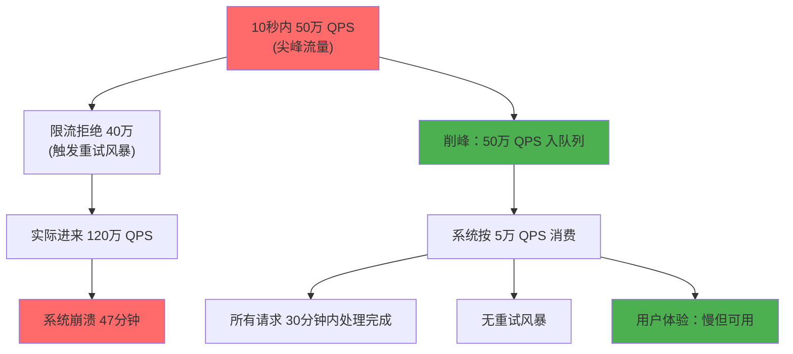
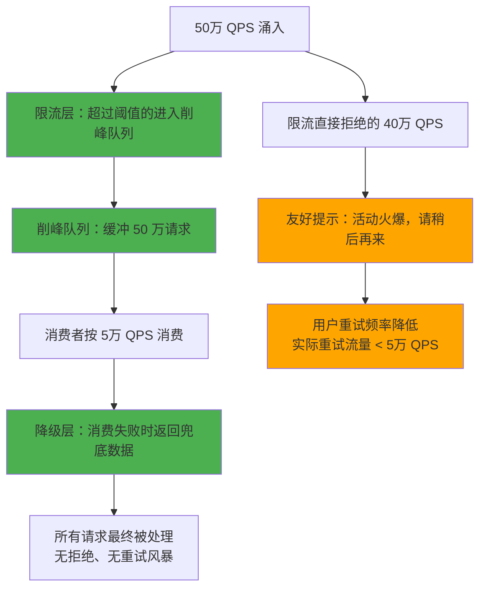

# 削峰填谷

2024年3月，某直播平台的"锦鲤抽奖"活动在晚上 8 点准时开始。

活动规则很简单：直播间每涌入 1 万人，就开一次大奖。运营团队预期峰值 QPS 大概 5 万。

实际发生的是：10 秒之内，QPS 从 1 万飙升到 50 万。

两台服务器在 30 秒内被打挂。负载均衡器检测到节点不可用，开始剔除节点。剩余节点承受不住更多请求，触发连锁崩溃。整场活动被迫中断 47 分钟，客服热线被打爆。

复盘结论：团队做了限流（QPS 上限 10 万），但没做削峰。50 万 QPS 打过来，限流拒绝了 40 万，但被拒绝的请求全部重试，流量反而被放大了 3 倍。

这一次事故，让我们彻底重新审视了削峰填谷的工程实践。

## 问题背景

削峰填谷的核心目标是：**把尖峰流量平滑成平稳流量，让系统在可承受的范围内处理请求**。

这和限流不同：
- **限流**：告诉系统"你不能超过这个量"，超出部分直接拒绝
- **削峰**：告诉系统"你可以慢一点，但我不会拒绝你"，把请求缓冲下来，慢慢处理



【架构权衡】

削峰不是银弹，它有代价：队列会引入延迟，消息堆积会占用内存，消费者的处理能力必须大于等于入口流量的平均值，否则队列会无限增长。选择削峰而非限流，意味着选择"慢但能处理"而非"快但会拒绝"。这两种策略没有对错，只有场景匹配：金融支付不能等，必须限流；抽奖活动可以等，削峰更合适。

## 削峰策略一：队列缓冲

### 内存队列 vs MQ 队列

队列是削峰最基础的手段。但用内存队列还是消息队列，效果完全不同：

| 维度 | 内存队列（LinkedBlockingQueue） | MQ（Kafka/RocketMQ） |
| --- | --- | --- |
| **容量** | 受 JVM 堆大小限制 | 受磁盘空间限制（理论上无上限） |
| **持久化** | 无，进程重启数据丢失 | 有，消息落盘 |
| **消费者扩展** | 单进程内扩展 | 跨进程、跨机器 |
| **可靠性** | 低（内存满则丢消息或阻塞） | 高（ACK 机制保证不丢） |
| **吞吐能力** | 取决于 JVM 吞吐 | 取决于 MQ 集群吞吐 |
| **延迟** | 极低（进程内） | 中等（网络 IO） |
| **适用场景** | 单机限流、内存友好 | 分布式系统、跨服务异步 |

```java
// 内存队列：简单但有风险
public class MemoryQueueProcessor {
    private BlockingQueue<Request> queue = new LinkedBlockingQueue<>(10000);

    public boolean submit(Request req) {
        // ✅ 队列有容量，返回 false 表示拒绝
        // ❌ 队列满了，请求被丢弃
        return queue.offer(req, 3, TimeUnit.SECONDS);
    }

    @Async
    public void consume() {
        while (true) {
            Request req = queue.poll(1, TimeUnit.SECONDS);
            if (req != null) {
                process(req);
            }
        }
    }
}
```

```java
// MQ 队列：分布式削峰
public class MQProcessor {
    private KafkaTemplate<String, Request> kafkaTemplate;

    public boolean submit(Request req) {
        // Kafka 异步发送，不阻塞
        kafkaTemplate.send("activity-topic", req.getKey(), req);
        return true; // 发送成功即返回
    }

    // 消费者按自己的节奏处理
    @KafkaListener(topics = "activity-topic", groupId = "activity-consumer")
    public void consume(Request req) {
        process(req);
    }
}
```

【架构权衡】

内存队列的优势是延迟极低，适合对延迟敏感且流量可控的场景。但一旦队列满了，要么丢消息（丢了你不知道），要么阻塞（拖慢整个进程）。MQ 队列的优势是容量大、可靠、可以横向扩展，但引入了额外的网络延迟和运维复杂度。实际生产中，更推荐 MQ 方案——内存队列在大流量冲击下很容易 OOM。

### 队列积压监控：避免 OOM

MQ 积压是最常见的削峰翻车场景。2022 年某电商大促，MQ 消费者处理速度跟不上生产速度，消息堆积了 500 万条，每条消息占用 2KB 内存，直接导致 Broker 进程 OOM。

```yaml
# RocketMQ 监控配置
rocketmq:
  consumer:
    pull-batch-size: 32
    pull-interval: 0  # 拉取间隔为 0，立即拉取
    consume-thread-min: 20
    consume-thread-max: 100
    consume-message-batch-max-size: 1

# 告警规则
alerts:
  - metric: mq_consumer_lag
    condition: "lag > 100000"  # 积压超过 10 万
    severity: P1
    action: "立即告警，扩容消费者"

  - metric: mq_consumer_lag
    condition: "lag > 1000000" # 积压超过 100 万
    severity: P0
    action: "紧急扩容，停止生产"
```

## 削峰策略二：请求合并

### 合并写：批量入库

高频写入场景下，每次请求都写数据库会产生大量 IO。合并请求后批量写入，可以将 IO 次数降低 10-100 倍。

```java
// 批量写入：每 100 条或每 500ms 写一次
public class BatchWriter {
    private BlockingQueue<Order> buffer = new LinkedBlockingQueue<>(10000);
    private ScheduledExecutorService flusher = Executors.newSingleThreadScheduledExecutor();

    public void submit(Order order) {
        buffer.offer(order);
    }

    public void start() {
        // 每 500ms 刷新一次
        flusher.scheduleAtFixedRate(() -> {
            List<Order> batch = new ArrayList<>();
            buffer.drainTo(batch, 100);  // 最多取 100 条

            if (!batch.isEmpty()) {
                orderMapper.batchInsert(batch);
                logger.info("批量写入 {} 条订单", batch.size());
            }
        }, 0, 500, TimeUnit.MILLISECONDS);
    }
}
```

### 合并读：读请求去重

同样的数据在短时间内被大量请求读取（N + 1 问题），可以用本地缓存或分布式缓存合并为一次读请求。

```java
public class DeduplicatedReader<T> {
    private LoadingCache<String, T> localCache;
    private ConcurrentHashMap<String, CountDownLatch> pending = new ConcurrentHashMap<>();

    public T get(String key, Supplier<T> loader) {
        // 第一步：检查本地缓存
        T cached = localCache.getIfPresent(key);
        if (cached != null) return cached;

        // 第二步：检查是否已有其他请求在加载
        CountDownLatch latch = pending.computeIfAbsent(key, k -> new CountDownLatch(1));

        if (latch.getCount() == 0) {
            // 已有请求完成，重新查缓存
            return localCache.get(key);
        }

        // 第三步：自己加载
        try {
            T value = loader.get();
            localCache.put(key, value);
            return value;
        } finally {
            latch.countDown();
            pending.remove(key);
        }
    }
}
```

【架构权衡】

请求合并的代价是增加响应延迟——用户不会立刻得到结果，需要等待合并窗口。对于抽奖、排行榜这类"可以等"的活动，合并是有效的优化；但对于商品详情页、搜索结果这类"必须快"的场景，合并反而会降低用户体验。关键判断标准：业务对延迟的容忍度是多少？

## 削峰策略三：阈值控制

### 拒绝策略：友好提示

超出处理能力的请求，不要直接返回 500，要返回友好的提示。

```java
public class ThrottledController {
    private Semaphore permits = new Semaphore(5000); // 同时处理 5000 个请求
    private AtomicLong queueWaitEstimate = new AtomicLong(0);

    @GetMapping("/seckill")
    public Result<SeckillToken> seckill(Long userId, Long skuId) {
        // 尝试获取处理许可
        if (!permits.tryAcquire()) {
            long waitTime = queueWaitEstimate.get();
            if (waitTime > 30000) {
                // 排队超过 30 秒，建议用户放弃
                return Result.fail("活动过于火爆，您来晚了，明天再来试试？");
            } else {
                // 还在排队，给个进度提示
                return Result.fail("当前排队人数较多，预计等待 " + (waitTime / 1000) + " 秒");
            }
        }

        try {
            return doSeckill(userId, skuId);
        } finally {
            permits.release();
        }
    }
}
```

### 多级降级：按优先级处理

```
一级：核心用户（VIP）→ 直接处理
二级：普通用户 → 进入队列，按顺序处理
三级：匿名用户 → 返回"活动太火爆，稍后再试"
```

## 削峰策略四：弹性伸缩

### K8s HPA

```yaml
# K8s HPA 配置：根据 CPU 和队列积压双重指标
apiVersion: autoscaling/v2
kind: HorizontalPodAutoscaler
metadata:
  name: activity-service-hpa
spec:
  scaleTargetRef:
    apiVersion: apps/v1
    kind: Deployment
    name: activity-service
  minReplicas: 3
  maxReplicas: 100
  metrics:
    - type: Resource
      resource:
        name: cpu
        target:
          type: Utilization
          averageUtilization: 70
    - type: External
      external:
        metric:
          name: mq_consumer_lag
          selector:
            matchLabels:
              topic: activity-orders
        target:
          type: AverageValue
          averageValue: "50000"  # 积压超 5 万，自动扩容
  behavior:
    scaleUp:
      stabilizationWindowSeconds: 30  # 扩容冷却 30 秒
      policies:
        - type: Percent
          value: 100                  # 最多翻倍扩容
          periodSeconds: 60
    scaleDown:
      stabilizationWindowSeconds: 300 # 缩容冷却 5 分钟
```

### 阿里云 ESS / AWS ASG 配置

```json
// 阿里云 ESS 配置
{
  "scalingConfiguration": {
    "minSize": 3,
    "maxSize": 100,
    "desiredCapacity": 3,
    "scalingStrategy": {
      "instantAccesStatus": "ESTABLISHING",
      "terminationPolicy": "NEWEST_INSTANCE"
    }
  },
  "scalingRules": [
    {
      "ruleName": "scale_up_by_mq_lag",
      "metricType": "mqConsumeMessageTimeInterval",
      "metricValue": "200",     // 消费延迟超过 200ms
      "adjustmentType": "QUANTITY_CHANGE_IN_CAPACITY",
      "adjustmentValue": 5,     // 扩容 5 台
      "coolDownTime": 180
    },
    {
      "ruleName": "scale_up_by_cpu",
      "metricType": "cpuUtilization",
      "metricValue": "80",      // CPU 超 80%
      "adjustmentType": "PERCENT_CHANGE_IN_CAPACITY",
      "adjustmentValue": 50,    // 扩容 50%
      "coolDownTime": 300
    }
  ]
}
```

【架构权衡】

弹性伸缩看起来很美好，但有三个致命延迟：冷启动延迟（K8s 新 Pod 启动需要 30-60 秒）、流量预热延迟（新 Pod 启动后需要预热才能承接流量）、缩容抖动（突然缩容导致请求失败）。在大促秒杀场景下，弹性伸缩不是银弹——它适合流量增长可预测的场景（如大促预热期），不适合"10 秒内从 1 万到 50 万"的突发场景。突发流量场景，正确的做法是提前扩容 + 队列缓冲，弹性伸缩作为补充手段。

## MQ 在削峰中的关键角色

MQ 是分布式削峰的核心组件，不同 MQ 的特性和适用场景差异巨大：

| 特性 | RocketMQ | Kafka | RabbitMQ |
| --- | --- | --- | --- |
| **吞吐量** | `10万-30万/秒` | `100万+/秒` | `5万-10万/秒` |
| **消息堆积** | 支持（磁盘存储） | 支持（高吞吐优先） | 支持（但性能下降明显） |
| **延迟** | 毫秒级 | 毫秒~秒级（高吞吐优先） | 微秒~毫秒级 |
| **顺序消息** | 支持（单队列有序） | 支持（单 Partition 有序） | 支持 |
| **事务消息** | 支持 | 不支持（需自实现） | 支持（Confirm 模式） |
| **延迟消息** | 支持（18 个级别） | 不支持（需自实现） | 支持（插件） |
| **适用场景** | 电商订单、金融交易 | 日志采集、实时分析 | 中小规模异步解耦 |

### 削峰场景下的 MQ 配置

```yaml
# RocketMQ 削峰配置
rocketmq:
  producer:
    retryTimesWhenSendFailed: 3
    sendMessageTimeout: 5000  # 超时 5 秒，防止无限重试

  consumer:
    consumeThreadMin: 20
    consumeThreadMax: 100    # 按峰值扩容
    pullInterval: 0           # 立即拉取
    pullBatchSize: 32
    consumeMessageBatchMaxSize: 32
    # 最重要：控制消费速度，不要打垮下游
    pullThresholdForQueue: 1000  # 单队列积压超 1000 条，限速
    consumeTimeout: 15          # 消费超时 15 秒

  broker:
    # 消息存储：削峰场景需要大磁盘
    storePathCommitLog: /data/rocketmq/commitlog
    maxMessageSize: 65536        # 最大消息 64KB
    flushIntervalCommitLog: 500  # 刷盘间隔 500ms（吞吐优先）
```

## 降级 + 限流 + 削峰三剑客

这三个机制配合使用，才能构建完整的流量防护体系：



| 场景 | 限流 | 削峰 | 降级 |
| --- | --- | --- | --- |
| 抽奖活动（可延迟） | 低阈值 | 高阈值 | 返回参与成功 |
| 金融支付（不可延迟） | 高阈值 | 不使用 | 返回失败 |
| 排行榜更新（可合并） | 中阈值 | 合并后批量处理 | 返回旧排行榜 |
| 库存查询（高频读） | 中阈值 | 合并读请求 | 返回缓存 |

【架构权衡】

三剑客不是层层叠加，而是按优先级分工。降级是第一道防线（快速返回兜底数据，不占资源）；限流是第二道防线（控制进入系统的总量）；削峰是第三道防线（在系统可承受范围内慢慢处理）。错误的顺序会导致灾难：先削峰再限流，队列会被撑爆；先限流再降级，限流拒绝的请求会触发重试风暴。正确的顺序是：降级兜底 -> 限流控量 -> 削峰缓冲。

## 生产案例：MQ 消息堆积 OOM

2022 年某电商大促，我们遇到了最经典的 MQ 翻车案例：

**问题**：消费者处理速度跟不上生产速度，消息堆积了 500 万条。

**根因**：
1. 消费者依赖的数据库连接池被其他服务耗尽
2. 消费者没有配置消费超时，阻塞在数据库操作上
3. 消费线程池满载，新消息无法被处理
4. RocketMQ Broker 将消息缓存在堆内存中

```java
// ❌ 错误：消费逻辑中没有超时控制
@RocketMQMessageListener(
    topic = "order-topic",
    consumerGroup = "order-consumer"
)
public class OrderConsumer implements RocketMQListener<OrderMessage> {
    @Override
    public void onMessage(OrderMessage message) {
        // 数据库操作没有超时控制
        // 如果数据库慢，这个线程会永久阻塞
        orderService.process(message); // 可能在 DB 耗时 30 秒
    }
}

// ✅ 正确：消费逻辑加超时控制 + 独立线程池
@RocketMQMessageListener(
    topic = "order-topic",
    consumerGroup = "order-consumer",
    consumeThreadCount = 50,  // 消费线程数
    consumeTimeout = 15       // 消费超时 15 秒
)
public class OrderConsumer implements RocketMQListener<OrderMessage> {
    private ThreadPoolExecutor executor = new ThreadPoolExecutor(
        20, 50, 60, TimeUnit.SECONDS,
        new LinkedBlockingQueue<>(1000),
        new ThreadFactoryBuilder().setNameFormat("order-consume-%d").build(),
        new ThreadPoolExecutor.CallerRunsPolicy()  // 队列满时由调用线程执行
    );

    @Override
    public void onMessage(OrderMessage message) {
        executor.submit(() -> {
            try {
                // 加超时控制
                CompletableFuture.runAsync(() -> orderService.process(message))
                    .get(10, TimeUnit.SECONDS);
            } catch (TimeoutException e) {
                logger.warn("消费超时 messageId={}", message.getId());
                // 放回队列重试，或者记录死信
            }
        });
    }
}
```

**修复方案**：
1. 消费逻辑加超时控制（10 秒超时就放弃）
2. 消费者独立线程池，不受其他服务影响
3. 配置 RocketMQ 消费者 `pullThresholdForQueue`，积压超 1000 条自动限速
4. 添加消费延迟监控，超过 5 秒触发告警

## 生产配置建议

### 削峰配置清单

| 配置项 | 推荐值 | 说明 |
| --- | --- | --- |
| 队列容量 | `预估峰值 × 2` | 预留 2 倍缓冲空间 |
| 消费超时 | `10-15 秒` | 超过则放弃，防止阻塞 |
| 消费线程数 | `CPU 核心数 × 2` | IO 密集型可加倍 |
| 消费批次 | `32-100 条/批` | 平衡吞吐和延迟 |
| 队列积压告警 | `> 10万` 触发 P1 | 及时扩容消费者 |
| 队列积压告警 | `> 100万` 触发 P0 | 停止生产或紧急扩容 |

### 活动前检查清单

活动开始前 30 分钟，必须确认以下配置：

- [ ] MQ 消费者线程池已扩容到峰值配置
- [ ] 数据库连接池已预热，预留足够的连接数
- [ ] 削峰队列容量已调整到活动预估的 2 倍
- [ ] 限流阈值已调整（高于日常但低于系统极限）
- [ ] 监控大盘已就绪（QPS、队列积压、消费延迟）
- [ ] 告警规则已配置（队列积压、消费超时）
- [ ] 回滚预案已准备（一键降级到无削峰模式）
- [ ] 值班人员已到位，确认应急联系方式

## 落地 Checklist

- [ ] 识别可削峰场景（抽奖、排行榜、异步通知）
- [ ] 识别不可削峰场景（支付、登录、下单）
- [ ] 选型 MQ 组件（Kafka/RocketMQ/RabbitMQ）
- [ ] 配置消费者线程池和消费超时
- [ ] 配置队列积压监控和告警
- [ ] 实施请求合并（批量写、读去重）
- [ ] 配置多级降级策略
- [ ] 全链路压测，验证削峰效果
- [ ] 混沌演练：消费者崩溃，验证队列缓冲能力
- [ ] 制定队列积压超过阈值的应急预案
