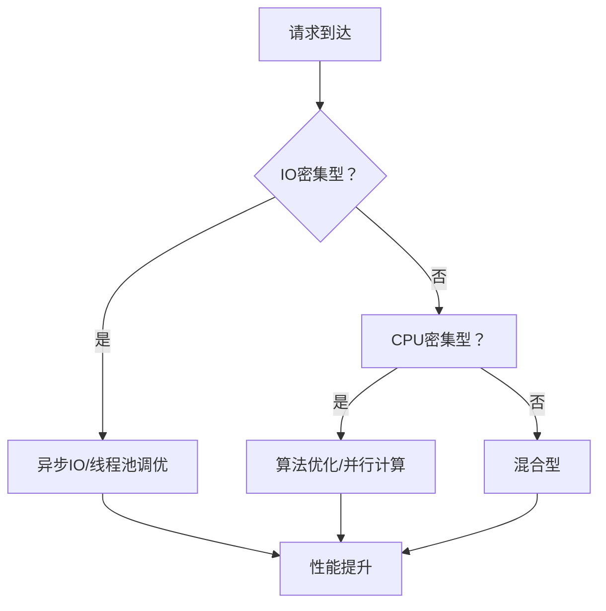

2024年双十一零点，我们的商品服务 QPS 飙到了 12 万，系统响应时间从平均 50ms 瞬间退化到 3s。用户下单页打不开，购物车加载超时，客服工单在 5 分钟内涌入了 2000+ 条投诉。

复盘发现，瓶颈根本不在数据库，也不在 Redis，而是 Tomcat 线程池被打满——开发同学用同步阻塞的方式调用了一个下游依赖，结果那个依赖超时了 2s，直接把 200 个线程全部卡死。

这就是高性能设计的第一课：**性能问题从来不是单点问题，是整条链路的木桶效应**。

## 问题背景

高性能不是"把服务变快"这么简单。在互联网场景下，它的核心目标是：**在有限资源下，系统能够承载的最大负载，以及在负载下的稳定表现**。

我见过太多团队在这件事上翻车：

- 业务高速增长时疯狂加机器，结果加到 100 台还是扛不住，因为架构本身就是同步阻塞的
- 迷信"高性能语言"，把 Java 换成 Go，结果 GC 问题没了，但内存泄漏问题来了
- 以为上了 Redis 就高性能了，结果 Redis 本身成了新的单点瓶颈

高性能设计是一套系统工程方法论，从 CPU 计算、内存分配、IO 模型、网络传输，到数据库查询、缓存策略、异步化改造，每个环节都有可能被卡住。

## 核心设计维度

### 计算层：CPU 与线程模型



**IO 密集型 vs CPU 密集型**：

| 类型 | 特征 | 优化方向 | 典型场景 |
| --- | --- | --- | --- |
| CPU 密集型 | 计算量大，CPU 利用率高 | 算法优化、多线程并行 | 加密解密、图像处理、复杂计算 |
| IO 密集型 | 等待时间长，CPU 利用率低 | 异步 IO、IO 多路复用 | Web 服务、数据库查询、外部 API 调用 |
| 混合型 | 两者都有 | 分阶段优化 | 几乎所有互联网服务 |

:::tip 💡
线程数有个经典公式：`线程数 = CPU核心数 / (1 - 阻塞系数)`。阻塞系数 0.9 意味着线程数 = 10倍 CPU 核心。这个公式的前提是你真的理解了"阻塞"在哪里。
:::

### 网络层：IO 模型演进


从 BIO 到 NIO 到 AIO，本质上是在解决一个核心问题：**怎么让有限的线程处理更多的连接**。

JDK NIO 的 epoll 实现（Linux 环境），用一个线程就能管理上万个连接。Netty 基于此做了封装，成为了互联网公司的事实标准。

:::warning ⚠️
NIO 的坑比想象的多。最常见的是"空轮询 bug"——JDK NIO 在某些场景下 epoll 会返回空事件，导致 CPU 100%。JDK 1.8 修了部分，但老版本的 Tomcat/Netty 还是要小心。
:::

### 存储层：数据库与缓存

```
用户请求
    │
    ▼
读写分离 ──► 从库承载读流量
    │
    ▼
分库分表 ──► 数据按规则分散到多个库/表
    │
    ▼
NoSQL ──► 适合分片的场景用 MongoDB/Cassandra
```

核心原则：**让数据库干它擅长的事，而不是让它干所有事**。

## 高性能架构演进

### 单体阶段

大多数系统的起点：所有逻辑在一个应用里，连接一个 MySQL。

**优点**：简单，适合业务早期
**缺点**：扩展性差，一个慢查询拖垮整个系统

### 垂直拆分阶段

按业务域拆分服务，比如拆出用户服务、订单服务、商品服务。

**优点**：故障隔离，独立扩展
**缺点**：服务间通信复杂度上升

### 水平扩展阶段

无状态服务 + 负载均衡 + 缓存 + 数据库读写分离。

这是大多数互联网公司能达到的阶段。

### 分布式阶段

分库分表 + 消息队列异步化 + 分布式缓存 + 服务治理。

**优点**：理论上无限扩展
**缺点**：复杂度爆炸，运维成本极高

## 生产避坑

### 坑1：过早优化

我见过一个团队在业务还在 PMF（产品市场契合度）阶段就开始做微服务拆分、引入 Kafka、部署 Kubernetes。结果系统跑了一年，用户才 1 万，运维成本却花了 3 个人力。

:::tip 💡
性能优化的第一原则：**先有性能问题，再优化**。过早优化是万恶之源，但不做预留容量的设计也是万恶之源。关键是区分哪些是架构层面的设计，哪些是细节层面的优化。
:::

### 坑2：迷信某一项技术

不是上了 Redis 就快了，不是换了 Go 就高效了，不是用了微服务就Scalable了。每一项技术都有它的适用场景和边界。

有个团队把所有数据都放 Redis 里，结果 Redis 内存不够，开始用 SSD 版本，SSD 也不够，最后只能做冷热分离。整个改造花了 6 个月，期间系统稳定性一塌糊涂。

### 坑3：没有基准测试

优化前后必须有量化对比。没有基准数据的优化都是耍流氓。

我建议每个团队都有一套性能测试规范：
1. 确定基准 TPS 和响应时间
2. 记录优化前数据
3. 逐步实施优化
4. 对比优化后数据
5. 确认提升比例

## 工程代价评估

| 维度 | 评估 |
| --- | --- |
| 开发成本 | 中等，需要团队有性能意识 |
| 运维成本 | 高，分布式系统复杂度上升 |
| 排障复杂度 | 高，需要全链路追踪工具 |
| 扩展性 | 优秀 |
| 业务灵活性 | 中等，架构约束增加 |

高性能不是目标，**在成本和收益之间找到平衡点才是**。系统能抗住业务峰值的 1.5 倍，就是好的高性能设计。追求 10 倍冗余，那是浪费。

【架构权衡】
高性能设计的核心权衡在于：投入多少工程成本，换取多少性能提升。单体架构简单但有天花板，微服务架构灵活但有复杂度代价。在业务增长期，我们要容忍一定的"技术债务"，在业务稳定期再逐步偿还。没有银弹，只有取舍。
