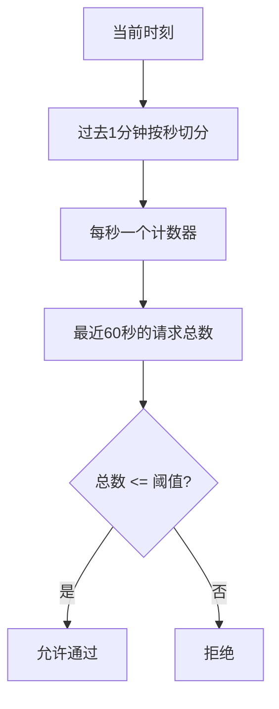
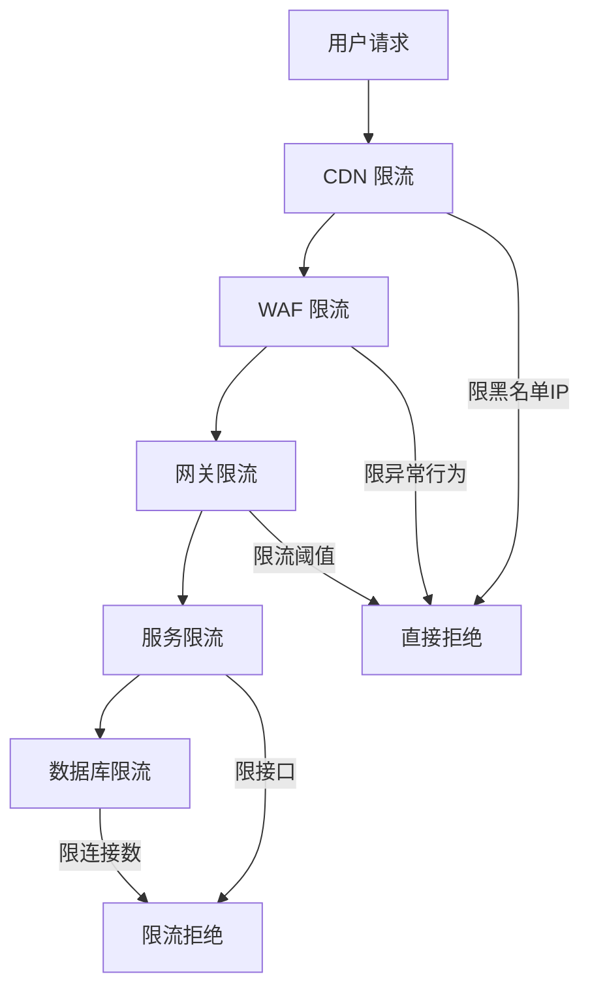

2023年第三季度，我们的商品详情页被不明流量打爆了。

不是正常的用户流量，是爬虫。爬虫的请求频率极高，每秒 3000 次，持续了 20 分钟。我们的服务容量是每秒 1000 次，多出来的 2000 次请求直接把数据库打爆了。

事后复盘，我们发现了一个致命问题：**服务没有限流**。

没有限流意味着什么？意味着只要有人愿意，就可以把你的服务打到不可用。这就是互联网安全中著名的"赵四攻击"——一个爬虫，或者一次意外的刷子活动，就能让你的服务彻底崩溃。

限流，是服务的最后一道防线。

## 问题背景

限流的核心目标是：**在系统容量有限的情况下，保护系统不被过载击垮**。

限流不是不让用户访问，而是让用户在可接受的范围内访问。超出的请求应该被拒绝，而不是排队等待——排队等待会消耗资源，最终还是会把系统拖垮。

限流需要回答三个问题：
1. **限多少**：阈值设多少？
2. **限谁**：限 IP、限用户、限接口？
3. **怎么限**：用什么算法？

## 三大核心算法

### 固定窗口算法

最简单的限流算法：用时间窗口划分请求，每窗口允许 N 个请求。

```
时间线: |----窗口1----|----窗口2----|----窗口3----|
请求数: ████ 5次    ████ 5次    ████ 5次
限制:   每窗口最多5次
```

**实现**：

```java
public class FixedWindowRateLimiter {
    private int limit;                        // 每窗口允许的请求数
    private int windowSizeMs;                // 窗口大小（毫秒）
    private Map<String, Counter> counters = new ConcurrentHashMap<>();

    public boolean tryAcquire(String key) {
        long now = System.currentTimeMillis();
        long windowStart = now / windowSizeMs * windowSizeMs;

        Counter counter = counters.computeIfAbsent(key,
            k -> new Counter(windowStart, new AtomicInteger(0)));

        // 窗口重置
        if (counter.windowStart != windowStart) {
            counter = new Counter(windowStart, new AtomicInteger(0));
            counters.put(key, counter);
        }

        return counter.count.incrementAndGet() <= limit;
    }
}
```

**优点**：简单，内存占用低
**缺点**：有临界突变问题——如果请求集中在窗口边界，2 倍限流阈值会在瞬间打进来

```
临界问题示例（限流阈值=100/秒）：
时刻0.9s: 100个请求    时刻1.1s: 100个请求  ← 0.2秒内来了200个请求
|--------窗口1--------|--------窗口2--------|
```

### 滑动窗口算法

解决固定窗口的临界问题，把时间窗口切分成多个小窗口，平滑化限流曲线。



**实现**：

```java
public class SlidingWindowRateLimiter {
    private int limit;
    private int windowSizeSec;
    private Map<String, LinkedList<Long>> requests = new ConcurrentHashMap<>();

    public synchronized boolean tryAcquire(String key) {
        long now = System.currentTimeMillis();
        long windowStart = now - windowSizeSec * 1000L;

        LinkedList<Long> list = requests.computeIfAbsent(key,
            k -> new LinkedList<>());

        // 移除窗口外的记录
        while (!list.isEmpty() && list.peek() < windowStart) {
            list.removeFirst();
        }

        if (list.size() < limit) {
            list.addLast(now);
            return true;
        }
        return false;
    }
}
```

**优点**：解决了临界突变问题，限流曲线平滑
**缺点**：内存占用随并发用户数线性增长

### 令牌桶算法

令牌桶的核心思想：**按固定速率往桶里放令牌，每个请求需要消耗一个令牌**。

```
桶容量 = 10    令牌生成速率 = 100/秒

时刻0:  桶里有10个令牌
时刻1:  来了5个请求，消耗5个令牌，剩余5个
时刻2:  生成了100个令牌，桶满（超过桶容量丢弃），现有105个
时刻3:  来了150个请求，只能通过105个
```

**实现**：

```java
public class TokenBucketRateLimiter {
    private int capacity;           // 桶容量
    private double refillRate;      // 每秒生成的令牌数
    private Map<String, Bucket> buckets = new ConcurrentHashMap<>();

    public boolean tryAcquire(String key) {
        Bucket bucket = buckets.computeIfAbsent(key,
            k -> new Bucket(capacity, refillRate));

        synchronized (bucket) {
            bucket.refill(System.currentTimeMillis());

            if (bucket.tokens >= 1) {
                bucket.tokens -= 1;
                return true;
            }
            return false;
        }
    }

    static class Bucket {
        double tokens;
        double capacity;
        double refillRate;
        long lastRefillTime;

        void refill(long now) {
            long elapsed = now - lastRefillTime;
            double newTokens = elapsed / 1000.0 * refillRate;
            tokens = Math.min(capacity, tokens + newTokens);
            lastRefillTime = now;
        }
    }
}
```

**优点**：允许一定程度的突发流量（桶里有令牌时），且令牌生成速率固定
**缺点**：实现稍复杂

:::tip 💡
令牌桶算法最著名的实现是 Google Guava 的 `RateLimiter`。Guava 的实现还支持"预消费"：允许一次拿走多个令牌，这在秒杀场景下很有用。
:::

### 漏桶算法

漏桶的核心思想：**请求进入漏桶，以固定速率从底部漏出**。

```
        ┌─────────┐
请求 ──►│  漏桶   │──► 处理
        │ (队列)  │
        └─────────┘
          固定速率漏出
```

```java
public class LeakyBucketRateLimiter {
    private int capacity;           // 桶容量
    private double leakRate;        // 每秒漏出的请求数
    private Map<String, Bucket> buckets = new ConcurrentHashMap<>();

    public boolean tryAcquire(String key, long requestTime) {
        Bucket bucket = buckets.computeIfAbsent(key,
            k -> new Bucket(capacity, leakRate, 0));

        synchronized (bucket) {
            // 先漏水
            double leaked = (requestTime - bucket.lastLeakTime) / 1000.0 * leakRate;
            bucket.water = Math.max(0, bucket.water - leaked);
            bucket.lastLeakTime = requestTime;

            // 再进水
            if (bucket.water < capacity) {
                bucket.water += 1;
                return true;
            }
            return false;   // 桶满了，拒绝
        }
    }
}
```

## 算法对比

| 维度 | 固定窗口 | 滑动窗口 | 令牌桶 | 漏桶 |
| --- | --- | --- | --- | --- |
| 临界突变 | 有 | 无 | 无 | 无 |
| 突发流量 | 允许（窗口内） | 允许（平缓） | 允许（桶容量内） | 不允许 |
| 实现复杂度 | 低 | 中 | 中 | 中 |
| 内存占用 | 低 | 高 | 中 | 中 |
| 适用场景 | 简单限流 | 精确限流 | API 限流 | 流量整形 |
| 代表实现 | Redis SETNX | Redis ZSet | Guava RateLimiter | Sentinel |

## 多层限流策略

限流不能只在一层做，需要层层设防：



**每层的职责**：
- CDN 层：按地域、ISP 限流，防御 DDoS
- WAF 层：按恶意行为（异常 UA、频繁 404）限流
- 网关层：按 API 限流，限流所有下游服务
- 服务层：按业务维度限流（如每用户每分钟下单 10 次）
- 数据库层：连接池限制，兜底保护

## 生产避坑

### 坑1：限流阈值拍脑袋

限流阈值不是随便设的，需要基于历史数据和压测结果来确定。

我见过一个团队的限流阈值是"10 TPS"，问为什么是这个数，答曰"随便设的"。结果限流后正常用户被大量拒绝。

**正确做法**：
1. 先做基准压测，确定单实例最大 TPS
2. 乘以实例数，减去冗余，得到总容量
3. 总容量的 80% 设为限流阈值，留 20% 给突发
4. 上线后根据实际数据持续调整

### 坑2：限流后没有降级策略

限流拒绝后，返回 429 Too Many Requests 就完事了？不对。

用户被限流后，应该给一个有意义的响应：
- 告知用户限流原因
- 告知用户什么时候可以重试
- 提供降级方案（如查看缓存数据）

```json
{
  "code": 429,
  "message": "请求过于频繁，请稍后再试",
  "retryAfter": 60,
  "data": { /* 降级数据 */ }
}
```

:::warning ⚠️
限流是保护系统的手段，不是用来为难用户的。限流后的用户体验同样重要。
:::

### 坑3：单机限流 vs 分布式限流

单机限流在单实例场景下没问题，但多实例部署时，每个实例的限流是独立的，总流量可能是各实例限流阈值的 N 倍。

**分布式限流方案**：
- Redis + Lua：原子操作，支持集群限流
- 滑动窗口 + Redis：精确控制全局流量
- Sentinel：阿里的开源限流框架，支持单机和分布式限流

## 工程代价评估

| 维度 | 评估 |
| --- | --- |
| 开发成本 | 中等，算法实现 + 配置调优 |
| 运维成本 | 低，主要靠配置调整 |
| 排障复杂度 | 低，限流有明确的拒绝信号 |
| 扩展性 | 好，无状态设计 |
| 业务侵入性 | 低，可以在网关层透明处理 |

【架构权衡】
限流的核心权衡是**保护系统 vs 伤害用户**。限得太严，正常用户受影响；限得太松，系统有被击垮的风险。阈值的设定需要数据支撑，而不是拍脑袋。限流策略也不是一成不变的，需要根据业务阶段、促销力度、攻击威胁动态调整。
