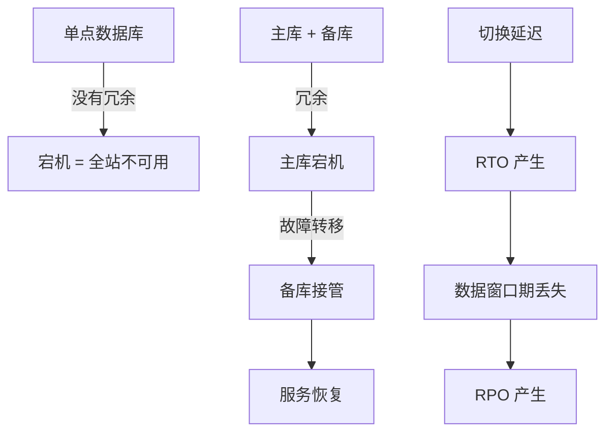
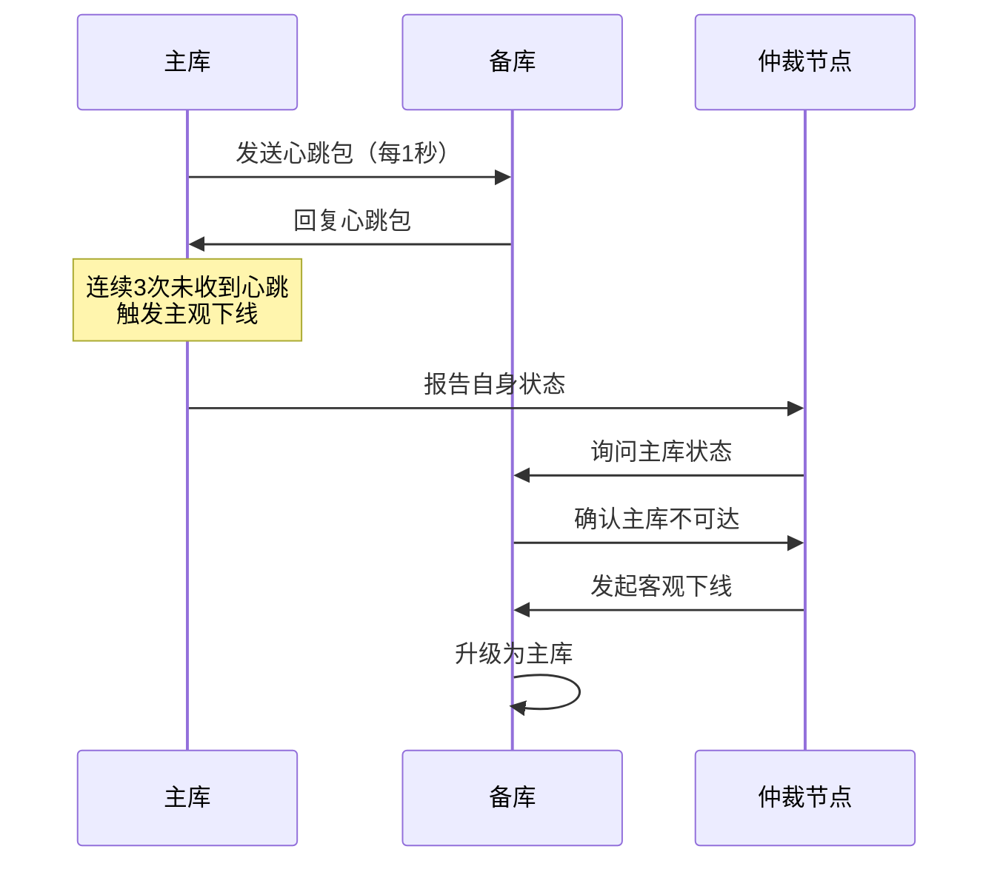
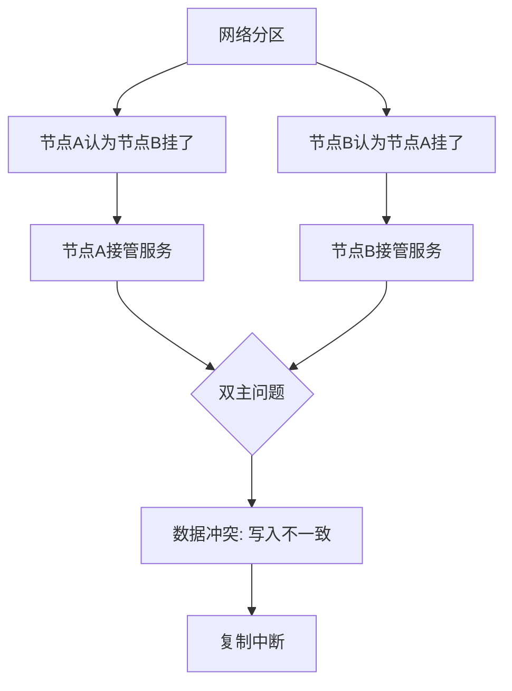
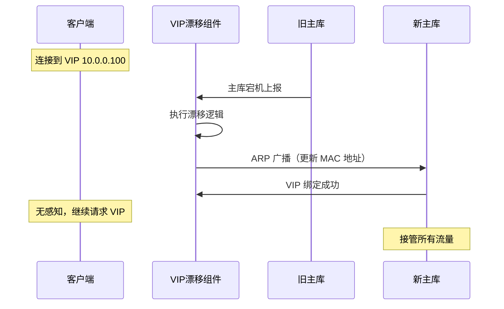
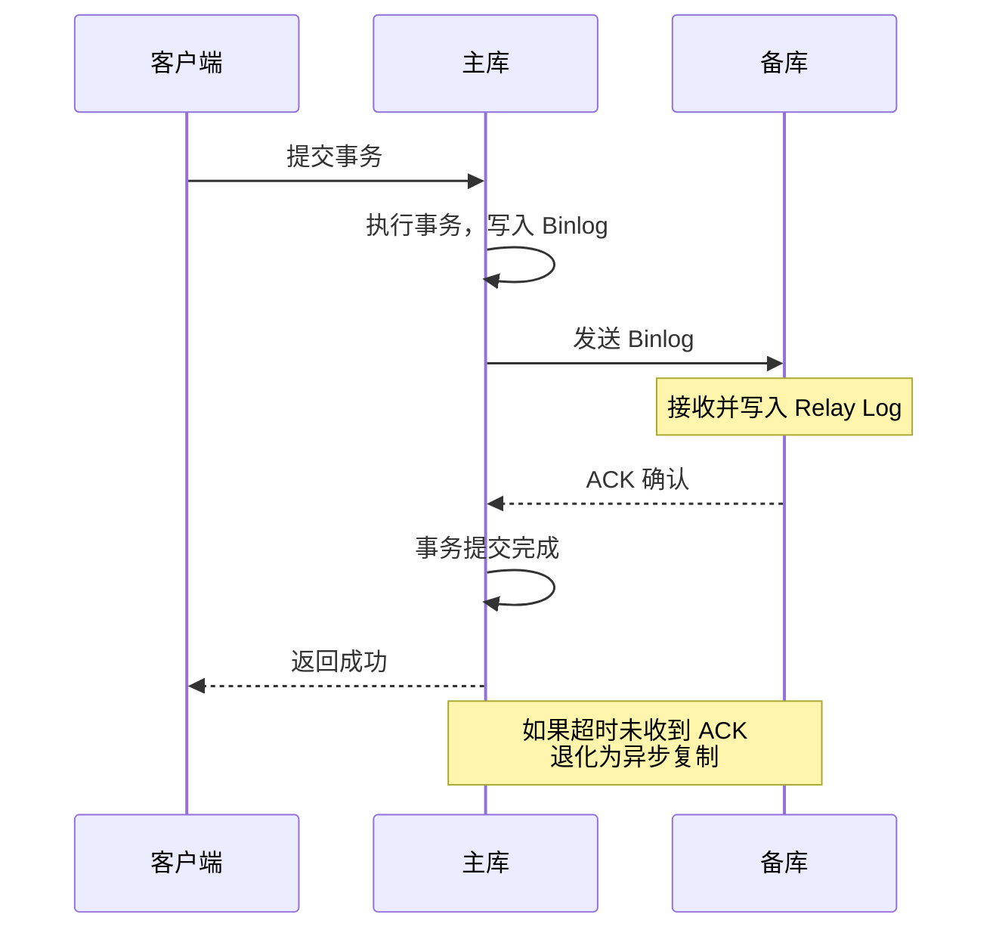

# 冗余与故障转移

## 问题背景

2023年双十一，某电商平台的库存系统在 21:03 分因为一次意外的主库宕机，触发了一个精心设计但从未完整测试过的"自动故障转移"流程。

结果：备库提升为主库后，应用程序同时向新旧主库写入数据，形成了数据库双写。几秒后，MySQL 主从复制中断，Binlog 出现数据冲突。运维团队花了整整 47 分钟才定位到"自动切换脚本在判断逻辑里少了一个条件"。

事后复盘发现，这个自动切换脚本从开发到上线，从未在生产环境做过一次完整演练。

这次事故的根因不是"没有做冗余"，而是"做了冗余但没有验证切换流程"。

【架构权衡】
冗余不是越多越好——两副本是工业标准，三副本的边际收益递减但成本线性增长。更重要的是，冗余的价值在于"切换成功"，而不是"数量够多"。一套没人验证过的故障转移流程，在关键时刻一定会失败。

## 问题定义

冗余（Redundancy）是为系统添加超过正常工作所需的额外组件，在故障发生时接管工作。

但冗余本身不提供可用性，**故障转移（Failover）** 才是。冗余 + 故障转移 = 高可用。

RTO 和 RPO 是冗余设计的两个核心约束：
- **RTO** 决定了你需要多快的切换速度
- **RPO** 决定了你需要多强的一致性保证

## 冗余的类型

### 热备（Hot Standby）

备库实时同步主库数据，随时可以接管。主库故障时，切换延迟在秒级甚至毫秒级。

- **用途**：金融交易、核心订单系统，对 RTO 要求极低的场景
- **代表实现**：MySQL 半同步复制、Redis Sentinel（主观下线 + 客观下线）

### 温备（Warm Standby）

备库定期同步（比如每分钟），不完全实时。主库故障时，切换延迟在分钟级，可能丢失少量数据。

- **用途**：中等重要性的业务，能接受几分钟 RTO
- **代表实现**：MySQL 异步复制（非半同步）

### 冷备（Cold Standby）

备库不在线，只有备份文件。主库故障时，需要从备份恢复数据，切换延迟在小时级。

- **用途**：非核心业务、归档数据
- **代表实现**：定时备份 + 手动恢复

| 类型 | 数据实时性 | RTO | RPO | 成本 | 适用场景 |
| --- | --- | --- | --- | --- | --- |
| 热备 | 实时同步 | 秒级 | 0 | 高（需要高带宽） | 金融、核心交易 |
| 温备 | 分钟级同步 | 分钟级 | 分钟级 | 中 | 一般互联网业务 |
| 冷备 | 小时级备份 | 小时级 | 小时级 | 低 | 非核心业务 |

## 故障检测机制

故障检测是故障转移的第一步，也是最容易出错的一步。

### 心跳检测

**主观下线（SDown）**：一个节点单方面认为另一个节点挂了（连续 N 次心跳超时）

**客观下线（ODown）**：多个节点（Quorum）都认为某个节点挂了

:::tip 💡
Sentinel 主观下线的阈值（`down-after-milliseconds`）设置太小会导致误判（网络抖动时误认为节点挂了），设置太大会导致真正故障时 RTO 拉长。建议设为心跳间隔的 3 倍以上。
:::

### 健康检查

应用层的健康检查比纯网络心跳更可靠：

- **TCP 探活**：检查端口是否可达
- **HTTP GET 探活**：检查 `/health` 端点，应用层返回真实状态
- **Exec 探活**：执行脚本验证（如"能否执行 SELECT 1"）

## 自动切换 vs 手动切换

这是最容易踩坑的决策点。

| 维度 | 自动切换 | 手动切换 |
| --- | --- | --- |
| 切换速度 | 快（秒级） | 慢（分钟级） |
| 脑裂风险 | 高（网络分区时可能双主） | 低（人工事先确认） |
| 运维成本 | 高（需要完整的切换验证） | 低（人工判断） |
| 误判率 | 可能因网络抖动误切换 | 人工判断更准确 |
| 适用场景 | 互联网业务、容忍少量数据丢失 | 金融交易、不允许数据冲突 |

【架构权衡】
**原则：先有可用的手动切换，再考虑自动切换。** 很多团队的"自动切换"其实是半自动——检测自动，执行手动。这个折中方案在大多数场景下是最优的：既避免了误判，又保留了人工判断的空间。

### 脑裂问题

当网络分区发生时，主节点和备节点之间网络断开，但各自仍能独立运行。此时：

- 主节点认为备节点挂了
- 备节点认为主节点挂了
- 两者同时尝试接管，形成**双主（Dual-Master）**

**解决方案**：
1. **Quorum 机制**：只有获得多数票的节点才能成为主（Redis Sentinel 的 `quorum` 参数）
2. ** fencing 机制**：切换时向原主发送 STONITH（shoot-the-other-node-in-the-head）信号，切断其写入能力
3. **网络层面隔离**：确保网络分区时只有一个节点能访问共享存储

## VIP 漂移

故障转移后，客户端如何找到新的主库？答案是 **VIP（Virtual IP）漂移**。

**Keepalived + VRRP** 是 Linux 环境下实现 VIP 漂移的标准方案：
- VRRP 协议在多个节点间选主
- 主节点持有 VIP，定期发送广告
- 主节点故障后，备节点自动接管 VIP

:::warning ⚠️
VIP 漂移有一个隐蔽的坑：**客户端的连接池持有的是 IP 而不是域名**。VIP 漂移后，TCP 连接本身不会断，但如果新主库没有完全同步数据，客户端用旧连接写入的数据可能丢失。解决方案：切换后刷新客户端连接池（最佳实践是使用注册中心的推送通知机制）。
:::

## 数据一致性保障

### MySQL 主从复制的一致性

MySQL 的复制方式影响 RPO：

| 复制模式 | 一致性 | 性能 | RPO | 适用场景 |
| --- | --- | --- | --- | --- |
| 异步复制 | 弱一致 | 高 | 分钟级 | 允许延迟的一般业务 |
| 半同步复制 | 强一致 | 中 | 0（至少一个备库确认） | 对数据完整性有要求 |
| 全同步复制 | 强一致 | 低 | 0 | 不允许任何数据丢失 |

**半同步复制（Semi-sync Replication）**：主库在提交事务前，等待至少一个备库确认收到 Binlog。这个"等待"带来了延迟，但保证了数据不会丢失。

### Redis 主从的一致性

Redis 的主从复制默认是异步的：
- 主库写入后立即返回客户端
- 异步同步到从库

Redis Sentinel 提供了故障转移能力，但 **RPO 不为 0**——在主库宕机到从库接管这段时间内，可能有少量数据未同步。

:::tip 💡
Redis Cluster 的槽迁移过程中也有数据一致性问题。当槽从节点 A 迁移到节点 B 时，访问迁移中槽的请求可能返回 MOVED 或 ASK——客户端需要正确处理这两种响应，否则可能读到脏数据。
:::

## 生产避坑

1. **切换脚本不测试就是废纸**：自动切换脚本必须定期在预发布环境演练。最佳实践是每月做一次完整的故障转移演练。
2. **不要忽略复制延迟**：MySQL 主从延迟可能在高峰期达到几秒甚至几分钟。以为"备库数据跟主库一样"是经典的认知错误。
3. **VIP 漂移后客户端连接池问题**：切换后老的 TCP 连接可能带着脏数据或者已经断开。需要通知客户端刷新连接。
4. **多级切换的顺序陷阱**：有些系统有多层冗余（如同城热备 + 异地冷备），切换时必须按正确顺序操作，跳步会导致数据不一致。
5. **切换时的数据回查**：新主库接管后，要主动回查一下这段时间有没有遗漏的请求（比如因为网络抖动被中断的客户端重试）。

## 工程代价

| 维度 | 评估 |
| --- | --- |
| 基础设施成本 | 热备 `+` 100% 成本，温备 `+` 50%，冷备 `+` 20% |
| 运维复杂度 | 自动切换的验证成本极高 |
| 排障复杂度 | 复制延迟 + 切换延迟叠加，故障定位更复杂 |
| 数据安全 | RPO 从分钟级到 0，取决于复制模式 |
| 回滚风险 | 切换过程不可逆，需要完整的回滚预案 |

## 落地 Checklist

- [ ] 评估业务对 RTO 和 RPO 的要求
- [ ] 选择合适的冗余类型（热备/温备/冷备）
- [ ] 选型故障检测机制（心跳/健康检查）和 Quorum 数量
- [ ] 评审自动 vs 手动切换策略（优先半自动）
- [ ] 实现 VIP 漂移（Keepalived）或使用注册中心通知机制
- [ ] 配置 MySQL 半同步复制（如果 RPO 要求为 0）
- [ ] 编写故障转移脚本，包含完整的边界条件处理
- [ ] 设计脑裂防护机制（fencing/STONITH）
- [ ] 每月执行一次完整的故障转移演练
- [ ] 建立切换后的数据一致性校验流程
- [ ] 配置监控：复制延迟告警、心跳丢失告警、切换事件告警
