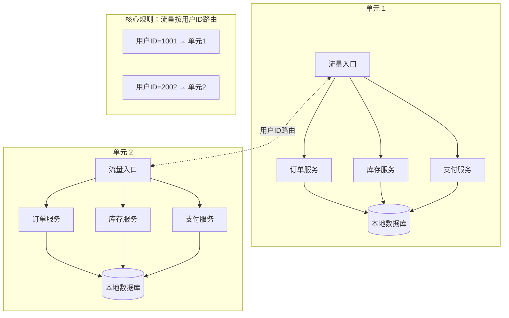
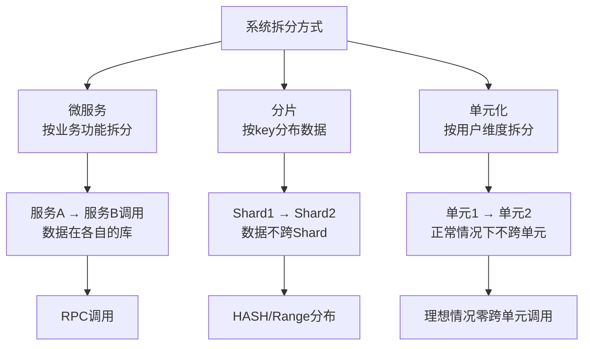
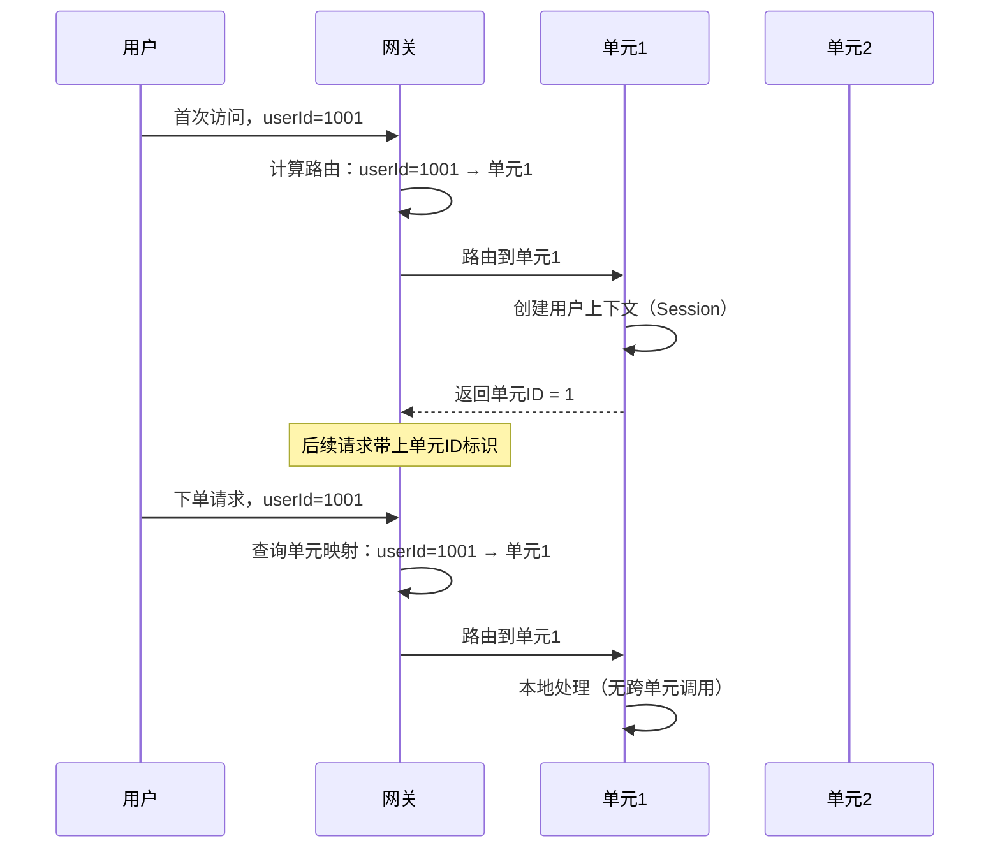
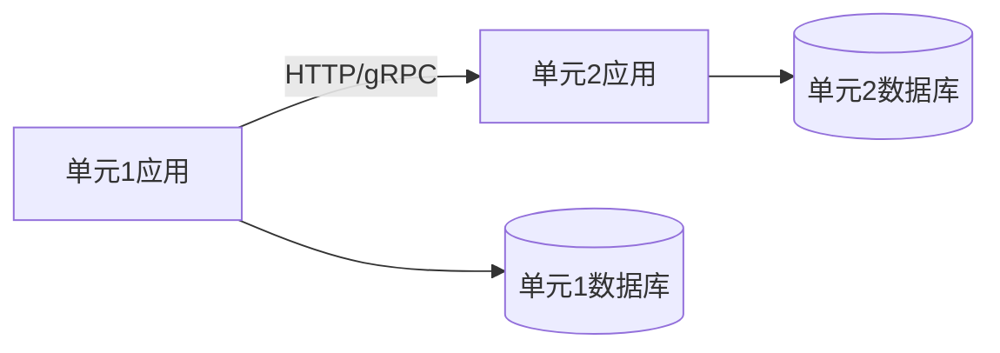
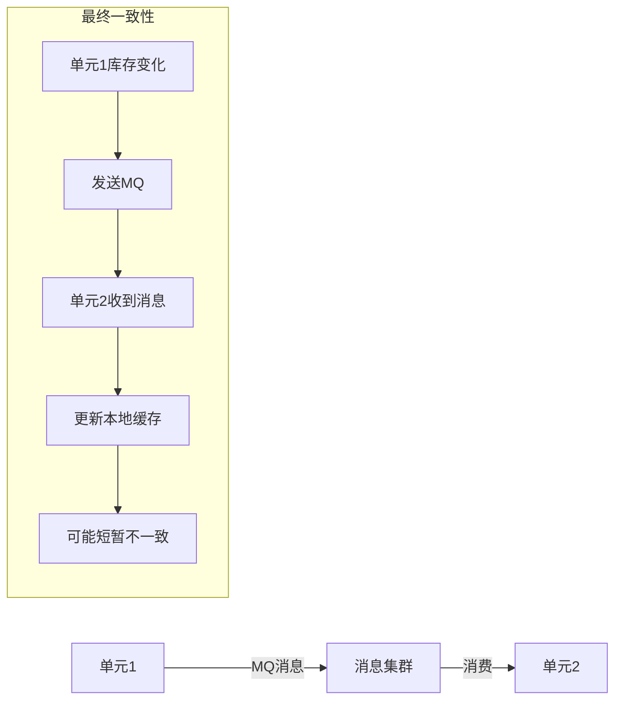

# 单元化架构

## 问题背景

2022年双十一，某电商平台的技术团队信心满满地宣布完成了"单元化改造"。他们按用户 ID 将流量拆分到 16 个单元，每个单元独立部署了完整的订单、库存、支付服务。

零点高峰到来后，问题出现了：用户 A（单元1）下单时，库存服务查询发现商品 SKU-1234 的库存数据**不在单元1的本地库中**——它被路由到了另一个单元。开发团队的解决方案是"跨单元调用库存服务"，但跨单元调用的延迟比本地调用高了 15ms，在零点高峰期导致大量超时。

更糟糕的是，库存服务跨单元更新后，扣减通知通过 MQ 异步发送到单元1，但此时用户 A 的订单已经超时关闭了——用户看到的是"下单成功但库存不足"。

这不是真正的单元化，而是**"伪单元化"**——把流量拆了，但数据没有跟着走。

【架构权衡】
单元化是"大招"，不是第一选择。中小型系统用多活就够了，单元化的改造成本极高——需要重构数据访问层、改造 RPC 框架、重写路由规则。阿里是在双十一超大规模流量压力下才发展出单元化，中小型团队不应该把这个方案当作默认选择。

## 问题定义

**单元化（Cell-based Architecture）**：将系统拆分为多个独立的"单元（Cell）"，每个单元是一个自包含的子系统，包含完整的业务数据和计算能力。核心原则是**数据不动、流量动**——数据不跨单元流动，流量通过路由规则分配到对应单元。

单元化的本质是对数据进行物理分区，同时保持业务的逻辑完整性。



## 单元化 vs 微服务 vs 分片

这三个概念经常被混淆，但实际上它们解决的问题完全不同。

| 维度 | 微服务 | 分片（Sharding） | 单元化 |
| --- | --- | --- | --- |
| **拆分维度** | 业务边界（按功能拆分） | 数据分布（按 key 分片） | 用户维度（按用户拆分） |
| **数据关系** | 跨服务通过 RPC 调用 | 同一分片内数据在一起 | 每个单元内数据完整 |
| **解决的问题** | 研发效率、团队自治 | 数据容量、单库瓶颈 | 故障隔离、超大规模 |
| **跨单元调用** | 正常（服务间调用） | 不允许（数据不在本分片） | 极少（单元间隔离） |
| **适用场景** | 所有规模的系统 | 单库数据量过大的场景 | 双十一级别超大规模 |
| **与单元化关系** | 独立概念 | 存储层划分 | 业务层划分 |



【架构权衡】
**微服务是拆服务，单元化是拆数据。** 微服务化不会减少数据库的总数据量，只是改变了服务边界。单元化则是对数据进行物理分区，每个单元的数据量是总数据量的 `1/N`。当你的单库数据量成为瓶颈时，第一反应应该是分片；当你的单机房成为瓶颈时，应该考虑多活；只有当你的业务规模接近或超过阿里/双十一级别时，才需要考虑单元化。

## 核心原则：数据不动、流量动

**数据不动**：每个用户的所有业务数据都在同一个单元内。用户下单、查询订单、查看物流——所有操作都在同一个单元内完成，不需要跨单元调用。

**流量动**：根据用户 ID 将流量路由到对应单元。第一次访问就确定用户属于哪个单元，后续所有请求都路由到同一个单元。



这个设计的好处：
1. **零跨单元调用**：正常流程中所有操作在单元内完成，避免了跨机房延迟
2. **故障天然隔离**：一个单元挂了，只影响该单元的用户，不影响其他单元
3. **线性扩展**：增加单元数量就能线性扩展容量

## 单元划分规则

### 按用户 ID 哈希分区

最常见的方式：按用户 ID 取模或哈希，映射到对应单元。

```java
int unitId = Math.abs(userId.hashCode()) % unitCount;
```

- **优点**：分布均匀
- **缺点**：扩缩容时需要重新哈希，数据迁移量大

### 按用户 ID 范围分区

按用户 ID 的数字范围划分（如 1~100万 → 单元1，100万~200万 → 单元2）。

- **优点**：扩缩容时只需调整边界，数据迁移量较小
- **缺点**：可能产生热点用户（如 ID 连续的新注册用户集中在同一单元）

### 按地域/业务分区

按用户所在的地域或业务属性分区（如华北用户 → 单元1，华东用户 → 单元2）。

- **优点**：符合业务天然属性，减少跨单元场景
- **缺点**：地域边界模糊时难以划分

## 跨单元调用

单元化的理想状态是零跨单元调用，但实际场景中总有例外：

1. **商家/平台侧操作**：运营后台需要操作所有单元的数据
2. **跨用户事务**：如"转账"操作涉及两个用户
3. **汇总查询**：报表、数据分析需要跨单元汇总

### 单元间同步调用

直接跨单元 RPC 调用，延迟较高（跨城 100ms+），适合低频场景。



### 单元间异步消息

通过 MQ（Kafka/RocketMQ）实现跨单元数据同步，适合高吞吐量场景，但引入最终一致性。



:::warning ⚠️
跨单元异步消息最大的坑是**时序问题**。MQ 消息的消费顺序不严格保证，在高并发场景下可能出现"扣减库存的消息比取消订单的消息后到"的情况。需要引入消息幂等处理和补偿机制。
:::

## 单元化与容灾

单元化天然支持故障隔离，一个单元挂了不影响其他单元。

```mermaid
graph TD
    subgraph 正常状态["正常状态"]
        U1A[单元1: 正常] --> UA[服务可用]
        U2A[单元2: 正常] --> UA
        U3A[单元3: 正常] --> UA
    end

    subgraph 故障状态["单元1故障"]
        U1B[单元1: 宕机] -->|不影响| UB1[单元2接管]
        U1B -->|不影响| UB2[单元3接管]
        UB1 --> U2B[用户被路由到单元2]
        UB2 --> U3B[用户被路由到单元3]
    end

    Note over U1B: 只影响单元1的用户<br/>其他单元用户无感知
```

但容灾切换时需要考虑：

1. **用户路由切换**：故障单元的用户需要被路由到其他单元
2. **数据补偿**：故障单元在宕机期间可能有未处理的消息需要补偿
3. **故障恢复后的数据合并**：故障单元恢复后，需要把故障期间的数据同步回来

## 适用场景

单元化不是万能药，以下场景才适合：

| 条件 | 说明 |
| --- | --- |
| 规模达到瓶颈 | 单机房无法承载当前流量，水平扩展受限 |
| 故障影响范围不可接受 | 一次 AZ 故障可能导致千万级用户不可用 |
| 业务模型适合分区 | 用户之间的交互少，跨用户事务少 |
| 有足够的技术储备 | 需要改造 RPC 框架、数据访问层、路由规则 |
| ROI 合理 | 改造成本能被业务收益覆盖 |

:::tip 💡
**判断标准**：如果你的系统单库数据量还没超过 1 亿条、单机房 QPS 还没超过 10 万，单元化大概率是过度设计。先把多活做好、把分片做对，这些基础工作比单元化优先级更高。
:::

## 生产避坑

1. **不要做"伪单元化"**：流量拆了但数据没跟着走，这是最常见的失败模式。单元化的前提是所有用户数据在同一个单元内。
2. **不要低估路由规则的复杂度**：用户从一个设备登录还是从另一个设备登录？换手机后如何保持单元一致性？这些边界条件需要在设计阶段全部覆盖。
3. **不要忽略跨单元审计场景**：运营、财务、合规通常需要查看全站数据，单元化后如何提供跨单元查询能力是一个需要提前解决的问题。
4. **不要跳过单元化改造的数据迁移验证**：从单库迁移到多单元数据层，数据迁移的正确性验证是最关键的环节。
5. **不要在单元内使用本地缓存作为唯一数据源**：本地缓存只在单元内有效，跨单元访问时缓存无效，可能导致数据不一致。

## 工程代价

| 维度 | 评估 |
| --- | --- |
| 基础设施成本 | 多个完整单元，成本 `+` 200% ~ 500% |
| 数据层改造 | 需要重构数据访问层，支持单元路由 |
| RPC 框架改造 | 需要改造服务发现和调用链路 |
| 路由规则开发 | 需要开发和维护全局路由映射 |
| 开发复杂度 | 跨单元事务、跨单元查询等特殊场景需要单独处理 |
| 运维复杂度 | 多单元配置一致性、监控、日志聚合 |
| 测试复杂度 | 单元化场景的功能测试和性能测试复杂度极高 |

## 落地 Checklist

- [ ] 确认业务规模真的需要单元化（单库数据量、单机房 QPS）
- [ ] 设计单元划分规则（按用户 ID 哈希/范围/地域）
- [ ] 改造数据访问层，支持按用户 ID 路由到对应单元数据库
- [ ] 改造 RPC 框架，支持单元内服务发现
- [ ] 实现全局路由服务（维护 userId → unitId 的映射）
- [ ] 评估跨单元调用场景，设计同步和异步处理方案
- [ ] 开发单元管理平台（单元创建、配置下发、监控）
- [ ] 设计故障隔离和切换方案
- [ ] 制定数据迁移计划，从当前架构平滑迁移到单元化
- [ ] 全量压测验证（模拟单个单元故障，观察其他单元是否受影响）
- [ ] 建立跨单元审计和报表机制
- [ ] 团队培训：所有开发团队理解单元化架构和路由规则
