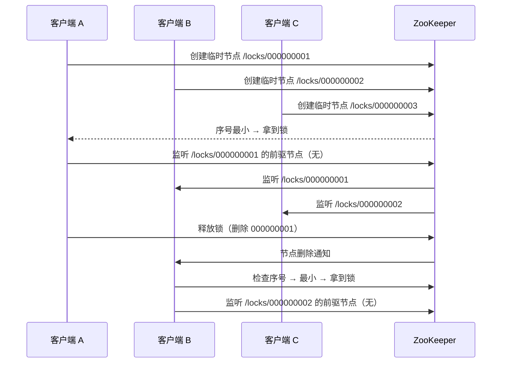
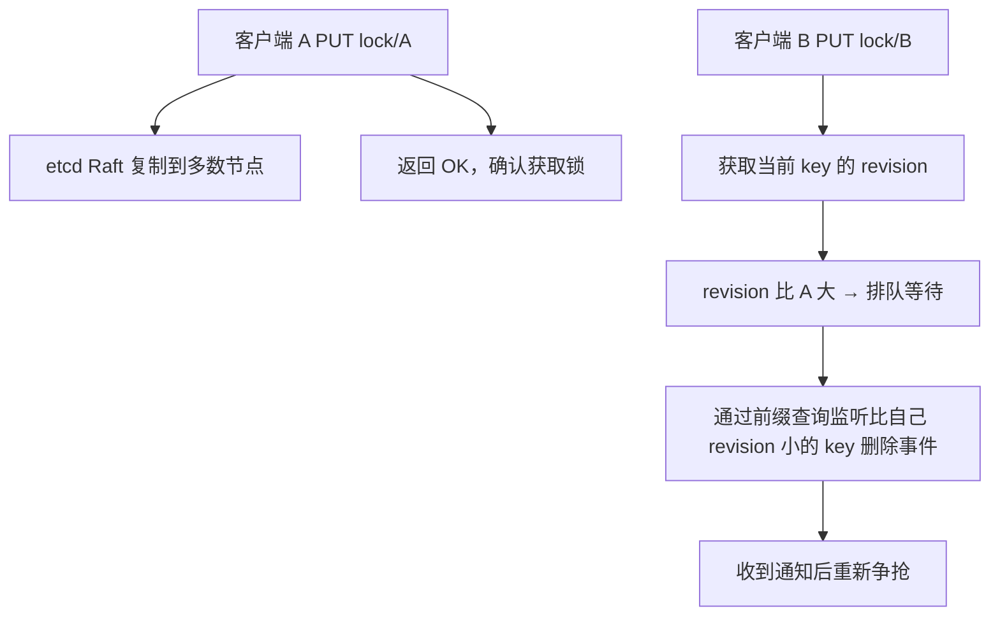

# 三种分布式锁方案对比

2023年双十一前夜，我们的支付团队做了一个"常规"的技术升级：将分布式锁从 ZooKeeper 切换到 Redis。

理由很充分：Redis 性能更好，团队更熟悉，运维更简单。

上线后 2 小时，订单系统出现了诡异的重复扣款：2000 多笔订单被重复支付，总金额超过 180 万元。

复盘结果：Redis 锁在主从切换时丢锁了——主节点宕机，从节点晋升，但从节点的数据落后了 30 秒。这 30 秒里，另一个客户端拿到了同一把锁。

这把锁，本该是保护用户钱袋子的。

今天这篇，我们把 Redis、ZooKeeper、etcd 三种主流分布式锁方案掰开揉碎讲清楚，帮你在这三个方案之间做出正确选择。

## 问题定义

分布式锁，本质上要解决的是**多进程之间对共享资源的互斥访问问题**。

在单机环境下，`synchronized` 或 `ReentrantLock` 就能搞定。但一旦涉及多节点部署，就需要跨进程的协调机制：

- 谁拿到了锁？
- 锁什么时候释放？
- 节点崩溃了怎么办？
- 网络分区了怎么办？

这三个问题，Redis、ZK、etcd 各自给出了不同的答案。

【架构权衡】

分布式锁没有银弹。Redis 快但有丢锁风险，ZK 一致性强但性能最低，etcd 性能居中但运维最复杂。选错方案的代价不仅是技术债务，更可能是真金白银的损失（如上文的 180 万）。所以选型之前，先问自己三个问题：对一致性要求有多高？团队能驾驭多复杂的方案？出问题了能否快速回滚？

## 方案一：Redis 分布式锁

### 核心原理

Redis 分布式锁基于 SETNX（SET if Not eXists）语义，通过 `SET key value NX PX timeout` 原子性地获取锁。

```java
// 获取锁
String result = redis.set(lockKey, clientId, SetParams.setNX().px(30000));
if ("OK".equals(result)) {
    // 获取成功，执行业务逻辑
    try {
        doBusiness();
    } finally {
        // 释放锁：只能删除自己持有的锁
        String script =
            "if redis.call('get', KEYS[1]) == ARGV[1] then " +
            "    return redis.call('del', KEYS[1]) " +
            "else return 0 end";
        redis.eval(script, 1, lockKey, clientId);
    }
}
```

关键设计点：
- **value 必须唯一**：用 UUID 或客户端标识，防止误删他人的锁
- **必须设置过期时间**：防止节点崩溃后锁永远不释放
- **释放锁必须用 Lua 脚本**：保证 get + del 的原子性

### 锁续期： watchdog 机制

如果业务执行时间超过锁过期时间怎么办？Redisson 框架提供了 watchdog 自动续期：

```java
// Redisson 源码简化版
private void scheduleExpirationRenewal(String threadId) {
    // 每 10 秒续期一次，续到原过期时间的 1/3
    expirationRenewalMap.put(threadId,
        schedule(new Runnable() {
            public void run() {
                renewLock(threadId);
            }
        }, internalLockLeaseTime / 3, TimeUnit.MILLISECONDS));
}
```

每 10 秒自动把锁的 TTL 重置为 30 秒，只要业务还在执行，锁就不会丢。

【架构权衡】

Redis 锁的最大优势是性能。在单机 Redis 环境下，QPS 可以达到 10 万以上，远超 ZK 和 etcd。但代价是牺牲了强一致性。Redis 的主从复制是异步的，主节点宕机时从节点可能没有最新数据，这就是"主从切换丢锁"的根因。RedLock 通过多数节点共识来解决这个问题，但会带来延迟增加和运维复杂度上升。

## 方案二：ZooKeeper 分布式锁

### 核心原理

ZK 分布式锁基于临时顺序节点 + Watch 机制：

```java
// 创建临时顺序节点
String path = zk.create("/locks/order-" + UUID.randomUUID(),
    null, ZooDefs.Ids.OPEN_ACL_UNSAFE, CreateMode.EPHEMERAL_SEQUENTIAL);

// 获取锁：自己是序号最小的节点就拿到锁
List<String> children = zk.getChildren("/locks", false);
Collections.sort(children);
String myNode = path.substring(path.lastIndexOf("/") + 1);
if (children.get(0).equals(myNode)) {
    // 拿到锁
} else {
    // 监听前一个节点删除事件
    String prevNode = children.get(children.indexOf(myNode) - 1);
    zk.exists("/locks/" + prevNode, watchEvent -> {
        // 前一个节点删除后，重新尝试获取锁
        tryAcquire();
    });
}
```

ZK 锁的核心逻辑：
1. 每个想要获取锁的客户端在 `/locks` 下创建临时顺序节点
2. 判断自己是否是序号最小的节点：如果是，拿到锁；如果不是，监听前一个节点
3. 当前一个节点被删除（客户端断开连接或业务完成），收到通知后重新争抢



### ZK 锁的天然优势

1. **自动释放**：临时节点在客户端断开时自动删除，不怕节点崩溃
2. **公平锁**：按序号排队，先到先得
3. **顺序保证**：不需要额外的一致性机制

### ZK 锁的劣势

ZK 使用 ZAB 协议保证一致性，每次锁操作都需要过半数节点确认，性能远低于 Redis。在高并发场景下，ZK 锁的 QPS 通常只能达到几千。

【架构权衡】

ZK 的设计哲学是"强一致、慢但稳"。ZK 的 ZAB 协议保证了线性一致性，但代价是每次操作都需要 Leader 节点协调，加上过半确认的延迟。另一个被忽视的问题是：ZK 集群的节点数必须是奇数（3/5/7），而且 ZK 不适合存储大量数据——如果你的锁数量超过 1 万，性能会明显下降。

## 方案三：etcd 分布式锁

### 核心原理

etcd 分布式锁基于其事务机制和租约（Lease）模型，与 ZK 有很多相似之处，但底层使用了 Raft 协议：

```java
// 创建租约
long leaseId = etcd.lease().grant(30).get().getId();

// 在租约上创建 key（带过期时间）
String lockKey = "/locks/order-123";
etcd.put(lockKey, clientId, leaseId);

// 使用事务保证原子性
TXN txn = etcd.transaction().then(
    Op.valueCompare(lockKey, CompareOp.EQUAL, clientId),
    Op.del(lockKey)
).build();
txn.commit();
```

etcd 的锁利用了 MVCC 机制：每次修改都生成一个新的版本号，配合前缀查询和范围事务，可以实现公平的顺序锁。



### etcd 的优势

1. **强一致性**：Raft 协议提供线性一致性，性能优于 ZK（单节点 QPS 可达数万）
2. **租约机制**：锁的过期和续期由租约管理，与业务逻辑分离
3. **多版本并发控制**：revision 机制天然支持公平锁和锁排队
4. **HTTP/gRPC 接口**：比 ZK 的 ZKClient 更轻量

【架构权衡】

etcd 是这三者中最"年轻"的方案，但它继承了 ZK 的强一致性保证，同时在性能上更接近 Redis。etcd 的劣势在于运维复杂度：它需要单独部署集群，学习曲线比 Redis 高，出了问题排查难度也更大。另外 etcd 的官方客户端在 Java 生态不如 Redis 成熟，所以选 etcd 之前要确认团队是否有能力驾驭它。

## 完整对比矩阵

| 维度 | Redis | ZooKeeper | etcd |
| --- | --- | --- | --- |
| **一致性模型** | AP（最终一致） | CP（线性一致） | CP（线性一致） |
| **单节点 QPS** | `>= 10万` | `3,000-5,000` | `10,000-30,000` |
| **CAP 取舍** | 牺牲一致性换取性能 | 牺牲性能换取一致 | 性能与一致性兼顾 |
| **可重入** | 需自行实现（存储 value） | 需自行实现（path + session） | 需自行实现（path + lease） |
| **锁续期** | Redisson watchdog | Session 过期自动释放 | Lease 续期 |
| **公平锁** | 需额外组件（如 Redisson） | 天然支持（序号节点） | 天然支持（revision 排序） |
| **读写锁** | Redisson 提供 | Curator 提供 | 需自行实现 |
| **主从切换丢锁** | 存在风险（异步复制） | 不存在（多数节点共识） | 不存在（Raft 多数确认） |
| **网络分区** | 部分节点可用（AP） | 不可用（需过半数） | 不可用（需过半数） |
| **单点故障** | 主节点故障需运维介入 | ZAB 协议自动选主 | Raft 协议自动选主 |
| **运维复杂度** | 低（团队熟悉度高） | 中（ZK 协议学习成本） | 中高（额外组件 + Raft） |
| **部署成本** | 低 | 中 | 中高 |
| **客户端生态** | 成熟（Jedis/Redisson/Lettuce） | 成熟（Curator/ZKClient） | 一般（jetcd/etcd4j） |
| **典型使用场景** | 高并发、普通业务 | 强一致、低并发 | 配置中心关联、中等并发 |

## 生产避坑

### Redis 锁的五个致命坑

**坑一：锁过期了但业务还没执行完**

如果设置了 30 秒超时，但业务需要 60 秒，锁会自动释放，另一个客户端会拿到同一把锁。

**解决方案**：使用 watchdog 续期（Redisson）或将锁 TTL 设置为业务预估时间的 2-3 倍。

**坑二：主从切换丢锁**

主节点宕机后，从节点晋升但数据缺失，导致两个客户端同时拿到锁。

**解决方案**：使用 RedLock（5 个独立 Redis 节点）或改用 etcd/ZK。

**坑三：锁被误删**

客户端 A 获取锁后超时，锁被自动释放；客户端 B 拿到锁；客户端 A 执行完成后删除了客户端 B 的锁。

**解决方案**：释放锁时用 Lua 脚本判断 value 是否匹配。

**坑四：集群模式下锁获取不对称**

Redis Cluster 模式下，锁 key 可能在不同槽位，不同节点的 `DEL` 操作无法保证原子性。

**解决方案**：Redisson 的集群锁使用 hash slot 计算，保证同一 key 在同一节点。

**坑五：CLH 队列饥饿问题**

使用 ZK 或 etcd 的顺序锁时，如果持有锁的客户端崩溃，后续所有客户端都要等待。

**解决方案**：监控锁获取延迟，设置超时告警。

### ZK 锁的坑

ZK 锁最大的坑是**羊群效应（Herd Effect）**：锁释放时，所有等待的客户端都会收到通知，同时去争抢锁，造成惊群效应。

**解决方案**：使用临时顺序节点，只监听前一个节点而不是锁节点本身。

### etcd 锁的坑

etcd 的 Lease 需要手动续期，如果忘记续期，锁会提前过期。

**解决方案**：使用 `keepAlive` 自动续期机制，或将 Lease TTL 设置为预估业务时间的最大值。

## 场景化推荐

【架构权衡】

没有最优方案，只有最适合业务场景的方案。以下推荐基于行业实践，但实际选型还需结合团队能力和运维成本综合判断。

| 场景 | 推荐方案 | 理由 |
| --- | --- | --- |
| 高并发秒杀 | Redis 锁 + RedLock | 性能优先，QPS 要求高 |
| 电商下单（普通库存扣减） | Redis 锁（单节点或 RedLock） | 性能足够，一致性可通过幂等补偿 |
| 金融支付（账务核对） | etcd 或 ZK | 强一致性，资损零容忍 |
| 任务调度（防止重复执行） | ZK 或 etcd | 公平锁、按序执行 |
| 配置中心关联场景 | etcd | 已有 etcd 集群，边际成本低 |
| 微服务节点选举 | ZK 或 etcd | Leader 选举天然适合顺序节点 |
| 多机房部署 | RedLock 或 etcd | 需要多数节点共识保证 |

## 工程代价评估

| 维度 | Redis | ZooKeeper | etcd |
| --- | --- | --- | --- |
| 排障复杂度 | 低（中台工具成熟） | 中（ZAB 协议排查门槛高） | 中高（Raft + MVCC） |
| 扩展性 | 好（水平扩展） | 差（需重新部署集群） | 中（支持扩缩容） |
| 回滚风险 | 低（回滚配置即可） | 中（需重启集群） | 中（需重启集群） |
| 监控成熟度 | 高（Redis Exporter 成熟） | 中（需要自建监控） | 中（Prometheus 支持好） |

## 落地 Checklist

- [ ] 确认业务对一致性的要求（CP 还是 AP）
- [ ] 评估高峰 QPS，选择锁方案
- [ ] 实现 watchdog/续期机制，防止锁提前释放
- [ ] 释放锁使用 Lua 脚本，保证原子性
- [ ] 锁的 value 使用唯一标识（UUID），防止误删
- [ ] 设置锁获取超时，避免无限等待
- [ ] 添加锁获取和释放的监控告警
- [ ] 全链路压测，验证锁方案在高并发下的正确性
- [ ] 制定主从切换时的兜底方案（降级、告警、人工介入）
- [ ] 编写故障演练脚本，验证锁方案在节点崩溃时的行为
