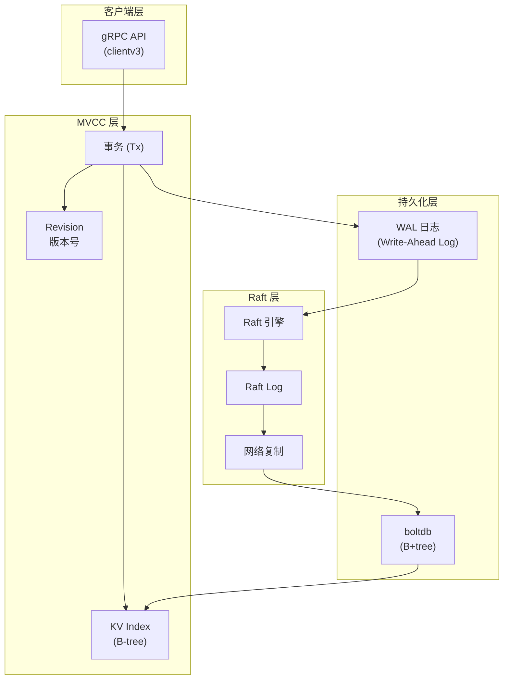
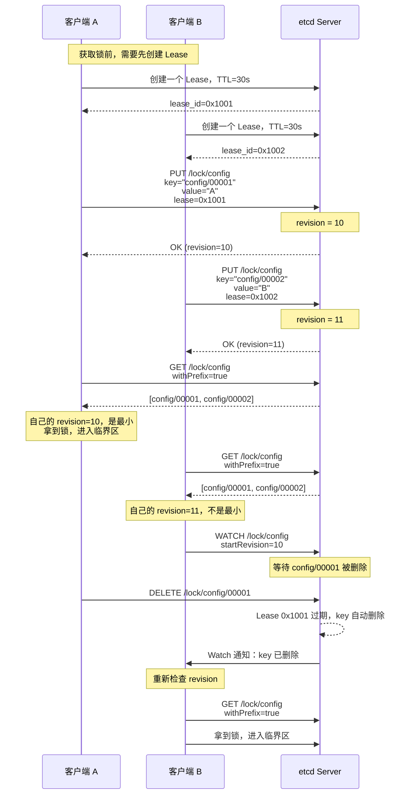

## 事故背景

2024年11月，我们团队上线了一套基于 etcd 分布式锁的配置变更保护机制。上线第一周运行平稳，但第二周被业务方的定时任务打了个措手不及。

每周一早上9点，200个服务实例会同时启动。启动时，每个实例都要争抢 `/lock/service-startup` 这把锁来做初始化。由于 etcd 的 QPS 上限（单节点约 1 万 ops，多节点集群约 3 万 ops），加上当时我们只有 3 个 etcd 节点，在 9:05 分出现了一波锁超时告警。

具体数据：etcd Server 的 P99 写延迟从 8ms 飙升到 500ms，200 个锁请求中有 15 个超时（返回 context deadline exceeded），导致部分服务实例启动失败，触发了 3 次 K8s 自动重启，最终影响了约 2000 名用户的登录体验。

事后复盘：etcd 的 Raft 共识机制在高并发锁竞争场景下，会因为日志复制成为瓶颈——所有写请求都要走 Raft 日志，而 Raft 是单次写的。这个瓶颈不是 bug，是 etcd 的设计取舍。

今天这篇，把 etcd 分布式锁的原理、陷阱和选型讲透。

## 一、etcd 核心架构

### 数据模型：MVCC + B+tree + WAL

etcd 的数据存储架构分为三层：



1. **WAL（Write-Ahead Log）**：所有写操作先写入 WAL 日志，用于崩溃恢复
2. **boltdb**：嵌入式的 B+tree 数据库，负责数据持久化
3. **MVCC（Multi-Version Concurrency Control）**：每次修改生成一个新的 revision 版本，老版本保留，通过版本号实现快照隔离

### MVCC 版本号机制

MVCC 是 etcd 实现线性一致性的关键。每个 key 的每次修改都会生成一个全局递增的 revision：

```
key: "config" | value: "v1" | revision: 3
key: "config" | value: "v2" | revision: 5   ← 修改后，revision 递增
key: "config" | value: "v3" | revision: 8   ← 再次修改
```

revision 由两部分组成：`main revision.mod revision`

- `main`：全局递增的主版本号，每次事务提交时 +1
- `mod`：事务内的修改序号

分布式锁就依赖于这个全局递增的 revision 来保证公平性。

## 二、分布式锁实现原理

### 核心流程

etcd 分布式锁基于前缀匹配 + Lease + Revision 三剑客：



### gRPC API 实现

```java
import io.etcd.jetcd.Client;
import io.etcd.jetcd.LockKey;
import io.etcd.jetcd.LockResponse;

public class EtcdDistributedLock {
    private final Client client;
    private final String lockName;
    private final LockKey lockKey;
    private LockResponse lockResponse;
    private byte[] leaseId;

    public EtcdDistributedLock(Client client, String lockName) {
        this.client = client;
        this.lockName = lockName;
        this.lockKey = client.getLockClient().getLockKey(lockName);
    }

    /**
     * 获取锁
     * @param waitTime  最大等待时间（秒）
     * @param leaseTime Lease 过期时间（秒）
     */
    public boolean tryLock(long waitTime, long leaseTime) throws Exception {
        // 1. 创建 Lease（带 TTL）
        Lease lease = client.getLeaseClient();
        long ttl = lease.grant(leaseTime);
        this.leaseId = Lease.toLeaseID(ttl);

        // 2. 尝试获取锁（原子操作：在指定 key 前缀下创建唯一 key）
        // 内部实现：
        //   - 在 /lock/{lockName}/ 路径下创建顺序 key
        //   - key 格式：/lock/{lockName}/{revision}
        //   - 使用 Txn 事务保证原子性
        try {
            lockResponse = client.getLockClient()
                .lock(lockName, ("instance-" + UUID.randomUUID()).getBytes(), leaseId)
                .get(waitTime, TimeUnit.SECONDS);
            return true;
        } catch (Exception e) {
            // 获取失败，撤销 Lease
            lease.revoke(Lease.toLeaseID(lease.grant(leaseTime).getID()));
            throw e;
        }
    }

    /**
     * 释放锁
     * 只需要撤销 Lease，key 会自动删除
     */
    public void unlock() throws Exception {
        if (lockResponse != null) {
            // Lease 撤销后，关联的 key 自动被删除
            client.getLeaseClient().revoke(leaseId);
        }
    }
}
```

### Lease 机制详解

Lease（租约）是 etcd 锁的核心设计之一：

```java
// Lease 的核心能力

// 1. 创建带 TTL 的 Lease
long leaseId = lease.grant(30); // TTL=30秒

// 2. key 关联 Lease
kv.put(key, value, leaseId); // key 只在 lease 存活期间有效

// 3. 续期（KeepAlive）
// 业务执行时间超过 lease TTL 时，需要续期
CompletableFuture<LeaseKeepAliveResponse> resp = lease.keepAlive(leaseId);
resp.thenAccept(r -> {
    System.out.println("续期成功，TTL=" + r.getTTL());
});

// 4. 撤销 Lease
lease.revoke(leaseId); // key 立即被删除

// 5. Lease 自动过期
// 如果不续期，TTL 到期后 etcd 自动删除所有关联的 key
```

对比 ZooKeeper 的临时节点：

```
ZooKeeper 临时节点：session 断开 → 节点删除
etcd Lease：TTL 到期 或 主动撤销 → key 删除
```

两者的语义相似，但 etcd 的 Lease 更灵活：**业务可以在持有锁期间主动续期**，而 ZooKeeper 的临时节点无法续期（只能等 session 超时）。

:::tip 💡
Lease 续期有一个容易踩的坑：**续期是异步的，需要持续发送 KeepAlive 请求**。如果业务执行时间很长，必须在另一个线程中持续调用 `keepAlive()`，而不是只调用一次。
:::

## 三、公平锁 vs 非公平锁

### 什么是非公平锁

etcd 的 `clientv3.Lock` 默认实现是**非公平锁**：

```java
// 非公平锁的问题
// 场景：3 个客户端同时尝试获取 /lock/order
// 由于 etcd 的写操作经过 Raft，如果 C2 的写请求先于 C1 到达
// revision 的顺序就不完全等于客户端的到达顺序

// 实际情况：
// C1 的写请求在 T1 发起，但由于 Raft Leader 的处理延迟
// C2 在 T2 发起的写请求可能先被 Raft 复制并提交
// 导致 revision(C2) < revision(C1)

// 结果：C2 拿到了锁，但 C1 先发起请求
// ——这就是非公平性
```

### 公平锁的实现

```java
// 基于 Txn 实现公平锁：先检查队列，再加锁
public class FairEtcdLock {
    private final KV kv;
    private final String lockPath;
    private final String myKey;

    public boolean acquire(long waitTime) throws Exception {
        // 1. 创建唯一 key（包含客户端标识 + 时间戳）
        myKey = lockPath + "/" + UUID.randomUUID().toString();

        // 2. 使用 Txn 确保原子性
        // Txn 的语义：先检查前缀下是否存在更小的 key
        // 如果不存在，才写入自己的 key
        Txn txn = kv.txn();
        txn.If(
            // 条件：不存在比当前 revision 更小的 key
            // 这保证了 FIFO 顺序
            new Range(kv, lockPath, myKey)
        ).Then(
            // 如果条件满足（自己是队列第一个），写入锁 key
            new Put(kv, myKey, lockValue, leaseId)
        ).Else(
            // 否则等待 Watch
            new Watch(kv, lockPath, myKey)
        );

        return txn.commit();
    }
}
```

【架构权衡】

公平锁和非公平锁的选择取决于业务需求：

| 场景 | 锁类型 | 理由 |
|------|--------|------|
| 任务调度（需要严格 FIFO） | 公平锁 | 先到先得，保证公平性 |
| 库存扣减（追求高吞吐） | 非公平锁 | 减少 Watch 开销，提高并发度 |
| 选主（只有一人能拿锁） | 无所谓 | 只有一个竞争者，不涉及公平性 |

## 四、与 Redis / ZooKeeper 锁的对比

| 维度 | etcd 锁 | Redis 锁 | ZooKeeper 锁 |
|------|---------|---------|--------------|
| 一致性模型 | CP（Raft 线性一致） | AP（最终一致） | CP（ZAB 强一致） |
| 线性一致性 | 强（MVCC + revision） | 弱（依赖单节点原子性） | 强（顺序节点） |
| 锁释放 | Lease TTL 或主动撤销 | TTL 过期 | session 断开自动删除 |
| 通知机制 | Watch（服务端推送） | 客户端自旋 | Watch（服务端推送） |
| 性能 | 中（单节点 1万 ops，Raft 瓶颈） | 高（单节点 10万+ ops） | 低（每次操作 1+ RTT） |
| 锁公平性 | 可实现公平锁 | 非公平 | 公平 |
| Lease 续期 | 支持 | 不直接支持（需用 Lua 模拟） | 不支持 |
| API 风格 | gRPC（protobuf） | Redis 协议 | ZK 协议（自定义） |
| 运维成本 | 中（Consul/etcd 生态成熟） | 低 | 高 |

【架构权衡】

一致性三角再次出现：etcd 选择了强一致性 + 中等性能，在 ZooKeeper 和 Redis 之间找到了一个平衡点：

```
性能:    Redis >> etcd > ZooKeeper
一致性:  Redis < etcd = ZooKeeper
运维:    Redis < etcd < ZooKeeper
```

如果你的场景是**配置变更保护、选主、服务注册**，etcd 是一个很好的选择——它比 ZooKeeper 轻量，比 Redis 可靠。

但如果你的场景是**高并发扣库存**（500+ 竞争者），etcd 的 Raft 瓶颈会成为性能杀手。

## 五、常见踩坑

### 踩坑一：Lease 续期不当

```java
// ❌ 错误：只在获取锁时调用一次 keepAlive
lock.tryLock(30, 30);
processOrder(); // 假设这个方法执行 45 秒
// Lease 在 30 秒后过期，但业务还没执行完
// 锁被其他客户端拿走，但当前客户端还在临界区
// → 两个客户端同时在临界区！

// ✅ 正确：异步持续续期
long leaseId = lease.grant(30);
CompletableFuture<Long> keepAlive = lease.keepAlive(leaseId);
keepAlive.thenAccept(response -> {
    // etcd 自动定期续期，直到显式撤销
    System.out.println("续期成功，TTL=" + response.getTTL());
});
```

### 踩坑二：Watch 断连

```java
// ❌ 错误：Watch 不处理断连
Watch watch = client.getWatchClient().watch(
    key,
    response -> {
        for (WatchEvent event : response.getEvents()) {
            // 处理事件
        }
    }
);
// 当 etcd 集群发生选举时，Watch 连接会断开
// 如果不处理，客户端会永远等待

// ✅ 正确：Watch 需要处理断连并重建
Watch watch = client.getWatchClient().watch(
    key,
    response -> {
        if (response.getEvents().isEmpty()) {
            // Watch 已过期，需要重新建立
            rebuildWatch();
            return;
        }
        for (WatchEvent event : response.getEvents()) {
            // 处理事件
        }
    }
);
```

:::warning ⚠️
etcd 的 Watch 有一个关键语义：**Watch 是按 revision 进行的**。如果一个 Watch 因为连接断开而错过了一个事件，客户端需要从断点重新开始监听。这要求客户端自己维护 last revision，并在重连时使用 `watch(key, startRevision)` 恢复。
:::

### 踩坑三：QPS 限制

etcd 默认对每个节点的写 QPS 有限制（约 1000~3000 ops，取决于硬件）。在高并发锁竞争场景下，这个限制会直接导致锁超时：

```java
// ❌ 错误：并发无上限
for (int i = 0; i < 200; i++) {
    final int idx = i;
    executor.submit(() -> {
        // 200 个并发请求同时打 etcd
        // etcd QPS 被打满，后续请求超时
        lock.tryLock();
    });
}

// ✅ 正确：限制并发度 + 指数退避
Semaphore semaphore = new Semaphore(50); // 限制同时竞争数
for (int i = 0; i < 200; i++) {
    executor.submit(() -> {
        if (!semaphore.tryAcquire()) {
            return; // 跳过，等待下次调度
        }
        try {
            lock.tryLock(10, 30); // 带超时
        } catch (Exception e) {
            // 指数退避重试
            retryWithBackoff();
        } finally {
            semaphore.release();
        }
    });
}
```

### 踩坑四：事务误用

```java
// ❌ 错误：把 Lease 和 Put 分开执行，不是原子的
long leaseId = lease.grant(30);
kv.put(key, value, leaseId); // 如果 Put 失败，Lease 已经创建了
// → Lease 泄漏

// ✅ 正确：使用 Txn 将 Lease 和 Put 打包
Txn txn = kv.txn();
txn.If(new Compare(lease, "GRANT", 0))  // Lease 已存在
    .Then(new Put(key, value, leaseId))
    .Else(new Put(key, value, lease.grant(30))); // 创建并使用新 Lease
txn.commit();
```

## 六、生产避坑清单

| 坑点 | 后果 | 解决方案 |
|------|------|---------|
| Lease 续期缺失 | 业务时间超过 TTL，锁被其他客户端拿走，并发进入临界区 | 使用 `keepAliveAsync()` 持续续期 |
| Watch 断连未处理 | 锁释放通知丢失，客户端无限等待 | 监听 Watch 响应状态，断连时重建 |
| QPS 被打满 | 锁获取超时，context deadline exceeded | 限制并发度 + 指数退避重试 |
| Lease 泄漏 | Lease 不撤销也不过期，浪费 etcd 存储 | 使用 Txn 保证 Lease 和 Put 原子性 |
| 锁值不唯一 | 不同客户端释放了别人的锁 | 用 UUID 生成唯一锁值 |
| 超时时间设置不当 | TTL 过长则锁回收慢，TTL 过短则续期压力大 | TTL = 业务预估时间 `*` 2，配合续期 |

## 七、工程代价评估

| 维度 | 评估 |
|------|------|
| 开发成本 | 中（gRPC API 学习曲线，Lease/Watch 语义需要深入理解） |
| 运维成本 | 中（etcd 集群至少 3 节点，Raft 选举需要监控） |
| 排障复杂度 | 中（QPS 瓶颈、Lease 过期、Watch 断连需要分析 etcd 日志和 metrics） |
| 扩展性 | 中（etcd 推荐最大 7 节点，容量和性能受限于 Raft） |
| 性能 | 中（单节点 1 万 ops，Raft 复制是瓶颈） |
| 一致性保证 | 高（MVCC + Raft，线性一致性） |

etcd 分布式锁是一个**一致性优先**的选择。它在正确性上优于 Redis 锁，在运维复杂度上优于 ZooKeeper 锁。但它有一个根本性局限：**etcd 不是为高并发锁场景设计的**。

回到我们的事故：200 个实例同时竞争，etcd 的 Raft 单次写瓶颈直接暴露。如果当时选择 Redis 锁 + 信号量限制并发数，完全可以避免这次故障。
