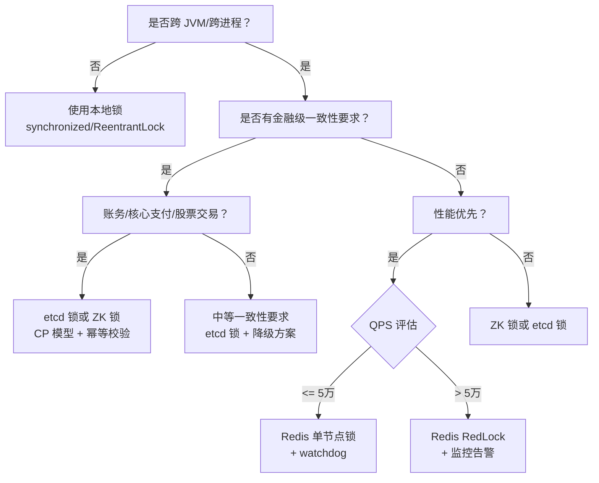

# 分布式锁选型建议

2024年一季度，某金融科技公司上线了一套理财购买系统。上线前测试了 3 个月，没出过问题。

结果上线第一周，就出现了一笔诡异的事故：同一用户在同一时刻触发了两次购买，导致超买了 50 万元的理财产品。

事后复盘发现，团队在选型时犯了一个致命错误——他们用 Redis 单节点锁来保护金融交易，但 Redis 单节点在主从切换时丢锁了。更要命的是，业务代码里没有做幂等校验。

50 万元的超买，直接触发了一次紧急技术复盘和监管问询。

分布式锁选型，不是选最快或者最稳的，而是选**最适合你的业务、团队和成本**的。这篇指南，带你做出正确的决策。

## 问题背景

分布式锁选型，本质上是在回答五个问题：

1. 锁的粒度有多细？
2. 对一致性要求有多高？
3. 高峰 QPS 有多少？
4. 团队能驾驭多复杂的方案？
5. 出问题了能否快速回滚？

这五个问题，串起来就是一个完整的选型决策树。

【架构权衡】

选型错误比不用分布式锁更危险。不用锁，至少团队知道系统在并发下可能出问题，会主动加幂等、加校验。但用了错误的锁方案，团队会产生虚假的安全感——"我们有锁保护，不会出问题"——从而忽略其他防护手段。一旦锁失效，就是裸奔。这次金融事故的根本原因不是 Redis 丢锁，而是业务代码没有幂等校验。锁只是防线之一，不是银弹。

## 决策树：七步选型法



### 决策步骤详解

**第一步：确认是否真的需要分布式锁**

如果你的系统是单节点部署，或者所有访问都在同一个 JVM 进程内，本地锁就够了。引入分布式锁会引入网络延迟和复杂度，不要过度设计。

**第二步：评估一致性要求**

金融支付、账务核对等场景：一致性 > 性能，选 etcd 或 ZK。
普通电商库存扣减：性能优先，可用 Redis，但必须加幂等。
任务调度防重复执行：需要公平锁，选 ZK 或 etcd。

**第三步：评估 QPS 规模**

`QPS <= 1万`：Redis 单节点锁 + Redisson watchdog，绰绰有余。
`QPS 1-5万`：Redis 锁，注意主从切换风险，考虑加监控。
`QPS > 5万`：Redis RedLock（5 个独立节点）或 etcd。

**第四步：评估团队能力**

团队对 Redis 熟悉度最高，维护成本最低。
ZK 需要学习 ZAB 协议，运维门槛中等。
etcd 需要学习 Raft 协议，运维门槛最高。

**第五步：确认回滚方案**

任何锁方案都需要有兜底——锁获取失败怎么办？锁失效了怎么办？提前想好降级策略，比上线后再补救代价低得多。

## 场景化推荐清单

### 场景一：金融支付

**推荐：etcd 锁（首选）或 ZK 锁**

金融支付的核心要求是强一致性。账务核对时的一个并发冲突，可能导致资产错配。etcd 的 Raft 协议提供线性一致性，性能又比 ZK 高 3-5 倍，是金融场景的首选。

但注意：etcd 锁只是基础，还需要：
- 每笔交易带全局唯一流水号
- 数据库层加乐观锁（version 字段）
- 业务层做幂等校验（流水号去重）

```java
// 三重保障：锁 + 乐观锁 + 幂等
@Transactional
public void pay(PaymentRequest request) {
    // 第一重：分布式锁（etcd/zk）
    lockProvider.lock("payment:" + request.getUserId(), () -> {
        // 第二重：乐观锁（数据库 version）
        int affected = accountMapper.deductBalance(
            request.getUserId(),
            request.getAmount(),
            request.getVersion()
        );
        if (affected == 0) throw new OptimisticLockException();

        // 第三重：幂等校验（流水号去重）
        if (idempotentService.checkAndSet(request.getBizNo())) {
            throw new DuplicateRequestException();
        }
    });
}
```

**为什么不选 Redis**：金融场景下，Redis 主从切换丢锁是不可接受的。即使是 RedLock，也需要 5 个独立节点，运维成本大幅上升。

### 场景二：电商下单

**推荐：Redis 锁（高并发）或 etcd 锁（库存精确）**

电商下单是典型的"高性能 + 最终一致"场景。库存超卖 1-2 件，可以通过补货或优惠券补偿；但下单失败导致用户体验下降，是实打实的转化率损失。

```java
// Redis 锁保护库存扣减
public Result placeOrder(OrderRequest request) {
    String lockKey = "lock:stock:" + request.getSkuId();
    String clientId = UUID.randomUUID().toString();

    try {
        // 尝试获取锁，最多等待 3 秒
        boolean acquired = redisLock.tryLock(lockKey, clientId, 3000, 30000);
        if (!acquired) {
            return Result.fail("系统繁忙，请稍后重试");
        }

        // 扣减库存（Lua 脚本保证原子）
        String script =
            "local stock = redis.call('get', KEYS[1]) " +
            "if tonumber(stock) >= tonumber(ARGV[1]) then " +
            "    return redis.call('decrby', KEYS[1], ARGV[1]) " +
            "else return -1 end";
        Long result = redis.eval(script, 1, "stock:" + request.getSkuId(), request.getQuantity());

        if (result < 0) {
            return Result.fail("库存不足");
        }

        return orderService.createOrder(request);
    } finally {
        redisLock.unlock(lockKey, clientId);
    }
}
```

### 场景三：任务调度防重复执行

**推荐：ZK 锁（天然公平锁）或 etcd 锁**

任务调度场景的特点是：同一个任务只应该有一个执行者，不允许重复执行。ZK 的临时顺序节点天然实现公平锁，序号最小的节点才能拿到锁，其他节点安静等待，不浪费资源。

### 场景四：高并发秒杀

**推荐：Redis 锁 + 限流 + 幂等三剑客**

秒杀是 Redis 锁的主战场。但要注意：Redis 锁只能解决"并发控制"，不能解决"高并发冲击"。一个 Redis 锁 + 三重防护才是完整的方案：

```java
// 秒杀完整方案
public SeckillResult seckill(SeckillRequest request) {
    // 第一重：限流（滑动窗口 + 令牌桶）
    if (!rateLimiter.tryAcquire(request.getUserId(), 1)) {
        return SeckillResult.fail("请求过于频繁");
    }

    String lockKey = "lock:seckill:" + request.getSkuId();
    String clientId = UUID.randomUUID().toString();

    try {
        boolean acquired = redisLock.tryLock(lockKey, clientId, 1000, 5000);
        if (!acquired) {
            return SeckillResult.fail("系统繁忙");
        }

        // 第二重：库存 Lua 原子扣减
        Long stock = redis.decr("stock:" + request.getSkuId());
        if (stock < 0) {
            redis.incr("stock:" + request.getSkuId()); // 回滚
            return SeckillResult.fail("已售罄");
        }

        // 第三重：幂等校验（防重复下单）
        String orderId = generateOrderId(request);
        if (!idempotentChecker.trySet("seckill:" + orderId, 3600)) {
            redis.incr("stock:" + request.getSkuId()); // 回滚
            return SeckillResult.fail("请勿重复下单");
        }

        return SeckillResult.success(orderId);
    } finally {
        redisLock.unlock(lockKey, clientId);
    }
}
```

## 从 Redis 单锁到 RedLock 的升级策略

如果当前使用 Redis 单节点锁，想要升级到 RedLock（5 个独立 Redis 节点），建议分三步走：

**第一步：灰度验证（1-2 周）**

在 10% 的流量上切换到 RedLock，观察性能损耗和错误率。RedLock 相比单节点锁，延迟会增加 2-5ms（因为需要多数节点确认）。

**第二步：监控告警（持续进行）**

- 锁获取成功率 `<= 99.9%` 触发 PagerDuty
- 锁获取平均延迟 `> 50ms` 触发预警
- 锁等待超时次数 `> 100/分钟` 触发预警

**第三步：全量切换 + 回滚预案**

全量切换前，必须准备好回滚脚本：一条命令切换回单节点锁。同时，保留两种锁方案的核心代码，随时可切换。

【架构权衡】

RedLock 不是银弹。它的设计假设是 5 个独立 Redis 节点之间没有共享状态，但这个假设在物理机上容易满足，在云环境中可能因为共享底层存储而失效（"RedLock 不安全"争议的根源就在这里）。另外，5 个节点的运维成本是单节点的 5 倍，监控、备份、升级都要乘以 5。升级 RedLock 之前，先问自己：团队能承受这个运维复杂度吗？

## 避坑 Checklist

### 锁粒度坑

**问题**：锁粒度过粗，导致性能下降严重。

例如：将整个用户相关的操作锁住，实际上只需要锁住单个 SKU。

**正确做法**：锁的粒度要精确到最小冲突域。订单锁 `lock:order:{orderId}`，不要用 `lock:user:{userId}`。

### 锁超时坑

**问题**：锁超时设置不合理——太长会拖慢故障恢复，太短会导致业务还没执行完锁就释放了。

```java
// ❌ 错误：超时时间拍脑袋
redis.set(lockKey, value, "NX", "PX", "100000"); // 100秒？太长了

// ❌ 错误：超时时间太短
redis.set(lockKey, value, "NX", "PX", "100"); // 100ms，业务可能执行 5 秒

// ✅ 正确：超时 = 预估业务时间 × 1.5 + buffer
long estimatedTime = measureBusinessTime(); // 通过压测测量
long lockTimeout = (long)(estimatedTime * 1.5) + 5000; // 加 5 秒 buffer
```

### 锁续期坑

**问题**：业务执行时间超过锁 TTL，导致锁自动释放后其他客户端进入临界区。

**解决方案**：
- Redisson：用 watchdog 自动续期
- 自研：启动一个后台线程定期续期
- 保守：将 TTL 设为预估业务时间的 2-3 倍

### 幂等性坑

**问题**：认为"有了锁就不需要幂等了"，这是最危险的错误。

**解决方案**：锁 + 幂等校验双重保障。幂等是兜底，锁是优化，两者缺一不可。

### 异常处理坑

**问题**：finally 块里 unlock 失败，导致锁一直不释放。

```java
// ❌ 错误：没有处理 unlock 异常
try {
    redisLock.unlock(lockKey, clientId);
} catch (Exception e) {
    // 吞掉了异常，锁可能没释放
}

// ✅ 正确：记录日志 + 告警
try {
    redisLock.unlock(lockKey, clientId);
} catch (LockReleaseException e) {
    logger.error("锁释放失败 key={}, clientId={}", lockKey, clientId);
    alertService.send("锁释放失败，可能存在死锁风险");
}
```

## 锁方案引入评估清单

在引入任何分布式锁方案之前，逐项核对：

| 检查项 | 要求 | 核对 |
| --- | --- | --- |
| 一致性要求 | 明确是 CP 还是 AP，是否有金融属性 | [ ] |
| QPS 压测数据 | 锁方案在高并发下的获取成功率 | [ ] |
| 锁粒度设计 | 锁到最小冲突域，避免过度竞争 | [ ] |
| TTL 设置依据 | 有压测数据支撑，不是拍脑袋 | [ ] |
| 续期机制 | 业务时间长于 TTL 时有 watchdog | [ ] |
| 幂等校验 | 锁之外有独立的幂等保护层 | [ ] |
| 降级方案 | 锁获取失败时的业务降级路径 | [ ] |
| 监控告警 | 锁获取成功率、等待时长、超时次数 | [ ] |
| 回滚预案 | 一键回滚到无锁模式的能力 | [ ] |
| 团队学习成本 | 核心成员是否理解锁的原理和坑 | [ ] |
| 运维能力 | 团队是否能独立排查锁相关故障 | [ ] |

## 常见选型误区

**误区一：Redis 最快，所以 Redis 最好**

Redis 快是真的，但 Redis 是 AP 模型，在主从切换时有丢锁风险。如果一致性要求高，快反而是缺点。

**误区二：ZK 最稳，所以无脑选 ZK**

ZK 确实稳，但 ZK 的 QPS 上限只有几千。在高并发场景下，ZK 锁本身就会成为瓶颈。

**误区三：有了锁就万事大吉**

锁只是并发控制的一种手段，不是唯一的。不要把锁当成解决所有并发问题的银弹，幂等、限流、降级都是防线的一部分。

**误区四：一次性选对，永远不换**

业务在增长，流量在变化。去年的最优方案今年可能不够用了。锁方案需要定期 review，根据业务数据调整。
