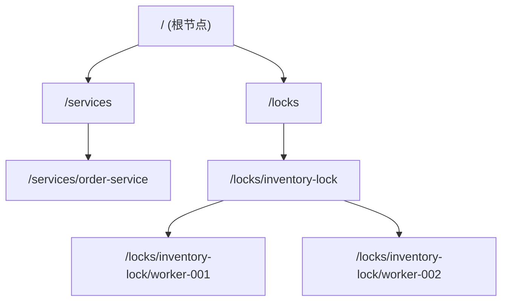
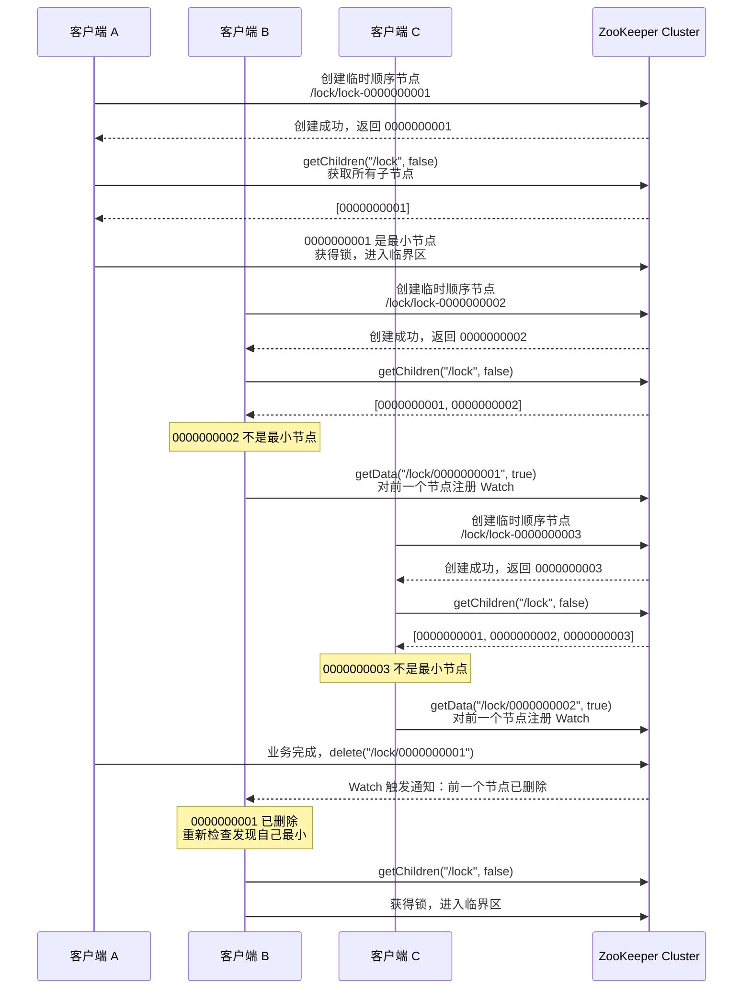
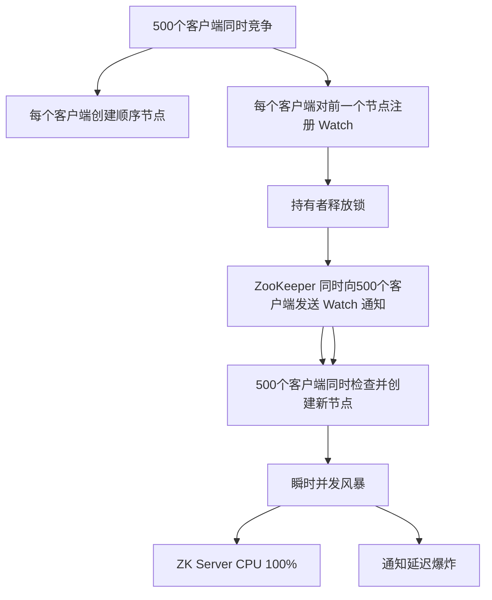
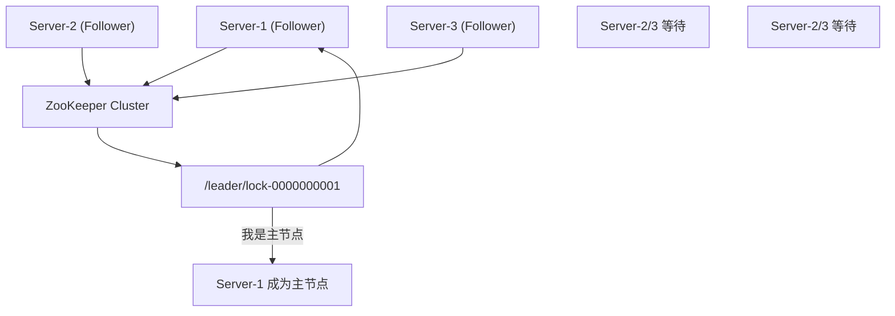

## 事故背景

2024年双十二零点，我们电商平台的库存服务出现了诡异的性能雪崩：API 平均响应时间从 50ms 飙到 8 秒，超时率拉到 99%，持续了整整 12 分钟。

DBA、Redis、网络团队全员就位，排查了 2 个小时后，发现罪魁祸首是一段"看起来很标准"的 Curator 分布式锁代码。

当时有 500 个服务实例同时抢同一把锁（扣库存场景），每个实例都注册了 Watch 监听前一个节点。ZK 集群的 watcher 通知队列瞬间被打满，ZK Server 的 CPU 飙到 95%，通知延迟从几毫秒扩散到几秒，最终触发了整个依赖链的超时瀑布。

这不是 ZK 的 bug，是开发团队没有理解 ZooKeeper 分布式锁的 Watch 机制在高并发下的行为模式。

今天这篇，把 ZooKeeper 分布式锁从原理到坑点全部讲透。

## 一、ZooKeeper 数据模型

### ZNode 层级结构

ZooKeeper 的数据模型是一个**树形层级结构**，每个节点叫做 ZNode：



每个 ZNode 都有以下关键属性：

- **version**：乐观锁版本号，每次修改自动递增
- **ctime / mtime**：创建时间和修改时间
- **dataLength**：数据最大 1MB
- **numChildren**：子节点数量
- **ephemeralOwner**：如果是临时节点，记录持有者的 session ID

### 三种 ZNode 类型

```java
// 持久节点：创建后一直存在，直到主动删除
zk.create("/config", data, ZooDefs.Ids.OPEN_ACL_UNSAFE, CreateMode.PERSISTENT);

// 临时节点：与客户端 session 绑定，session 断开后自动删除
zk.create("/worker-001", data, ZooDefs.Ids.OPEN_ACL_UNSAFE, CreateMode.EPHEMERAL);

// 顺序节点：在创建时自动追加递增序号
zk.create("/lock/lock-", data, ZooDefs.Ids.OPEN_ACL_UNSAFE, CreateMode.PERSISTENT_SEQUENTIAL);
// 创建结果可能是：/lock/lock-0000000001
```

这三种类型的组合产生了分布式锁的核心能力：**临时顺序节点**（EPHEMERAL_SEQUENTIAL）—— session 断开自动删除，且创建时自动带序号。

## 二、分布式锁实现原理

### 核心流程

ZooKeeper 分布式锁的核心思想是：**让锁竞争者排队，最小序号持有锁**。整个流程分为四步：



这个流程中蕴含着三个精妙的设计：

1. **临时节点**：锁持有者崩溃时，session 断开，临时节点自动消失，锁自动释放
2. **顺序节点**：全局递增序号保证了所有客户端看到的排队顺序一致
3. **Watch 机制**：锁释放时只通知下一个人，而不是广播给所有人

### 代码实现

```java
public class ZkDistributedLock implements Watcher {
    private final ZooKeeper zk;
    private final String lockPath;
    private final String currentNode;
    private final String waitNode;
    private final CountDownLatch latch = new CountDownLatch(1);
    private final AtomicBoolean locked = new AtomicBoolean(false);

    public ZkDistributedLock(ZooKeeper zk, String lockPath) throws Exception {
        this.zk = zk;
        this.lockPath = lockPath;

        // 1. 创建临时顺序节点
        currentNode = zk.create(
            lockPath + "/lock-",
            new byte[0],
            ZooDefs.Ids.OPEN_ACL_UNSAFE,
            CreateMode.EPHEMERAL_SEQUENTIAL
        );

        // 2. 检查自己是否是最小节点
        if (checkMinNode()) {
            locked.set(true);
            return;
        }

        // 3. 不是最小节点，监听前一个节点
        waitNode = getPrevNode();
        if (waitNode != null) {
            zk.getData(waitNode, true, null);
        }
    }

    private boolean checkMinNode() throws Exception {
        List<String> nodes = zk.getChildren(lockPath, false);
        Collections.sort(nodes);

        String minNode = nodes.get(0);
        return currentNode.endsWith(minNode);
    }

    private String getPrevNode() throws Exception {
        List<String> nodes = zk.getChildren(lockPath, false);
        Collections.sort(nodes);

        String currentShortName = currentNode.substring(currentNode.lastIndexOf('/') + 1);
        int idx = Collections.binarySearch(nodes, currentShortName);
        if (idx > 0) {
            return lockPath + "/" + nodes.get(idx - 1);
        }
        return null;
    }

    @Override
    public void process(WatchedEvent event) {
        if (event.getType() == Event.EventType.NodeDeleted) {
            try {
                // 前一个节点被删除，重新检查自己是否是最小
                if (checkMinNode()) {
                    locked.set(true);
                    latch.countDown();
                }
            } catch (Exception e) {
                // ignore
            }
        }
    }

    public void unlock() throws Exception {
        if (locked.get()) {
            zk.delete(currentNode, -1);
        }
    }
}
```

## 三、羊群效应问题

### 问题描述

上一节说的 Watch 机制看起来很美好：锁释放时只通知下一个人。但在**锁竞争者数量很大**时，这个设计会退化成严重的**羊群效应**（Herd Effect）。



让我们用具体数字还原这次事故：

500 个实例抢同一把锁，锁持有时间约 100ms。在锁释放的瞬间：

1. ZK 向 499 个等待者（除持有者外）发送 NodeDeleted 通知
2. 499 个客户端几乎同时收到通知
3. 499 个客户端几乎同时执行 `getChildren` + `getData` + `create`
4. ZK Server 的写 QPS 瞬间从 100 飙升到 5000+
5. ZK Server 的 CPU 和通知队列被打满
6. 后续的通知开始堆积，延迟从 5ms 扩散到 5s

### 为什么会这样

羊群效应的根源在于：**Watch 通知是一次性的，每个客户端收到通知后必须重新注册 Watch**。

```java
// 问题代码：每次被唤醒后都要重新 getData 注册 Watch
@Override
public void process(WatchedEvent event) {
    if (event.getType() == Event.EventType.NodeDeleted) {
        try {
            if (checkMinNode()) {
                locked.set(true);
                latch.countDown();
            } else {
                // 重新注册 Watch——这是羊群效应的触发点
                waitNode = getPrevNode();
                zk.getData(waitNode, true, null);
            }
        } catch (Exception e) { }
    }
}
```

当锁释放时，499 个等待者同时被唤醒，同时重新注册 Watch，同时创建新节点。这 499 个客户端的行为**完全相同**，就像一群羊被惊动后同时奔逃——这就是"羊群效应"这个名字的由来。

### 解决方案

#### 方案一：减少同时竞争者数量

```java
// 使用信号量限制同时竞争锁的客户端数量
Semaphore semaphore = new Semaphore(50); // 最多50个客户端同时竞争

public boolean tryLock() {
    if (!semaphore.tryAcquire()) {
        return false; // 直接放弃，不注册 Watch
    }

    try {
        return acquireZkLock();
    } catch (Exception e) {
        semaphore.release();
        return false;
    }
}
```

#### 方案二：随机退避

```java
// 收到通知后，不立即行动，随机等待一段时间
@Override
public void process(WatchedEvent event) {
    if (event.getType() == Event.EventType.NodeDeleted) {
        // 随机退避 0~500ms，减少并发冲突
        int jitter = new Random().nextInt(500);
        Thread.sleep(jitter);

        if (checkMinNode()) {
            locked.set(true);
            latch.countDown();
        }
    }
}
```

:::warning ⚠️
随机退避会引入额外的等待延迟，在低延迟场景下需要慎用。而且退避不能根本解决问题，只是把并发峰值拉平了。
:::

#### 方案三：切换到 Redis 锁或 etcd 锁

如果锁竞争者数量经常超过 100，ZooKeeper 锁的性能会明显下降。此时应考虑 Redis 锁（高并发友好）或 etcd 锁（一致性保证）。

## 四、惊群问题

羊群效应还有另一个维度，叫做**惊群问题**（Thundering Herd）。

想象这样一个场景：

```
锁路径：/lock/inventory
竞争者：2000 个客户端实例
竞争资源：扣减商品库存（单品库存只有 10 件）
```

这 2000 个客户端都在 Watch `/lock/inventory/lock-0001`（最小节点）。当持有者释放锁时，2000 个客户端同时收到通知、同时竞争锁。结果：

- 2000 个客户端中，只有 1 个能拿到锁
- 1999 个客户端在 ZK 层面就失败了（序号不是最小）
- 但这 1999 次"失败尝试"都需要 ZK Server 处理，包括 `getChildren` 系统调用

如果业务是"抢库存"这类场景，大量客户端同时竞争但最终只有少数能成功，惊群问题会严重放大 ZK 的负担。

【架构权衡】

惊群问题的本质是：**大量旁观者同时被唤醒，但绝大多数人的努力是无效的**。

| 方案 | 解决思路 | 代价 |
|------|---------|------|
| ZK 锁 | 旁观者需重新注册 Watch 并等待 | 高竞争下性能差 |
| Redis 锁 | 每个客户端自行 spin，无需通知 | 大量无效的 SETNX 尝试 |
| etcd 锁 | 类似 ZK，但基于 Range + Watch | 同样面临惊群问题 |

## 五、与 Redis 锁的对比

| 维度 | ZooKeeper 锁 | Redis 锁 |
|------|-------------|----------|
| 数据一致性 | CP 系统（ZAB 共识，强一致） | AP 系统（主从异步，存在数据丢失） |
| 锁释放方式 | session 断开自动释放 | TTL 过期释放 |
| 通知机制 | Watch 机制（服务端推送） | 客户端自旋/轮询 |
| 性能 | 低（每次锁操作至少 1 次 RTT） | 高（单节点可达 10万+ QPS） |
| 锁公平性 | 公平（顺序节点保证 FIFO） | 非公平（SETNX 先到先得，但存在时序问题） |
| 实现复杂度 | 高（需要理解 ZNode、Watch、Session） | 低（SETNX + TTL） |
| 运维成本 | 高（ZK 集群需要 3/5 节点） | 低（Redis 成熟方案多） |
| 锁丢失风险 | 低（session 断开即释放） | 有（主节点宕机时锁数据可能丢失） |

【架构权衡】

ZK 锁和 Redis 锁的选择，本质上是**一致性**和**性能**的 trade-off：

```
选 ZK 锁的场景：
  - 锁误释放的后果极其严重（如选主、配置变更）
  - 需要 session 级别的自动续命机制
  - 锁竞争者数量可控（< 100）

选 Redis 锁的场景：
  - 高并发扣库存、抢券等需要极致吞吐的场景
  - 可以容忍极端情况下的小概率数据不一致
  - 团队对 Redis 运维更熟悉
```

## 六、Curator InterProcessMutex

Apache Curator 是最流行的 ZooKeeper 客户端框架，它提供了开箱即用的 `InterProcessMutex`（分布式可重入互斥锁）。

### 基本使用

```java
// 创建 Curator 客户端
CuratorFramework client = CuratorFrameworkFactory.newClient(
    "zk1:2181,zk2:2181,zk3:2181",
    5000,  // sessionTimeoutMs
    5000,  // connectionTimeoutMs
    new ExponentialBackoffRetry(1000, 3)
);
client.start();

// 创建可重入分布式锁
InterProcessMutex lock = new InterProcessMutex(client, "/lock/my-app");

// 加锁
try {
    lock.acquire(30, TimeUnit.SECONDS); // 等待30秒
    // 临界区
    processOrder();
} catch (Exception e) {
    throw new RuntimeException("获取锁失败", e);
} finally {
    try {
        lock.release(); // 释放锁
    } catch (Exception e) {
        // log error
    }
}
```

### 可重入实现原理

```java
// InterProcessMutex 的可重入原理
// 在 ZK 中存储：thread UUID -> lock count
private String lockPath;

// 获取锁
public void acquire() throws Exception {
    if (!internalLock(-1, null)) {
        throw new IOException("Lost connection while trying to acquire lock: " + lockPath);
    }
}

private boolean internalLock(long time, TimeUnit unit) throws Exception {
    // 1. 尝试在 ZK 中创建锁节点
    String lockPath = client.create()
        .creatingParentsIfNeeded()
        .withMode(CreateMode.EPHEMERAL_SEQUENTIAL)
        .forPath(lockPath + "/lock-");

    // 2. 检查当前线程是否已经持有锁（可重入）
    // 原理：在 /locks 下存储 thread UUID -> count 的映射
    // 如果当前线程 UUID 已存在，增加 count 并直接返回成功
    if (isCurrentThreadMutexHolder(lockPath)) {
        incrementMutexHolderCount(lockPath);
        return true;
    }

    // 3. 按标准流程等待锁（检查最小序号 + Watch 前一个节点）
    return waitForLock(lockPath, lockPathData);
}
```

### Curator 锁的坑点

:::warning ⚠️
Curator 的 InterProcessMutex 虽然封装良好，但有一个容易被忽略的坑：**可重入的计数数据存储在锁节点的 data 中**。

如果使用默认的 `OPEN_ACL_UNSAFE`，data 是明文存储的。如果用 `digest` 权限校验，data 的读写需要额外的权限配置。生产环境中务必检查 ACL 配置。
:::

```java
// 坑1：默认使用 OPEN_ACL_UNSAFE，生产环境应该配置 ACL
InterProcessMutex lock = new InterProcessMutex(client, "/lock/my-app");

// 坑2：锁自动续期依赖 session，如果 session 断开需要重试
// Curator 默认会续期，sessionTimeout 内不会自动释放锁
// 但极端情况下（网络分区）仍可能丢锁

// 坑3：InterProcessMutex 不支持公平锁和非公平锁的切换
// 默认是公平锁（按顺序获取），高并发下性能受限
```

## 七、适用场景

ZooKeeper 分布式锁最适合以下场景：

### 选主（Leader Election）



```java
// 选主代码：主节点崩溃后自动切换
InterProcessMutex leaderElection = new InterProcessMutex(client, "/leader");

if (leaderElection.acquire(0, TimeUnit.MILLISECONDS)) {
    // 拿到锁的实例成为主节点
    becomeLeader();
} else {
    // 其他实例等待主节点释放
    waitForLeadership();
}

// 当主节点崩溃时，session 断开，临时节点消失
// 下一个拿到锁的实例自动成为新主节点
```

选主是 ZooKeeper 锁的**最佳场景**：主节点崩溃后自动触发锁重新分配，不依赖 TTL，不依赖续期机制。

### 配置变更

```java
// 监听配置变更：所有客户端 Watch 同一个配置节点
String configPath = "/config/app-config";

while (true) {
    byte[] data = client.getData().usingWatcher(new ConfigWatcher()).forPath(configPath);
    applyConfig(new String(data));

    // 配置更新时，Watch 触发，重新读取
    // 不需要轮询，由 ZK 服务端推送变更
}

private static class ConfigWatcher implements Watcher {
    @Override
    public void process(WatchedEvent event) {
        if (event.getType() == Event.EventType.NodeDataChanged) {
            // 触发重新读取配置
        }
    }
}
```

## 八、生产避坑清单

| 坑点 | 后果 | 解决方案 |
|------|------|---------|
| 锁路径过长 | ZK 层级过深影响性能 | 锁路径控制在 3 层以内 |
| Watch 数量过多 | 通知延迟爆炸 | 锁竞争者超过 100 时换 Redis 锁 |
| sessionTimeout 配置过短 | 网络抖动时锁意外释放 | sessionTimeout `>=` tickTime `*` initLimit `*` 2 |
| 未处理 KeeperException.ConnectionLossException | 锁状态未知 | 加锁/解锁时必须处理 ConnectionLoss，重试逻辑 |
| 使用临时节点做永久计数 | 统计不准 | 临时节点只用于锁，不要存储业务数据 |
| ACL 配置为 OPEN_ACL_UNSAFE | 安全风险 | 生产环境使用 digest 或 ip 权限 |

```java
// 正确的 sessionTimeout 配置
CuratorFramework client = CuratorFrameworkFactory.newClient()
    .sessionTimeoutMs(30000)    // session 超时 30s
    .connectionTimeoutMs(10000) // 连接超时 10s
    .retryPolicy(new ExponentialBackoffRetry(1000, 3))
    .build();
```

:::tip 💡
ZooKeeper 的 sessionTimeout 配置有一个容易被忽略的细节：**它必须是 tickTime 的整数倍**。如果 ZK Server 的 tickTime 是 2000ms，那么 sessionTimeout 应该是 2000、4000、6000... 而不是 5000 或 30000。
:::

## 九、工程代价评估

| 维度 | 评估 |
|------|------|
| 开发成本 | 中（需要理解 ZNode、Watch、Session 机制，Curator 封装后可降低） |
| 运维成本 | 高（ZK 集群至少 3 节点，需要专门的 ZK 运维知识） |
| 排障复杂度 | 高（Watch 通知延迟、session 断开原因需要分析 ZK 日志） |
| 扩展性 | 低（ZK 集群规模受限于 ZAB 协议，节点数不宜超过 7） |
| 性能 | 低（每次锁操作至少 1 次 RTT，高并发下瓶颈明显） |
| 一致性保证 | 高（CP 系统，ZAB 共识保证强一致性） |

ZooKeeper 分布式锁是分布式锁中的"正确性标杆"——它牺牲了性能和运维便利性，换来了分布式环境中最强的锁正确性保证。但就像我们这次双十二事故所揭示的，**选型比实现更重要**：如果你的场景是 500 个实例同时抢锁，ZK 锁会先于 Redis 锁崩溃。
