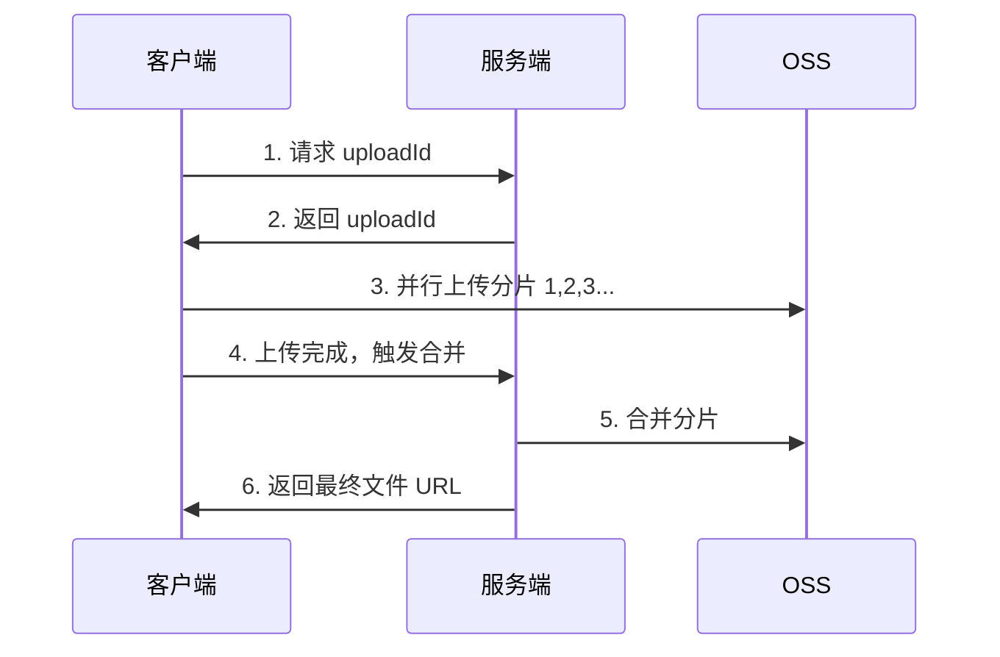

# 文件分片上传与断点续传实现

上传一个 5GB 的视频，50% 的时候断网了。

重新上传？从头开始？用户体验太差了。

这就是分片上传要解决的问题。

## 分片上传的必要性

大文件上传有三大痛点：

1. **失败率高**：网络波动导致上传失败，从头开始
2. **无法并行**：单线程上传，带宽利用率低
3. **服务器压力大**：大文件占用服务器内存和带宽

分片上传的解决方案：

1. **分片**：将文件切成多个小块（chunk），每个小块独立上传
2. **并行**：多个分片同时上传，充分利用带宽
3. **断点续传**：记录已上传的分片，失败后从上次位置继续

## 分片上传流程



### 第一步：获取 uploadId

服务端创建上传任务，返回 uploadId：

```java
@Service
public class UploadService {

    public UploadInitResponse initUpload(UploadInitRequest request) {
        // 1. 创建上传任务
        UploadTask task = new UploadTask();
        task.setUploadId(UUID.randomUUID().toString());
        task.setFileName(request.getFileName());
        task.setFileSize(request.getFileSize());
        task.setChunkCount(calculateChunkCount(request.getFileSize()));
        task.setStatus(UploadStatus.INIT);

        // 2. 保存任务到 Redis（设置过期时间）
        redisTemplate.opsForValue().set(
            "upload:" + task.getUploadId(),
            task,
            24, TimeUnit.HOURS
        );

        // 3. 返回 uploadId 和分片信息
        return new UploadInitResponse(
            task.getUploadId(),
            task.getChunkCount(),
            getChunkSize()
        );
    }

    private int calculateChunkCount(long fileSize) {
        return (int) Math.ceil((double) fileSize / getChunkSize());
    }

    private long getChunkSize() {
        return 5 * 1024 * 1024L;  // 5MB
    }
}
```

### 第二步：分片上传

客户端将文件切分成多个 chunk，并行上传：

```java
public class ChunkUploader {

    private static final int PARALLEL_COUNT = 4;  // 并行数

    public void upload(String uploadId, File file) {
        int chunkSize = 5 * 1024 * 1024;  // 5MB
        int chunkCount = (int) Math.ceil((double) file.length() / chunkSize);

        ExecutorService executor = Executors.newFixedThreadPool(PARALLEL_COUNT);
        CountDownLatch latch = new CountDownLatch(chunkCount);

        for (int i = 0; i < chunkCount; i++) {
            final int chunkIndex = i;
            executor.submit(() -> {
                try {
                    long start = (long) chunkIndex * chunkSize;
                    long end = Math.min(start + chunkSize, file.length());
                    uploadChunk(uploadId, chunkIndex, file, start, end);
                } finally {
                    latch.countDown();
                }
            });
        }

        latch.await();
        executor.shutdown();
    }

    private void uploadChunk(String uploadId, int chunkIndex, File file, long start, long end) {
        // 调用服务端上传接口
        MultipartBody body = new MultipartBody.Builder()
            .addFormDataPart("uploadId", uploadId)
            .addFormDataPart("chunkIndex", String.valueOf(chunkIndex))
            .addFormDataPart("file", file.getName(),
                RequestBody.create(file, start, end - start))
            .build();
        api.uploadChunk(body);
    }
}
```

### 第三步：触发合并

客户端上传完所有分片后，调用合并接口：

```java
public void merge(String uploadId) {
    api.merge(uploadId);
}
```

服务端合并分片：

```java
@Service
public class UploadService {

    @Autowired
    private MinioClient minioClient;

    public String mergeChunks(String uploadId) {
        // 1. 获取上传任务
        UploadTask task = getTask(uploadId);

        // 2. 合并分片
        String finalFileName = task.getFileName();
        List&lt;ComposeSource&gt; sources = new ArrayList&lt;&gt;();
        for (int i = 0; i < task.getChunkCount(); i++) {
            String chunkName = getChunkName(uploadId, i);
            sources.add(ComposeSource.builder()
                .bucket(BUCKET_NAME)
                .object(chunkName)
                .build());
        }

        // 3. 创建最终文件
        minioClient.composeObject(
            ComposeObjectArgs.builder()
                .bucket(BUCKET_NAME)
                .object(finalFileName)
                .sources(sources)
                .build()
        );

        // 4. 删除分片文件
        deleteChunks(uploadId, task.getChunkCount());

        return finalFileName;
    }
}
```

## 断点续传

断点续传的核心是**记录已上传的分片列表**：

```java
public class UploadProgress {
    private String uploadId;
    private Set&lt;Integer&gt; uploadedChunks;  // 已上传的分片索引
    private long uploadedBytes;
}

// 客户端保存进度
public void saveProgress(String uploadId, Set&lt;Integer&gt; uploadedChunks) {
    redisTemplate.opsForValue().set(
        "upload:progress:" + uploadId,
        uploadedChunks,
        7, TimeUnit.DAYS
    );
}

// 客户端获取进度
public Set&lt;Integer&gt; getProgress(String uploadId) {
    return redisTemplate.opsForValue().get(
        "upload:progress:" + uploadId
    );
}

// 恢复上传
public void resumeUpload(String uploadId, File file) {
    Set&lt;Integer&gt; uploadedChunks = getProgress(uploadId);

    for (int i = 0; i < chunkCount; i++) {
        if (!uploadedChunks.contains(i)) {
            uploadChunk(uploadId, i, file);
        }
    }
}
```

## MD5 秒传

秒传的核心是**上传前计算文件 MD5，服务端检查是否已存在**：

```java
// 客户端计算 MD5
public String calculateMD5(File file) throws NoSuchAlgorithmException, IOException {
    MessageDigest md = MessageDigest.getInstance("MD5");
    FileInputStream fis = new FileInputStream(file);
    byte[] buffer = new byte[8192];
    int bytesRead;
    while ((bytesRead = fis.read(buffer)) != -1) {
        md.update(buffer, 0, bytesRead);
    }
    return new String(Hex.encodeHex(md.digest()));
}

// 客户端上传前先查询
public UploadCheckResult checkBeforeUpload(String fileMD5, String fileName) {
    // 服务端查询 MD5 是否存在
    String existingFile = fileMapper.findByMD5(fileMD5);
    if (existingFile != null) {
        return new UploadCheckResult(true, existingFile);  // 已存在，直接返回
    }
    return new UploadCheckResult(false, null);  // 不存在，需要上传
}
```

秒传成功的前提是**文件完全相同**。两个不同的文件，即使只差一个字节，MD5 也不一样。

## 面试追问方向

- 分片大小怎么设置？（答：通常 5MB，太大影响重试效率，太小增加服务器压力）
- 并行上传数怎么设置？（答：通常 3-6 个，过多会占用过多带宽和连接数）
- 合并分片的原子性怎么保证？（答：先合并，成功后再删除分片；可以用 Redis 事务或分布式锁）
- 分片上传和普通上传的性能对比？（答：分片上传可以并行，充分利用带宽，速度更快；适合大文件）

## 小结

分片上传是解决大文件上传问题的标准方案：

1. **分片**：5MB 一个分片，便于管理和重试
2. **并行**：多个分片同时上传，提高速度
3. **断点续传**：记录已上传分片，网络波动不怕
4. **秒传**：MD5 预检，已存在的文件跳过上传

分片上传的实现并不复杂，关键是流程清晰、状态管理到位。
