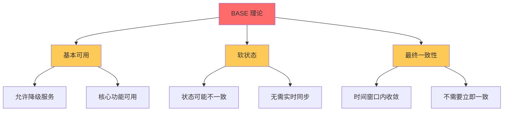
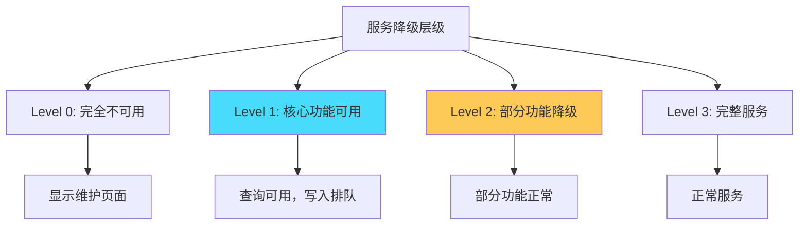
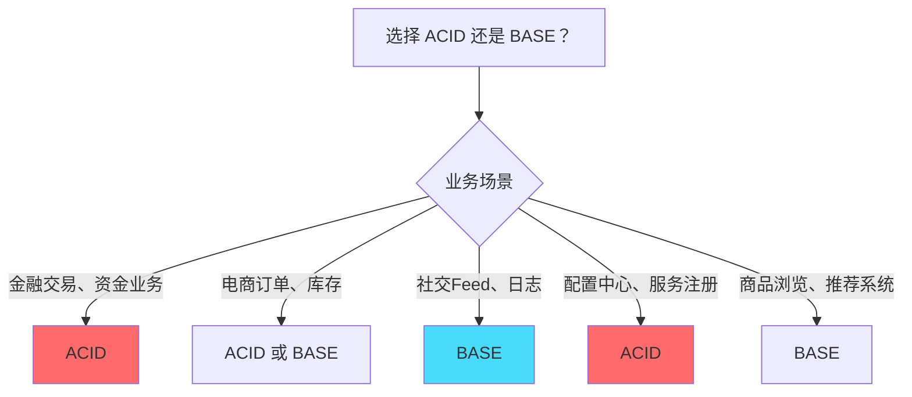
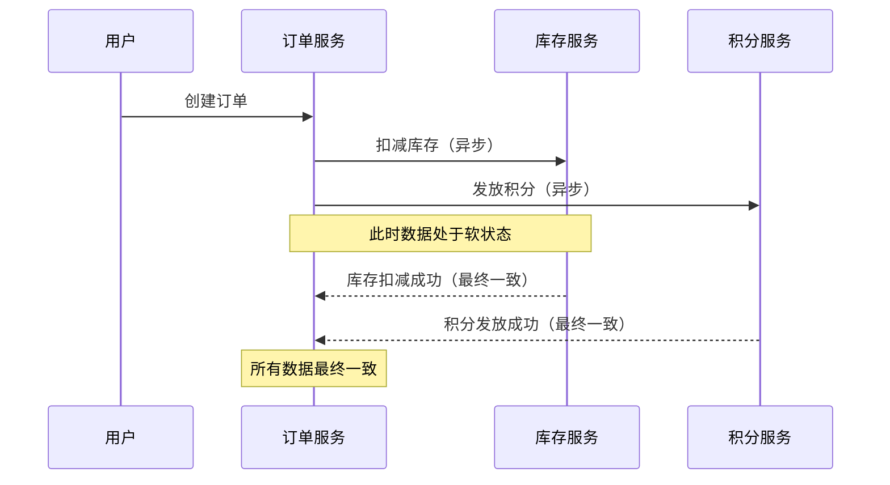
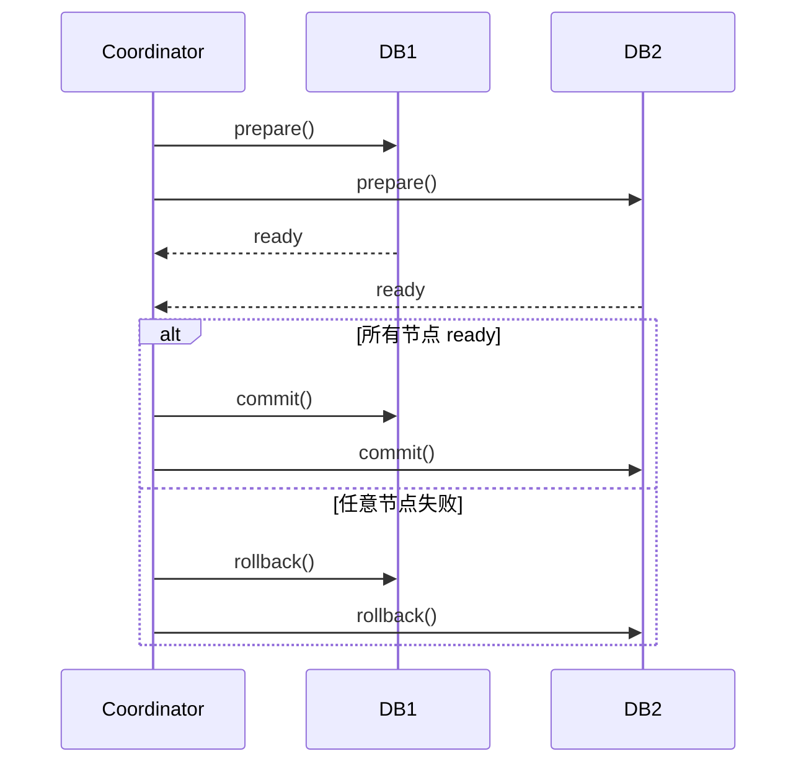
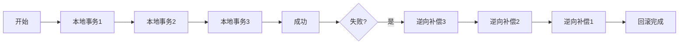
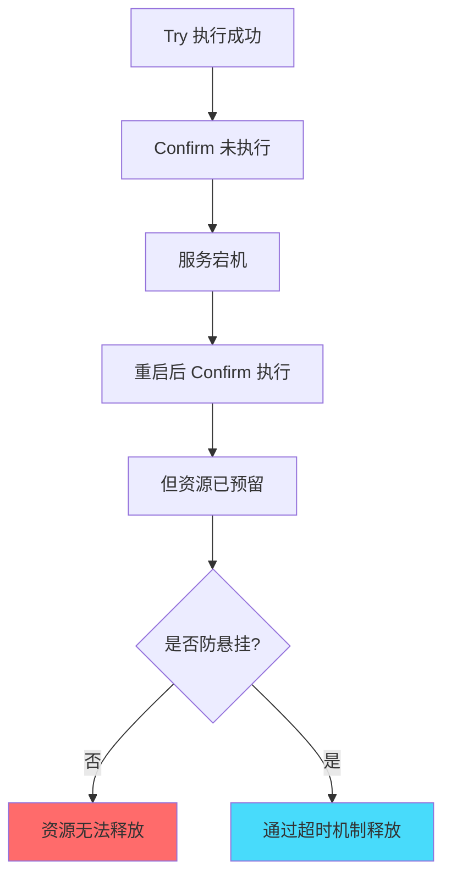

# BASE 理论：CAP 的实际妥协方案

## 快速自测：面试官最关心的 3 个问题

> 🔴 **高频必考**，P6/P7 面试必问

1. **BASE 理论是哪三个单词的缩写？它们分别对应什么含义？**
2. **BASE 和 ACID 的区别是什么？为什么说 BASE 是「柔韧性」的实现？**
3. **如何理解「最终一致性」？它和强一致性有什么本质区别？**

---

## 一、BASE 理论的起源与定义

### 1.1 理论背景

BASE 理论由 eBay 架构师 Dan Pritzkel 于 2008 年在 ACM 的讨论文章「Base: An Acid Alternative」中提出。eBay 在扩展其系统时发现，传统 ACID 事务无法满足互联网高可用、大规模数据量的场景需求，于是提出了 BASE 这个更务实的理论。

**BASE 的全称**：

- **B**asically **A**vailable：基本可用
- **S**oft state：软状态
- **E**ventually consistent：最终一致性



### 1.2 BASE 与 CAP 的关系

BASE 理论是 CAP 定理在工程实践中的妥协方案：

```
CAP 理论：           →    强制选择
                    C 或 A

BASE 理论：          →    放弃强一致性
                    选择可用性 + 最终一致性
```

| CAP 约束 | BASE 响应 |
|---------|----------|
| 在 C 和 A 之间选择 | 选择 A（可用性），放弃 C（强一致） |
| 分区时必须妥协 | 接受软状态，允许不一致 |
| 强一致性是理想 | 接受「最终一致」作为现实目标 |

---

## 二、BASE 三要素详解

### 2.1 Basically Available：基本可用

**核心思想**：允许系统在故障时降级服务，但保证核心功能始终可用。

**降级策略示例**：

| 场景 | 降级方案 |
|------|----------|
| 秒杀系统过载 | 排队机制、限流提示、延迟发货 |
| 数据库连接耗尽 | 返回默认页面、显示「系统繁忙」 |
| 搜索服务不可用 | 返回热门推荐而非搜索结果 |
| 支付系统故障 | 显示「支付通道维护中」 |

**降级程度控制**：



### 2.2 Soft State：软状态

**核心思想**：系统的状态不要求实时一致，允许存在中间过渡状态。

**状态分类**：

| 状态类型 | 说明 | 示例 |
|---------|------|------|
| **硬状态（Hard State）** | 强一致，必须同步成功 | 银行转账，两个账户余额同时变化 |
| **软状态（Soft State）** | 最终一致，存在延迟 | 订单状态从「支付中」变为「已支付」 |

**软状态的产生原因**：

1. **异步复制延迟**：主从同步需要时间
2. **多副本写入顺序**：不同节点写入顺序不同
3. **缓存更新延迟**：缓存和数据库不一致

### 2.3 Eventually Consistent：最终一致性

**核心思想**：系统不需要实时一致，但保证在一定时间窗口内达到一致状态。

**一致性等级**：

| 等级 | 说明 | 实现难度 |
|------|------|----------|
| **强一致性（Strong Consistency）** | 写入后立即可读 | 高 |
| **因果一致性（Causal Consistency）** | 有因果关系的操作顺序一致 | 中 |
| **最终一致性（Eventual Consistency）** | 无时间保证，最终一致 | 低 |
| **弱一致性（Weak Consistency）** | 只保证最终可能一致 | 极低 |

---

## 三、BASE 与 ACID 对比

### 3.1 核心对比

| 对比维度 | ACID（传统事务） | BASE（柔性事务） |
|---------|----------------|----------------|
| **一致性模型** | 强一致性 | 最终一致性 |
| **可用性** | 低（需要锁资源） | 高（允许降级） |
| **性能** | 低（同步开销大） | 高（异步处理） |
| **适用场景** | 金融、订单等核心业务 | 互联网高并发场景 |
| **实现复杂度** | 低（数据库原生支持） | 高（需要应用层实现） |
| **数据安全** | 高（事务保证） | 中（需自行保证） |

### 3.2 选择原则



### 3.3 实际案例：电商订单系统



**BASE 实现方式**：

1. **订单创建**：立即返回成功（可用性）
2. **库存扣减**：异步处理，可能暂时超卖（最终一致）
3. **积分发放**：后台任务补偿，保证最终发放（最终一致）

---

## 四、柔性事务的实现方式

### 4.1 两阶段提交（2PC）

属于「半柔性」方案，在准备阶段完成后如果协调者宕机，可能导致阻塞。



### 4.2 TCC（Try-Confirm-Cancel）

完全由应用层控制的柔性事务，每个阶段都需要实现对应接口。

```java
@LocalTCC
public interface InventoryService {
    // Try 阶段：预留资源
    @TwoPhaseBusinessAction(name = "deduct")
    void tryDeduct(@BusinessActionContextParameter(paramName = "inventoryId") String inventoryId,
                   @BusinessActionContextParameter(paramName = "count") int count);
    
    // Confirm 阶段：确认扣减
    boolean confirm(BusinessActionContext context);
    
    // Cancel 阶段：回滚
    boolean cancel(BusinessActionContext context);
}
```

### 4.3 Saga 模式

将长事务拆分为多个本地事务，通过正向/逆向补偿实现最终一致。



---

## 五、面试题精讲

### 🔴 面试题 1：BASE 理论的三要素是什么？

**答案要点**：

- **B：基本可用（Basically Available）**：允许系统在故障时降级服务，保证核心功能可用
- **S：软状态（Soft State）**：系统的状态不要求实时一致，允许存在中间状态
- **E：最终一致性（Eventually Consistent）**：不需要立即一致，但保证在一定时间内达到一致

**追问链**：

> **第一层**：BASE 的三个单词分别代表什么？
> **第二层**：为什么 BASE 要放弃强一致性？
> **第三层**：什么样的场景适合 BASE？什么样的场景不适合？

### 🟡 面试题 2：BASE 和 ACID 的核心区别是什么？

**答案要点**：

| 维度 | ACID | BASE |
|------|------|------|
| 一致性 | 强一致，实时同步 | 最终一致，允许延迟 |
| 可用性 | 较低（需要锁） | 高（异步处理） |
| 性能 | 较低（同步开销） | 高（异步处理） |
| 适用场景 | 金融、核心业务 | 互联网、高并发 |
| 实现难度 | 低（数据库原生） | 高（应用层实现） |

### 🟢 面试题 3：如何实现最终一致性？

**答案要点**：

1. **消息队列**：通过可靠消息实现跨服务的数据同步
2. **定时任务**：定期同步和校验数据一致性
3. **补偿机制**：失败后通过补偿事务修正
4. **幂等设计**：确保重复执行不会导致数据错误

---

## 六、BASE 的局限性与注意事项

### ⚠️ 注意点一：业务层必须保证幂等性

由于分布式事务可能多次执行，业务层必须保证幂等性：

```java
// 错误示例
public void deductInventory(String inventoryId, int count) {
    inventoryRepository.reduceCount(inventoryId, count); // 每次都扣减
}

// 正确示例
public void deductInventory(String inventoryId, int count) {
    // 使用乐观锁或幂等标记，防止重复扣减
    inventoryRepository.reduceCountWithIdempotency(inventoryId, count, idempotencyKey);
}
```

### ⚠️ 注意点二：补偿逻辑的复杂性

逆向补偿可能失败，导致「悬挂」问题：



### ⚠️ 注意点三：最终一致的时间窗口评估

必须评估业务能容忍的最大不一致时间：

| 业务场景 | 可容忍时间 | 实现方案 |
|---------|-----------|----------|
| 支付成功通知 | 秒级 | RocketMQ 事务消息 |
| 订单状态同步 | 分钟级 | 定时任务 + 补偿 |
| 数据统计报表 | 小时级 | T+1 批处理 |

---

## 七、实战思考题

### 思考题 1：余额扣减场景的 BASE 实现

电商系统中，用户余额扣减场景如何用 BASE 实现？

1. 如果使用异步扣减，如何保证不超扣？
2. 如果出现数据不一致，如何发现和修复？
3. 幂等性如何保证？

### 思考题 2：分布式事务的选型

某电商平台需要实现下单、减库存、发放优惠券的分布式事务。请问：

1. 如果选择 TCC 方案，Try/Confirm/Cancel 阶段分别做什么？
2. 如果选择 Saga 方案，正向补偿和反向补偿分别是什么？
3. 如何选择合适的方案？

---

## 扩展阅读

如果本文档对你有帮助，建议继续阅读：

- [CAP 与 BASE 关系](/distributed/theory/cap-base-relation)：理解 CAP 如何推导出 BASE
- [2PC 两阶段提交](/distributed/transaction/2pc)：强一致事务的实现方式
- [TCC 原理](/distributed/transaction/tcc)：应用层控制的柔性事务