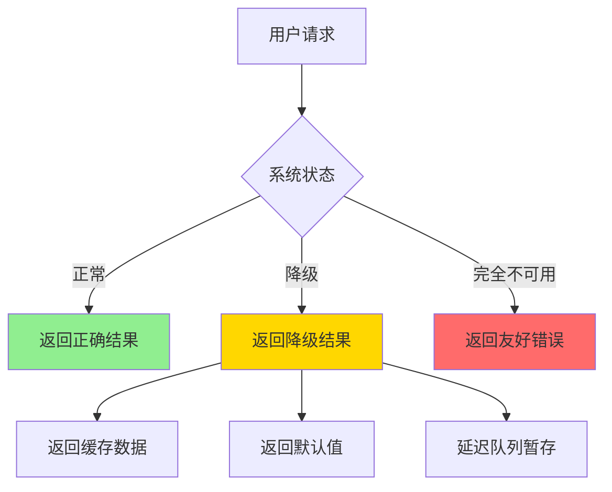
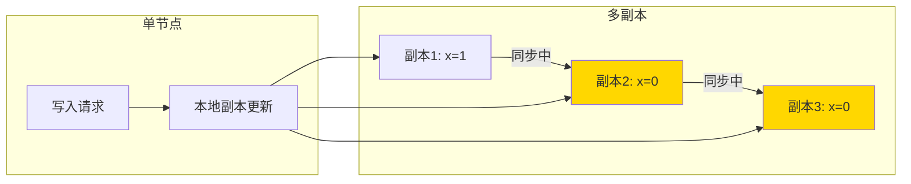
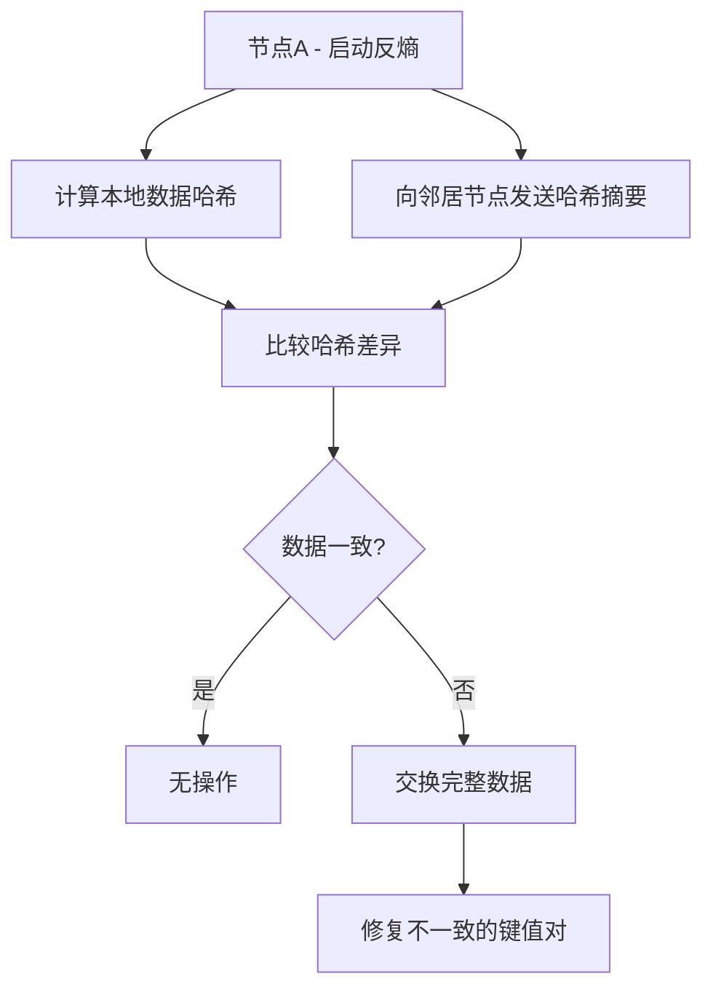

## 问题背景

2010 年，Amazon 的工程师团队在内部技术复盘会上遇到了一个问题：

DynamoDB 的购物车服务，在网络分区期间出现了数据冲突——用户小王在手机端添加了一件商品，在 PC 端删除了同一件商品，分区恢复后，DynamoDB 收到了两个冲突的版本：一个是"添加"，一个是"删除"。系统该怎么处理？

工程师们最终选择了"最后写入胜出"（Last-Write-Wins，LWW），但这个决定引发了一系列的售后问题：用户明明删除了商品，为什么订单里还有？

这个问题拉开了 BASE 理论在工程实践中的序幕。

---

## 一、BASE 的诞生

BASE 理论是 2008 年由 eBay 的架构师 Dan Pritchett 在 ACM Queue 杂志上发表的论文《BASE: An Acid Alternative》中首次提出。

它是为了回答一个非常实际的问题：

> "我们在 eBay 面临的场景是：高并发、海量数据、全球化部署。在这种情况下，ACID 事务的开销太大了。我们能不能设计一种替代方案，在牺牲强一致性的前提下，获得更好的可用性和性能？"

Dan Pritchett 把这个替代方案总结为 BASE：

| 字母 | 全称 | 含义 |
| --- | --- | --- |
| **B** | Basically Available | 基本可用——系统在故障期间仍然可以提供读写服务 |
| **S** | Soft State | 软状态——系统的状态可能在多个副本之间暂时不一致 |
| **E** | Eventually Consistent | 最终一致性——在无新写入的情况下，系统状态最终会收敛 |

---

## 二、三大特性深度解析

### 2.1 Basically Available（基本可用）

基本可用意味着：**即使在故障期间，系统也要能处理请求**。但"能处理请求"不意味着"返回正确结果"。



**降级策略**：

| 策略 | 场景 | 示例 |
| --- | --- | --- |
| 返回缓存数据 | 读多写少 | 首页推荐商品从 Redis 缓存返回 |
| 返回默认值 | 配置类数据 | 用户画像缺失时返回空对象 |
| 暂存入延迟队列 | 写入为主 | 订单写入 Kafka，分区恢复后重放 |
| 主动限流 | 过载保护 | 熔断器打开，拒绝部分请求 |

```java
// 基本可用的降级示例
public ProductRecommendation getRecommendation(String userId) {
    try {
        // 尝试从主数据源获取
        return recommendationService.getFromDB(userId);
    } catch (DataAccessException e) {
        // 主数据源不可用，降级到缓存
        return recommendationService.getFromCache(userId);
    } catch (CacheException e) {
        // 缓存也不可用，降级到默认值
        return ProductRecommendation.DEFAULT;
    }
}
```

### 2.2 Soft State（软状态）

软状态是 BASE 与 ACID 最核心的区别。

ACID 模型中，数据库状态是"硬"的——要么提交，要么回滚，不存在中间状态。

BASE 模型中，系统允许存在**不确定的中间状态**：



在这个时间窗口内，三个副本的状态不一致（副本1是1，副本2和3是0），但系统仍然对外提供服务——这就是软状态。

**软状态的来源**：

| 来源 | 描述 | 典型时长 |
| --- | --- | --- |
| 异步复制延迟 | 写入主节点后，从节点延迟同步 | 毫秒~秒 |
| 缓存穿透 | 缓存过期，数据尚未从DB加载 | 毫秒~秒 |
| 批量写入合并 | 写入队列未刷盘 | 秒~分钟 |
| 分区期间的本地写入 | 数据尚未同步到其他节点 | 取决于分区时长 |

### 2.3 Eventually Consistent（最终一致性）

最终一致性是 BASE 的最终目标：**在没有新写入的情况下，系统状态最终会收敛到一致**。

"最终"是多长？BASE 没有给出答案——这个时间取决于具体的实现机制和系统负载。

```
时间线：
T0: 写入 x=1（仅在节点A）
T1: 反熵修复开始（节点B仍为x=0）
T2: 节点B收到修复消息，更新x=1
T3: 节点C收到修复消息，更新x=1
T4: 所有节点一致 ✓

"最终" = T4 - T0 = 取决于网络和负载
```

---

## 三、最终一致性的五种实现机制

### 3.1 读修复（Read Repair）

读修复是最直接的一致性修复方式：**在读取数据时，如果发现某个副本过期，就异步修复它**。

```java
public class ReadRepair<K, V> {
    private final Map<K, Node> replicas;

    public V read(K key) {
        // 并发向所有副本发起读请求
        List<CompletableFuture<VersionedValue<V>>> futures = replicas.values().stream()
            .map(node -> node.readAsync(key))
            .collect(Collectors.toList());

        // 等待所有响应
        List<VersionedValue<V>> responses = futures.stream()
            .map(CompletableFuture::join)
            .collect(Collectors.toList());

        // 找到最新版本
        VersionedValue<V> latest = responses.stream()
            .max(Comparator.comparingLong(VersionedValue::getVersion))
            .orElseThrow(() -> new KeyNotFoundException(key));

        // 异步修复过期副本
        responses.stream()
            .filter(r -> r.getVersion() < latest.getVersion())
            .forEach(r -> r.getNode().writeAsync(key, latest.getValue(), latest.getVersion()));

        return latest.getValue();
    }
}
```

:::tip 💡
读修复的优点是**零额外开销**——利用读操作的空闲时间做修复，不需要专门的修复进程。但缺点是**对冷数据不生效**：如果一个数据块从来没人读，它的过期副本就永远得不到修复。这也是为什么需要反熵机制作为补充。
:::

### 3.2 反熵（Anti-Entropy）

反熵是一种**主动的全量数据校验和修复机制**。系统会定期运行后台任务，对比不同副本的数据版本，发现不一致就修复。



反熵的核心问题是**开销巨大**：如果要对比 10 亿条数据，每次反熵都要传输大量数据。

解决方案是使用 **Merkle Tree**：

```java
// Merkle Tree 原理：哈希树
// 叶子节点是单个键值对的哈希
// 父节点是子节点哈希的哈希
// 如果根哈希相同 → 两棵树完全相同
// 如果根哈希不同 → 只需同步差异分支

public class MerkleTree {
    // 层数计算：如果有 N 个键，Merkle Tree 的高度约为 log₂(N)
    // 10亿键 → 高度约 30 层
    // 对比根哈希只需要 1 次网络往返，而不是传输 10亿 条数据
}
```

### 3.3 提示移交（Hinted Handoff）

提示移交是 Dynamo 论文中提出的机制：当某个节点暂时不可用时，其他节点会代它临时存储数据，并在它恢复后将数据移交回去。

```
场景：
- 节点B暂时故障
- 节点A收到写入请求，原本应该复制到B
- A使用Hinted Replica机制，在本地额外存储一份"提示"
- B恢复后，A将"提示"中的数据移交给B
```

```java
public class HintedHandoff {
    private final Map<Node, List<HintedRecord>> pendingHints = new ConcurrentHashMap<>();

    // 节点B故障时，在节点A上记录一个提示
    public void storeHint(Node failedNode, Record record) {
        pendingHints.computeIfAbsent(failedNode, k -> new ArrayList<>())
            .add(new HintedRecord(record, System.currentTimeMillis()));
    }

    // 节点B恢复后，移交数据
    public void handoff(Node recoveredNode) {
        List<HintedRecord> hints = pendingHints.remove(recoveredNode);
        if (hints != null) {
            for (HintedRecord hint : hints) {
                recoveredNode.write(hint.getRecord());
            }
        }
    }
}
```

### 3.4 冲突解决策略

当多个副本在分区期间收到相互冲突的写入时，分区恢复后必须解决冲突。

**策略一：最后写入胜出（Last-Write-Wins, LWW）**

使用时间戳来决定哪个写入优先：

```java
public class LWWConflictResolver<T> {
    public T resolve(List<VersionedValue<T>> versions) {
        return versions.stream()
            .max(Comparator.comparingLong(VersionedValue::getTimestamp))
            .map(VersionedValue::getValue)
            .orElse(null);
    }
}
```

**问题**：依赖同步时钟，而分布式环境中时钟漂移是普遍现象。Dynamo 使用 Logical Clock（向量时钟）来替代物理时钟。

**策略二：向量时钟（Vector Clock）**

向量时钟记录了每个版本由哪些节点写入以及写入的因果关系：

```java
// 向量时钟示例
// 版本1: {node_A: 1}         - A写入x=1
// 版本2: {node_A: 2, node_B: 1} - B也写入了x
// 通过比较向量时钟，可以判断版本之间是因果关系还是并发冲突
```

**策略三：语义冲突解决**

对于购物车场景，Dynamo 实现了语义合并：
- "添加商品"：合并结果 = 两个版本的并集
- "删除商品"：如果另一个版本有新添加，则删除失效（防止幽灵商品）

### 3.5 墓碑机制（Tombstone）

删除操作在最终一致系统中是个坑——如果你直接删除一条数据，分区期间其他节点可能不知道这个删除，继续返回旧数据。

解决方案是使用**墓碑**：

```java
public class TombstoneExample {
    // 正常记录
    // key="order:123", value={...}, deleted=false

    // 删除操作 → 不物理删除，而是标记墓碑
    // key="order:123", value=null, deleted=true, tombstone_timestamp=...

    // 读取时跳过墓碑（逻辑删除）
    // GC 时物理删除墓碑
}
```

Cassandra 就是用墓碑机制实现删除的，代价是**墓碑占用磁盘空间，且需要等待 GC 周期才能真正删除**。

---

## 四、BASE vs ACID：不是对立而是互补

| 维度 | ACID | BASE |
| --- | --- | --- |
| 一致性模型 | 强一致 | 弱一致（最终一致） |
| 可用性 | 低（分区时不可用） | 高（分区时仍可用） |
| 性能 | 较低（两阶段锁） | 高（异步复制） |
| 事务保证 | 原子性、隔离性 | 无原子性保证（补偿事务） |
| 典型场景 | 金融、转账、库存 | 购物车、点赞、日志 |
| 代表系统 | Oracle, MySQL, PostgreSQL | Cassandra, DynamoDB, Riak |

:::warning ⚠️
很多工程师误以为 BASE 就是"不要一致性"。错。BASE 是"**暂时**放弃强一致，**最终**还是要一致的"。如果你设计了一个永远无法收敛到一致的 AP 系统，那不是 BASE，是 bug。
:::

---

## 五、生产中的 BASE 实践

### 5.1 案例：阿里库存系统的 BASE 设计

阿里的库存系统在双十一期间面临极端压力，最终选择了 BASE 方案：

```
业务需求：
- 库存扣减必须精确（不能超卖）
- 但系统可用性也必须保证（不能因为库存系统挂了导致整个交易流程停摆）

解决方案：
1. 预扣减（软状态）：订单创建时先"冻结"库存（本地操作，毫秒级）
2. 异步确认：冻结操作写入消息队列，后台 worker 异步确认真实扣减
3. 最终一致：定期对账，发现超卖立即告警并补偿
```

```java
// 预扣减的伪代码
public class InventoryService {
    // 本地库存快照（软状态）
    private ConcurrentHashMap<String, AtomicInteger> localSnapshot = new ConcurrentHashMap<>();

    public boolean freeze(String itemId, int quantity) {
        // 本地操作，无网络往返
        AtomicInteger available = localSnapshot.computeIfAbsent(itemId, k -> new AtomicInteger(0));
        return available.addAndGet(-quantity) >= 0;
    }

    public void asyncConfirm(String itemId, int quantity) {
        // 写入队列，异步处理
        inventoryQueue.offer(new InventoryConfirmTask(itemId, quantity));
    }
}
```

### 5.2 补偿事务（Saga Pattern）

ACID 用两阶段提交保证原子性，BASE 用 Saga 模式实现**最终原子性**：

```
Saga 序列：
T1: 订单服务创建订单（成功）
T2: 库存服务扣减库存（成功）
T3: 支付服务扣款（失败 → 触发补偿）
T4: 库存服务补偿（+库存）
T5: 订单服务取消订单

补偿事务 = 逆操作序列
```

```java
public class SagaOrchestrator {
    private final List<Step> steps;
    private final Map<Step, CompensatingStep> compensations;

    public void execute() {
        List<Step> executedSteps = new ArrayList<>();
        try {
            for (Step step : steps) {
                step.execute();
                executedSteps.add(step);
            }
        } catch (Exception e) {
            // 回滚：逆序执行补偿操作
            for (int i = executedSteps.size() - 1; i >= 0; i--) {
                compensations.get(executedSteps.get(i)).compensate();
            }
        }
    }
}
```

:::tip 💡
Saga 模式的核心约束：**补偿操作必须是幂等的**。因为补偿事务本身也可能失败（网络抖动），需要支持重试。
:::

---

## 六、BASE 系统的设计原则

### 架构权衡

BASE 系统的设计，本质上是在三个维度之间做权衡：

| 维度 | 取舍 |
| --- | --- |
| 一致性 vs 可用性 | BASE 优先可用，但接受暂时不一致 |
| 复杂度 vs 可靠性 | 最终一致性引入冲突解决，复杂度上升 |
| 延迟 vs 正确性 | 异步复制降低延迟，但增加了数据不一致窗口 |
| 补偿成本 vs 业务损失 | 补偿事务需要额外的业务逻辑 |

### 核心设计原则

1. **明确 RPO**：你的业务能容忍多少数据丢失？这个决定了你能接受多大的不一致窗口。
2. **设计补偿路径**：既然没有原子性，就要有补偿逻辑。每个写操作都要有"撤销"能力。
3. **监控不一致状态**：部署专门的对账服务，检测数据不一致并告警。
4. **限制不一致窗口**：通过反熵、读修复等机制，主动缩小不一致的持续时间。
5. **用户告知**：在无法提供强一致时，给用户明确的提示（如"库存正在确认中"）。

---

## 七、工程选型 Checklist

| 决策点 | 问题 | 推荐 |
| --- | --- | --- |
| 一致性级别 | 业务能接受多长时间的延迟一致？ | 金融秒级，社交分钟级，缓存无感知 |
| 冲突策略 | 写入冲突的优先级是什么？ | LWW / 向量时钟 / 语义合并 |
| 删除策略 | 墓碑是否会影响查询性能？ | 定期 GC，避免墓碑堆积 |
| 补偿设计 | 每个写操作都有补偿路径吗？ | 幂等补偿 / Saga 模式 |
| 监控体系 | 如何发现不一致状态？ | 对账服务 + 告警 |
