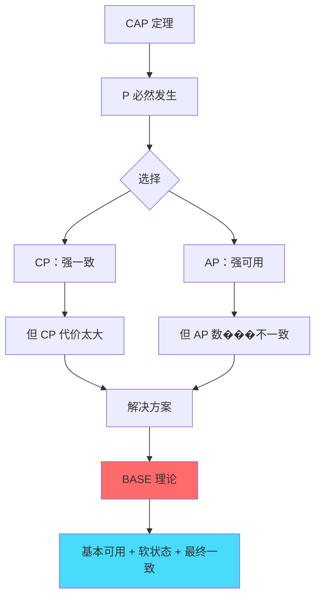
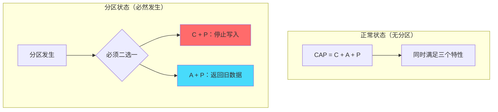
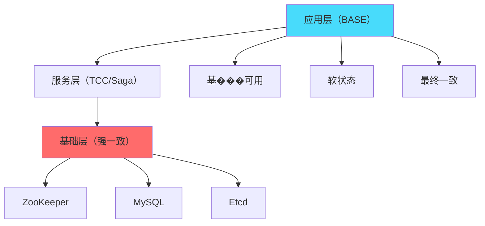
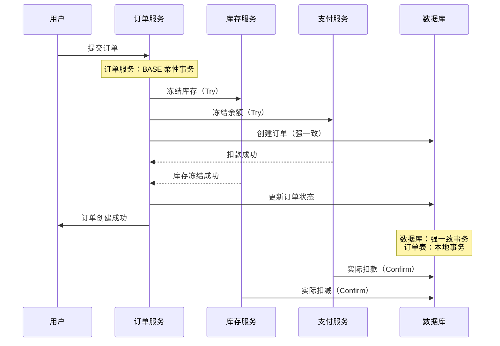

# CAP 与 BASE 的关系：从理论到实践

## 快速自测：面试官最关心的 3 个问题

> 🔴 **高频必考**，P6/P7 面试必问

1. **BASE 理论是如何从 CAP 推导出来的？为什么说 BASE 是 CAP 的工程实现？**
2. **CAP 和 BASE 的核心矛盾是什么？如何在实际系统中权衡？**
3. **一个系统能否同时满足 CAP 的 C 和 BASE 的 A？为什么？**

---

## 一、CAP 如何推导出 BASE

### 1.1 理论推导路径

```
CAP 定理告诉我们：
在分布式系统中，网络分区（P）是必然发生的
因此必须在一致性（C）和可用性（A）之间做出选择

但 CAP 的选择太极端：
- CP 系统：分区时完全不可用
- AP 系统：分区时完全不一致

BASE 的解决方案：
放弃「实时一致性」，接受「最终一致性」
在保证基本可用性的前提下，实现柔性事务
```



### 1.2 映射关系

| CAP 选择 | BASE 对应 | 说明 |
|---------|----------|------|
| P（必然发生） | 基本可用 | 系统在故障时仍需运行 |
| A（放弃强一致） | 软状态 | 接受数据中间状态 |
| C（最终一致） | 最终一致性 | 不追求实时一致 |

---

## 二、CAP 的「三选二」误区

### 2.1 为什么说「三选二」是误解

**关键误解**：很多人以为 CAP 意味着「只能选两个特性」。

**真相**：CAP 意味着「在网络分区发生时，只能在 C 和 A 之间二选一」。

```
误解：系统只能同时满足两个特性
真相：在正常运行时（无分区），可以同时满足 C 和 A
       在异常运行时（分区），必须在 C 和 A 之间选择
```

### 2.2 正常状态 vs 分区状态



---

## 三、CAP 与 BASE 的核心矛盾

### 3.1 理论矛盾

| 维度 | CAP | BASE |
|------|-----|------|
| 一致性 | 强一致 | 最终一致 |
| 可用性 | 可能有损 | 基本可用 |
| 实时性 | 同步 | 异步 |
| 实现 | 数据库原生 | 应用层实现 |

### 3.2 实践调和

在实际系统中，CAP 和 BASE 并不矛盾：

1. **不同模块采用不同策略**：
   - 配置中心（ZooKeeper）：CP，保证配置强一致
   - 用户中心（Redis）：AP，保证高可用

2. **不同场景采用不同策略**：
   - 正常流程：追求强一致（接近 CAP）
   - 异常流程：降级为最终一致（BASE）

3. **分层设计**：
   - 基础层：保证强一致（CAP）
   - 应用层：实现柔性事务（BASE）

---

## 四、CAP + BASE 的分层架构实践

### 4.1 分层架构示例



### 4.2 电商订单系统实例



---

## 五、面试题精讲

### 🔴 面试题 1：为什么说 BASE 是 CAP 的工程实现？

**答案要点**：

1. **CAP 的问题**：只告诉我们在分区时二选一，但没有给出具体实现方案
2. **BASE 的贡献**：
   - 基本可用：提供了「降级」的具体策略
   - 软状态：明确了状态可以不一致
   - 最终一致：给出了具体的一致性目标
3. **工程价值**：BASE 把 CAP 的理论选择变成了可落地的实现方案

**追问链**：

> **第一层**：BASE 如何从 CAP 推导出来？
> **第二层**：CAP 有什么局限？BASE 如何解决？
> **第三层**：在实际项目中，如何设计分层架构同时利用 CAP 和 BASE？

### 🟡 面试题 2：如何理解「基本可用」？

**答案要点**：

1. **降级服务**：系统故障时，返回降级响应而非错误
2. **延迟响应**：系统压力大时，允许响应延迟增加
3. **功能缩减**：系统故障时，关闭非核心功能，保留核心功能

---

## 六、实战思考题

### 思考题：银行转账系统的 CAP + BASE 设计

某银行系统需要实现跨行转账功能，请设计其 CAP + BASE 分层架构：

1. 哪些模块应该使用 CAP 的 CP？
2. 哪些模块应该使用 BASE 的柔性事务？
3. 如果网络分区发生，系统如何处理？

---

## 扩展阅读

如果本文档对你有帮助，建议继续阅读：

- [CAP 定理](/distributed/theory/cap)：CAP 基础理论
- [BASE 理论](/distributed/theory/base)：BASE 三要素详解
- [一致性模型对比](/distributed/theory/consistency-models)：各种一致性模型详解