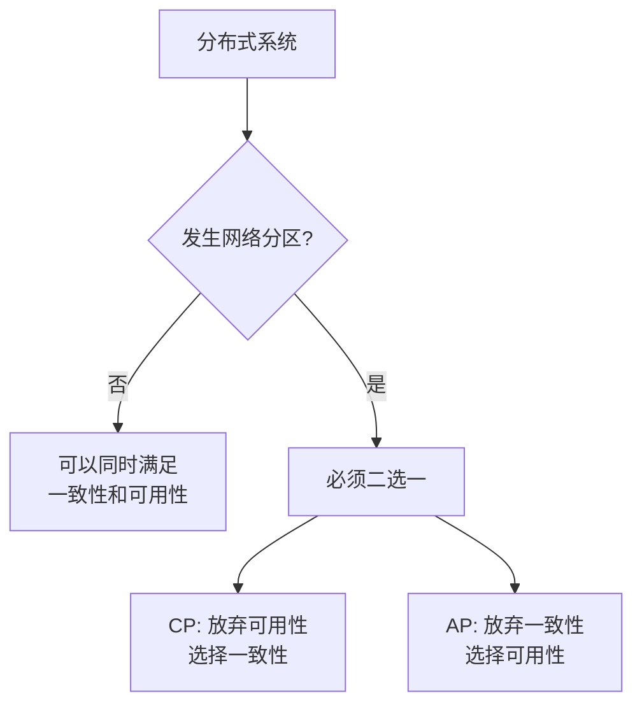
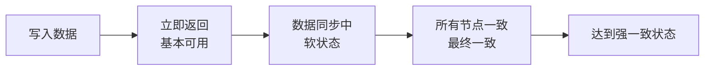
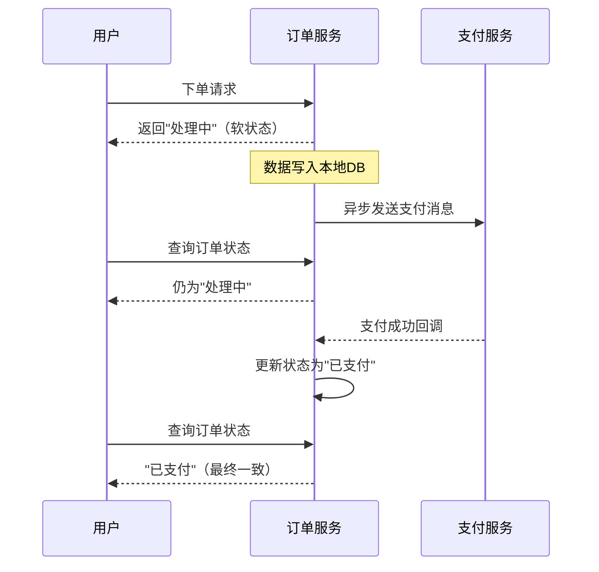
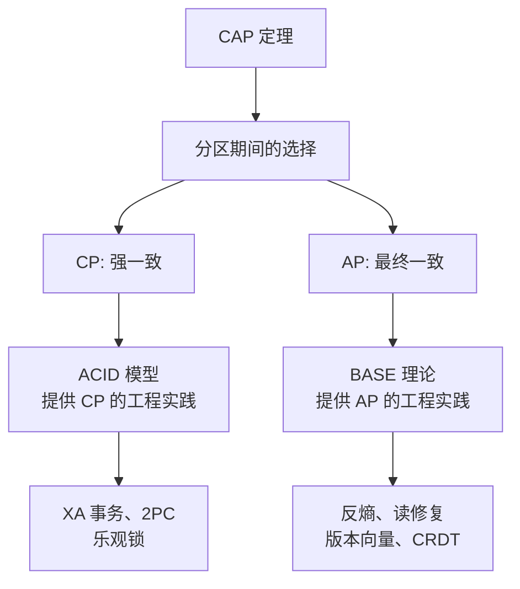

## 问题背景

2022年，某电商团队的架构评审会上，两个 P8 吵了起来。

起因是一个订单系统的选型问题：有人说应该选择强一致（CP），有人说最终一致就够了（AP），吵了两个小时没有结论。

最后 CTO 拍板："先把 CAP 和 BASE 讲清楚，再吵。"

这场争论的本质是：**CAP 定理描述的是理论边界，BASE 理论是在这个边界下的工程实践**。不理解两者的关系，就会在架构设计中要么过度设计、要么设计不足。

今天这篇，我们把 CAP 和 BASE 的关系彻底讲清楚。

## 一、CAP 定理的物理约束

CAP 定理告诉我们：分布式系统在网络分区时，必须在一致性和可用性之间做取舍。

这不是一个技术选择，而是一个物理约束。就像光速不可超越一样，网络延迟和分区故障在分布式系统中是不可避免的。



但这里有一个关键点：**CAP 定理描述的是"分区期间"的行为，而不是"正常时期"的行为。**

- 正常时期（无分区）：CP 系统可以同时提供一致性和可用性
- 分区时期：CP 系统必须放弃可用性，AP 系统必须放弃一致性

【架构权衡】

这就引出了一个重要问题：**分区恢复后，CP 系统怎么恢复可用性？AP 系统怎么恢复一致性？**

CAP 定理没有回答这个问题。BASE 理论正是为了填补这个空白而产生的。

## 二、BASE 理论的核心思想

BASE 是由 eBay 的架构师 Dan Pritchett 在 2008 年提出的，全称是 **B**asically **A**vailable, **S**oft state, **E**ventually consistent。

| 概念 | 含义 |
| --- | --- |
| **Basically Available** | 基本可用，允许系统在故障时降级服务，但不是完全不可用 |
| **Soft state** | 软状态，数据状态不要求强一致，允许存在中间状态 |
| **Eventually consistent** | 最终一致，系统在一段时间后达到一致状态 |



BASE 的核心洞察是：**在分布式系统中，强一致性不是常态，而是特例。** 大多数业务场景，用户可以接受短暂的数据不一致，只要最终能恢复到一致状态。

### 2.1 BASE vs ACID

ACID 是单机数据库的事务模型，强调强一致性；BASE 是分布式系统的事务模型，接受最终一致性。

| 维度 | ACID | BASE |
| --- | --- | --- |
| 一致性 | 强一致 | 最终一致 |
| 可用性 | 牺牲可用性 | 保证基本可用 |
| 隔离性 | 隔离级别明确 | 不强调隔离 |
| 性能 | 低（同步等待） | 高（异步复制） |
| 适用场景 | 单机数据库 | 分布式系统 |

### 2.2 BASE 的三个属性详解

**Basically Available（基本可用）**

基本可用不是说"系统可以故障"，而是说系统在故障时**有策略地降级**，而不是直接崩溃。

例如：
- 秒杀系统在大促期间，只保证核心下单流程可用，查询功能降级
- 社交Feed在高峰期，只保证新帖子能发布，不保证实时推送
- 支付系统在高峰期，只保证付款成功，积分等附属功能延迟处理

```java
// 基本可用的实现示例
public Result createOrder(OrderRequest request) {
    try {
        // 核心流程：同步执行
        return orderService.syncCreateOrder(request);
    } catch (Exception e) {
        // 非核心流程：降级处理
        log.warn("Order creation degraded, saving to retry queue", e);
        retryQueue.offer(request);
        return Result.success("订单处理中，稍后确认");
    }
}
```

**Soft state（软状态）**

软状态是指数据的状态不是"写进去就立即可见"，而是可以存在"传播延迟"。

例如：用户在订单系统下单后，立即查询可能看到"处理中"状态；过几秒后，状态变成"已支付"。这个"处理中"就是软状态。



**Eventually consistent（最终一致）**

最终一致意味着：数据在写入后，可能不会立即在所有节点看到相同的值，但经过一定时间后，系统会收敛到一致状态。

最终一致有不同的强度：
- **读己之所写**：写入后能读到自己的写入
- **单调读**：能读到数据的历史单调递增版本
- **因果一致**：有因果关系的事件按顺序看到
- **强最终一致**：最终一定达到强一致

【架构权衡】

最终一致不等于"不要一致性"。最终一致是一种**有策略的一致性降级**——在故障期间暂时允许不一致，在故障恢复后通过各种手段（反熵、读修复、 hinted handoff）收敛到一致。

关键是**明确业务对"最终"的时间容忍度**。金融支付可能要求秒级一致，社交Feed可能接受分钟级一致。不同的容忍度需要不同的实现策略。

## 三、CAP 与 BASE 的内在联系

CAP 和 BASE 不是对立的，而是互补的：

- **CAP** 描述了分布式系统的理论边界（分区期间，必须在 C 和 A 之间取舍）
- **BASE** 提供了在 CAP 约束下的工程实践方法（在选择 AP 后，如何通过工程手段达到最终一致）



### 3.1 CP + ACID vs AP + BASE

选择 CP 系统，通常意味着选择强一致方案，使用 ACID 风格的事务：

| 场景 | 方案 | 特点 |
| --- | --- | --- |
| 金融支付 | CP + ACID | 强一致，但分区时不可用 |
| 跨行转账 | CP + 2PC/XA | 强一致，但性能低、复杂度高 |
| 库存精确扣减 | CP + 乐观锁 | 强一致，但并发高时冲突多 |

选择 AP 系统，通常意味着选择最终一致方案，使用 BASE 风格的事务：

| 场景 | 方案 | 特点 |
| --- | --- | --- |
| 电商订单 | AP + Saga | 最终一致，性能高 |
| 社交Feed | AP + 本地消息表 | 最终一致，延迟可接受 |
| 日志采集 | AP + 异步写入 | 允许少量数据丢失 |

### 3.2 为什么大多数互联网系统选择 BASE

互联网业务的特点是：
- **海量用户、高并发**：无法承受 2PC 的两轮投票和锁等待
- **用户体验优先**：宁可看到"处理中"，也不要看到"服务不可用"
- **业务可降级**：非核心功能可以暂时降级，保证核心功能

这就解释了为什么大多数互联网系统选择 AP + BASE：
- Cassandra、DynamoDB、Redis Cluster 都是 AP 系统
- 阿里、美团、字节的核心交易链路，虽然表面是强一致，但底层大量使用最终一致方案做解耦

【架构权衡】

BASE 不是"不要一致性"，而是"用最终一致替代强一致"。这对架构师的要求反而更高：

1. **明确一致性级别**：每个业务操作需要什么级别的一致性？不是越强越好
2. **设计补偿机制**：数据不一致时怎么修复？定时对账？事件驱动回滚？
3. **管理用户预期**：给用户明确的一致性承诺，而不是让用户困惑

## 四、CAP/ACID/BASE 的工程映射

| CAP 约束 | 理论模型 | 工程实践 | 典型框架/产品 |
| --- | --- | --- | --- |
| CP + 强一致 | ACID | 2PC/XA/本地消息表 | MySQL XA、Seata AT、Apache DTM |
| AP + 最终一致 | BASE | Saga/TCC/异步消息 | RocketMQ、Canal、Databus |
| CP + 可用降级 | 混合 | 读写分离 + 延迟检测 | ZooKeeper、etcd |

### 4.1 从 CAP 到工程实现的推导

```
第一步：确定业务对一致性的真实需求
  ↓
金融支付/库存扣减 → 需要强一致 → CP
社交Feed/日志采集 → 可以最终一致 → AP
  ↓
第二步：在 CAP 约束下选择实现方案
  ↓
CP → 需要 ACID 风格事务 → 2PC/TCC/Seata AT
AP → 需要 BASE 风格事务 → Saga/TCC/本地消息表/事务消息
  ↓
第三步：评估性能、复杂度、团队能力
  ↓
选型决策
```

## 五、生产避坑

### 5.1 混淆"最终一致"和"不要一致"

最终一致不是"写完就不管了"，而是需要**主动修复不一致**。

常见的不一致修复机制：
- **反熵（Anti-Entropy）**：定期扫描数据，发现不一致时修复
- **读修复（Read Repair）**：读取时发现不一致，立即修复
- ** hinted handoff**：节点恢复后，缓存更新延迟的写操作

```java
// 读修复示例
public Order getOrder(String orderId) {
    Order order = orderCache.get(orderId);
    if (order == null) {
        order = orderDB.query(orderId);
        orderCache.set(orderId, order);

        // 对比其他节点的数据，发现不一致则修复
        Order otherNodeOrder = otherNode.query(orderId);
        if (!order.equals(otherNodeOrder)) {
            log.warn("Inconsistent order detected, repairing", orderId);
            repairOrder(orderId);
        }
    }
    return order;
}
```

### 5.2 BASE 系统的监控盲区

最终一致系统有一个隐藏的风险：**不一致状态可能在很长一段时间内不被业务感知**。

例如：用户下单后，库存数据在不同节点不一致，但这个不一致只在下单时才会暴露。如果下单接口没被调用，不一致可能永远不被发现。

解决方案：定期运行一致性对账任务，主动发现不一致。

【架构权衡】

最终一致系统的运维复杂度其实比强一致系统更高。强一致系统的错误是"立竿见影"的（事务直接失败），但最终一致系统的错误是"延迟爆炸"的——小的不一致积累成大的问题，排查难度成倍增加。

所以选择 BASE 之前，要问自己：**团队有能力做日常的一致性监控和对账吗？** 如果没有，强一致方案可能是更安全的选择。

## 六、落地 Checklist

- [ ] 识别系统中每个数据操作的**真实一致性需求**（不是越强越好）
- [ ] 将业务操作分为**核心（强一致）** 和 **非核心（最终一致）**
- [ ] 对最终一致的数据，设计**补偿/修复机制**（对账、读修复、反熵）
- [ ] 明确**"最终"的时间窗口**（秒级？分钟级？小时级？）
- [ ] 为 BASE 系统建立**一致性监控和告警**
- [ ] 制定**数据对账计划**（每天/每周跑对账任务）
- [ ] 评估团队能力：能否驾驭最终一致系统的运维复杂度
- [ ] 在架构文档中明确记录每个模块的**一致性级别选择和理由**
