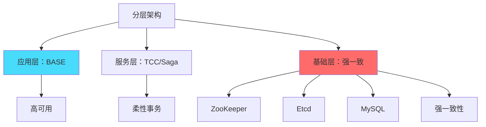

# CAP 理解误区：面试中常见的错误认知

## 快速自测：面试官最关心的 3 个问题

> 🔴 **高频必考**，P6/P7 面试必问

1. **有人说「CAP 三选二，我选 CA」——这个说法对吗？为什么？**
2. **CAP 定理是否已经过时？为什么现在很多人不再讨论 CAP？**
3. **有人说「分布式系统必须放弃强一致性」——这个观点对吗？**

---

## 一、最经典的三个误解

### ⚠️ 误解一：「我选 CA，不选 P」

**错误观点**：「网络分区很少发生，所以我可以选择不要 P，只保证 C 和 A」。

**为什么错误**：

```
CAP 定理的 P 不是「可选的故障」，而是「必然发生的约束」

1. 分区不是小概率事件
   - 机房断电、网线被挖断、交换机故障
   - 跨机房通信本身就存在延迟和不稳定
   
2. CAP 的 P 是「容忍分区」，不是「会发生分区」
   - 意思是：即使分区发生，系统也要继续工作
   - P 是分布式系统必须具备的基本能力
```

**正确理解**：

```
在分布式系统中，你只能在 C 和 A 之间选择
因为 P 是必须接受的现实约束，不是可选特性
```

### ⚠️ 误解二：「CAP 已经过时，不需要学习」

**错误观点**：「现在分布式系统很少讨论 CAP，因为它太简单/太老了/没用了」。

**为什么错误**：

1. **CAP 揭示的权衡问题至今有效**：一致性 vs 可用性的权衡是分布式系统的核心问题
2. **PACELC 只是补充，不是替代**：CAP 的基本框架仍然正确
3. **面试仍然高频考察**：P6/P7 面试中，CAP 几乎是必问

**正确理解**：

```
CAP + PACELC = 完整的分布式系统权衡模型

CAP：告诉我们分区时必须在 C 和 A 之间选择
PACELC：补充了无分区时的延迟-一致性权衡
```

### ⚠️ 误解三：「分布式系统必须放弃强一致性」

**错误观点**：「既然 BASE 是趋势，那分布式系统就不需要强一致性了」。

**为什么错误**：

1. **强一致场景仍然存在**：金融交易、订单系统、配置中心必须强一致
2. **CAP 的 C 和 BASE 的 E 不矛盾**：BASE 接受的是「实时强一致」，不是「永远放弃一致性」
3. **分层设计可以兼得**：基础层强一致 + 应用层柔性事务



---

## 二、面试中常见的陷阱

### ⚠️ 陷阱一：用 CAP 来选型

**错误做法**：「我们选 AP 系统，所以选 Cassandra」。

**问题分析**：

1. 同一系统可以有多种配置（可 CP 可 AP）
2. 业务场景决定需求，不是 CAP 决定选型
3. 不同模块可以采用不同策略

**正确做法**：

```
选型决策树：
1. 业务需要强一致还是最终一致？
2. 能容忍的最大不一致时间是多少？
3. 性能和一致性，哪个优先？
4. 根据答案选择合适的系统/配置
```

### ⚠️ 陷阱二：混淆 CAP 的「C」和其他一致性概念

**错误理解**：「CAP 的 C 和 ACID 的 C 是一样的」。

**关键区别**：

| 一致性 | 说明 | 场景 |
|-------|------|------|
| **CAP 一致性** | 所有节点同一时刻数据相同 | 分布式系统 |
| **ACID 一致性** | 事务前后数据库状态正确 | 单机事务 |
| **最终一致性** | 不保证实时一致，但保证最终一��� | BASE |

### ⚠️ 陷阱三：认为 CAP 是静态的

**错误理解**：「一个系统一旦设计完成，就是 CP 或 AP 了」。

**正确理解**：

```
系统可以在不同时刻、不同场景下表现出不同的 CAP 特性

示例：Redis Cluster
- 正常情况：可用性高 + 最终一致
- 分区发生时：部分 Slot 停止写入（保证一致）
- 分区恢复后：自动同步数据
```

---

## 三、CAP 的边界与适用性

### 3.1 哪些系统适合用 CAP 分析

| 系统类型 | 是否适用 CAP | 说明 |
|---------|-------------|------|
| 分布式数据库 | 适用 | Redis Cluster、MongoDB、Cassandra |
| 分布式协调服务 | 适用 | ZooKeeper、etcd |
| 分布式消息队列 | 部分适用 | Kafka（可配置一致性级别） |
| 单机数据库 | 不适用 | 没有网络分区问题 |
| 多副本缓存 | 部分适用 | 一致性和可用性可配置 |

### 3.2 CAP 的边界

**CAP 不能解决的问题**：

1. **延迟与一致性权衡**（需要 PACELC）
2. **数据冲突解决策略**（需要向量时钟/CRDT）
3. **跨数据中心复制的复杂性**（需要更复杂的模型）
4. **性能优化**（CAP 只关注正确性，不关注性能）

---

## 四、面试题精讲

### 🔴 面试题 1：有人说「CAP 三选二，我选 CA」，这个说法对吗？

**答案要点**：

1. **错误原因**：P 是分布式系统必须接受的约束，不能放弃
2. **正确理解**：CAP 的意思是「在 P 必然发生的前提下，只能在 C 和 A 之间选择」
3. **正确表述**：只能在 CP 和 AP 之间选择

**追问链**：

> **第一层**：为什么不能选择 CA？
> **第二层**：CAP 的 P 是什么含义？「分区容错」是否意味着「会发生分区」？
> **第三层**：CAP 定理的证明基于什么假设？

### 🟡 面试题 2：CAP 定理和 ACID 的事务隔离级别有什么关系？

**答案要点**：

1. **CAP 的 C**：分布式系统中所有节点数据一致
2. **ACID 的 C**：事务执行前后数据库状态正确
3. **没有直接关系**：CAP 是分布式系统理论，ACID 是单机事务理论

---

## 五、实战思考题

### 思考题 1：MySQL 主从复制是 CAP 中的哪一种？

1. 异步复制模式
2. 半同步复制模式
3. 全同步复制模式

### 思考题 2：Kafka 的 Producer 和 Consumer 分别是 CAP 中的哪一种？

提示：考虑 Producer 的 `acks` 配置和 Consumer 的自动提交配置。

---

## 扩展阅读

如果本文档对你有帮助，建议继续阅读：

- [CAP 定理](/distributed/theory/cap)：CAP 基础理论
- [PACELC 定理](/distributed/theory/pacelc)：CAP 的扩展模型
- [一致性模型对比](/distributed/theory/consistency-models)：各种一致性模型详解