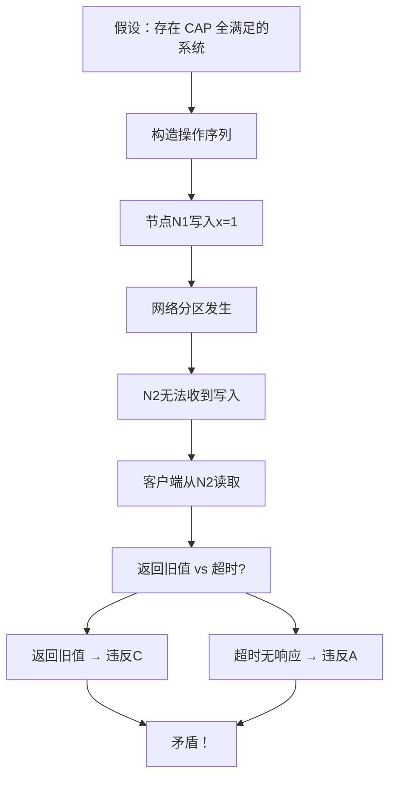
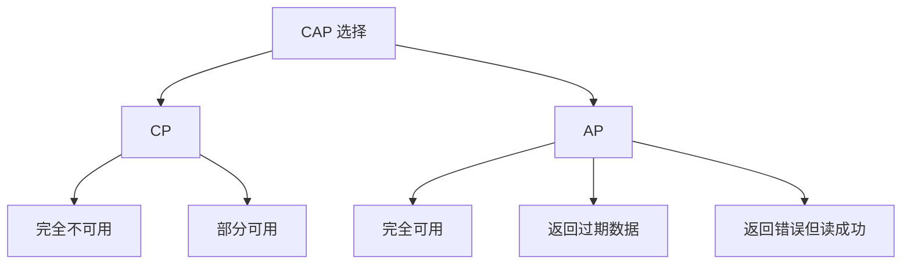

## 问题背景

2023年，字节跳动基础架构团队出了一道面试题：

> "CAP 定理的 Gilbert-Lynch 证明中，用的是一个分布式 KV 存储系统。请描述这个证明的核心思路，并指出：如果把证明中的'读操作'改成'异步读'，证明还成立吗？"

这道题下来，10个候选人里 9 个答不上来。

原因很简单：99% 的人看的都是"三选二"版本的 CAP 文章，从来没人看过原始证明，更没人思考过证明的前提假设是什么。

今天，我们把 CAP 定理的证明和所有常见误区全部讲透。

---

## 一、Gilbert-Lynch 证明拆解

### 1.1 证明的系统模型

Gilbert 和 Lynch 在 2002 年的论文《Brewer's Conjecture and the Feasibility of Consistent, Available, Partition-Tolerant Web Services》中，给出了一个非常简洁的证明。

证明用的系统是一个**分布式原子多读多写寄存器**（atomic multi-writer multi-reader register），类似于一个简单的 KV 存储：

```java
interface DistributedKVStore {
    // 写入操作
    void write(String key, String value);

    // 读取操作
    String read(String key);
}
```

**系统的假设**：
1. 系统由两个节点组成：`N1` 和 `N2`
2. 两个节点之间可以通信，也可以发生网络分区
3. 客户端可以向任意节点发起请求
4. 每个操作都在有限时间内完成

### 1.2 证明的核心反证法

Gilbert 和 Lynch 的证明思路分为三步：

**第一步**：假设存在一个同时满足 CAP 的系统。

**第二步**：构造一个特定的操作序列，使得系统无法同时满足 C 和 A。

**第三步**：得出矛盾，证明假设不成立。



### 1.3 关键操作序列

假设初始状态：`x = 0` 在两个节点上。

```
时间线：
T1: 客户端向 N1 写入 x = 1
T2: 写入成功，N1 更新本地 x = 1
T3: 网络分区发生，N1 和 N2 断开
T4: 客户端向 N2 发起读操作
```

此时系统面临两个选择：

| 选择 | 结果 | 违反的性质 |
| --- | --- | --- |
| 返回 x = 0（旧值） | 违反一致性（C）—— 读到了过期数据 | Consistency |
| 返回超时/错误 | 违反可用性（A）—— 请求没有成功响应 | Availability |

:::warning ⚠️
这个证明的关键前提：**读操作必须返回写入的结果**。如果允许异步读（即"我启动了读请求但还没拿到结果"），证明确实会变得复杂——这也正是面试题中"异步读"变体的来源。
:::

---

## 二、CAP 的形式化定义

### 2.1 一致性的形式化定义

Gilbert 和 Lynch 用的是**线性一致性**（Linearizability）的定义，这是一个非常强的定义：

> **一致性**：任何读操作返回的值，都是最近一次写操作的结果。

"最近一次"在这里是一个物理时间上的约束——不是逻辑上的"最终"，而是**立即可见**。

| 一致性级别 | 描述 | 典型系统 |
| --- | --- | --- |
| 线性一致性（Linearizability） | 读返回最近一次写的值 | ZooKeeper, etcd（共识算法保证） |
| 顺序一致性（Sequential） | 所有节点看到相同操作顺序，但不一定是全局时间顺序 | SCUBA（ARM SCUBA） |
| 因果一致性（Causal） | 满足因果关系的操作顺序保证 | PostgreSQL BDR |
| 最终一致性（Eventual） | 不保证立即一致，最终会达到一致 | Cassandra, DynamoDB |

### 2.2 可用性的形式化定义

Gilbert 和 Lynch 对可用性的定义是：

> **可用性**：系统中每个收到的请求都必须在有限时间内产生响应。

这里的"有限时间"是一个关键——不是说"等足够长时间就有响应"，而是说**必须在某个合理的时间窗口内返回**。

### 2.3 分区容错的形式化定义

> **分区容错**：系统能在网络分区发生时继续运行。

"继续运行"的含义是：**两个分区都能各自独立处理请求**。

---

## 三、面试中最常见的七个误区

### ❌ 误区一："CAP 是三选二"

这是传播最广的误解。Brewer 本人在 2012 年的重述文章里明确说过：

> "The CAP theorem is often described as choosing 2 out of 3 properties, but this is misleading. Partition tolerance is not optional — networks are unreliable, so you must choose between consistency and availability."

**真相**：CAP 意味着分区**必然发生**，你只能在 C 和 A 之间二选一。

### ❌ 误区二："系统可以同时满足 CAP"

有些候选人看完证明后反驳："我的单机 MySQL 就同时满足 CAP！"

这个反驳忽略了**可扩展性**这个隐含假设。CAP 证明的前提是**系统必须能够扩展到多个节点**。如果你只有一台机器，那确实满足 CAP——但这不是分布式系统。

```
分布式系统 = 多节点 + 网络通信
单机系统   = 无网络通信 = 不在 CAP 讨论范围内
```

### ❌ 误区三："CA 系统是存在的"

CAP 的三角图里经常看到 CA 系统放在角落。但这其实是个陷阱——**CA 系统在分布式环境中不存在**。

CA 系统意味着"既不想放弃一致性，也不想放弃可用性，同时还想容忍分区"。这在数学上不可能。

现实中的 CA 系统其实是：
- 单机数据库（没有网络通信 = 没有分区场景）
- 有全通网络的紧耦合集群（假设永不分区 = 不现实的工程假设）

### ❌ 误区四："CAP 意味着要么完全一致，要么完全可用"

真实情况远比这复杂：



比如 DynamoDB 的强一致读在分区期间会返回错误（CP 行为），但DynamoDB 的最终一致读在分区期间仍可返回过期数据（AP 行为）——**同一个数据库可以在不同操作类型上表现不同**。

### ❌ 误区五："CAP 是静态的、永久的选择"

CAP 定理描述的是一个**瞬时的状态**：在某个特定时刻发生分区时，你必须做选择。但**分区恢复后，系统可以重新回到 CAP 全满足的状态**。

```
T1: 分区发生 → CP 系统拒绝写入
T2: 分区恢复 → 系统恢复正常（同时满足 CAP）
T3: 再次分区 → 再次面临选择
```

这不是"CAP 变了"，而是"系统在不同的网络状态下有不同的行为"。

### ❌ 误区六："一致性只有强和弱两种"

一致性不是二元对立的。从强到弱，是一个连续的光谱：

| 级别 | 一致性强度 | 典型场景 |
| --- | --- | --- |
| 线性一致性 | 最强 | 分布式锁、共识系统 |
| 顺序一致性 | 强 | 多核 CPU 内存模型 |
| 因果一致性 | 中 | 社交网络评论顺序 |
| 最终一致性 | 弱 | CDN、缓存、DNS |

### ❌ 误区七："BASE 是 CAP 的妥协"

CAP 和 BASE 不是对立关系。**CAP 描述的是系统设计的选择点，BASE 描述的是 AP 系统的工程实现方式**。

CAP 的 C（Consistency）是强一致性。BASE 的 BA（Basically Available）来自 AP 系统放弃强一致后的设计哲学，S（Soft state）和 E（Eventually consistent）是对"弱一致状态"的具体描述。

---

## 四、CAP 的隐藏假设与限制

### 4.1 CAP 证明忽略的因素

Gilbert-Lynch 的证明是一个**理论模型**，做了很多简化：

| 假设 | 现实情况 |
| --- | --- |
| 单次原子读写 | 实际系统有复杂的事务（两阶段提交、Saga） |
| 节点只有两种状态（正常/故障） | 现实中还有网络延迟、响应缓慢、部分分区 |
| 分区只有"完全断开"一种 | 实际有单向网络、延迟抖动、丢包 |
| 客户端随机选择节点 | 实际系统有路由、负载均衡、重试 |
| 操作是同步的 | 实际系统有异步复制、后台同步 |

### 4.2 CAP 不讨论什么

CAP 定理**没有涉及**以下重要问题：

1. **性能**：CP 和 AP 系统在延迟上的差异
2. **延迟容忍度**：你能接受多长时间的等待
3. **故障检测**：如何判断节点是真的挂了还是网络慢
4. **恢复机制**：分区恢复后如何修复数据
5. **写入冲突**：多个客户端同时写入同一 key 怎么办

:::tip 💡
这也是为什么在 2010 年代之后，工程师们开始用 PACELC（延迟与一致性）和其他模型来补充 CAP 的不足。CAP 给了一个"是/否"的定性判断，但没有给出"多快、多好"的定量分析。
:::

---

## 五、生产中的 CAP 边界案例

### 5.1 单向分区

CAP 证明假设分区是"两边都断开"，但实际中经常遇到**单向分区**：

```
N1 → N2: 丢包率 0%（正常）
N2 → N1: 丢包率 100%（完全断开）
```

这意味着 N1 可以发送消息给 N2，但收不到 N2 的响应。在这种情况下：
- N1 认为分区发生了（等不到确认）
- N2 认为网络正常（收得到 N1 的消息）

这种"半分区"会导致更复杂的问题，比如**脑裂**（split-brain）——两个节点都认为自己是主节点。

### 5.2 网络延迟不等于网络分区

很多工程师把"网络慢"和"网络分区"混为一谈：

| 场景 | CAP 行为 |
| --- | --- |
| 网络延迟 10ms | 正常处理，不触发 CAP 选择 |
| 网络延迟 30s | 仍然正常，但用户体验差 |
| 心跳超时（分区判定） | 触发 CAP 选择（CP 拒绝服务 / AP 返回过期） |

**关键区别**：CAP 只关心"分区是否被判定"，不关心网络延迟本身。系统设计者通过心跳超时阈值来控制"多慢才算分区"。

### 5.3 故障检测的艺术

ZooKeeper 和 etcd 都用**心跳 + 超时**来检测节点是否存活：

```java
// ZooKeeper 的故障检测逻辑（简化）
public class HeartbeatMonitor {
    public boolean isNodeAlive(String nodeId) {
        long lastHeartbeat = lastHeartbeatMap.get(nodeId);
        long now = System.currentTimeMillis();
        return (now - lastHeartbeat) < HEARTBEAT_TIMEOUT; // 典型值：3000ms
    }
}
```

问题来了：**超时设置多少合适？**

- 太短（1000ms）：网络抖动时频繁误判，正常节点被踢出
- 太长（10000ms）：真正的故障检测不出来，分区期间系统长时间不可用

:::warning ⚠️
这个阈值没有银弹。ZooKeeper 默认 3000ms 是经过大量实践验证的，但不是所有系统都适用。比如在跨洲际数据中心部署，RTT 可能达到 200ms+，3000ms 可能还是太短。
:::

---

## 六、面试真题：CAP 深度追问

### 题目一：CAP 和延迟的关系

**面试官追问**："CAP 定理没有提到延迟，但 PACELC 模型说延迟和一致性也有关系。为什么？"

**分析**：Gilbert-Lynch 证明中的操作假设是"在有限时间内完成"，但没有量化"有限时间是多长"。在 PACELC 视角下，即使没有分区，强一致性写入通常需要多轮网络往返（共识算法需要多数派确认），而最终一致写入只需要一次网络往返（写到本地就返回）。

**参考答案**：
> "CAP 只关心分区是否发生，不关心分区恢复的快慢。但 PACELC 洞察到的是：即使没有分区，强一致系统也需要额外的网络往返（多数派确认），而弱一致系统可以本地写入就返回。这导致了两者在 P99 延迟上有显著差异——DynamoDB 强一致读的 P99 延迟通常是最终一致读的 3-5 倍。"
>

### 题目二：CAP 证明的异步版本

**面试官追问**："如果把 CAP 证明中的读操作改成异步读（读请求发起后不等待结果就返回），证明还成立吗？"

**参考答案**：
> "原版 Gilbert-Lynch 证明依赖同步读的原子性保证。如果改为异步读，客户端在收到读响应前可以发起其他操作，证明的构造会变得更复杂。实际上，很多 AP 系统（如 DynamoDB 的最终一致读）本质上就是异步的——写入被复制到多个副本，但读操作不等待复制完成。这种情况下，系统仍然要面临一致性的权衡，只是把'立即一致性'变成了'最终一致性'。"

---

## 七、总结：CAP 定理的真正价值

CAP 定理的真正价值不在于告诉你"选哪个"，而在于**迫使你明确地思考系统在故障时的行为**。

| 问题 | CAP 之前的思考方式 | CAP 之后的思考方式 |
| --- | --- | --- |
| 系统故障时怎么办？ | "加监控、加重试" | "明确选择：拒绝服务还是返回过期" |
| 分区恢复后怎么办？ | "重启服务" | "设计数据修复机制" |
| 一致性级别怎么定？ | "越强越好" | "根据业务需求选择合适级别" |

【架构权衡】

CAP 定理是分布式系统设计的**思维框架**，而不是"背了就能用"的公式。它的价值在于：

1. **明确 Trade-off**：不再侥幸地认为"我的系统又快又一致又可用"
2. **指导选型**：金融系统选 CP，社交Feed选AP，配置中心选CP
3. **推动演进**：Google Spanner 通过 Truetime API 在全球范围内实现了强一致 + 可用（但有副作用：延迟较高）
