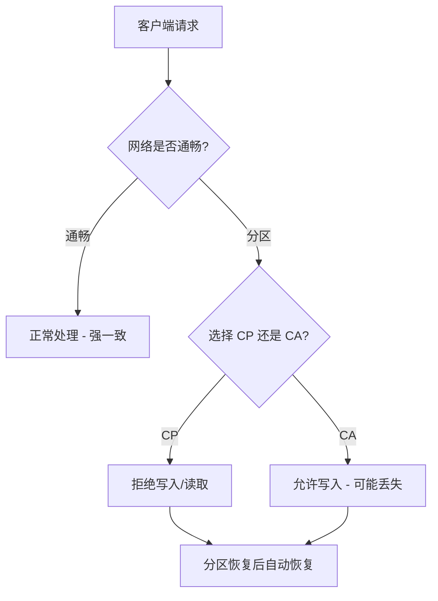
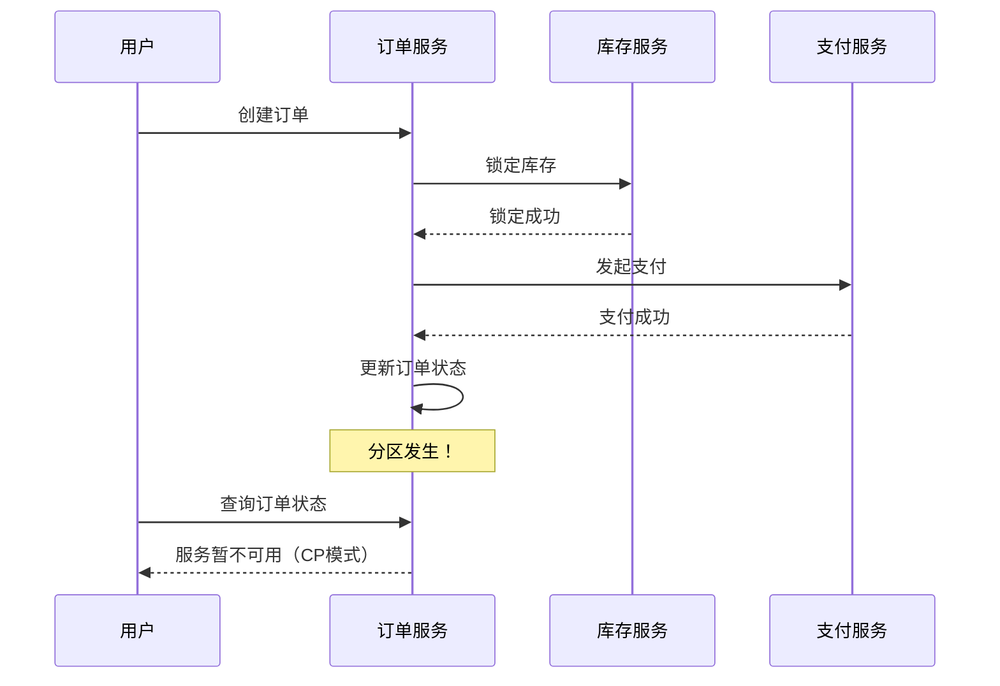
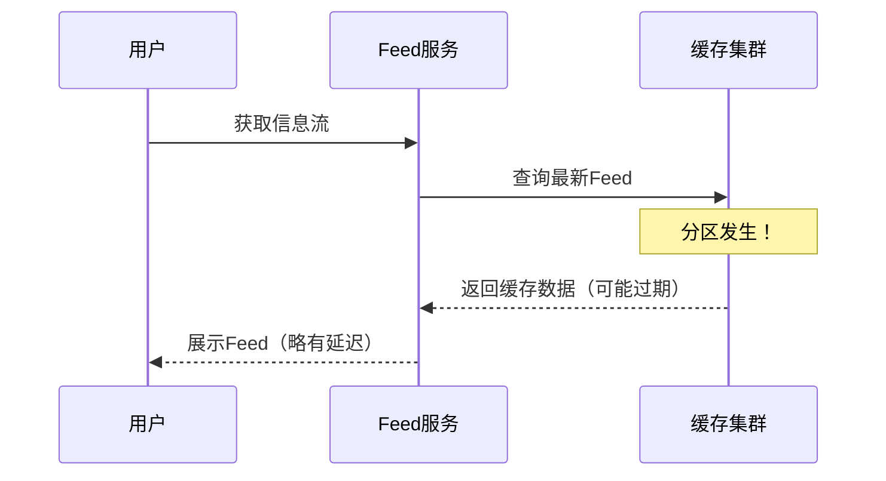

## 问题背景

2024年双十一零点，美团外卖订单系统的 Kafka 集群突然出现了网络分区。

两台 Broker 之间的心跳超时，被 Controller 判定为节点故障，触发了分区Leader切换。结果如何？2000多笔订单在支付完成后，状态卡在"已支付待发货"，上游erp收不到消息，下游库存服务也同步不了。

排查了整整 47 分钟，客服电话被打爆。

事后复盘，根因其实特别清晰：订单服务依赖 Kafka 的强一致性写入，但 Kafka 在网络分区时会选择 A（Availability），导致一半分区的写入操作在故障期间被拒绝——这正是 CAP 定理在生产环境里的一次经典表演。

今天，我们把 CAP 定理从理论到实践彻底讲透。

---

## 一、什么是 CAP

CAP 定理，也叫 Brewer 定理，是 2000 年由加州大学伯克利分校的 Eric Brewer 教授在 PODC（分布式计算原理研讨会）上首次提出，2002 年被 Gilbert 和 Lynch 严格证明。

**核心结论**：分布式系统不可能同时满足以下三个特性：

| 特性 | 英文 | 含义 |
| --- | --- | --- |
| **C** - 一致性 | Consistency | 每次读操作都能读到最近一次写入的结果 |
| **A** - 可用性 | Availability | 每个请求都能在有限时间内收到响应 |
| **P** - 分区容错性 | Partition Tolerance | 系统在网络分区发生时仍能继续运行 |

:::warning ⚠️
注意：CAP 定理并不是说"你可以在三个里选两个"，而是说在网络分区发生时，你必须在 C 和 A 之间做取舍。**分区容错不是可选项，而是分布式系统的必然**——网络会抖动，机架会断电，光纤会被挖断。真正的问题永远是：分区期间，我选一致性还是可用性？
:::

### 1.1 三个核心性质

**一致性（Consistency）**

一致性意味着"所有节点在同一时刻看到的数据是相同的"。这不叫"最终一致"，叫"强一致性"。写操作完成后，任何后续读操作必须返回写入的值。

**可用性（Availability）**

可用性意味着"每个请求都能得到响应"。注意，这里说的是"能收到响应"，不是"返回正确结果"。一个返回过期数据的系统，同样满足可用性。

**分区容错（Partition Tolerance）**

分区容错意味着"系统能在网络分区的情况下继续运行"。网络分区是指系统中的一部分节点无法与另一部分节点通信。这在真实生产环境中几乎不可避免。

---

## 二、CAP 的三角博弈

```
        A
       / \
      /   \
     / CP  \
    /       \
   C ------- P
```

### 2.1 CP 系统：强一致 + 分区容错

CP 系统在分区期间会**放弃可用性**，选择拒绝服务直到分区恢复。

典型代表：
- **ZooKeeper**：在 Leader 选举期间，整个集群不可用
- **etcd**：Raft 共识要求多数派节点确认才返回成功
- **HBase**：Region 迁移期间相关数据不可访问
- **Redis Cluster**：分片主节点故障时，从节点即使在运行也不提供写入



**典型场景**：ZooKeeper 在网络分区时，如果 Leader 不在多数派分区中，会主动关闭服务。这意味着分布式锁在分区期间可能失效——这是很多开发团队踩过的坑。

### 2.2 AP 系统：可用 + 分区容错

AP 系统在分区期间会**放弃强一致性**，选择返回可能过期的数据，但保证服务不中断。

典型代表：
- **Cassandra**：去中心化架构，分区期间仍可读写，但可能返回冲突版本
- **DynamoDB**：使用向量时钟解决冲突，写入永远成功
- **Elasticsearch**：主分片故障时从分片接管，可能读到过期数据
- **Kafka**：分区Leader故障时，Follower 成为新Leader，期间可能有数据丢失

```java
// Cassandra 写入永远成功的哲学
// 这行代码在分区期间也能"成功"返回，但数据可能最终被丢弃
cassandra.execute("INSERT INTO orders (id, status) VALUES (?, ?)", id, status);
```

### 2.3 CA 系统：不存在

等等，我说"不存在"不是开玩笑。

在分布式系统中，网络分区是必然发生的。你可以把 CA 理解为"单机数据库"——MySQL 单实例、PostgreSQL 单实例，都是 CA。但只要你的系统涉及多个节点通过网络通信，**P 就不是可选项**。

| 组合 | 实际含义 | 典型系统 |
| --- | --- | --- |
| CP + AP | 真实分布式系统 | Kafka、Cassandra、ZooKeeper |
| CA | 单机或有全通网络 | MySQL 单实例、PostgreSQL 单实例 |

---

## 三、生产场景中的 CAP 取舍

### 3.1 订单支付系统：选 CP



**为什么选 CP？**

支付场景下，一致性是生命线。扣了库存但订单创建失败、支付成功但状态没更新——这些场景在金融系统里是不可接受的。

:::tip 💡
阿里双十一的订单系统，在分区期间会主动限流，而不是返回过期状态。这背后的逻辑：宁可让用户看到"系统繁忙"，也不能让用户看到"余额扣了但订单没创建"。
:::

### 3.2 Feed 流系统：选 AP



**为什么选 AP？**

Feed 流的用户容忍度极高——晚几秒看到新动态，用户感知不明显。但如果你告诉用户"服务不可用"，用户会直接流失。

---

## 四、CAP 的经典误区

### ❌ 误区一：CAP 意味着三选二

这是最常见的误解。Brewer 本人在 2012 年专门发了一篇文章《CAP 十二年回顾： CAP 定理如何改变了世界》来澄清：**分区容错不是可选项**，CAP 真正描述的是在分区发生时，你选 C 还是选 A。

### ❌ 误区二：AP 系统就是"不要一致性"

AP 系统并不是放弃一致性，而是**在分区期间暂时放弃强一致性**，在分区恢复后通过各种机制（反熵、读修复、 hinted handoff）达到最终一致。

### ❌ 误区三：MySQL 是 CA 系统

MySQL 主从复制在网络分区时，从库可能落后于主库——这意味着读从库可能读到过期数据，已经不是"强一致"了。只有 MySQL 单实例才是 CA，但那样的话 P 就是 0。

### ❌ 误区四：Redis Cluster 是 AP 系统

Redis Cluster 在主节点故障时会进行故障转移，但如果在选举过程中发生分区，新主节点可能缺少一些尚未复制到从节点的写操作。这其实是 CP 和 AP 的一个灰色地带——Redis 选择了"最终一致性"作为妥协。

---

## 五、CAP 的演进：PACELC

【架构权衡】

CAP 定理只描述了分区发生时的行为，但**没有描述分区恢复时的行为**。2012 年，Daniel Abadi 提出了 PACELC 模型来填补这个空白：

> **P**artition **A**vailability **C**onsistency **E**lse **L**atency **C**onsistency

PACELC 的核心洞察是：**即使没有发生分区，你也要在延迟和一致性之间做取舍**。

| 系统 | 分区期间 | 无分区时 |
| --- | --- | --- |
| DynamoDB（强一致） | 延迟/不可用 | 每次读都确认 |
| DynamoDB（最终一致） | 可用但可能过期 | 读更快 |
| Cassandra | 可用但可能冲突 | 读更快（最终一致） |
| HBase | 不可用（CP） | 每次写都确认 |
| ZooKeeper | 不可用（CP） | 写必须通过Leader |

:::tip 💡
这个模型对于架构师选型特别重要。比如你在设计一个全球分布式的数据库，多个数据中心之间存在网络延迟（即使不是分区）。在这种情况下，PACELC 告诉你：**你无法同时获得强一致和低延迟**。
:::

---

## 六、工程选型 Checklist

| 场景 | 推荐组合 | 原因 |
| --- | --- | --- |
| 金融支付 | CP | 一致性是生命线 |
| 社交Feed | AP | 用户体验优先 |
| 配置中心 | CP | 配置不一致会导致灾难 |
| 日志采集 | AP | 允许少量丢失 |
| 分布式锁 | CP | 锁失效比不可用更严重 |
| 消息队列 | CP/AP 混合 | 消费进度可追，消息体要可靠 |

### 落地 Checklist

- [ ] 确认系统是否真的需要分布式（单机是否能满足？）
- [ ] 识别分区场景：哪些节点之间可能断联？
- [ ] 定义 RPO（恢复点目标）：能容忍多少数据丢失？
- [ ] 定义 RTO（恢复时间目标）：能容忍多久不可用？
- [ ] 选择 CP 或 AP，并在架构文档中明确记录
- [ ] 设计分区检测机制（心跳超时、RTT阈值）
- [ ] 设计分区恢复后的数据修复流程
- [ ] 模拟分区场景进行演练

---

## 七、一道高频面试题

**面试官问**："Redis Cluster 是 AP 系统还是 CP 系统？"

**错误回答**："Redis 是 AP 系统，因为它是最终一致的。"

**问题诊断**：这个回答暴露了对 Redis Cluster 故障处理机制的不了解。Redis Cluster 在主节点故障时会进行故障转移，但如果原主节点在故障前有未同步到从节点的写操作，这些数据会丢失——这其实是 CP 的表现（数据可能丢失，不满足一致性）。同时，在故障转移期间如果有客户端连接到从节点（从节点被提升前），读到的可能是过期数据——这又是 AP 的表现。

**正确回答**：Redis Cluster 是一个**混合系统**，在不同的故障场景下表现不同：

1. **主节点故障 + 从节点接管**：CP 行为（可能丢失未同步数据）
2. **分区期间访问从节点**：AP 行为（可能读到过期数据）
3. **正常运行时**：最终一致

:::tip 💡
能回答出"Redis Cluster 在主节点故障时会丢数据"这个细节的候选人，基本都是 P7 以上——因为这意味着他不仅看过文档，还真正在生产环境处理过 Redis 故障。
:::
