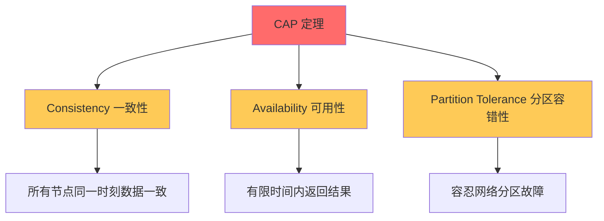
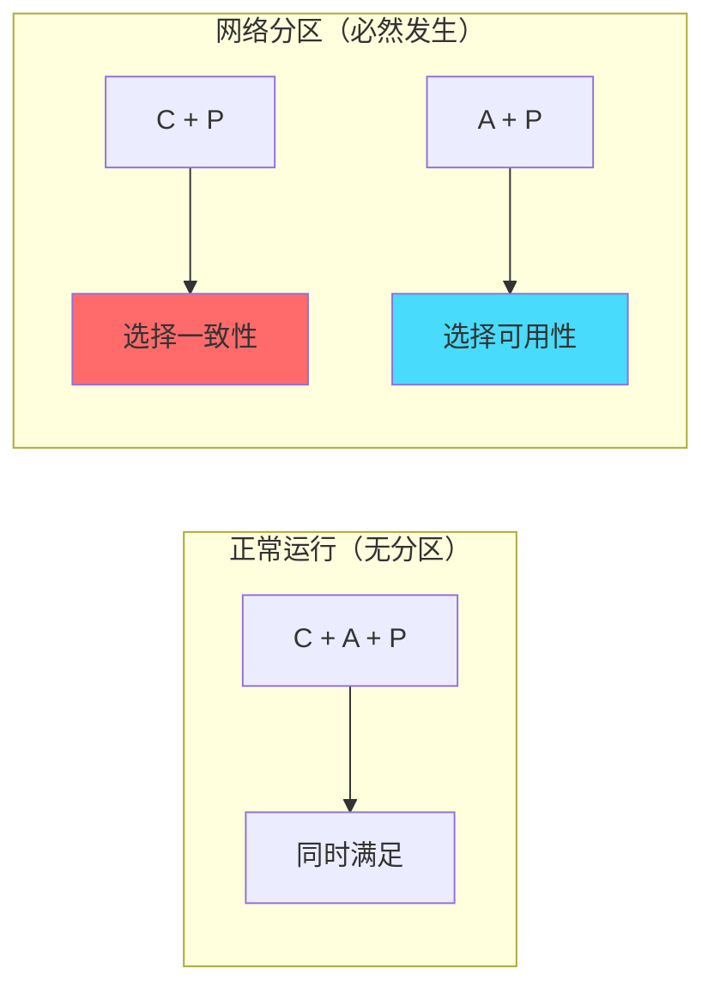
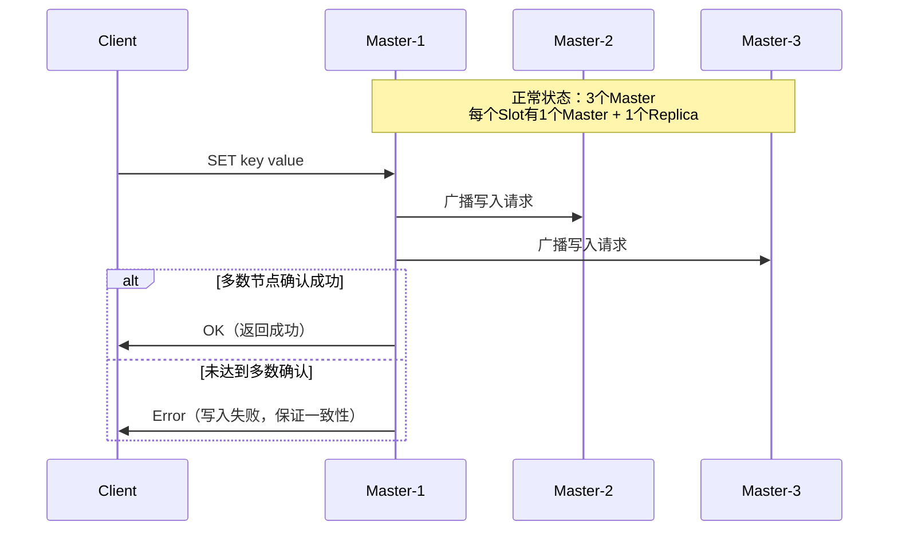
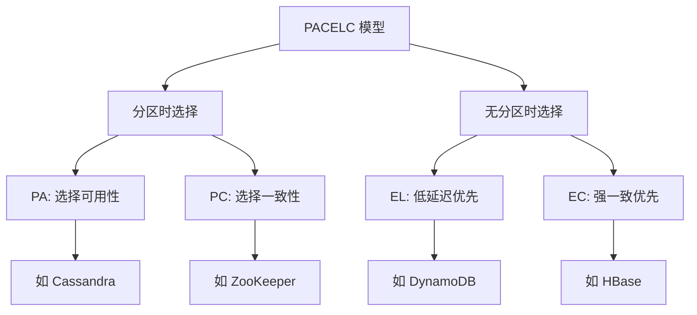

# CAP 定理：分布式系统的不可能三角

## 快速自测：面试官最关心的 3 个问题

> 🔴 **高频必考**，P6/P7 面试必问

1. **CAP 定理的三要素是什么？「三选二」是不是意味着可以舍去一个？**
2. **CP 系统和 AP 系统的典型代表是什么？Redis Cluster 是 CAP 中的哪一种？**
3. **为什么说「CAP 不应该被用于选型」？PACELC 模型解决了什么问题？**

如果这三个问题你都能完整回答，说明 CAP 定理你已经掌握得不错了。

---

## 一、CAP 定理的核心概念

### 1.1 定理的起源

CAP 定理由加州大学伯克利分校的 Eric Brewer 教授于 2000 年在 PODC（分布式计算原理）大会上提出，并在 2002 年被 Seth Gilbert 和 Nancy Lynch 通过形式化证明。定理描述了一个分布式系统不可能同时满足以下三个特性：

- **C（Consistency）一致性**：任何时刻，所有节点看到的数据都是一致的
- **A（Availability）可用性**：每个请求都能在有限时间内获得响应
- **P（Partition Tolerance）分区容错性**：当网络分区发生时，系统仍能继续运行



### 1.2 网络分区必然发生

很多初学者对 CAP 最大的误解是：「我可以选择不要 P，因为网络分区是小概率事件」。这个理解是错误的。

**在分布式系统中，网络分区不是一种可选的故障，而是必然发生的事件**。原因如下：

1. **物理层面的不可靠**：服务器会宕机、网线会被挖断、交换机可能故障
2. **超时机制的设计**：系统必须能处理「节点暂时不可达」的情况
3. **地理分布式部署**：跨机房、跨地域的部署天然存在网络延迟和不稳定

> **结论**：分布式系统必须在 C 和 A 之间做出选择，因为 P 是必须接受的约束条件。

### 1.3 CAP 三选二的真正含义

「三选二」不是简单地从三个特性中选两个，而是指：

- **在没有网络分区时**：系统可以同时保证 C 和 A
- **在发生网络分区时**：系统必须在 C 和 A 之间二选一



---

## 二、CP 与 AP 的典型代表

### 2.1 CP 系统：强一致性优先

CP 系统在网络分区时会牺牲可用性，保证所有节点数据一致。典型代表：

| 系统 | CAP 类型 | 一致性实现 | 说明 |
|------|---------|-----------|------|
| **ZooKeeper** | CP | ZAB 协议 | 选主期间不可用，写入需要多数节点确认 |
| **Etcd** | CP | Raft 协议 | 强一致性，Leader 故障时重新选主 |
| **HBase** | CP | HDFS 副本 | Region 迁移时短暂不可用 |
| **MongoDB**（副本集） | CP | 多数派写入 | 多数节点确认后才返回成功 |
| **Redis Cluster** | CP | Slot 迁移 | 迁移期间部分 key 不可用 |

### 2.2 AP 系统：高可用优先

AP 系统在网络分区时会继续服务，但可能返回过期数据。典型代表：

| 系统 | CAP 类型 | 数据同步方式 | 说明 |
|------|---------|-------------|------|
| **Cassandra** | AP | Gossip 协议 | 任意节点可写，最终合并冲突 |
| **DynamoDB** | AP | 向量时钟 | 冲突数据保留，用户自行解决 |
| **Redis Sentinel** | AP | 主从异步复制 | 故障转移期间可能丢数据 |
| **Amazon S3** | AP | 版本控制 | 读写都可用，冲突版本保留 |

### 2.3 Redis Cluster 的 CAP 归属

这是一个高频追问问题，很多候选人回答错误。

**Redis Cluster 属于 CP 系统**，原因如下：

1. **写入流程**：客户端先路由到目标 Slot 所在的 Master 节点，需要 `N/2 + 1` 个节点确认写入成功
2. **分区发生时的行为**：如果 Master 节点所在分区节点数 `<` 总节点数的一半，该分区会停止写入（保证一致性）
3. **主观下线与客观下线**：节点发现其他节点不可达时，需要多数节点同意才认定故障



---

## 三、CAP 定理的常见误区

### ⚠️ 误区一：「CAP 意味着系统只能选两个特性」

这是最经典的误解。实际上 CAP 描述的是「在分区发生时的权衡」，而不是「系统整体特性」。

```
错误理解：CAP = C + A 或 C + P 或 A + P
正确理解：CAP = 在没有分区时满足所有特性 + 在分区发生时选择 C 或 A
```

### ⚠️ 误区二：「CAP 定理已过时，不需要关注」

虽然 CAP 定理在 2000 年提出，但它揭示的权衡问题至今仍是分布式系统设计的核心考量。PACELC 模型是对 CAP 的补充和扩展。

### ⚠️ 误区三：「可以用 CAP 来选型」

很多架构师在选型时会说「我们要选 AP 系统，所以选 Cassandra」。这个逻辑是错误的：

1. **系统可以在不同模块选择不同的策略**：例如 ZooKeeper 用于选主（CP），Kafka 用于消息队列（AP）
2. **同一系统可能有多种配置**：Redis 可以配置为强一致模式或高可用模式
3. **业务场景决定需求**：金融交易需要 CP，社交Feed需要 AP

---

## 四、面试题精讲

### 🔴 面试题 1：CAP 定理的三要素是什么？

**答案要点**：

- **C（Consistency）一致性**：任何时刻，所有客户端看到的数据都是一致的。注意这里的一致性是指「线性一致性」或「强一致性」，不是「最终一致性」
- **A（Availability）可用性**：每个请求都能在有限时间内获得响应，无论数据是否最新
- **P（Partition Tolerance）分区容错性**：系统能够容忍网络分区故障，即使节点之间无法通信也能继续运行

**追问链**：

> **第一层**：CAP 三要素是什么？
> **第二层**：为什么 P 是必须的，不能放弃吗？
> **第三层**：Redis Cluster 是 CP 还是 AP？为什么？

### 🟡 面试题 2：CP 和 AP 系统各举三个例子

**答案要点**：

| 类型 | 典型系统 | 特点 |
|------|---------|------|
| **CP** | ZooKeeper、Etcd、HBase | 分区时不可写，保证数据一致 |
| **AP** | Cassandra、DynamoDB、Redis Sentinel | 分区时继续读写，可能返回旧数据 |

### 🟢 面试题 3：如何判断一个系统是 CP 还是 AP？

**答案要点**：

1. **故障注入测试**：人为制造网络分区，观察系统行为
2. **写一致性配置**：查看系统配置的写入确认节点数（`w`、`j` 参数）
3. **代码分析**：查看主从复制的同步/异步模式

---

## 五、CAP 与 PACELC：更精确的权衡模型

### 5.1 为什么需要 PACELC

CAP 只能描述「分区发生时的选择」，无法描述「无分区时的延迟-一致性权衡」。PACELC 模型由 Daniel J. Abadi 于 2009 年提出：

- **PA/PC**：分区时选择可用性（PA）还是一致性（PC）
- **EL/EC**：无分区时追求低延迟（EL）还是强一致（EC）



### 5.2 常见系统的 PACELC 归属

| 系统 | PACELC | 说明 |
|------|--------|------|
| Cassandra | PA/EL | 分区可用 + 低延迟 |
| DynamoDB | PA/EL | 可配置的一致性级别 |
| HBase | PC/EC | 强一致 + 写入延迟高 |
| ZooKeeper | PC/EC | 选主后写入延迟低 |
| MongoDB | PC/EC | 多数派写入保证一致 |
| etcd | PC/EC | Raft 协议强一致 |

---

## 六、对比总结表

| 对比维度 | CP 系统 | AP 系统 |
|---------|---------|---------|
| **分区时行为** | 停止服务或拒绝写入 | 继续服务，可能返回旧数据 |
| **数据一致性** | 强一致，所有节点数据相同 | 最终一致，冲突数据需合并 |
| **典型场景** | 金融交易、订单系统、配置中心 | 社交Feed、日志系统、缓存 |
| **故障恢复** | 需要重新同步数据 | 自动合并冲突数据 |
| **延迟** | 写入需要多数节点确认，延迟高 | 写入只需主节点确认，延迟低 |
| **代表产品** | ZooKeeper、Etcd、HBase | Cassandra、DynamoDB、Redis Sentinel |

---

## 七、实战思考题

### 思考题 1：Redis 主从模式的 CAP 归属

Redis 主从模式下，Master 宕机后 Sentinel 会自动提升一个 Replica 为 Master。请问：

1. 这个过程是 CP 还是 AP？
2. 如果原 Master 在网络分区后恢复，会出现什么问题？
3. 如何解决「脑裂」问题？

### 思考题 2：Kafka 的 CAP 归属

Kafka 使用 ISR（In-Sync Replicas）机制来平衡一致性和可用性。请问：

1. `acks=all` 时 Kafka 是 CP 还是 AP？
2. `acks=1` 时 Kafka 是 CP 还是 AP？
3. 如何理解「Kafka 既不是严格的 CP，也不是严格的 AP」？

---

## 扩展阅读

如果本文档对你有帮助，建议继续阅读：

- [CAP 与 BASE 关系](/distributed/theory/cap-base-relation)：理解 CAP 如何推导出 BASE 理论
- [PACELC 定理](/distributed/theory/pacelc)：更精确的分布式系统选型模型
- [一致性模型对比](/distributed/theory/consistency-models)：强一致、最终一致、线性一致等模型详解
