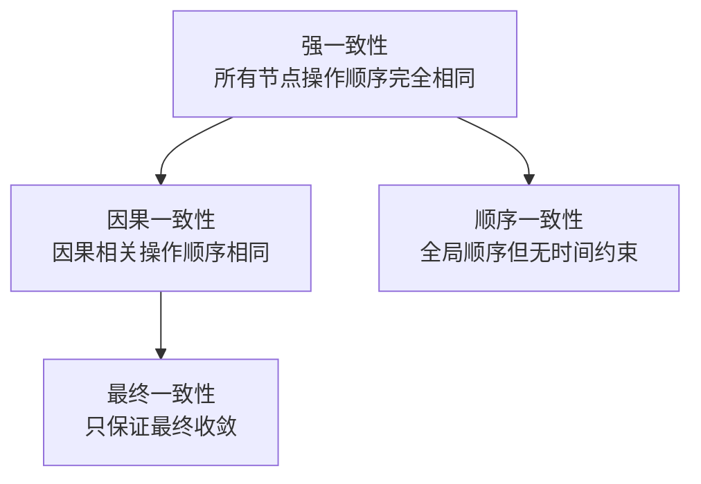
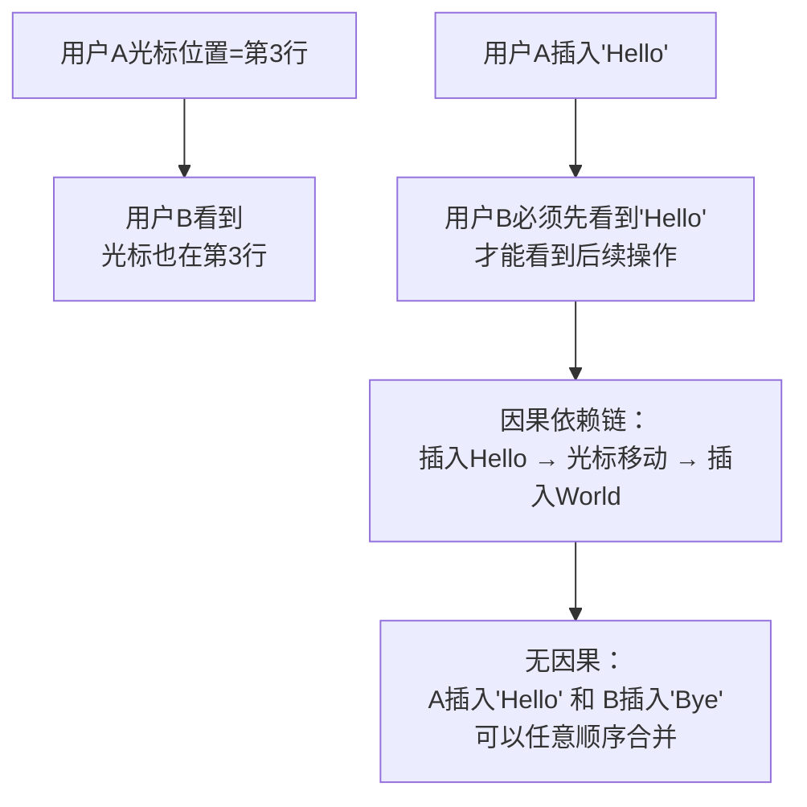

微信群聊里，你遇到过这样的场景吗？

群里有人发了一条消息，有人马上回复，但你的消息列表里，回复跑到了原消息的前面。

这不是 bug，这是**因果一致性缺失**的表现。

在分布式系统里，因果一致性是一种"刚刚好"的一致性模型——它保证了有因果关系的操作必须按顺序执行，但无因果关系的操作可以并行。今天我们来深度拆解它。

## 一、问题的本质：什么是因果？

### 1.1 生活中的因果

```
场景1（有因果）：
  发了一条朋友圈 → 才能看到评论
  先发微博 → 才能被转发

场景2（无因果）：
  A 发了朋友圈，B 发了朋友圈
  谁先谁后？ → 没关系，显示顺序无所谓
```

**因果的定义**：如果操作 B 依赖于操作 A 的结果，则 A 和 B 有因果关系（A → B）。

### 1.2 分布式系统中的因果

```
场景：电商下单

操作顺序（有因果）：
  1. 查询商品库存（必须先查）
  2. 扣减库存（依赖查询结果）
  3. 创建订单（依赖扣减结果）

这三个操作必须串行执行，不能乱序
```

```
无因果的场景：
  用户A修改收货地址
  用户B修改头像

这两个操作没有因果关系，可以并行处理
```

## 二、因果一致性的定义

**因果一致性（Casual Consistency）**：保证有因果关系的操作按因果顺序执行，无因果关系的操作可以乱序。

```
因果一致性的数学表达：
  对于任意两个操作 A 和 B：
  - 如果 A → B（ A 是 B 的因），则所有节点看到 A 都在 B 之前
  - 如果 A 和 B 无因果关系，则不同节点可能以不同顺序看到它们
```

### 2.1 因果 vs 强一致

| 维度 | 强一致性 | 因果一致性 |
| --- | --- | --- |
| 顺序保证 | 所有操作全局有序 | 只有因果相关操作有序 |
| 无因果操作 | 也必须有序 | 可以并行/乱序 |
| 实现复杂度 | 高（全局时钟或共识） | 中（向量时钟） |
| 延迟 | 高（需要全局协调） | 低（只需要相关方协调） |
| 可用性 | 中 | 高 |



【架构权衡】

因果一致性是"实用主义"的选择：**在大多数互联网场景里，真正有因果关系的操作不到 10%**。社交发帖和评论有因果，但两个用户同时发帖没有因果。用因果一致性，可以让 90% 的无因果操作并行执行，只有 10% 的因果操作需要协调。

## 三、向量时钟：因果追踪的核心数据结构

### 3.1 为什么需要向量时钟？

强一致性用全局时钟（Lamport Clock）或 Raft Leader 来排序所有操作。但全局时钟需要同步，Raft Leader 是单点。

**向量时钟（Vector Clock）** 的思想是：**每个节点维护自己的逻辑时钟，每个操作记录"我看到这个操作之前，我已经看到了哪些节点的操作"。**

```
Lamport Clock（单一时钟）：
  节点A: t=1, t=2, t=3
  节点B: t=4, t=5, t=6
  问题：只知道"我的操作比你新"，不知道"我在哪些操作之后"

Vector Clock（向量时钟）：
  节点A: VC_A = {A: 2, B: 1, C: 0}
  节点B: VC_B = {A: 2, B: 1, C: 0}
  含义：
    - 我已经看到了 A 的 2 次操作
    - 我已经看到了 B 的 1 次操作
    - 我还没看到 C 的任何操作
```

### 3.2 向量时钟的规则

```java
// 向量时钟的三条核心规则

// 规则1：本地操作后，时钟递增
public class Node {
    Map<String, Integer> vectorClock = new HashMap<>();

    public void localOperation() {
        int current = vectorClock.getOrDefault(nodeId, 0);
        vectorClock.put(nodeId, current + 1);
    }
}

// 规则2：发送消息时，附上当前向量时钟
public void send(Message msg) {
    Message withClock = new Message(msg);
    withClock.setVectorClock(vectorClock.copy()); // 复制当前时钟
    network.send(withClock);
}

// 规则3：收到消息时，合并时钟（取最大值）
public void receive(Message msg) {
    Map<String, Integer> received = msg.getVectorClock();

    // 合并：每个节点取 max
    for (String nodeId : allNodes) {
        int local = vectorClock.getOrDefault(nodeId, 0);
        int remote = received.getOrDefault(nodeId, 0);
        vectorClock.put(nodeId, Math.max(local, remote));
    }

    // 最后本地时钟 +1
    vectorClock.put(this.nodeId, vectorClock.get(this.nodeId) + 1);
}
```

### 3.3 因果判断：通过向量时钟

```java
// 判断两个向量时钟的因果关系

// 定义：VC1 < VC2 表示 VC1 在 VC2 之前（VC1 是因）
public static Relation compare(Map<String, Integer> vc1, Map<String, Integer> vc2) {
    boolean allLessOrEqual = true;
    boolean allEqual = true;

    // 合并所有节点
    Set<String> allNodes = new HashSet<>(vc1.keySet());
    allNodes.addAll(vc2.keySet());

    for (String node : allNodes) {
        int v1 = vc1.getOrDefault(node, 0);
        int v2 = vc2.getOrDefault(node, 0);

        if (v1 < v2) allLessOrEqual = false;
        if (v1 != v2) allEqual = false;
    }

    if (allEqual) return Relation.EQUAL;
    if (allLessOrEqual) return Relation.BEFORE; // vc1 在 vc2 之前
    // vc2 在 vc1 之前
    if (isAllGreaterOrEqual(vc2, vc1)) return Relation.AFTER;

    // 否则：并发（无因果关系）
    return Relation.CONCURRENT;
}
```

### 3.4 向量时钟的并发判断

```
场景：两个客户端同时编辑同一个文档

节点A的向量时钟：{A: 1, B: 0}
节点B的向量时钟：{A: 0, B: 1}

compare(VC_A, VC_B)：
  - A <= B? 否（A:1 > B:0）
  - B <= A? 否（B:1 > A:0）
  → 并发关系：无因果，可并行
```

```mermaid
graph LR
    A["A: write(x=1)<br/>VC_A={A:1,B:0}"] --> B["B: write(x=2)<br/>VC_B={A:0,B:1}"]
    A --> C["A 收到 B 的消息<br/>VC_A={A:1,B:1}"]
    B --> D["B 收到 A 的消息<br/>VC_B={A:1,B:1}"]
    C --> E["两节点收敛到<br/>{A:1,B:1}"]
    D --> E
    Note over E: A和B的操作无因果<br/>需要冲突解决
```

## 四、因果一致性的实现：COPS 系统

COPS（Consistency as Prefix Ordering with Seers）是因果一致性的工业级实现，来自 AWS Labs 的论文。

### 4.1 COPS 的设计

```java
// COPS 的因果一致性实现框架
public class COPSNode {
    private Map<String, Object> localStore = new HashMap<>();
    private Map<String, VectorClock> metadata = new HashMap<>();

    // 本地写入
    public void put(String key, String value) {
        VectorClock vc = incrementLocalClock();

        localStore.put(key, value);
        metadata.put(key, vc);

        // 异步复制到其他节点
        replicateAsync(key, value, vc);
    }

    // 因果一致读取
    public String get(String key) {
        // 等待依赖的所有操作都应用
        VectorClock dependsOn = metadata.get(key);
        waitForDependencies(dependsOn);

        return localStore.get(key);
    }
}
```

### 4.2 COPS 的特点

| 特性 | 说明 |
| --- | --- |
| 因果保证 | 读操作在返回前，保证所有因果依赖已应用 |
| 局部性 | 每个节点的延迟只依赖于其因果依赖链的深度 |
| 可扩展性 | 无全局协调，可水平扩展 |
| 冲突解决 | 存储冲突操作的完整历史，而非只保留最新值 |

## 五、因果一致性的实际应用

### 5.1 社交网络的评论系统

```
场景：微博评论

因果关系：
  微博A → 评论A1 → 回复A1的评论

非因果关系：
  评论A1 → 评论A2（可能无因果，谁先发没关系）

因果一致实现：
  - 评论必须在所属微博之后展示
  - 回复必须在被回复的评论之后展示
  - 两个独立评论的顺序无所谓
```

```java
// 微博评论的因果一致性实现
public class CommentService {
    // 评论的因果依赖链
    public class Comment {
        String weiboId;        // 依赖微博
        String parentId;       // 依赖父评论（回复场景）
        VectorClock vc;        // 向量时钟
    }

    // 发布评论
    public void postComment(Comment comment) {
        // 1. 确认依赖存在
        if (comment.parentId != null) {
            Comment parent = commentStore.get(comment.parentId);
            waitForVC(parent.vc); // 等待父评论的因果依赖
        }

        // 2. 记录自己的向量时钟
        comment.vc = incrementLocalClock();

        // 3. 存储并广播
        commentStore.put(comment.id, comment);
        broadcast(comment);
    }

    // 读取评论（因果一致）
    public List<Comment> getComments(String weiboId) {
        List<Comment> result = new ArrayList<>();

        // 1. 获取微博的因果依赖
        Weibo weibo = weiboStore.get(weiboId);
        waitForVC(weibo.vc); // 确保微博已加载

        // 2. 只加载因果相关的评论
        for (Comment c : commentStore.getByWeibo(weiboId)) {
            if (isCausallyReady(c)) { // 确保因果依赖已满足
                result.add(c);
            }
        }

        return result;
    }
}
```

### 5.2 协作编辑系统（Google Docs 类）



```java
// 协作编辑的因果一致性
public class CollaborativeEditor {
    private Map<String, Operation> ops = new ConcurrentHashMap<>();

    public void apply(Operation op) {
        // 1. 检查因果依赖
        for (String depId : op.getDependencies()) {
            if (!ops.containsKey(depId)) {
                waitFor(ops, depId); // 等待依赖操作到达
            }
        }

        // 2. 确认依赖后应用操作
        VectorClock newVC = mergeVC(op.getVC(), localVC);
        op.setVC(newVC);
        ops.put(op.getId(), op);

        // 3. 应用到文档
        applyToDocument(op);
    }
}
```

### 5.3 购物车的跨设备同步

```
场景：用户在手机和电脑上操作购物车

因果关系：
  手机：添加商品A → 删除商品A
  电脑：添加商品A（同一时间）

如果两设备各自广播操作：
  - 两个"添加商品A"是并发的（无因果）
  - "删除商品A"依赖于"添加商品A"（有因果）

因果一致性保证：
  - 手机和电脑最终看到的购物车状态相同
  - 删除操作一定在添加操作之后
  - 两个添加操作的顺序由冲突解决策略决定（Last-Write-Wins 或 合并）
```

## 六、生产避坑

### 6.1 坑一：向量时钟的内存膨胀

```java
// ❌ 错误：向量时钟随节点数线性增长
// 1000个节点 → 每个消息携带1000维向量
// 1000万消息 → 内存爆炸

// ✅ 正确：使用有界向量时钟
public class BoundedVectorClock {
    // 只记录最近 N 个节点的时钟，或使用截断策略
    private static final int MAX_SIZE = 10;
    private Map<String, Integer> vc = new LinkedHashMap<>(MAX_SIZE);

    public void put(String nodeId, int value) {
        if (vc.size() >= MAX_SIZE) {
            // 删除最旧的条目
            String oldest = vc.keySet().iterator().next();
            vc.remove(oldest);
        }
        vc.put(nodeId, value);
    }
}
```

:::warning ⚠️
向量时钟的内存问题是生产环境的主要瓶颈。DynamoDB/Cassandra 等系统使用"版本向量"的有界版本——只保留一定数量的历史版本，超过后截断。这牺牲了部分因果精度，但保证了可扩展性。
:::

### 6.2 坑二：混淆因果一致性与最终一致

```java
// ❌ 错误：认为因果一致就是最终一致
// 最终一致：停止写入后最终收敛，但不保证顺序
// 因果一致：收敛时保证因果顺序

// ✅ 正确：因果一致是最终一致的子集
// 因果一致 → 一定最终一致（收敛时有因果保证）
// 最终一致 ↛ 因果一致（收敛时可能因果乱序）
```

## 七、与其它一致性模型的对比

| 模型 | 有因果 | 全局有序 | 时间约束 | 实现难度 |
| --- | --- | --- | --- | --- |
| 线性一致性 | ✅ | ✅ | ✅（真实时间）| 高 |
| 顺序一致性 | ✅ | ✅ | ❌ | 高 |
| 因果一致性 | ✅ | ❌ | ❌ | 中 |
| 最终一致性 | ❌ | ❌ | ❌ | 低 |

【架构权衡】

因果一致性的核心价值：**在保证因果关系的前提下，允许无因果操作乱序**。这让它在社交协作、聊天消息、购物车等场景非常实用——这些场景里，大多数操作其实是独立的。

但要注意：因果一致性的**实现成本比最终一致性高**（需要维护向量时钟），比强一致性低（不需要全局协调）。它是一个"刚刚好"的选择。

## 八、工程代价评估

| 维度 | 评估 |
| --- | --- |
| 开发成本 | 中等（需要维护向量时钟） |
| 存储成本 | 高（每个操作需要存储向量时钟） |
| 消息大小 | 中（向量随节点数线性增长） |
| 延迟 | 低（只需要相关方协调） |
| 适用场景 | 社交协作、聊天、协同编辑、跨设备同步 |
