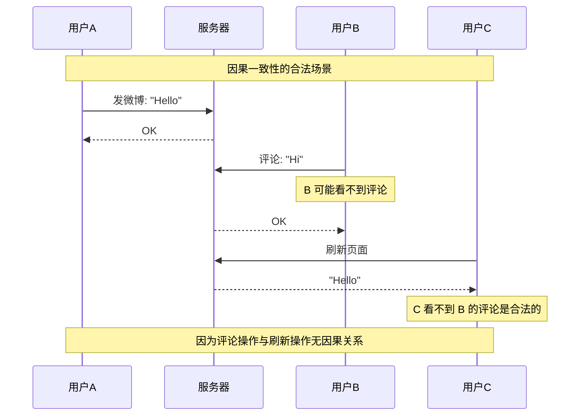
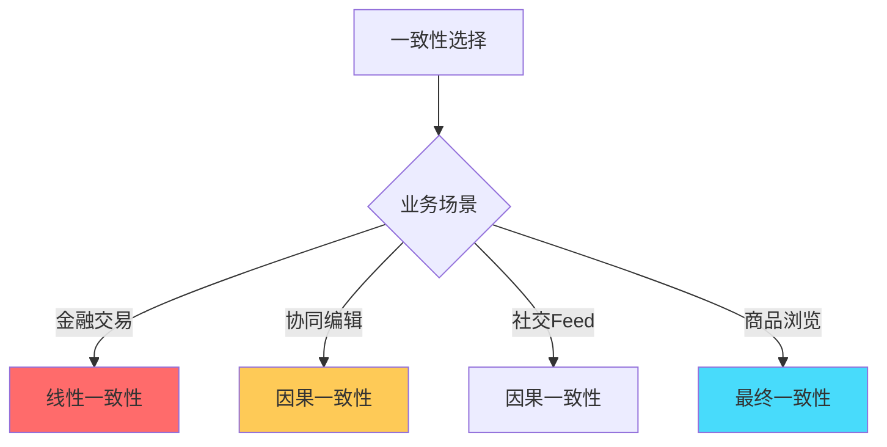
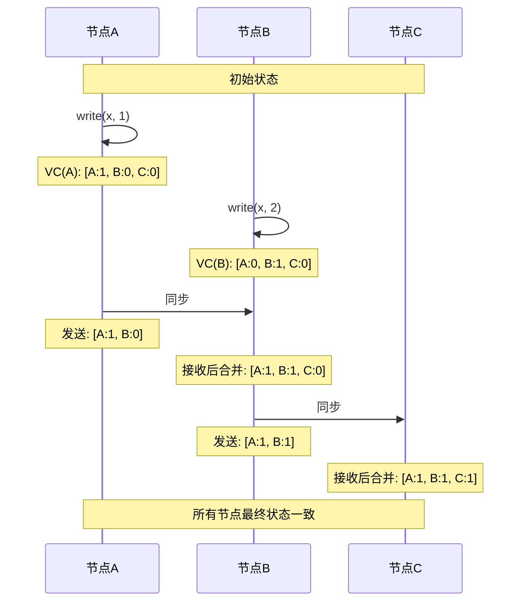
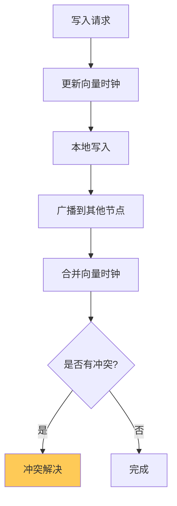

# 因果一致性：分布式系统中的因果关系保证

## 快速自测：面试官最关心的 3 个问题

> 🟡 **中频常考**，P7 架构设计面试可能问

1. **什么是因果一致性？它和线性一致性有什么区别？**
2. **向量时钟是如何工作的？为什么需要向量时钟来实现因果一致性？**
3. **Cassandra 的因果一致性是如何实现的？**

---

## 一、因果一致性的核心概念

### 1.1 什么是「因果关系」

在分布式系统中，操作之间存在因果关系：

```
因果关系的例子：

1. A 发了一条微博（写操作）
2. B 看到了 A 的微博（因果：2 依赖 1）
3. B 转发/评论了 A 的微博（因果：3 依赖 1 和 2）

不是因果关系的例子：
- C 同时浏览了 A 的微博（无依赖关系）
- D 同时浏览了 B 的评论（无依赖关系）
```

### 1.2 因果一致性的定义

因果一致性只保证有因果关系的操作顺序一致，无因果关系的操作可以乱序执行。

```
因果一致性的保证：
1. 如果 A 在 B 之前发生且有因果关系，则所有节点看到 A 在 B 之前
2. 无因果关系的操作（如并发操作），可以以任意顺序执行
3. 比线性一致性弱，比最终一致性强
```

### 1.3 因果一致性的时序图



---

## 二、因果一致性 vs 线性一致性

### 2.1 对比表格

| 维度 | 线性一致性 | 因果一致性 |
|------|----------|----------|
| **全局顺序** | 所有操作按真实时间排序 | 只保证有因果关系的操作有序 |
| **性能** | 低（需要全局协调） | 中（允许并发） |
| **实现难度** | 高 | 高 |
| **典型场景** | 金融交易 | 社交互动、协同编辑 |
| **实现技术** | Paxos/Raft | 向量时钟 |

### 2.2 何时选择因果一致性



---

## 三、向量时钟：因果一致性的实现

### 3.1 向量时钟的原理

向量时钟是一个由每个节点版本号组成的向量，用于记录操作之间的因果关系。

```
向量时钟示例：

节点 A 的向量：[A:1, B:0, C:0]
节点 B 的向量：[A:0, B:1, C:0]
节点 C 的向量：[A:0, B:0, C:1]
```

### 3.2 向量时钟的操作

```java
// 向量时钟的核心操作

public class VectorClock {
    private Map<NodeId, Long> clock;
    
    // 1. 本地操作：增加本地版本号
    public void increment(NodeId node) {
        clock.merge(node, 1L, Long::sum);
    }
    
    // 2. 同步操作：合并两个向量时钟
    public VectorClock merge(VectorClock other) {
        VectorClock result = new VectorClock();
        for (NodeId node : allNodes()) {
            result.set(node, Math.max(
                this.get(node), 
                other.get(node)
            ));
        }
        return result;
    }
    
    // 3. 比较操作：判断因果关系
    public Relationship compare(VectorClock other) {
        // 返回：之前、之后、并发
        boolean allLessOrEqual = true;
        boolean allGreaterOrEqual = true;
        boolean atLeastOneStrict = false;
        
        for (NodeId node : allNodes()) {
            long thisValue = this.get(node);
            long otherValue = other.get(node);
            
            if (thisValue > otherValue) {
                allLessOrEqual = false;
            }
            if (thisValue < otherValue) {
                allGreaterOrEqual = false;
            }
            if (thisValue != otherValue) {
                atLeastOneStrict = true;
            }
        }
        
        if (allLessOrEqual && atLeastOneStrict) return BEFORE;
        if (allGreaterOrEqual && atLeastOneStrict) return AFTER;
        return CONCURRENT;
    }
}
```

### 3.3 向量时钟的时序图



---

## 四、因果一致性的实现方案

### 4.1 基于向量时钟的方案

**代表系统**：Dynamo、Cassandra（部分）



### 4.2 基于版本向量的方案

**代表系统**：Riak

```java
// 版本向量示例
public class VersionVector {
    private Map<NodeId, Long> versions;
    
    // 比较两个版本向量
    public Comparison compare(VersionVector other) {
        // 1. 判断是否需要同步
        // 2. 判断是否有冲突
        // 3. 返回比较结果
    }
}
```

### 4.3 Cassandra 的因果一致性

Cassandra 通过以下方式实现因果一致性：

1. **Tracked topology awareness**：客户端跟踪节点拓扑
2. **Read repair**：读取时修复不一致数据
3. **Write + Synchronous**：写操作同步到多数节点

```java
// Cassandra 的因果一致读配置
ConsistencyLevel causalConsistency = ConsistencyLevel.TWO;
// 需要至少 2 个节点确认
// 且后续读必须能读到之前写的节点
```

---

## 五、面试题精讲

### 🟡 面试题 1：什么是因果一致性？它和线性一致性有什么区别？

**答案要点**：

1. **因果一致性**：只保证有因果关系的操作顺序一致
2. **线性一致性**：所有操作都必须按真实时间排序
3. **因果一致性更弱**：允许无因果关系的操作乱序，性能更好

**追问链**：

> **第一层**：什么是因果关系？哪些操作有因果关系？
> **第二层**：因果一致性和线性一致性的核心区别是什么？
> **第三层**：为什么因果一致性比线性一致性性能更好？

### 🟡 面试题 2：向量时钟是如何工作的？

**答案要点**：

1. 每个节点维护一个向量，记录所有节点的版本号
2. 操作时更新本地版本号
3. 同步时合并向量时钟
4. 通过比较向量时钟判断因果关系

---

## 六、实战思考题

### 思考题 1：协同编辑系统的因果一致性

某在线文档系统需要实现协同编辑，请设计其因果一致性方案：

1. 如何保证用户的操作顺序正确？
2. 如何处理并发编辑冲突？
3. 如何同步到其他用户？

### 思考题 2：向量时钟的局限性

向量时钟有什么局限性？在大规模系统中，向量时钟会面临什么问题？

---

## 扩展阅读

如果本文档对你有帮助，建议继续阅读：

- [一致性模型对比](/distributed/theory/consistency-models)：各种一致性模型详解
- [向量时钟](/distributed/theory/vector-clock)：向量时钟的详细实现
- [Quorum 读写](/distributed/theory/quorum)：强一致性读写多数派机制