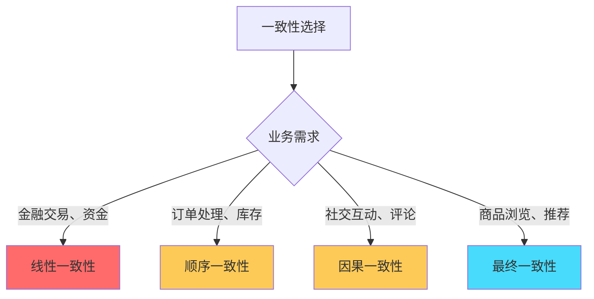
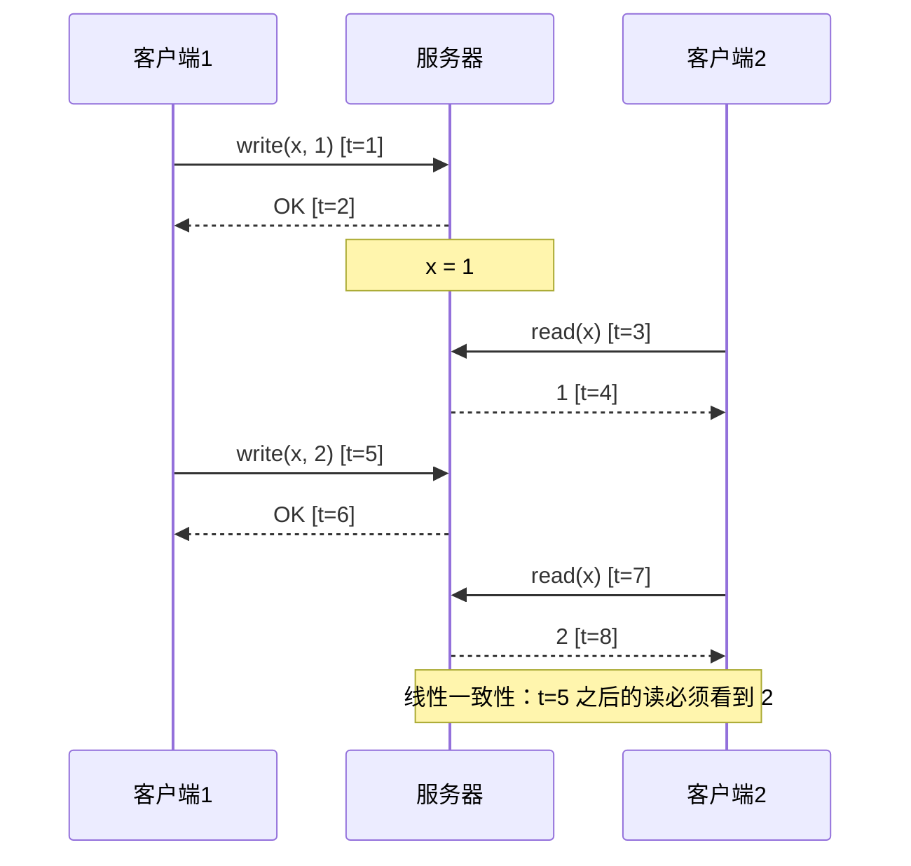
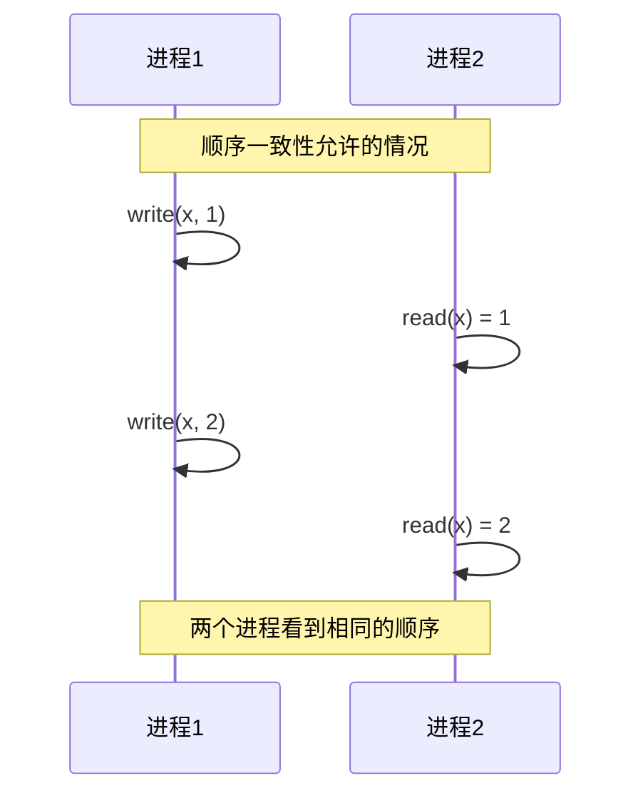
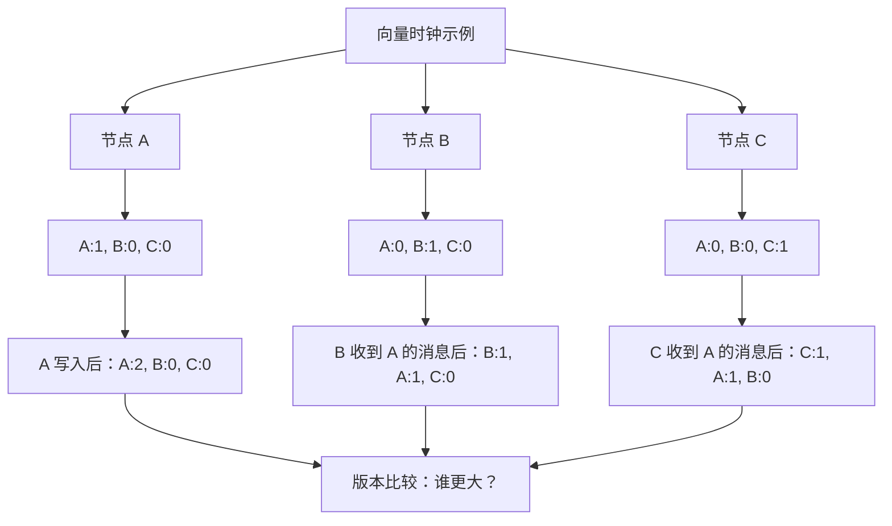

# 一致性模型对比：从强到弱的完整光谱

## 快速自测：面试官最关心的 3 个问题

> 🔴 **高频必考**，P7 架构设计面试常问

1. **线性一致性和顺序一致性有什么区别？如何判断一个系统是否满足线性一致性？**
2. **因果一致性和因果一致性的实现方式是什么？向量时钟是如何工作的？**
3. **最终一致性是否可以满足业务需求？什么场景下必须使用强一致性？**

---

## 一、一致性模型概述

### 1.1 一致性模型的光谱

分布式系统中存在多种一致性模型，从强到弱排列如下：

```
强一致性 ←────────────────────────────────→ 弱一致性
  ↓
线性一致性 > 顺序一致性 > 因果一致性 > 会话一致性 > 最终一致性 > 弱一致性
```

| 一致性级别 | 保证强度 | 性能 | 实现难度 |
|-----------|---------|------|---------|
| **线性一致性** | 最强 | 低 | 极高 |
| **顺序一致性** | 强 | 低 | 高 |
| **因果一致性** | 中强 | 中 | 高 |
| **会话一致性** | 中 | 中 | 中 |
| **最终一致性** | 弱 | 高 | 低 |
| **弱一致性** | 最弱 | 最高 | 低 |

### 1.2 一致性模型的选择原则



---

## 二、线性一致性（Linearizability）

### 2.1 定义

线性一致性是最强的一致性模型，要求：

1. **原子性**：所有操作像在一个时间点完成
2. **实时性**：读操作能看到最新写入的结果
3. **全局顺序**：所有节点看到相同顺序

### 2.2 线性一致性的时序图



### 2.3 线性一致性的判断标准

**如何判断一个系统是否满足线性一致性**：

```
判断条件：
1. 读操作能返回最近一次写入的结果
2. 写入操作是原子的
3. 系统的真实时间顺序与逻辑顺序一致
```

---

## 三、顺序一致性（Sequential Consistency）

### 3.1 定义

顺序一致性要求：

1. **所有节点看到相同的操作顺序**（全局有序）
2. **但不保证这个顺序与真实时间一致**

### 3.2 顺序一致性与线性一致性的区别

```mermaid
graph LR
    subgraph "顺序一致性"
        A1["节点A：write(x, 1)"]
        A2["节点A：write(x, 2)"]
        B1["节点B：read(x) = 2"]
        B2["节点B：read(x) = 1"]
        
        A1 --> B1
        A2 --> B2
        Note over A1,B1: 全局有序，但与时间无关
    end
    
    subgraph "线性一致性"
        C1["t=1: write(x, 1)"]
        C2["t=2: write(x, 2)"]
        D1["t=3: read(x) = 2"]
        
        C1 --> C2
        C2 --> D1
        Note over C1,D1: 全局有序 + 实时性
    end
```

**关键区别**：

| 维度 | 顺序一致性 | 线性一致性 |
|------|----------|----------|
| 全局顺序 | 保证 | 保证 |
| 实时性 | 不保证 | 保证 |
| 性能 | 较高 | 较低 |

### 3.3 顺序一致性的时序图



---

## 四、因果一致性（Causal Consistency）

### 4.1 定义

因果一致性只保证有因果关系的操作顺序一致，无因果关系的操作可以并行。

```
因果关系示例：
- A 对商品点赞，B 看到点赞数 +1（A 和 B 有因果）
- C 同时浏览商品页面（D 无因果，可并行）
```

### 4.2 因果一致性的实现：向量时钟

**向量时钟（Vector Clock）**是实现因果一致性的核心技术：



**向量时钟比较规则**：

```java
// 版本比较
boolean happensBefore(VectorClock v1, VectorClock v2) {
    // v1 < v2 当且仅当 v1 所有维度 <= v2，且至少一维 <
    boolean lessOrEqual = true;
    boolean strictlyLess = false;
    
    for (String node : allNodes) {
        if (v1.get(node) > v2.get(node)) {
            return false; // v1 不可能早于 v2
        }
        if (v1.get(node) < v2.get(node)) {
            strictlyLess = true;
        }
    }
    return strictlyLess;
}
```

---

## 五、会话一致性（Session Consistency）

### 5.1 定义

会话一致性保证在同一个会话内的操作顺序一致。会话通常通过客户端 ID 或 Session Token 标识。

```
会话一致性的保证：
1. 同一会话内，读操作能看到会话内之前的写入
2. 不同会话之间，可能出现不一致
```

### 5.2 会话一致性的实现

```java
// 会话级别的读写一致性
public class SessionContext {
    // 每个会话维护一个版本号
    private long localVersion;
    
    // 读取时检查版本
    public Object read(String key) {
        Object value = cache.get(key);
        long version = cache.getVersion(key);
        
        if (version > localVersion) {
            // 本地版本过期，从服务器获取最新
            value = server.get(key);
            localVersion = version;
        }
        return value;
    }
    
    // 写入时更新本地版本
    public void write(String key, Object value) {
        server.put(key, value);
        localVersion++; // 会话内写入后版本递增
    }
}
```

---

## 六、最终一致性（Eventual Consistency）

### 6.1 定义

最终一致性是 BASE 理论的核心，只保证「在没有新写入的情况下，数据最终会一致」。

```
最终一致性的关键点：
1. 不保证多久（no bound）
2. 只保证最终（eventually）
3. 无写入时，数据会收敛
```

### 6.2 最终一致性的冲突解决策略

| 策略 | 说明 | 适用场景 |
|------|------|----------|
| **Last-Write-Wins** | 以时间戳为准，保留最新 | 简单场景 |
| **向量时钟** | 保留所有版本，应用层决定 | 复杂业务 |
| **CRDT** | 无冲突数据结构 | 集合、计数器 |
| **应用层合并** | 用户手动解决冲突 | 需要人工处理 |

### 6.3 CRDT 示例：Grow-only Counter

```java
// 无冲突复制数据类型 - 只增计数器
public class GrowOnlyCounter {
    private Map<NodeId, Long> counters = new HashMap<>();
    
    // 每个节点只能增加自己对应的值
    public void increment(NodeId node, long delta) {
        counters.merge(node, delta, Long::sum);
    }
    
    // 查询总数 = 所有节点之和
    public long get() {
        return counters.values().stream().mapToLong(Long::longValue).sum();
    }
    
    // 合并两个 CRDT（用于同步）
    public void merge(GrowOnlyCounter other) {
        other.counters.forEach((node, delta) -> {
            counters.merge(node, delta, Long::sum);
        });
    }
}
```

---

## 七、对比总结表

| 一致性模型 | 因果保证 | 性能 | 实现难度 | 代表系统 |
|-----------|---------|------|---------|---------|
| **线性一致性** | 实时全局顺序 | 最低 | 极高 | ZooKeeper, etcd |
| **顺序一致性** | 全局顺序（无实时） | 低 | 高 | 单进程多线程 |
| **因果一致性** | 因果顺序 | 中 | 高 | Cassandra |
| **会话一致性** | 会话内有序 | 中 | 中 | Redis Session |
| **最终一致性** | 无保证 | 高 | 低 | Cassandra, DynamoDB |
| **弱一致性** | 无保证 | 最高 | 低 | DNS 缓存 |

---

## 八、面试题精讲

### 🔴 面试题 1：线性一致性和顺序一致性的区别？

**答案要点**：

1. **顺序一致性**：所有进程看到相同的操作顺序，但不保证与真实时间一致
2. **线性一致性**：在顺序一致性的基础上，增加实时性保证

**追问链**：

> **第一层**：线性一致性和顺序一致性有什么区别？
> **第二层**：如何用测试验证一个系统是否满足线性一致性？
> **第三层**：ZooKeeper 是线性一致性还是顺序一致性？

### 🟡 面试题 2：向量时钟如何实现因果一致性？

**答案要点**：

1. 每个节点维护一个向量，记录「每个节点看到的版本」
2. 写入时更新本地节点的版本号
3. 读取时比较向量时钟，判断是否有因果关系

---

## 扩展阅读

如果本文档对你有帮助，建议继续阅读：

- [向量时钟](/distributed/theory/vector-clock)：向量时钟的详细实现
- [Quorum 读写](/distributed/theory/quorum)：读写多数派实现强一致性
- [线性一致性测试](/distributed/theory/linearizable-sequential)：如何使用 Jepsen 测试线性一致性