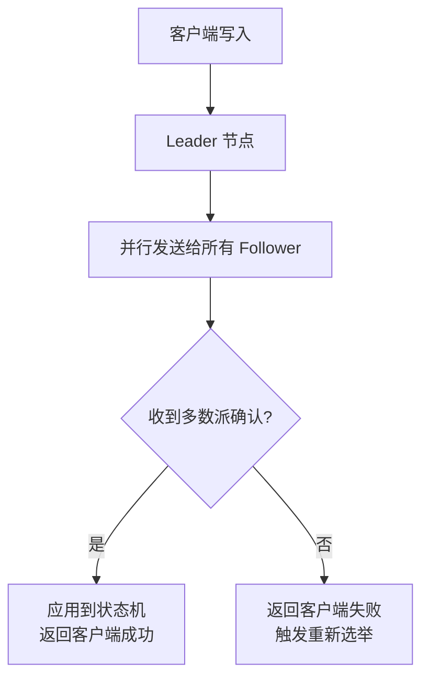

2023年双十一，我们的秒杀系统出现了 37 笔超卖。

用户下单成功、支付成功，但库存已经没了。排查了整整 2 个小时，发现是缓存和数据库之间的数据不一致导致的：Redis 里显示还有库存，但 MySQL 里已经扣到 0 了。

37 笔订单，涉及金额 12 万元。

这不是一个简单的 bug，这是一个架构问题：**我们选了最终一致但没做兜底**。

今天，我们把强一致性和最终一致性彻底讲透。

## 一、两种一致性的本质定义

一致性（Consistency）在分布式系统里有多种定义，这里讨论的是**数据一致性**——即**多个副本之间的数据是否相同**。

### 强一致性（Strong Consistency）

**定义**：任何时刻，所有客户端读到的都是同一个（最新的）值。写操作完成后，任何后续读操作都返回写入的值。

```
强一致性保证：
T0: 写入 X = 5
T1: 任何节点读取 X → 必须返回 5
T2: 写入 X = 10
T3: 任何节点读取 X → 必须返回 10
```

**典型实现**：
- 2PC/3PC 分布式事务
- Raft/Paxos 共识算法
- 同步复制的主从架构

### 最终一致性（Eventual Consistency）

**定义**：如果不再有新写入，那么最终所有副本会收敛到同一个值。但在收敛之前，不同客户端可能读到不同的值。

```
最终一致性保证：
T0: 写入 X = 5
T1: 节点A读 X → 可能返回 5 或旧值
T2: 节点B读 X → 可能返回 5 或旧值
T3: 写入停止
T4: 经过足够长的时间
T5: 所有节点读取 X → 一定返回 5
```

**典型实现**：
- DNS 系统（域名解析的 TTL 更新）
- Cassandra 的宽松一致性
- Redis 主从异步复制
- 消息队列的异步消费

【架构权衡】

强一致性和最终一致性的核心权衡是**延迟与可用性**。强一致性需要同步确认（每次写入都要多数派确认），延迟高但数据准。最终一致性允许异步复制（写入后立即返回），延迟低但数据可能有窗口期。

## 二、最终一致性的五种变体

很多人以为"最终一致"就是"不管了，等着就行"。其实最终一致性有非常精细的分类：

### 2.1 因果一致性（Causal Consistency）

保证有因果关系的操作顺序一致，无因果关系的操作可以乱序。

```
场景：微博评论
- 用户A发了一条微博（因果关系：先发才能评论）
- 用户B看到微博后评论（因果关系：评论依赖微博存在）
- 用户C看到评论（无因果关系：可能看不到）

因果一致性保证：B一定在A之后看到，但C的看到时间不确定
```

### 2.2 读己之所写（Read Your Writes）

保证自己写入的数据自己一定能看到。

```
场景：修改个人资料
- 用户A修改昵称为"张三"
- 用户A刷新页面
- 必须看到"张三"，不能还看到旧昵称

读己之所写是最终一致系统中最基本的要求
如果用户改完看不到自己的改动，会非常困惑
```

### 2.3 会话一致性（Session Consistency）

保证在同一个会话内满足读己之所写。会话结束后，下一个会话可能看到旧数据。

```
场景：电商购物车
- 用户A在会话中把商品加入购物车
- 刷新页面，必须看到商品在购物车里
- 会话结束后，下次访问可能短暂看不到（下一个会话开始前）

会话一致性好比：你在一个店里逛，你的购物车状态你自己说了算
```

### 2.4 单调读一致性（Monotonic Read）

保证如果客户端读取了某个值，后续读取不会读到更旧的值。

```
场景：社交Feed
- 第一次读：看到帖子A、B
- 第二次读：必须看到 A、B 以及可能的新帖子
- 绝对不能：第二次读只看到 A（比第一次还少）

单调读 = 不会出现"时光倒流"现象
```

### 2.5 单调写一致性（Monotonic Write）

保证同一个客户端的写操作按顺序执行，不会乱序。

```
场景：日志写入
- 写日志 L1
- 写日志 L2
- 最终状态必须是 L1 + L2，不会出现只有 L2 的状态

单调写保证：写操作的串行化
```

:::details 📖 一致性模型强度层次

```
最强 ────────────────────────────── 最弱

线性一致性（Linearizability）
    ↓
顺序一致性（Sequential Consistency）
    ↓
因果一致性（Causal Consistency）
    ↓
读己之所写（Read Your Writes）
    ↓
会话一致性（Session Consistency）
    ↓
单调读（Monotonic Read）
    ↓
单调写（Monotonic Write）
    ↓
最终一致性（Eventual Consistency）
```

从线性一致性到最终一致性，一致性强度递减，但性能（延迟）递增。

:::

## 三、强一致性实现：从 Raft 到 2PC

### 3.1 Raft 共识算法

Raft 是强一致性的工业标准实现，核心是**Leader 复制**：



```java
// Raft 写入流程简化实现
public class RaftNode {
    public AppendEntriesResult append(String key, String value) {
        // 1. 如果不是 Leader，转发到 Leader
        if (state != State.LEADER) {
            return redirectToLeader();
        }

        // 2. 构造日志条目
        LogEntry entry = new LogEntry(term, key, value);
        log.append(entry);

        // 3. 并行发送 AppendEntries 到所有 Follower
        List<Future<Boolean>> responses = sendToAllFollowers(entry);

        // 4. 等待多数派确认
        int successCount = 1; // Leader 自己算一票
        for (Future<Boolean> f : responses) {
            if (f.get(timeout)) {
                successCount++;
            }
        }

        // 5. 多数派确认后，应用到状态机
        if (successCount > totalNodes / 2) {
            stateMachine.apply(entry);
            return SUCCESS;
        }
        return FAILURE;
    }
}
```

**代价分析**：

| 维度 | Raft 强一致 | 异步复制 |
| --- | --- | --- |
| 写入延迟 | RTT（一次网络往返）| 立即返回 |
| 数据安全性 | 少数节点故障不丢数据 | 少数节点故障可能丢数据 |
| 可用性 | Leader 挂了需选举（短暂不可用）| 任何节点都可写 |

### 3.2 同步复制 vs 异步复制

```
同步复制（强一致）：
  写入 → Leader → 等待所有 Follower 确认 → 返回成功
  延迟 = N × RTT（N=节点数，RTT≈1~5ms）

半同步复制（折中）：
  写入 → Leader → 等待至少一个 Follower 确认 → 返回成功
  延迟 = 1~2 × RTT

异步复制（最终一致）：
  写入 → Leader → 立即返回成功（后台同步到 Follower）
  延迟 = 0（客户端感知）
```

MySQL 的 binlog 复制模式就是这三种的典型代表：

```sql
-- 同步复制（safe mode）
set rpl_semi_sync_source_wait_point = 'AFTER_SYNC';
-- 写入 binlog → 同步到从库 → 从库确认 → 提交事务 → 返回

-- 异步复制
set rpl_semi_sync_source_wait_point = 'AFTER_COMMIT';
-- 写入 binlog → 提交事务 → 返回（后台同步到从库）
```

## 四、生产事故：最终一致性踩坑实录

### 4.1 事故一：缓存双写导致超卖（开篇案例）

```
根因分析：
1. 库存服务：先扣 Redis，再扣 MySQL（错误顺序）
2. 如果 Redis 扣成功，MySQL 扣失败 → Redis 有库存但 MySQL 没库存
3. 另一个请求查到 Redis 有库存，下单成功，但库存实际为 0

正确做法：
- 方案A：先扣 MySQL，再扣 Redis（但 Redis 失败需要回补 MySQL）
- 方案B：只扣 MySQL，用 Canal 同步到 Redis
- 方案C：用分布式事务（Seata）保证两者原子性
```

:::warning ⚠️
"缓存双写"是生产环境中最常见的一致性陷阱。缓存和数据库是两个独立的存储系统，**没有天然的事务保证**。正确的做法是：用 Canal/Binlog 同步（消费方可靠性），或者接受最终一致（窗口期内可能有偏差）。
:::

### 4.2 事故二：库存缓存击穿

```
场景：Redis 库存为 0，但数据库里还有库存（Redis 被错误设置为 0）

时间线：
T0: 误操作把 Redis 库存设为 0
T1: 用户查询库存 → Redis 返回 0 → 商品显示"缺货"
T2: 大量用户看到缺货 → 转化率暴跌
T3: 运营发现 → 手动修复 Redis
T4: 30 分钟后才恢复正常

教训：
- 缓存设置需要有变更审批流程
- 需要有缓存与数据库的一致性监控
- 需要有缓存的快速回源机制
```

### 4.3 事故三：消息丢失导致数据不一致

```
场景：订单完成后发送消息到 MQ，消费者扣库存

问题链条：
- 订单服务：订单落库成功，发送 MQ 消息（但 MQ 消息发送失败）
- 消息没发出去 → 库存永远不扣
- 用户付了钱，商品没预留

正确做法：
- 使用 RocketMQ 事务消息（half message 机制）
- 或者使用本地消息表（订单落库 + 消息落库在同一个事务）
```

## 五、工程选型矩阵

| 场景 | 一致性模型 | 理由 |
| --- | --- | --- |
| 金融转账/扣款 | 强一致（2PC/Raft） | 资金不允许丢失 |
| 库存扣减 | 强一致 + 幂等补偿 | 超卖代价极高 |
| 用户画像更新 | 最终一致 | 短暂不精准影响不大 |
| Feed 流/评论 | 最终一致 | 用户体验优先 |
| 配置中心 | 强一致（CP） | 配置不一致会导致灾难 |
| 分布式锁 | 强一致（CP） | 锁失效比不可用更严重 |
| 消息消费进度 | 最终一致 | 丢了就重试，丢了可追 |
| 分布式 Session | 会话一致 | 同一会话内自己看到就行 |

## 六、一致性检测工具

### 6.1 缓存数据库一致性检测

```sql
-- 定期对比 Redis 和 MySQL 的库存数据
SELECT
    p.id, p.stock AS db_stock,
    GET(p.id) AS cache_stock,
    CASE WHEN p.stock != GET(p.id) THEN '不一致' ELSE '一致' END AS status
FROM products p
WHERE p.updated_at > DATE_SUB(NOW(), INTERVAL 5 MINUTE);
```

### 6.2 跨机房复制延迟检测

```java
// 写入带时间戳的行，定期检测各节点时间戳差距
public class ReplicaLagMonitor {
    public void detectLag() {
        // 在主库写入带时间戳的检测行
        String ts = String.valueOf(System.currentTimeMillis());
        master.execute("INSERT INTO lag_test (ts) VALUES (?)", ts);

        // 各从库检测延迟
        for (Replica replica : replicas) {
            String replicaTs = replica.query("SELECT ts FROM lag_test ORDER BY id DESC LIMIT 1");
            long lag = System.currentTimeMillis() - Long.parseLong(replicaTs);
            if (lag > MAX_ACCEPTABLE_LAG) {
                alert("从库 " + replica + " 延迟 " + lag + "ms，超过阈值");
            }
        }
    }
}
```

## 七、工程代价评估

| 维度 | 强一致性 | 最终一致性 |
| --- | --- | --- |
| 开发成本 | 高（事务、补偿、重试） | 低（异步写入，无需协调） |
| 运维成本 | 高（需要监控一致性状态） | 低（依赖异步复制） |
| 排障复杂度 | 高（需要定位数据不一致点） | 高（需要检测数据收敛时间） |
| 延迟 | 高（同步确认） | 低（异步写入） |
| 可用性 | 中（Leader 挂了需选举） | 高（任何节点都可写） |
| 数据安全性 | 高（不丢数据） | 低（有窗口期可能丢数据） |

【架构权衡】

选强一致还是最终一致，本质上是在回答一个问题：**这个数据不一致的代价有多高？**

- 扣款/库存：代价极高 → 强一致
- Feed/评论：代价低 → 最终一致
- 配置/路由：代价极高 → 强一致

但现实往往更复杂：**同一个系统里，不同数据需要不同的一致性级别。** 订单支付链路选强一致，商品评论选最终一致，配置中心选强一致。这才是一个成熟系统的做法。

## 八、落地 Checklist

- [ ] 识别系统中的所有数据存储点（DB、缓存、消息队列）
- [ ] 为每个存储点定义一致性要求（强一致/最终一致）
- [ ] 设计跨存储的一致性保障方案（同步/异步/事务消息）
- [ ] 实现一致性检测机制（定时对比 + 告警）
- [ ] 设计数据修复流程（一旦发现不一致怎么修复）
- [ ] 定义 RTO（恢复时间目标）和 RPO（恢复点目标）
- [ ] 模拟数据不一致场景进行演练
