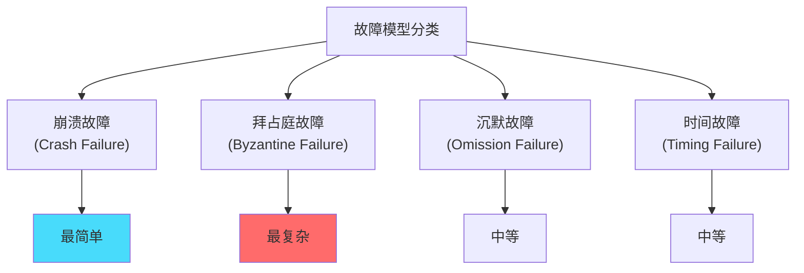
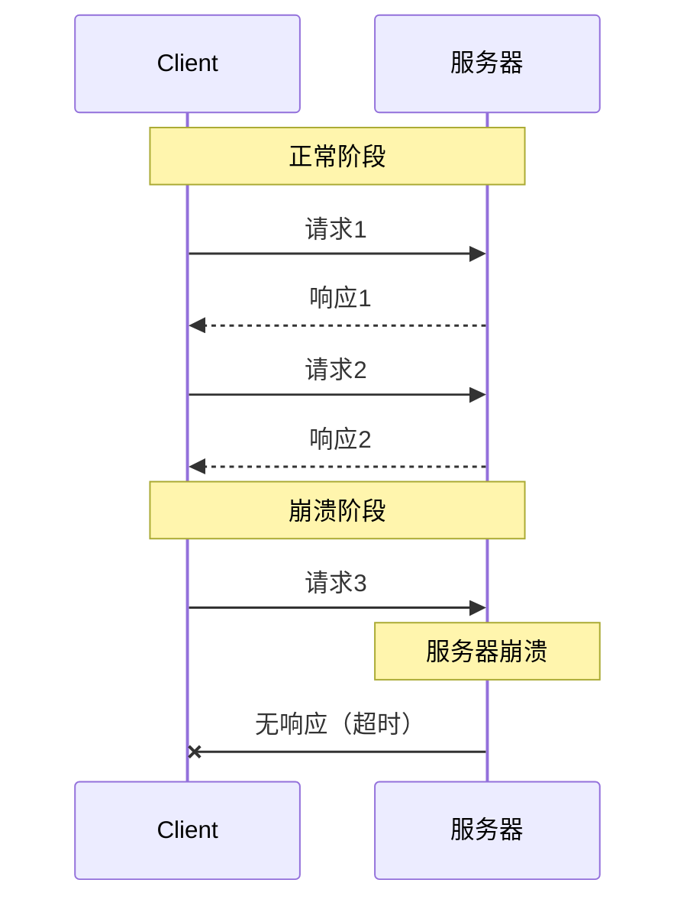
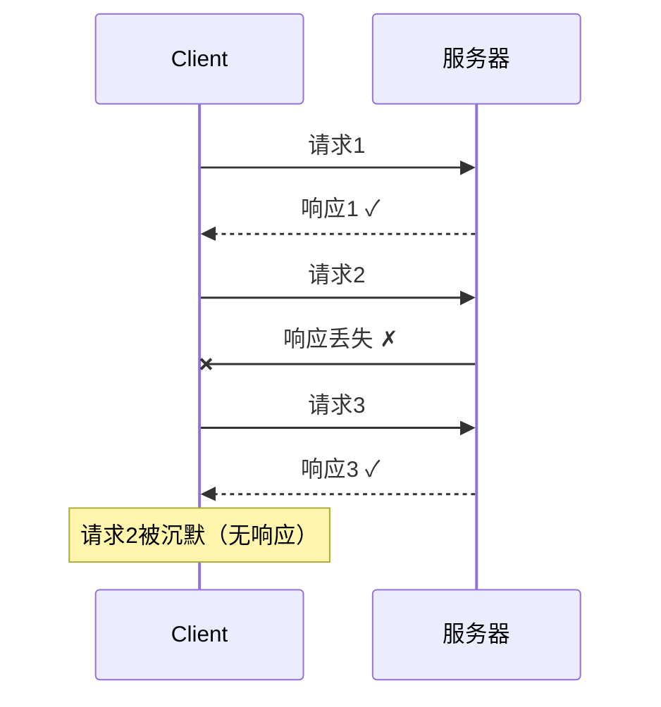

# 故障模型：分布式系统的基础假设

## 快速自测：面试官最关心的 3 个问题

> 🟡 **中频常考**，P7 架构设计面试可能问

1. **分布式系统中有哪些常见的故障模型？崩溃故障和拜占庭故障有什么区别？**
2. **什么是 CAP 定理与故障模型的关系？FP 故障模型意味着什么？**
3. **如何设计能容忍不同故障模型的系统？**

---

## 一、故障模型概述

### 1.1 为什么需要故障模型

分布式系统设计中，需要先明确「系统会遇到什么故障」，然后才能设计相应的容错机制。

```
故障模型的意义：

1. 明确定义系统边界
   - 假设会发生什么故障？
   - 系统在故障时应该如何表现？
   
2. 指导容错设计
   - 崩溃故障 → 简单的心跳检测
   - 网络分区 → CAP 的二选一
   - 拜占庭故障 → 冗余 + 投票
   
3. 确定可行性边界
   - FLP 不可能性定理的前提
   - CAP 定理的前提
```

### 1.2 故障模型的层次



---

## 二、崩溃故障（Crash Failure）

### 2.1 定义

崩溃故障是最简单的故障模型：节点要么正常工作，要么完全停止（崩溃）。不会产生错误行为。

```
崩溃故障的特点：
1. 节点正常时，响应正确
2. 节点崩溃后，停止响应
3. 不会产生错误的响应
4. 节点不会恢复（除非重启）
```

### 2.2 崩溃故障的时序图



### 2.3 崩溃故障的检测

```java
// 崩溃检测：心跳机制
public class Heartbeat {
    private ScheduledExecutorService scheduler;
    private volatile boolean alive = true;
    
    public void startHeartbeat(Node target) {
        scheduler.scheduleAtFixedRate(() -> {
            if (!sendHeartbeat(target)) {
                alive = false;
                onNodeCrashed(target);
            }
        }, 0, HEARTBEAT_INTERVAL, TimeUnit.MILLISECONDS);
    }
    
    private boolean sendHeartbeat(Node target) {
        try {
            return target.ping();
        } catch (Exception e) {
            return false;
        }
    }
}
```

### 2.4 崩溃故障的容错

| 策略 | 说明 | 适用场景 |
|------|------|----------|
| **主备复制** | 一主一备，主故障后切换 | 简单场景 |
| **多副本** | 多副本写入，多数派保证 | 强一致场景 |
| **心跳检测** | 定时检测节点存活 | 通用方案 |

---

## 三、拜占庭故障（Byzantine Failure）

### 3.1 定义

拜占庭故障是最严重的故障模型：节点可能产生任意错误的行为，包括发送错误、矛盾或伪造的消息。

```
拜占庭故障的特点：
1. 节点可能产生任意错误
2. 节点可能被攻击者控制
3. 节点可能发送矛盾的消息
4. 最难处理的故障类型
```

### 3.2 拜占庭将军问题

拜占庭将军问题由 Lamport 于 1982 年提出：

```
问题描述：
- N 个将军，其中有一个叛徒
- 将军们需要通过通信达成一致的作战计划
- 叛徒可以发送任意消息干扰决策

目标：
- 所有忠诚的将军达成一致的决定
- 无论叛徒如何干扰
```

### 3.3 拜占庭容错协议

**PBFT（Practical Byzantine Fault Tolerance）** 是实用的拜占庭容错协议。

```java
// PBFT 的三阶段协议
public class PBFTProtocol {
    
    // 1. Pre-Prepare：主节点广播提案
    public void prePrepare(View view, long sequence, Object request) {
        Message msg = new PrePrepare(view, sequence, digest(request));
        broadcast(msg);
    }
    
    // 2. Prepare：所有节点广播准备消息
    public void prepare(View view, long sequence, digest) {
        if (checkMessage(view, sequence, digest)) {
            Message msg = new Prepare(view, sequence, digest, myId);
            broadcast(msg);
            // 等待 2f 个 Prepare 消息
        }
    }
    
    // 3. Commit：等待 Prepare 后，广播提交消息
    public void commit(View view, long sequence, digest) {
        if (receivedEnoughPrepare()) {
            Message msg = new Commit(view, sequence, digest, myId);
            broadcast(msg);
            // 执行请求
            execute(request);
        }
    }
}
```

### 3.4 拜占庭容错的要求

| 节点数 | 拜占庭节点数 | 要求 |
|--------|-------------|------|
| **3f + 1** | f | 至少 3f + 1 个节点才能容忍 f 个拜占庭节点 |
| **2f + 1** | f | 需要 2f + 1 个正确节点才能达成共识 |

---

## 四、沉默故障（Omission Failure）

### 4.1 定义

沉默故障：节点能够正常接收消息，但不响应（或丢失消息）。可以看作「间歇性崩溃」。

```
沉默故障的特点：
1. 节点能接收消息
2. 但不发送响应（或响应丢失）
3. 介于崩溃和拜占庭之间
4. 可能是网络丢包导致
```

### 4.2 沉默故障的时序图



---

## 五、时间故障（Timing Failure）

### 5.1 定义

时间故障：节点的响应时间超出预期范围。

```
时间故障的类型：
1. 响应太慢（性能退化）
2. 响应太快（可能是伪造）
3. 时钟偏移
```

### 5.2 时间故障的检测

```java
// 超时检测
public class TimeoutChecker {
    private static final long TIMEOUT_MS = 1000;
    
    public Response sendRequest(Request request) {
        long start = System.currentTimeMillis();
        try {
            Response response = send(request);
            long elapsed = System.currentTimeMillis() - start;
            
            if (elapsed > TIMEOUT_MS) {
                log.warn("请求超时: {}ms > {}ms", elapsed, TIMEOUT_MS);
            }
            return response;
        } catch (TimeoutException e) {
            handleTimeout();
            throw e;
        }
    }
}
```

---

## 六、故障模型与 CAP

### 6.1 故障模型是 CAP 的前提

CAP 定理的证明基于以下假设：

1. **网络分区可能发生**：故障模型中的「分隔故障」
2. **消息可能丢失或延迟**：沉默故障或时间故障
3. **节点可能崩溃**：崩溃故障

### 6.2 不同故障模型下的 CAP

| 故障模型 | CAP 的影响 | 解决方案 |
|---------|-----------|----------|
| **崩溃故障** | 简单场景，可用性高 | 多副本复制 |
| **网络分区** | 必须二选一 | CAP 的核心约束 |
| **拜占庭故障** | 最复杂，需要多数派 | PBFT、Raft + 签名 |

### 6.3 FLP 不可能性与故障模型

FLP 不可能性定理的前提：

1. **异步网络**：消息延迟无上限
2. **崩溃故障**：节点只可能崩溃，不会发送错误消息
3. **随机消息丢失**：无法依赖超时检测

```
FLP 定理（简化）：
在异步网络中，如果至少有一个节点可能崩溃，
则不存在确定性算法能保证在有限时间内达成共识。
```

---

## 七、面试题精讲

### 🔴 面试题 1：崩溃故障和拜占庭故障的区别是什么？

**答案要点**：

| 维度 | 崩溃故障 | 拜占庭故障 |
|------|---------|-----------|
| **错误行为** | 节点停止响应 | 节点产生任意错误 |
| **检测难度** | 简单（心跳） | 困难（需要多数派验证） |
| **容错成本** | 低 | 高（需要 3f + 1 节点） |
| **代表场景** | 服务器宕机 | 恶意攻击、节点被控制 |

### 🟡 面试题 2：什么是拜占庭将军问题？

**答案要点**：

1. N 个将军中有叛徒，需要达成一致的作战计划
2. 叛徒可以发送任意消息干扰决策
3. 需要 3f + 1 个将军才能容忍 f 个叛徒
4. PBFT 是实用的拜占庭容错协议

---

## 八、实战思考题

### 思考题 1：比特币的拜占庭容错

比特币使用 PoW（工作量证明）来解决拜占庭将军问题。请分析其原理。

### 思考题 2：Raft 是拜占庭容错吗？

Raft 协议能容忍拜占庭故障吗？为什么？

---

## 扩展阅读

如果本文档对你有帮助，建议继续阅读：

- [FLP 不可能性](/distributed/theory/flp)：FLP 定理详解
- [CAP 定理](/distributed/theory/cap)：CAP 与故障模型的关系
- [Paxos 共识](/distributed/transaction/2pc)：崩溃故障下的共识算法