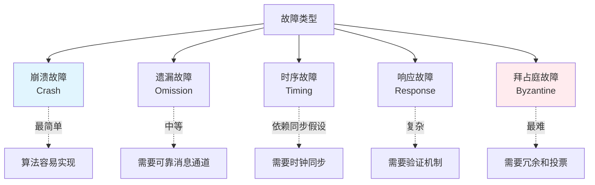

某公司运维团队在一次故障复盘中吵翻了天。

凌晨 2 点，系统出现短暂的"脑裂"——两个节点同时认为自己是主节点，各自处理了一批请求。DBA 说这是"网络抖动导致的 Paxos 脑裂"，定级为 P2。研发团队认为这是"不可接受的算法缺陷"，定级为 P1。

吵了两个小时，最后 CTO 拍板："先别吵。告诉我们，Paxos 论文里怎么定义这类故障的？"

没有人答得上来。

这次争议的根因，是对**故障模型**的理解不一致。不同的故障模型，对应不同的算法保证边界。你连故障模型都没定义清楚，就去评估 Paxos 的可靠性，这不是盲人摸象吗？

今天，我们把分布式系统里的六种故障模型系统讲清楚。

## 一、为什么需要故障模型？

### 1.1 先定义敌人，再谈策略

在分布式系统里，"故障"不是一个单一的词。节点可能崩溃、网络可能丢包、消息可能乱序、时钟可能漂移——每种故障的应对策略完全不同。

```
没有故障模型时：
  工程师：我们的系统很可靠！
  面试官：可靠到什么程度？节点崩溃了怎么办？网络分区呢？
  工程师：...我们有重试机制。

有故障模型后：
  工程师：我们在崩溃故障（Crash Failure）假设下保证活性。
  面试官：那拜占庭故障呢？
  工程师：不做保证，这是我们的设计边界。
```

**故障模型（Failure Model）** 定义了系统在什么假设下工作，以及超出这个假设时的行为边界。没有故障模型的系统设计，就像没有地图的航海——你不知道哪里是暗礁。

### 1.2 六种故障模型总览

分布式系统的故障可以从两个维度分类：

```
维度一：故障表现
  - 崩溃（Crash）：节点停止响应，不再发送任何消息
  - 遗漏（Omission）：节点能运行，但跳过了某些消息（发送遗漏或接收遗漏）
  - 时序（Timing）：响应超时，违反了时间假设
  - 响应（Response）：响应值错误或响应类型错误
  - 任意（Arbitrary）：节点行为完全不可预测，包括发送虚假消息

维度二：故障范围
  - 单点故障（1 个节点）
  - 多点故障（N 个节点）
```



## 二、六种故障模型详解

### 2.1 崩溃故障（Crash Failure）

**定义**：节点完全停止工作，不再发送或接收任何消息。这是所有故障模型中最简单的一种。

```
表现：
  节点 A 发生崩溃故障 →
  A 不再发送心跳 →
  其他节点检测到 A 不可达 →
  触发 Leader 选举或故障转移
```

崩溃故障的假设下，节点只有两种状态：**正常工作** 或 **已崩溃**。没有"半死不活"、"响应慢"、"行为异常"这些中间状态。

```java
// 崩溃故障检测：心跳机制
public class CrashDetector {
    private final Map<String, Long> lastHeartbeat = new ConcurrentHashMap<>();
    private final long timeoutMs = 5000;

    public void onHeartbeat(String nodeId) {
        lastHeartbeat.put(nodeId, System.currentTimeMillis());
    }

    public Set<String> detectCrashedNodes() {
        long now = System.currentTimeMillis();
        Set<String> crashed = new HashSet<>();

        for (Map.Entry<String, Long> entry : lastHeartbeat.entrySet()) {
            if (now - entry.getValue() > timeoutMs) {
                crashed.add(entry.getKey());
            }
        }
        return crashed;
    }
}
```

**典型场景**：Raft、Paxos 协议在崩溃故障假设下工作。只要崩溃的节点不超过多数派，系统依然可用。

:::tip 💡
Raft 论文明确假设崩溃故障（Crash Fault）。如果你在 Raft 集群里看到"拜占庭行为"（如节点返回错误结果），这不是 Raft 的设计目标——Raft 不保证在拜占庭故障下工作。
:::

### 2.2 遗漏故障（Omission Failure）

**定义**：节点能运行，但跳过了某些消息。分为**发送遗漏**（节点没发出消息）和**接收遗漏**（节点没收到消息）。

```
崩溃故障：
  节点 A → [没有任何消息] → 节点 B

遗漏故障：
  节点 A → [消息1] → 节点 B
  节点 A → [消息2（丢失）] → 节点 B
  节点 A → [消息3] → 节点 B
```

遗漏故障比崩溃故障更复杂——节点还活着，但消息丢了。

**与崩溃故障的区别**：

| 维度 | 崩溃故障 | 遗漏故障 |
| --- | --- | --- |
| 节点状态 | 彻底不工作 | 还在运行 |
| 消息行为 | 完全不发送 | 跳过某些消息 |
| 检测方式 | 心跳超时 | 需要确认+重试 |
| 算法复杂度 | 较低 | 较高（需要可靠通道）|

```java
// 遗漏故障处理：可靠消息通道
public class ReliableChannel {
    private final int maxRetries = 3;
    private final long retryDelayMs = 100;

    public boolean sendWithRetry(String nodeId, Message msg) {
        for (int attempt = 0; attempt < maxRetries; attempt++) {
            try {
                network.send(nodeId, msg);
                if (waitForAck(nodeId, msg.getId(), 1000)) {
                    return true; // 消息被确认
                }
            } catch (NetworkException e) {
                // 消息遗漏，等待后重试
                sleep(retryDelayMs);
            }
        }
        return false; // 重试耗尽
    }
}
```

**典型场景**：TCP 协议处理网络丢包，但 TCP 假设消息最终会到达。如果超过重试次数，TCP 也会放弃，此时变成崩溃故障。

### 2.3 时序故障（Timing Failure）

**定义**：节点的响应时间超出了预期范围。在同步系统模型中，这是主要故障类型。

```
时序正确：
  发送请求 → T=100ms → 收到响应

时序故障：
  发送请求 → T=5000ms（超时）→ 收到响应
  或者：
  发送请求 → T=∞（永远不响应）
```

时序故障比遗漏故障更微妙——消息可能最终到达，但**超时了**。在实时系统中，超时意味着"任务失败"，需要立即处理。

**超时设置的艺术**：

```java
// 时序故障处理：自适应超时
public class AdaptiveTimeout {
    // 基于历史数据动态调整超时
    private static final double RTT_ALPHA = 0.3;
    private static final double RTTVAR_ALPHA = 0.3;

    private double estimatedRTT = 1000; // 估计往返时间
    private double rttvar = 0;          // RTT 方差

    public void recordRTT(long actualRTT) {
        rttvar = RTTVAR_ALPHA * rttvar
               + RTT_ALPHA * Math.abs(actualRTT - estimatedRTT);
        estimatedRTT = RTT_ALPHA * estimatedRTT
                      + (1 - RTT_ALPHA) * actualRTT;
    }

    public long getTimeout() {
        // TCP 标准：timeout = estimatedRTT + 4 * rttvar
        return (long)(estimatedRTT + 4 * rttvar);
    }
}
```

:::warning ⚠️
时序故障检测依赖**同步假设**——你必须假设消息在某个最大延迟 `Δ` 内到达。如果系统是异步的（消息延迟无上限），时序故障检测是不可能的。这也是 FLP 不可能性定理的核心假设。
:::

### 2.4 响应故障（Response Failure）

**定义**：节点响应了，但响应的值是错误的，或者响应的类型是错误的。

```
值错误：
  请求：get_balance(account_id=1001)
  期望：返回账户余额
  实际：返回 null（值错误）

类型错误：
  请求：ping()
  期望：返回 pong
  实际：返回了系统日志（类型错误）
```

响应故障比前三种故障都难处理——节点还在工作，但**给出的答案是错的**。更难的是，你怎么判断"答案是错的"？

```java
// 响应故障处理：验证机制
public class ResponseVerifier {
    // 简单验证：校验和
    public boolean verifyChecksum(Message msg) {
        int expected = msg.getChecksum();
        int actual = computeChecksum(msg.getData());
        return expected == actual;
    }

    // 复杂验证：拜占庭协议（后面会讲）
    public boolean verifyByzantine(List<ReadResponse> responses, int f) {
        // 如果 f 个节点返回错误答案，
        // 2f+1 个节点中正确答案是多数派
        return responses.stream()
            .filter(this::isCorrectResponse)
            .count() > f;
    }
}
```

### 2.5 拜占庭故障（Byzantine Failure）

**定义**：节点的行为完全不可预测——它可能发送任意消息、跳过消息、发送矛盾消息、甚至假装正常。

这是最严重的故障类型。得名于"拜占庭将军问题"——多支军队围攻一座城市，将军们必须通过信使传递命令，但其中可能有叛徒（故障节点）传递假消息。

```
拜占庭故障的节点可能做：
  1. 说谎：发送与真实状态不符的消息
  2. 矛盾：对不同节点发送不同的消息
  3. 假装：假装正常响应，但返回错误结果
  4. 恶意：故意破坏一致性
  5. 任意：以上任意组合
```

**拜占庭容错（BFT）** 需要至少 `3f + 1` 个节点才能容忍 `f` 个故障节点。

```java
// 拜占庭将军问题：口信消息型
// n 个将军，其中 m 个是叛徒（拜占庭节点）
// 算法要求：n >= 3m + 1

public class ByzantineConsensus {
    private int f; // 可容忍的拜占庭节点数
    private int n; // 总节点数

    public ByzantineConsensus(int n, int f) {
        if (n < 3 * f + 1) {
            throw new IllegalArgumentException(
                "Need n >= 3f+1 for Byzantine fault tolerance");
        }
        this.n = n;
        this.f = f;
    }

    // PBFT（Practical Byzantine Fault Tolerance）的简化逻辑
    public boolean reachConsensus(String value) {
        // 1. Pre-prepare：主节点广播提议
        // 2. Prepare：所有节点互相通信，验证提议
        //    如果收到 >= 2f 个 Prepare 消息，节点进入 Prepared 状态
        // 3. Commit：进入 Prepared 状态的节点广播 Commit
        //    如果收到 >= 2f+1 个 Commit 消息，提交决议

        int prepareCount = collectPrepareMessages();
        int commitCount = collectCommitMessages();

        return prepareCount >= 2 * f + 1
            && commitCount >= 2 * f + 1;
    }
}
```

**为什么是 3f+1？**

```
容忍 f 个拜占庭节点：

消息总数 = n = f(坏) + 2f+1(好)

算法要求正确节点占多数派：
  正确节点数 > 拜占庭节点数
  2f+1 > f

所以 n = f + (2f+1) = 3f+1
```

:::warning ⚠️
拜占庭故障在大多数互联网系统中**不是主要威胁**。服务器节点运行的是经过测试的代码，不会"恶意发送假消息"。拜占庭故障的主要场景是：安全攸关系统（区块链、智能合约、航天控制）、多租户环境、或对抗性网络。给你的数据库加"拜占庭容错"是杀鸡用牛刀。
:::

### 2.6 任意故障（Arbitrary Failure）

**定义**：节点的行为与规范不符，但不一定是有意的。这涵盖了以上所有故障类型的组合。

任意故障是一个"兜底"类别——任何不符合预期的行为都可以归为任意故障。它比拜占庭故障范围更广（拜占庭是有意的恶意行为，任意故障可能是无意的 Bug）。

## 三、同步 vs 异步系统模型

### 3.1 三个系统模型

故障模型必须和**系统模型**结合起来理解。系统模型定义了消息传递的时间特性：

| 系统模型 | 消息延迟 | 时钟漂移 | 代表场景 |
| --- | --- | --- | --- |
| **同步** | 有界 `Δ` | 有界漂移 | 实时系统、有严格 SLA 的系统 |
| **异步** | 无上限 | 无限制 | 互联网应用、大多数分布式数据库 |
| **部分同步** | 最终有界 | 最终同步 | 实践中大多数系统 |

```
同步系统：
  消息延迟 <= Δ（已知上界）
  时钟漂移 <= ψ（已知上界）
  → 可以用超时可靠检测故障

异步系统：
  消息延迟无上限
  → 超时不能可靠区分"慢"和"死了"
```

### 3.2 为什么系统模型重要？

```
问题：在异步系统里，你能可靠地检测节点故障吗？

答案：不能。

原因：
  节点 A 发送心跳后无响应
  可能的原因：
    1. 节点 A 崩溃了
    2. 消息丢失了
    3. 节点 A 还在运行，只是很慢
    4. 网络分区了

  在异步系统里，你永远无法区分这四种情况
  → 超时只能"猜测"故障，不能"确定"故障
```

这就是 **FLP 不可能性定理** 的核心：如果系统是异步的，即使只有一个节点可能崩溃，**任何确定性共识算法都无法在有限时间内达成共识**。

【架构权衡】

**为什么大多数系统选择部分同步模型？**

1. **完全同步**过于理想——现实网络中消息延迟是变化的，不能保证恒定上界
2. **完全异步**过于悲观——FLP 定理证明了共识不可能，让系统无法工作
3. **部分同步**是务实选择：假设"系统最终会恢复同步"，用超时做故障检测，用重试做恢复

Raft/ZooKeeper 的超时机制、Cassandra 的 Gossip 协议，都基于部分同步假设。超时不是精确的故障检测，但在实践中足够有效。

## 四、FLP 不可能性定理

### 4.1 定理内容

1985 年，Fischer、Lynch 和 Paterson 发表了分布式系统领域的里程碑论文，证明了：

> **在异步系统模型下，如果至少有一个节点可能发生崩溃故障，那么任何确定性共识算法都无法同时满足以下两个性质：**
> - **安全性（Safety）**：所有正确节点最终达成相同的决定
> - **活性（Liveness）**：在有限时间内达成决定

```
简单理解：
  你不能既保证"永远不出错"，又保证"最终能出结果"

  在异步系统 + 可能有节点崩溃的前提下：
  → 要么放弃活性（可能永远等下去）
  → 要么放弃确定性（用随机化协议）
  → 不可能同时做到两者
```

### 4.2 为什么叫"不可能性"？

FLP 证明的不是"共识很难"，而是"共识在异步 + 崩溃故障下是严格不可能的"。

```
证明的核心思想（简化版）：

1. 假设存在一个算法 A 能在异步系统下达成共识
2. 构造一个"两难"初始状态 S
3. 在这个状态下，无论收到什么消息，算法 A 都会陷入"不可决定"状态
4. 由于消息顺序可以任意（异步系统），攻击者可以选择让 A 陷入 S
5. 矛盾 → 不存在这样的算法
```

:::tip 💡
FLP 定理说的是"确定性共识算法"无法同时保证安全性和活性。但"随机化共识算法"（如 Randomized Consensus）可以绕过这个限制——通过抛硬币决定，打破对称性，打破"两难"状态。
:::

## 五、故障检测与恢复机制

### 5.1 故障检测

**心跳检测（Heartbeat）**：

```java
public class HeartbeatFailureDetector {
    private final ScheduledExecutorService scheduler =
        Executors.newScheduledThreadPool(1);
    private final Map<String, AtomicLong> lastHeartbeat = new ConcurrentHashMap<>();
    private final long phi = 8; // 检测敏感度

    public void start(Node node) {
        // 发送心跳
        scheduler.scheduleAtFixedRate(() -> {
            network.broadcast(new Heartbeat(localNodeId));
        }, 0, 100, TimeUnit.MILLISECONDS);

        // 处理心跳响应
        scheduler.scheduleAtFixedRate(() -> {
            for (String peer : peers) {
                long delay = computeDelay(peer);
                long phiValue = calculatePhi(delay);
                if (phiValue > phi) {
                    markSuspected(peer);
                }
            }
        }, 0, 100, TimeUnit.MILLISECONDS);
    }

    // Phi Accrual Detector（Swim 使用的）
    private double calculatePhi(long currentDelay) {
        double mean = history.getMean();
        double variance = history.getVariance();
        double sd = Math.sqrt(variance);

        // Φ = -log10(1 - CDF(delay))
        return -Math.log10(1 - normalCDF(currentDelay, mean, sd)) / Math.log10(10);
    }
}
```

**Gossip 协议检测（Cassandra 风格）**：

```java
public class GossipFailureDetector {
    private final Map<String, GossipState> state = new ConcurrentHashMap<>();

    // 每秒执行一次
    public void gossip() {
        // 1. 选择一个随机节点交换信息
        String target = randomPeer();
        Map<String, EndpointState> delta = collectLocalState();

        // 2. 交换并合并状态
        Map<String, EndpointState> remoteState = exchange(target, delta);
        mergeState(remoteState);

        // 3. 标记超时节点
        markOverdueNodes();
    }

    // 故障判定：超过阈值没更新
    public boolean isAlive(String nodeId) {
        GossipState gs = state.get(nodeId);
        if (gs == null) return false;

        long sinceLastUpdate = System.currentTimeMillis() - gs.getLastUpdateTime();
        return sinceLastUpdate < failureTimeoutMs;
    }
}
```

### 5.2 故障恢复

```
崩溃恢复流程：

T0: 节点 A 崩溃
T1: 心跳超时 → 标记为疑似崩溃
T2: Raft 触发 Leader 选举 → 节点 B 成为新 Leader
T3: 节点 A 重启
T4: 节点 A 从 Leader 同步错过的日志
T5: 节点 A 恢复正常
```

```java
// 崩溃恢复后的日志同步
public class LogRecovery {
    public void recover(Node node) {
        // 1. 从 Leader 获取最新的 commitIndex
        long commitIndex = fetchCommitIndexFromLeader(node.leaderId);

        // 2. 补全本地缺失的日志
        List<LogEntry> missingEntries =
            fetchMissingEntries(node.id, node.lastLogIndex);

        for (LogEntry entry : missingEntries) {
            appendEntry(entry);
        }

        // 3. 应用到状态机
        applyToStateMachine(commitIndex);

        // 4. 恢复正常服务
        node.setState(NodeState.FOLLOWER);
    }
}
```

## 六、Chaos Engineering 的理论基础

### 6.1 故障注入测试

故障模型是 Chaos Engineering 的理论基础。你注入的每一种故障，都对应一个故障模型假设。

```
Chaos Monkey（Netflix）：
  注入：随机终止节点
  故障模型：崩溃故障（Crash）

Chaos Kong（Netflix）：
  注入：随机关闭整个机房
  故障模型：网络分区（分区侧视为崩溃）

Pod Failure（Kubernetes）：
  注入：随机删除 Pod
  故障模型：崩溃故障

Latency Injection：
  注入：增加网络延迟
  故障模型：时序故障（Timing）
```

### 6.2 故障注入矩阵

| 注入类型 | 对应故障模型 | 验证目标 |
| --- | --- | --- |
| 随机杀进程 | 崩溃故障 | 故障检测 + 自动恢复 |
| 网络延迟 | 时序故障 | 超时配置合理性 |
| 网络丢包 | 遗漏故障 | 重试机制有效性 |
| 数据损坏 | 拜占庭故障 | 校验机制有效性 |
| 资源耗尽 | 时序 + 崩溃 | 限流 + 熔断有效性 |
| 时钟偏移 | 时序故障 | 依赖时钟的逻辑健壮性 |

```yaml
# Chaos Mesh 故障注入配置示例
apiVersion: chaosmesh.com/v1alpha1
kind: NetworkChaos
metadata:
  name: network-partition
spec:
  action: partition  # 网络分区
  mode: one
  selector:
    namespaces:
      - production
  # 模拟故障模型：网络分区（拜占庭故障的子集）
  direction: both
  target:
    mode: one
    selector:
      namespaces:
        - production
        - backup
```

## 七、生产避坑

### 7.1 坑一：在拜占庭环境中运行非 BFT 算法

```
错误认知：
  "我的系统用了 Raft，很安全，不会出错。"

现实：
  Raft 假设崩溃故障（Crash Failure）
  如果有节点返回错误数据（拜占庭行为）
  Raft 不会处理，甚至可能被错误数据误导

正确认知：
  重要数据用 Raft（崩溃故障假设）
  极高安全性用 PBFT/链式 BFT（拜占庭故障假设）
  接受相应的算法复杂度和性能代价
```

### 7.2 坑二：混淆系统模型与故障模型

```
错误认知：
  "我们的系统是异步的，但 Raft 能保证一致性。"

现实：
  Raft 在崩溃故障 + 部分同步假设下保证活性和安全性
  如果系统变成完全异步（消息延迟无上限）
  Raft 的超时机制失效，可能永远选不出 Leader
  → 此时 Raft 不保证活性

正确认知：
  了解你使用的算法在什么系统模型下工作
  生产环境监控网络延迟，防止系统滑入"异步陷阱"
```

### 7.3 坑三：忽略故障检测的假阳性

```
问题：
  超时设置为 1s，但在高峰期网络延迟 2s
  → 正常节点被误判为崩溃
  → 触发不必要的故障转移
  → 新的 Leader 选举导致短暂不可用

解决：
  - 使用自适应超时（基于历史 RTT）
  - 监控超时误判率
  - 在高峰期临时延长超时阈值
```

## 八、工程代价评估

| 故障模型 | 算法复杂度 | 节点要求 | 适用场景 |
| --- | --- | --- | --- |
| 崩溃故障 | 低 | `2f + 1` | 大多数分布式数据库（Raft/Paxos）|
| 遗漏故障 | 中 | `2f + 1` | 可靠消息传递系统 |
| 时序故障 | 中 | 依赖时钟同步 | 实时系统、传感器网络 |
| 响应故障 | 高 | `2f + 1` | 有数据验证的系统 |
| 拜占庭故障 | 极高 | `3f + 1` | 区块链、航天控制、多方协作 |

【架构权衡】

选什么故障模型，不是技术问题，是**业务风险决策**：

1. **崩溃故障**是大多数系统的选择：算法成熟、实现简单、协议高效。Raft、Multi-Paxos 都基于这个假设。
2. **拜占庭故障**只在必要时使用：算法复杂（PBFT 是 Raft 的 5 倍消息量）、性能差（`O(n²)` 消息复杂度）、运维成本高。
3. **切忌"高配低用"**：给一个博客系统加拜占庭容错，就像用航空母舰运快递——成本爆炸，但没有收益。

回到文章开头那个吵架的场景。如果运维团队在设计系统时明确定义了"我们只处理崩溃故障，超过 `f` 个节点崩溃时服务降级"，那就不会有"为什么 Paxos 会脑裂"这种争议了——因为 Paxos 在崩溃故障假设下根本不保证分区时的行为。
