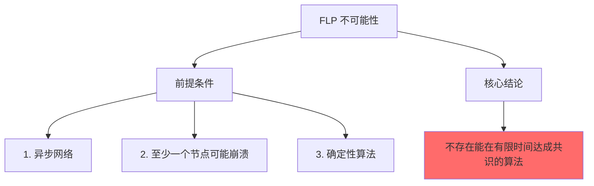
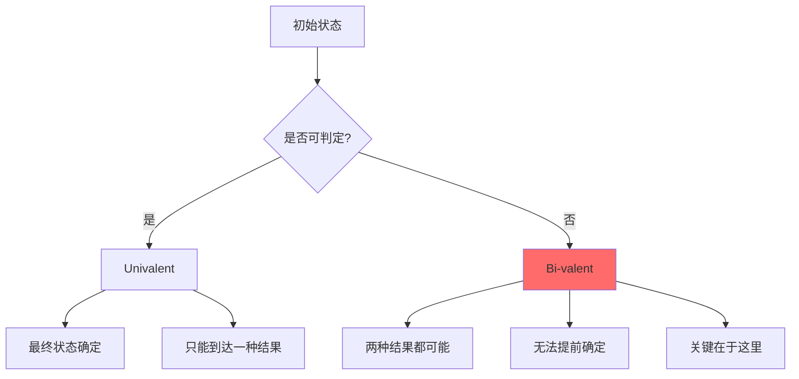
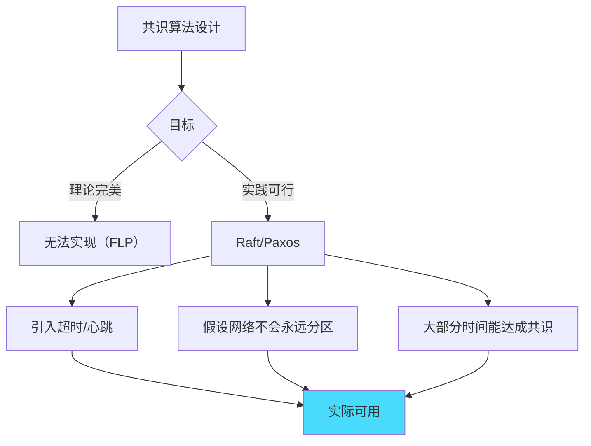

# FLP 不可能性：分布式共识的数学边界

## 快速自测：面试官最关心的 3 个问题

> 🟢 **低频了解**，P7 架构设计面试可能问

1. **FLP 不可能性定理是什么？它证明了什么结论？**
2. **FLP 定理的三个前提假设是什么？为什么这些假设是必要的？**
3. **既然 FLP 证明了不可能，为什么 Raft/Paxos 能工作？**

---

## 一、FLP 定理的背景

### 1.1 定理来源

FLP 不可能性定理由 Fischer、Lynch 和 Paterson 于 1985 年提出，是分布式系统理论的重要里程碑。

```
论文标题：Impossibility of Distributed Consensus with One Faulty Process
作者：Michael J. Fischer, Nancy A. Lynch, Michael J. Paterson
发表：1985 年 PODC 会议
```

### 1.2 核心结论

```
FLP 定理（简化版）：
在异步网络中，如果至少有一个节点可能崩溃，
则不存在确定性算法能保证在有限时间内达成共识。

换句话说：
只要有可能崩溃，就不可能有完美的共识算法。
```



---

## 二、FLP 定理的三个前提

### 2.1 前提一：异步网络

**假设**：消息延迟没有上限，节点无法区分「消息丢失」和「消息延迟」。

```
异步网络的问题：
1. 无法用超时来判断节点是否崩溃
2. 节点无法确定对方是否还活着
3. 算法不能依赖时间假设
```

### 2.2 前提二：至少一个崩溃故障

**假设**：至少有一个节点可能崩溃停止工作。

```
崩溃故障模型：
1. 崩溃的节点不再发送消息
2. 不发送恶意或错误消息
3. 只是停止响应

注意：
- 不是拜占庭故障（不发送错误消息）
- 只是简单的停止
```

### 2.3 前提三：确定性算法

**假设**：算法必须是确定性的，不能依赖随机性。

```
确定性的含义：
1. 相同输入 → 相同输出
2. 没有随机数或掷硬币
3. 算法行为完全由输入决定
```

---

## 三、为什么 FLP 是正确的

### 3.1 反证法思路

FLP 的证明采用反证法：

```
1. 假设存在一个算法 A 能在异步网络中达成共识
2. 证明当有节点崩溃时，A 可能无法正常工作
3. 构造一个特定的执行场景（bivalent configuration）
4. 在这个场景下，无论算法如何选择，都无法达成共识
5. 因此假设矛盾，原命题成立
```

### 3.2 二值共识与多值共识

FLP 证明的是**二进制共识**（二值共识）的不可实现：

```
二值共识：
- 节点需要决定是 0 还是 1
- 所有节点必须达成相同的决定

注意：
- 多值共识同样不可实现
- 因为多值共识可以简化为二值共识
```

### 3.3 两类不可判定的场景



---

## 四、FLP 的实际影响

### 4.1 FLP 告诉我们「不能做什么」

```
FLP 的实际意义：

1. 不存在完美的共识算法
   - 任何算法在异步网络中都可能在某些场景下无法终止

2. 必须在「确定性终止」和「正确性」之间权衡
   - 要么接受不确定的终止时间
   - 要么在某些情况下可能返回错误结果

3. 但实践中我们有解决方案
```

### 4.2 突破 FLP 的方法

| 方法 | 说明 | 突破原理 |
|------|------|----------|
| **随机算法** | 引入随机性 | 违反「确定性」前提 |
| **超时机制** | 引入时间假设 | 违反「异步」前提 |
| **强同步假设** | 网络延迟有上限 | 违反「异步」前提 |
| **部分同步** | 大多数时候同步 | 放宽同步假设 |

### 4.3 随机共识算法

**代表**：Ben-Or 的随机共识算法

```java
// 随机共识的简化实现
public class RandomConsensus {
    
    public int decide(int myValue, int round) {
        // 每一轮，随机选择是否上报自己的值
        if (random.nextBoolean()) {
            broadcast(PROPOSE, myValue);
        }
        
        // 等待消息或超时
        waitForMessagesOrTimeout();
        
        // 根据收集到的值决定
        if (receivedValues.size() > threshold) {
            return majority(receivedValues);
        } else {
            return random.nextBoolean() ? 0 : 1; // 随机决定
        }
    }
}
```

---

## 五、FLP 与 Raft/Paxos 的关系

### 5.1 为什么 Raft/Paxos 能工作

**关键**：Raft/Paxos 不违反 FLP，而是**放宽了假设**。

```
Raft/Paxos 的妥协：

1. 引入超时机制
   - 假设网络延迟不会无限长
   - 虽然违反异步假设，但这是实际可行的
   
2. 不保证确定性终止
   - 如果网络持续分区，算法可能永远不会终止
   - 但在实际网络中，这种情况很少发生
   
3. 依赖「大多数情况下网络正常」
   - 在正常情况下，算法能够终止
   - 异常情况通过 human intervention 处理
```

### 5.2 实践中的处理方式



---

## 六、面试题精讲

### 🟡 面试题 1：FLP 不可能性定理是什么？

**答案要点**：

1. **定义**：在异步网络中，如果至少有一个节点可能崩溃，则不存在确定性算法能保证在有限时间内达成共识
2. **核心**：完美共识算法不存在
3. **意义**：明确了分布式共识的数学边界

**追问链**：

> **第一层**：FLP 定理的核心结论是什么？
> **第二层**：FLP 的三个前提假设是什么？
> **第三层**：既然 FLP 证明了不可能，为什么 Raft/Paxos 能工作？

### 🟢 面试题 2：如何突破 FLP 的限制？

**答案要点**：

1. **引入随机性**：Ben-Or 随机共识算法
2. **引入时间假设**：超时机制
3. **放宽假设**：允许不确定的终止时间

---

## 七、实战思考题

### 思考题 1：区块链的共识算法

比特币的 PoW 和以太坊的 PoS 是如何突破 FLP 的限制的？

### 思考题 2：FLP 与 CAP 的关系

FLP 定理和 CAP 定理有什么关系？它们是否矛盾？

---

## 扩展阅读

如果本文档对你有帮助，建议继续阅读：

- [故障模型](/distributed/theory/failure-models)：分布式系统的故障类型
- [CAP 定理](/distributed/theory/cap)：CAP 与 FLP 的关系
- [Paxos 共识](/distributed/transaction/2pc)：实用的共识算法