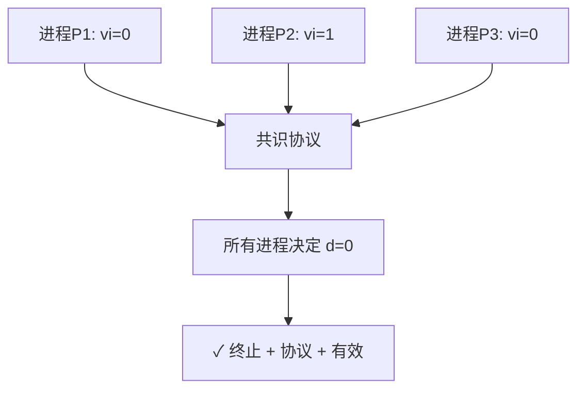
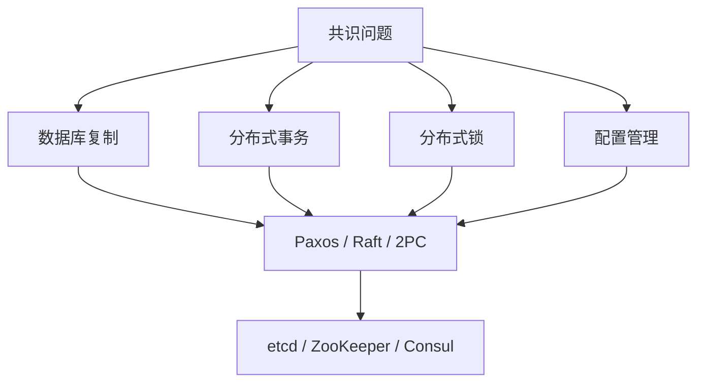
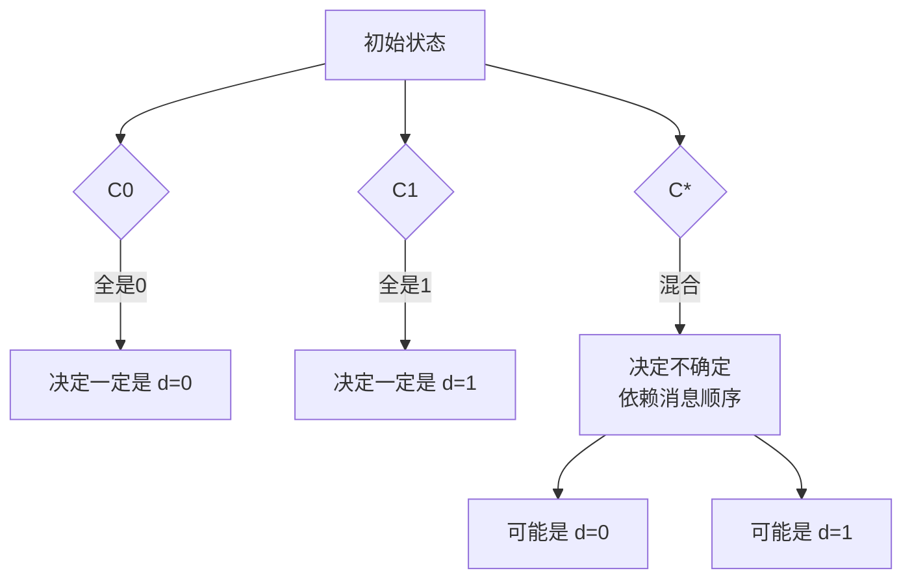
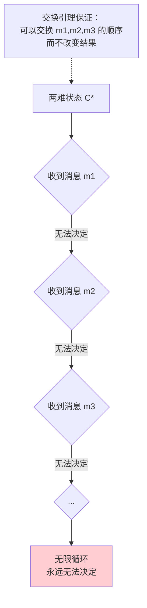
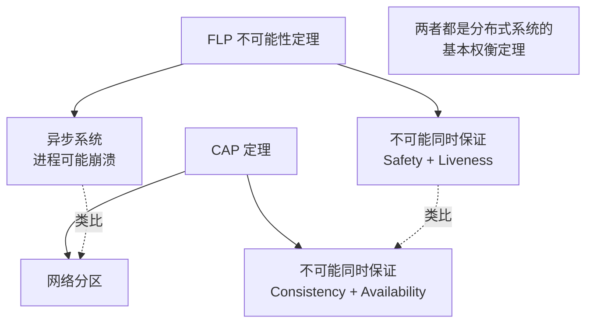

架构评审会上，激烈讨论正在进行。

有人抛出灵魂拷问："Paxos 和 Raft 都号称能解决共识问题，那是否存在一个更完美的共识算法，能在所有情况下都既保证安全、又保证活性？"

沉默了几秒，有人说："FLP 定理说不可能。"

"什么 FLP？"

"1985 年有个定理证明了，异步系统下共识不可能。"

"那为什么我们还在用 Paxos 和 Raft？它们不是异步的吗？"

没人答得上来。

FLP 定理是分布式系统领域最深邃的理论结果之一。它不是告诉你"共识很难"，而是告诉你"在异步系统下，即使只有一个节点可能崩溃，共识在数学上就是不可能的"。

今天，我们把这个定理从数学迷雾里捞出来，用直观的方式让你理解它的证明思路和工程意义。

## 一、问题背景：共识是什么？

### 1.1 共识问题的定义

共识（Consensus）问题是分布式系统中最核心的问题之一。一个共识协议需要满足三个性质：

```
共识问题（Consensus Problem）：

输入：n 个进程，每个进程有一个初始值 vi
目标：所有正确进程最终达成相同的决定 d

共识协议必须满足：

1. 终止性（Termination / Liveness）：
   所有正确进程最终都会做出决定

2. 协议性（Agreement / Safety）：
   所有正确进程做出的决定相同

3. 有效性（Validity）：
   决定的值必须是某个进程的初始值
```



这三个性质看起来很朴素——不就是"大家商量一个值，然后达成一致"吗？但 FLP 证明的是：在某些条件下，这个朴素的需求是**不可能实现**的。

### 1.2 为什么共识重要？

共识是分布式系统大厦的基石：

```
共识问题 → 隐含在无数分布式场景中：

  数据库主从复制 → 需要对"谁是主"达成共识
  分布式事务提交 → 需要对"是否提交"达成共识
  分布式锁 → 需要对"谁持有锁"达成共识
  配置变更同步 → 需要对"配置版本"达成共识
  分布式队列 → 需要对"消息顺序"达成共识
```



## 二、FLP 定理的系统模型

### 2.1 异步系统模型

FLP 定理建立在**异步系统模型**上。这是关键假设：

```
异步系统模型（Asynchronous System）：

1. 消息延迟无上限
   → 你不能通过"等多久"来判断节点是否崩溃
   → 超时只能猜测，不能确定

2. 时钟漂移无限制
   → 节点不能依赖本地时钟做决策
   → 逻辑时钟可以，物理时钟不行

3. 进程速度无保证
   → 进程可能随时停止（崩溃）
   → 停止多久也不知道
```

```
现实中的类比：

异步系统就像一个"邮政系统"：
  - 信件可能永远不到（消息丢失）
  - 信件可能延迟数年（消息延迟无上限）
  - 你不知道送信人是否还活着（进程是否崩溃）

在这种情况下，你怎么和远方的人"达成共识"？
  → 你不能确定对方是否收到了你的消息
  → 你不知道是否应该重试
  → 你甚至不知道对方是否还"在"
```

### 2.2 消息传递系统

FLP 论文假设的是**消息传递**（Message Passing）模型，而非共享内存模型。

```
两个进程 P1 和 P2 通过消息传递通信：

P1: send(msg) → [网络] → recv() ← P2

如果网络是可靠的（不丢消息）：
  → 如果 P2 崩溃了，P1 发出的消息永远无人接收
  → P1 不知道 P2 是"慢了"还是"死了"

这就是异步系统的核心困境：
  无法区分"慢"和"死了"
```

## 三、FLP 定理的核心证明思路

### 3.1 关键引理：交换引理（Swapping Lemma）

FLP 的证明非常精巧，但核心思想可以概括为一个关键引理：

> **在初始状态 I 中，如果进程收到消息 m 后会做决定，那么一定存在另一个初始状态 I'（只是某个进程的初始值不同），使得在 I' 中，即使不收到消息 m，进程也会做相同的决定。**

```
这个引理的意思：

假设在某个状态 S 下：
  进程 P 收到了消息 M
  P 看了 M 后决定 d

那么一定存在另一个状态 S'：
  P 根本没收 M
  但 P 还是决定 d

→ 消息 M 对决定 d 是"无关紧要的"
→ 进程的决定只取决于它的初始状态和"知道什么"
```

这个引理的直观含义是：**在共识协议中，消息的"到达顺序"可以影响结果，但有些消息的作用是可以被"交换"的**。

### 3.2 构造"两难"初始状态

FLP 证明的第一步是构造一个特殊的初始状态：

```
两难初始状态（bivalent initial configuration）：

假设有两个初始状态：
  - C0：所有进程初始值都是 0，最终决定 d=0
  - C1：所有进程初始值都是 1，最终决定 d=1

两难状态 C*：
  - 既有进程初始值为 0，也有进程初始值为 1
  - 在这种状态下，协议的"最终决定"是不确定的
  - 可能是 d=0，也可能是 d=1，取决于消息顺序
```



**为什么两难状态存在？**

```
证明（反证法）：

1. 假设对于任意初始状态，最终决定都是确定的
2. 考虑 n=2 的最简情况
3. 进程 P1 的初始值为 0 或 1，进程 P2 的初始值为 0 或 1
4. 存在 4 种初始状态

如果初始状态 A 和 B 只有 P1 的初始值不同（0 vs 1），
但最终决定相同（都是 d=0），则这两个状态之间必然存在一个
"两难状态"——因为协议必须连续地从一个决定跳到另一个决定。

这个两难状态就是 FLP 证明的关键。
```

### 3.3 核心证明：两难状态不可逃脱

现在到了 FLP 证明最精彩的部分。FLP 证明了：

> **在一个两难初始状态中，无论收到什么消息，协议都无法在有限步内做出决定。**

```
证明步骤：

1. 假设当前在两难状态 C*
2. 协议收到了一个消息 m
3. 在两难状态下，收到 m 后协议仍然无法决定（否则证明完毕）
4. 我们证明：存在一个消息 m'，使得收到 m' 后协议也仍然无法决定
5. 通过反复应用这个论证，我们可以构造一个无限的消息序列
6. 协议永远无法做出决定

这个证明的核心依赖交换引理：
  交换引理保证了我们可以在不改变最终结果的前提下，
  任意交换消息的顺序。
```



### 3.4 定理证明的完整逻辑链

```
FLP 定理完整证明：

前提：
  - 异步系统（消息延迟无上限）
  - 至少有一个进程可能崩溃
  - 确定性共识协议

论证：
  1. 初始状态空间一定包含两难状态（bivalent state）
     → 否则存在一个"决定边界"，可以区分不同初始状态

  2. 在两难状态 C* 下，无论收到什么消息 m：
     - 协议不能立即决定（否则两难状态不是两难的）
     - 协议进入新状态 C'，且 C' 仍然是两难的
     → 证明基于交换引理和两难状态的定义

  3. 反复应用第 2 步，可以构造无限的消息序列
     → 协议永远不会做出决定

  4. 与 Liveness（活性）矛盾

结论：
  不存在同时满足 Safety 和 Liveness 的确定性共识算法
```

## 四、工程意义：为什么 Raft/Paxos 还能工作？

### 4.1 FL0P 定理说的是"同时保证"

FLP 定理说的是：在异步系统模型下，**任何确定性共识算法都无法同时保证 Safety 和 Liveness**。

但注意，它不是说：
- Safety 不可能保证
- Liveness 不可能保证
- 共识完全不可能

它说的是：**不能同时保证两者**。

```
在实践中，有三种妥协方式：

方式一：放弃 Liveness → 阻塞共识
  例：2PC 在协调者崩溃时会阻塞
  → Safety 保证了（不会做出错误的决定）
  → Liveness 丢失了（可能永远阻塞）

方式二：放弃确定性 → 随机化共识
  例： Randomized Consensus（Ben-Or, 1983）
  → 通过抛硬币打破对称性
  → Safety 保证了
  → Liveness 以概率 1 保证（期望有限时间内决定）
  → 问题：实际性能差，消息复杂度高

方式三：改变系统模型 → 引入超时（部分同步）
  例：Raft、Paxos
  → 假设"网络最终会恢复同步"
  → 在大多数情况下保证 Safety + Liveness
  → 极端异步情况下可能失去 Liveness（但这种情况极罕见）
```

### 4.2 Raft 如何绕过 FLP 的？

```java
// Raft 的领导人选举
public class RaftLeaderElection {
    // Raft 使用随机超时来打破"两难"状态
    // 这是将"确定性协议"变成"准随机化协议"的技巧

    private final int electionTimeoutMin = 150;  // ms
    private final int electionTimeoutMax = 300;  // ms

    public void onElectionTimeout() {
        // 随机超时打破了对称性
        // 如果所有节点的超时相同，可能同时发起选举 → 活锁
        // 随机超时使得"谁先发起"变得不确定
        int timeout = random(electionTimeoutMin, electionTimeoutMax);

        // 成为 Candidate，发起选举
        currentState = State.CANDIDATE;
        currentTerm++;
        voteFor = myId;

        // 发送 RequestVote 给所有节点
        broadcastRequestVote(currentTerm, lastLogIndex, lastLogTerm);
    }
}
```

**Raft 解决活锁的技巧：随机化超时**

```
场景：三个节点 A、B、C 都超时了，同时发起选举

如果超时相同：
  A、B、C 同时发 RequestVote
  → 没有人拿到多数票
  → 重新等待超时，再同时发起
  → 活锁！

Raft 的解法：
  A 超时 = 150ms → 第一个发起选举
  B 超时 = 200ms → 第二个
  C 超时 = 250ms → 第三个

A 发起选举时，B 和 C 还在等待
→ A 有机会拿到多数票成为 Leader
→ 活锁被打破
```

### 4.3 Paxos 如何绕过 FLP 的？

```
Paxos 的 Multi-Paxos 引入了一个关键假设：

"Acceptor 接受第一个收到的提案"

这个规则创造了一个"不可逆"的状态：
  一旦多数派 Acceptors 接受了同一个提案
  → 后续的提案必须"尊重"这个决定
  → 打破了两难状态的对称性

但 Paxos 的活性仍然依赖"消息最终到达"：
  如果 Proposer 发送的 Prepare 请求恰好丢失
  → 新的 Proposer 可能提出冲突的提案
  → 需要新的 Prepare 轮次
  → 在极端异步情况下，可能无限循环
```

【架构权衡】

**FLP 定理的实际影响**：

1. **它不是一个"会立即发作"的问题**：FLP 条件（极端异步 + 恰好一个崩溃 + 特定消息顺序）在实践中几乎不会同时发生。Raft 和 Paxos 在 99.99% 的情况下都能正常工作。

2. **它的意义是理论上的**：它告诉我们"完美的共识算法不存在"，让我们理解了共识的本质限制。这比"不知道"要好得多。

3. **工程上通过妥协来实用化**：Raft/Paxos 牺牲了"在所有情况下都保证 Liveness"，换来了"在绝大多数情况下高效工作"。这是务实的工程选择。

## 五、FLP 定理的推论与实际工程

### 5.1 推论一：共识算法必须在某处"引入随机性"

```
FLP → 确定性协议无法同时保证 Safety + Liveness

结论：实用的共识算法必须满足以下至少一条：

1. 引入随机化（如 Randomized Consensus）
   → 以概率保证活性

2. 引入同步假设（如 Raft/Paxos 的超时）
   → 以"假设最终会同步"换取活性

3. 放弃确定性（如协调者选择规则）
   → 以"选择规则"打破对称性
```

### 5.2 推论二：CAP 定理是 FLP 的兄弟

```
FLP 定理和 CAP 定理说的其实是同一件事：

FLP（1985）：
  异步系统 + 消息延迟无上限
  → 不可能同时保证 Safety + Liveness

CAP（2000）：
  分布式系统 + 网络分区
  → 不可能同时保证 Consistency + Availability

两者都揭示了分布式系统的基本权衡：
  在"完美的环境假设"下，某些目标是互斥的

FLP 从"进程可能崩溃"的角度论证
CAP 从"网络可能分区"的角度论证

本质上都是：
  "你不可能既要...又要..."
```



### 5.3 推论三：区块链的共识创新

```
传统分布式系统（FLP 的影响范围）：
  - Raft / Paxos / Zab → 解决崩溃故障下的共识
  - 依赖部分同步假设
  - 不保证在极端异步情况下工作

区块链（试图突破 FLP）：
  - PoW（工作量证明）：引入经济激励 + 随机数
  - PoS（权益证明）：引入代币抵押 + 随机出块
  - PBFT（实用拜占庭容错）：牺牲规模换取 BFT

但区块链真的突破了 FLP 吗？
  → 没有
  → PoW 的安全性建立在"攻击者拥有不到 50% 算力"的前提下
  → PBFT 需要 n >= 3f+1，和传统 BFT 一样

区块链的创新不是"突破 FLP"
  而是"在 FLP 的约束下，通过经济机制设计激励正确行为"
```

## 六、生产避坑

### 6.1 坑一：认为 Raft/Paxos 能解决所有一致性需求

```
错误认知：
  "我们用了 Raft，所以数据一定一致。"

FLP 的教训：
  Raft 在部分同步假设下保证 Safety + Liveness
  如果系统退化为完全异步（如极端网络分区）
  Raft 可能失去 Liveness（选不出 Leader）
  → 系统"卡住"但不"出错"

正确认知：
  Raft 保证的是"做对了"（Safety）
  但不保证"一定能做完"（Liveness 在极端情况下可能丢失）
  对于金融核心链路，还需要额外的容错措施
```

### 6.2 坑二：在高延迟网络上部署 Raft/Paxos

```
问题：

网络延迟从 10ms → 500ms：
  → 原本 150ms 的选举超时不够了
  → 频繁触发新的选举
  → 集群不稳定

FLP 的视角：
  高延迟网络接近"异步系统"
  在异步系统中，FLP 告诉我们 Liveness 可能无法保证
  → Raft 的选举机制失效

解决：
  - 调整选举超时 >= 10 * 平均 RTT
  - 使用网络质量监控，及时告警延迟异常
  - 在跨地域部署时，考虑用 AP 架构（如 DynamoDB）而非 CP
```

```java
// 动态调整 Raft 超时
public class AdaptiveRaftConfig {
    // 传统静态配置
    // private static final int ELECTION_TIMEOUT = 300;

    // 动态配置（基于实际 RTT）
    public long getElectionTimeout() {
        // Raft 论文建议：选举超时 > 心跳间隔 * 5
        // 同时要考虑网络 RTT
        long heartbeatInterval = 50;  // ms
        long avgRtt = monitor.getAverageRTT();
        long safetyMargin = 10 * avgRtt;

        // 选举超时 = 基础值 + 安全边际
        return Math.max(150, heartbeatInterval * 5 + safetyMargin);
    }

    public long getHeartbeatInterval() {
        return Math.min(50, getElectionTimeout() / 5);
    }
}
```

### 6.3 坑三：混淆 Safety 和 Liveness 的优先级

```
业务场景分析：

场景1：金融核心账务
  → Safety 优先：宁可卡住，不能出错
  → Raft/Paxos 合适

场景2：社交 Feed
  → Availability 优先：宁可展示旧数据，不能不可用
  → DynamoDB/Cassandra 的 AP 架构更合适

场景3：秒杀下单
  → 两者都重要，需要精细权衡
  → 可能需要"强一致读 + 异步复制"的混合方案
```

## 七、工程代价评估

| 维度 | Raft/Paxos | Randomized Consensus | 2PC |
| --- | --- | --- | --- |
| Safety 保证 | ✅ 始终保证 | ✅ 以概率保证 | ✅ 始终保证 |
| Liveness 保证 | ⚠️ 部分同步下保证 | ✅ 以概率保证 | ❌ 协调者崩溃会阻塞 |
| 性能 | 高 | 低 | 中 |
| 消息复杂度 | `O(N)` | `O(N²)` | `O(N)` |
| 算法复杂度 | 中 | 高 | 低 |
| 适用场景 | 强一致存储 | 理论模型 | 分布式事务 |

【架构权衡】

FLP 定理告诉我们：**在分布式系统中，没有银弹**。

共识算法必须在 Safety 和 Liveness 之间权衡：

1. **强 Safety + 最终 Liveness**（Raft/Paxos）：大多数分布式数据库的选择。牺牲"极端异步下的活性"，换取"绝大多数情况下的高性能"。

2. **概率 Safety + 概率 Liveness**（Randomized Consensus）：理论意义大于实践意义。消息复杂度高，实际系统很少用。

3. **强 Safety + 无 Liveness**（2PC）：XA 事务的选择。协调者崩溃时系统阻塞，但不会做出错误的决定。

FLP 定理是分布式系统领域的"基础限制"。理解它不是为了绕开它，而是为了知道：**在这个约束下，什么是可能的，什么是不可能的，以及为什么**。

理解 FLP 的工程师，知道共识算法的边界在哪里，能在选型和设计时做出更清醒的决策。
