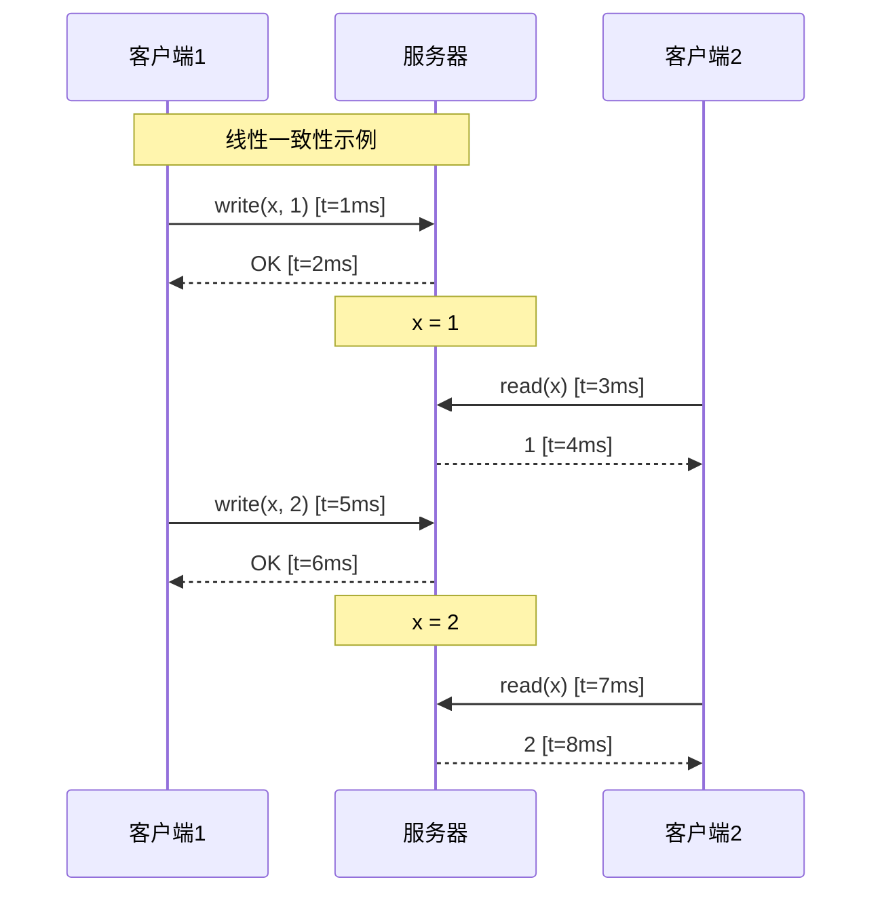
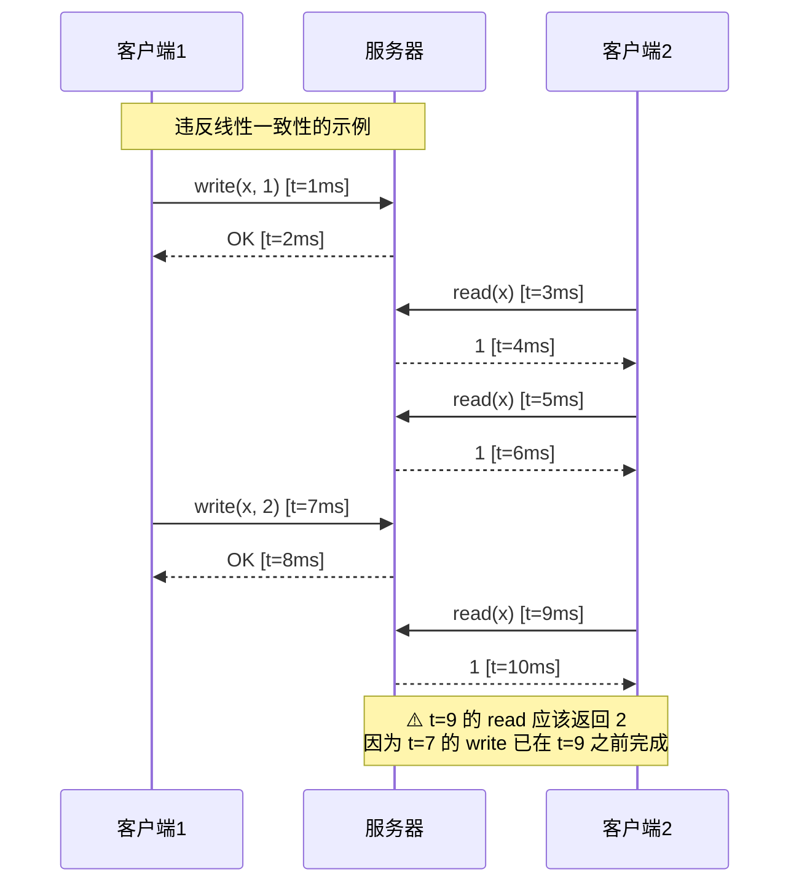
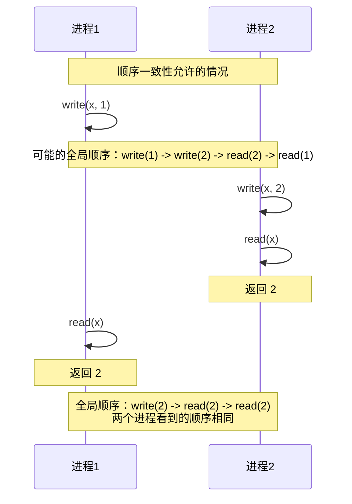
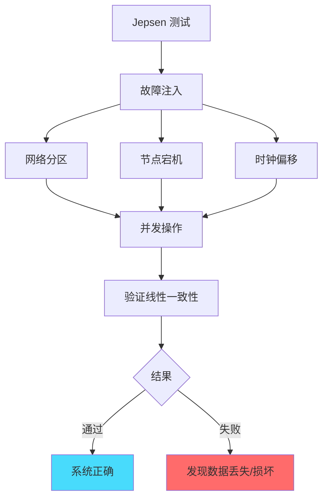
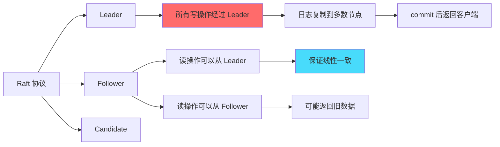

# 线性一致性与顺序一致性：最强的一致性保证

## 快速自测：面试官最关心的 3 个问题

> 🔴 **高频必考**，P7 架构设计面试常问

1. **线性一致性和顺序一致性的定义是什么？两者有什么区别？**
2. **如何用 Jepsen 测试验证一个系统是否满足线性一致性？**
3. **ZooKeeper/etcd/Raft 是线性一致性还是顺序一致性？为什么？**

---

## 一、线性一致性（Linearizability）

### 1.1 定义

线性一致性是最强的一致性模型，由 Maurice Herlihy 和 Jeannette Wing 于 1990 年提出。核心要求：

1. **原子性**：所有操作像在一个时间点完成
2. **实时性**：读操作必须看到最新写入的结果
3. **全局顺序**：所有节点看到相同的操作顺序

```
线性一致性的直观理解：
- 系统像只有一个节点
- 所有操作按真实时间顺序执行
- 任何读操作都能看到最近一次写入的结果
```

### 1.2 线性一致性的时序图



**关键点**：t=3 的 read 必须在 t=5 的 write 之前返回，因为 t=3 `<` t=5。

### 1.3 线性一致性的反例



---

## 二、顺序一致性（Sequential Consistency）

### 2.1 定义

顺序一致性由 Leslie Lamport 于 1979 年提出，要求：

1. **全局顺序**：所有节点看到相同的操作顺序
2. **但无实时性要求**：不保证操作顺序与真实时间一致

```
顺序一致性 vs 线性一致性：

顺序一致性：
- 所有节点看到相同的顺序 ✓
- 但顺序不一定与真实时间一致 ✓

线性一致性：
- 所有节点看到相同的顺序 ✓
- 且顺序必须与真实时间一致 ✓
```

### 2.2 顺序一致性与线性一致性的对比

```mermaid
graph LR
    subgraph "顺序一致性（合法）"
        A1["进程A：write(x, 1)"]
        A2["进程A：write(x, 2)"]
        B1["进程B：read(x) = 2"]
        B2["进程B：read(x) = 1"]
        
        A1 --> B1
        A2 --> B2
    end
    
    subgraph "线性一致性（非法）"
        C1["进程A：write(x, 1) at t=1"]
        C2["进程A：write(x, 2) at t=2"]
        D1["进程B：read(x) = 2 at t=1.5"]
        
        Note over D1: ⚠️ t=1.5 的 read 不可能返回 2<br/>因为 write(x, 2) 还没发生
    end
```

### 2.3 顺序一致性的合法场景



---

## 三、线性一致性 vs 顺序一致性：核心区别

### 3.1 关键区别

| 维度 | 线性一致性 | 顺序一致性 |
|------|----------|----------|
| **全局顺序** | 必须与真实时间一致 | 任意合法顺序 |
| **实时性** | 必须保证 | 不要求 |
| **实现难度** | 极高 | 高 |
| **性能开销** | 很大 | 较大 |
| **代表系统** | ZooKeeper, etcd (选主后) | 多处理器程序 |

### 3.2 时间线对比图

```mermaid
gantt
    title 线性一致性 vs 顺序一致性
    dateFormat X
    
    section 线性一致性
    write(x,1) at 1: 0, 1
    write(x,2) at 2: 1, 2
    read(x)=2 at 3: 2, 3
    
    section 顺序一致性
    write(x,1) at 1: 0, 2
    write(x,2) at 2: 2, 4
    read(x)=1 at 3: 4, 6
```



---

## 四、线性一致性测试：Jepsen

### 4.1 Jepsen 简介

Jepsen 是一个分布式系统一致性测试框架，由 Kyle Kingsbury 开发。用于验证分布式系统在各种故障场景下是否满足线性一致性。

### 4.2 Jepsen 测试原理



### 4.3 Jepsen 测试代码示例

```java
// Jepsen 测试的核心逻辑
public class LinearizabilityTest {
    
    // 生成所有可能的合法历史
    public History generateAllHistories(History observed) {
        // 1. 收集所有操作
        // 2. 生成所有可能的操作顺序
        // 3. 过滤掉不符合语义的顺序
        // 4. 检查是否存在满足线性一致性的顺序
        return filteredHistories;
    }
    
    // 验证系统是否线性一致
    public boolean isLinearizable(History observed) {
        List<History> candidates = generateAllHistories(observed);
        return !candidates.isEmpty();
    }
}
```

---

## 五、常见系统的线性一致性分析

### 5.1 ZooKeeper 的线性一致性

**答案**：ZooKeeper 不是严格的线性一致性，而是顺序一致性。

**原因**：

```
ZooKeeper 的特性：
1. 写操作是线性一致的（通过 ZAB 协议）
2. 读操作可能返回旧数据（可以在任意 follower 读取）
3. 使用 sync() 同步读才能保证线性一致
```

### 5.2 etcd 的线性一致性

**答案**：etcd 在默认配置下是线性一致性（Raft 协议保证）。

**原因**：

```
etcd 的特性：
1. 写操作通过 Raft 协议保证线性一致
2. 读操作默认是线性一致（从 leader 读取）
3. 可以配置为串行化读（性能更好，一致性稍弱）
```

### 5.3 Raft 与线性一致性



---

## 六、面试题精讲

### 🔴 面试题 1：线性一致性和顺序一致性的定义和区别？

**答案要点**：

1. **顺序一致性**：所有进程看到相同的操作顺序，但顺序不需要与真实时间一致
2. **线性一致性**：在顺序一致性的基础上，增加实时性保证——任何读操作必须看到最近一次写入的结果

**追问链**：

> **第一层**：两者的定义是什么？
> **第二层**：两者的核心区别是什么？哪个更强？
> **第三层**：ZooKeeper 是线性一致性还是顺序一致性？为什么？

### 🟡 面试题 2：如何测试一个系统是否满足线性一致性？

**答案要点**：

1. **Jepsen 测试框架**：通过故障注入验证一致性
2. **历史记录法**：记录所有操作，检查是否存在合法顺序
3. **模型检测**：使用 model checker 验证

### 🟢 面试题 3：Raft 协议是线性一致性吗？

**答案要点**：

1. **Raft 的写操作**：是线性一致的（日志复制到多数节点）
2. **Raft 的读操作**：默认是线性一致的（从 leader 读）
3. **可以优化**：使用 Lease Read 或 Follower Read 来提升性能

---

## 七、实战思考题

### 思考题 1：MySQL 的事务隔离级别与线性一致性

MySQL 的 `SERIALIZABLE` 隔离级别是线性一致性吗？和分布式系统的线性一致性有什么区别？

### 思考题 2：Redis 的 WAIT 命令

Redis 的 `WAIT` 命令可以让写操作等待指定数量的副本确认。这个命令能否实现线性一致性？

---

## 扩展阅读

如果本文档对你有帮助，建议继续阅读：

- [一致性模型对比](/distributed/theory/consistency-models)：各种一致性模型详解
- [Quorum 读写](/distributed/theory/quorum)：实现线性一致性的读写多数派机制
- [向量时钟](/distributed/theory/vector-clock)：因果一致性的实现方式