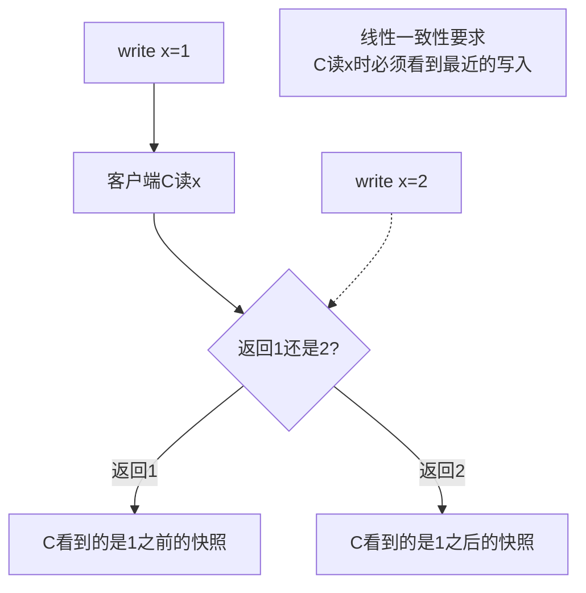
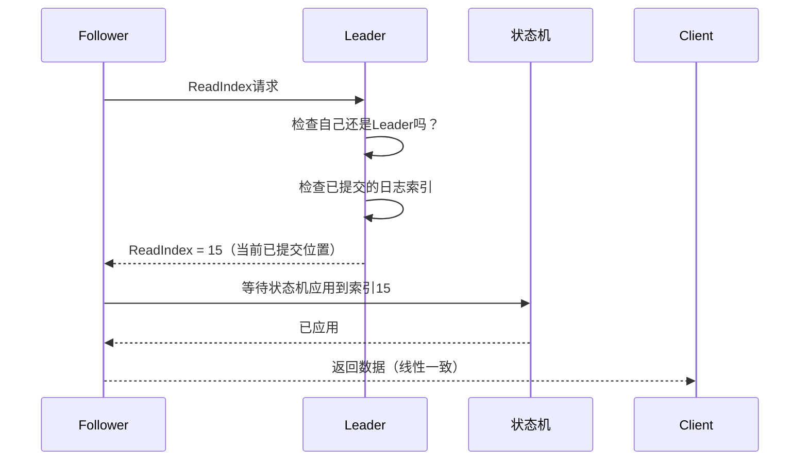

面试官问："ZooKeeper 的读是强一致的吗？"

很多候选人脱口而出："是的，ZooKeeper 是强一致的。"

面试官追问："那为什么 ZooKeeper 的读不经过 Leader 也可以？"

候选人开始犹豫。

这道题的背后，是一个很多工作 3 年的后端工程师都容易混淆的概念：**线性一致性（Linearizability）和顺序一致性（Sequential Consistency）**。

今天，我们把这两种一致性彻底讲清楚。

## 一、问题的起源：谁先谁后？

在分布式系统里，最核心的问题之一是：**多个节点上的操作，谁先谁后？**

```
场景：两个客户端分别在两个数据中心操作同一个变量

客户端A：在节点 N1 执行 write(x, 1)
客户端B：在节点 N2 执行 write(x, 2)
客户端C：在节点 N3 读取 x，得到 1
客户端D：在节点 N4 读取 x，得到 2

问题：C 和 D 谁是对的？
```

如果 C 和 D 都认为自己是对的，那就产生了**一致性问题**。

而"谁先谁后"的一致性保证，就是线性一致性和顺序一致性要回答的。

## 二、线性一致性（Linearizability）

### 2.1 定义

**线性一致性**（也叫 **原子一致性**）的核心是：**所有操作在全局看来就像是按某个时间顺序一个一个执行，每个操作都是原子的。**

```
线性一致性的直观理解：
- 时间戳是连续的、不重叠的
- 每个读操作都能看到最近一次写操作的结果
- 读操作在返回给客户端的那一刻，就确定了它看到的是哪个时间点的状态
```

**关键点**：线性一致性**有时间约束**。读操作看到的结果，必须与读操作发生的时间点一致——不能看到"未来"的值，也不能看到"过去"的值。



### 2.2 线性一致性的时间约束

线性一致性有一个关键的时间约束：**读操作的返回时间必须在写操作完成之后**。

```
正确示例（线性一致）：
  T0: write(x, 1) 完成
  T1: read(x) 开始 → 必须返回 1 或更新的值

错误示例（不是线性一致）：
  T0: write(x, 1) 开始（但还没完成）
  T1: read(x) 开始 → 返回了 1（但 write 实际失败了）

线性一致性要求：操作的"完成时间"是全局可观测的
```

### 2.3 线性一致性的实现

线性一致性的工业实现主要是共识算法：**Raft 和 Paxos**。

```java
// Raft 的线性一致性写入
public class RaftClient {
    public boolean write(String key, String value) {
        // 1. 把写入请求发送给 Leader
        Node leader = findLeader();
        if (leader == null) {
            return false; // 没有 Leader，无法线性写入
        }

        // 2. Leader 把日志复制到多数派节点
        int term = leader.getCurrentTerm();
        LogEntry entry = new LogEntry(term, key, value);
        boolean committed = leader.appendEntry(entry);

        if (!committed) {
            return false; // 多数派未达成一致
        }

        // 3. 此时写入已线性化（已提交到状态机）
        return true;
    }
}
```

**Raft 的线性一致性保证**：

```mermaid
sequenceDiagram
    participant C as 客户端
    participant L as Leader
    participant F1 as Follower-1
    participant F2 as Follower-2

    C->>L: write(x=1)
    L->>F1: AppendEntries(x=1)
    L->>F2: AppendEntries(x=1)
    F1-->>L: OK
    F2-->>L: OK
    Note over L: 多数派确认，日志已提交
    L-->>C: 写入成功
    Note over L,F1,F2: 此刻所有节点上x=1是一致的
```

## 三、顺序一致性（Sequential Consistency）

### 3.1 定义

**顺序一致性**的核心是：**所有节点看到的操作顺序是相同的，但这个顺序**不需要和真实时间一致**。**

```
顺序一致性的直观理解：
- 所有节点看到的操作序列是相同的（保序）
- 但"先发起的操作不一定先完成"
- 就像多线程程序中的内存屏障：每个线程看到的操作顺序相同，但时间可以乱序
```

**关键点**：顺序一致性**没有时间约束**，只要求**所有节点看到的操作顺序一致**。

```mermaid
graph TD
    A[Node-1: write(x,1)] --> B[Node-1: write(y,1)]
    A' --> B'[Node-2: 看到的顺序相同<br/>write(x,1) → write(y,1)]
    A'' --> B''[Node-3: 看到的顺序相同<br/>write(x,1) → write(y,1)]
    Note over A,A',A'': 全局操作顺序一致<br/>但 Node-1 的 write(x,1) 和 write(y,1)<br/>谁先完成对其他节点不可见
```

### 3.2 线性一致性 vs 顺序一致性：关键区别

```
场景：
  Node-1: write(x, 1) → write(x, 2)
  Node-2: read(x)

顺序一致性允许：
  Node-2 看到 x=2（因为它看到的是写 1 然后写 2 的顺序）
  即使 write(x, 1) 还没完成

线性一致性不允许：
  Node-2 必须等 write(x, 2) 完成之后才能读到 2
  因为 write(x, 1) 还没完成（线性一致有时间约束）
```

| 维度 | 线性一致性 | 顺序一致性 |
| --- | --- | --- |
| 全局时钟 | 需要（操作有真实时间顺序） | 不需要（只要求所有节点看到的顺序相同） |
| 读能否返回"未来"的值 | 不允许 | 允许（只要全局顺序一致） |
| 实现难度 | 高（需要共识算法） | 低（可以用链式复制） |
| 性能 | 较低（需要同步确认） | 较高（可以异步复制） |
| 代表系统 | Raft/Paxos、ZooKeeper 写操作 | ZooKeeper 读操作、宽松 quorum |

:::tip 💡
可以用一个简单的比喻来区分：**顺序一致性**像是"多个人看同一本书，翻页顺序必须一致，但允许每个人翻页的速度不同"。**线性一致性**则像是"所有人在同一个时刻看到同一页，翻页速度和真实时间挂钩"。
:::

## 四、ZooKeeper 的读写一致性

### 4.1 ZooKeeper 的一致性保证

这才是开头面试题的标准答案：

```
ZooKeeper 的写操作：线性一致（因为通过 ZAB 协议保证）
ZooKeeper 的读操作：顺序一致（不经过 Leader，可能读到过期数据）
```

```java
// ZooKeeper 读操作（不经过 Leader）
public class ZKClient {
    // 方式1：读任意节点（顺序一致，不保证是最新的）
    public String read(String path) {
        Node node = zk.getConnection().getNode随便一个节点);
        return node.getData(); // 可能返回旧数据
    }

    // 方式2：Sync + 读 Leader（线性一致，但延迟高）
    public String linearizableRead(String path) {
        zk.sync(); // 强制与 Leader 同步
        return zk.getData(path, false, null);
    }
}
```

这就是为什么 ZooKeeper 的读操作可以不用经过 Leader——因为它的读**不保证线性一致**，只保证**顺序一致**。

【架构权衡】

ZooKeeper 的设计哲学是：**写操作必须强一致（CP），读操作可以弱一致（AP）**。这对于配置中心、分布式锁这类场景是合理的——配置变更（写）必须立即生效，但配置读取（读）偶尔读到旧值影响不大。

但如果你的场景**读也必须是最新的**（比如分布式锁的持有者检查），就需要用 `sync()` 强制与 Leader 同步。

### 4.2 面试题详解

**面试官问**：etcd 和 ZooKeeper 都在做分布式协调，它们的读一致性有什么不同？

**标准答案**：

```
etcd：
- 默认读是线性一致的（通过 Raft 协议）
- 因为 etcd 的读也经过 Leader 或多数派确认
- 读延迟高，但保证读到最新数据

ZooKeeper：
- 写是线性一致的（通过 ZAB 协议）
- 读是顺序一致的（可以读任意节点，不经过 Leader）
- 读延迟低，但不保证读到最新数据

关键区别：
- etcd 是"读也走 Raft"，一致性更强但延迟更高
- ZooKeeper 是"读不走 ZAB"，延迟低但一致性弱
```

## 五、Raft 的线性一致性读取

### 5.1 Raft 读操作的三种方式

```java
// 方式1：走 Leader（线性一致）
public String readViaLeader(String key) {
    Node leader = findLeader();
    if (leader == null) throw new NotLeaderException();

    // 确保自己是 Leader（可能已经过期）
    if (!leader.isStillLeader()) {
        throw new NotLeaderException(); // 重新找 Leader
    }

    // 读取本地状态机（Leader 的状态机一定是最新的）
    return leader.getStateMachine().read(key);
}
```

```java
// 方式2：Lease Read（优化版，减少一次 RPC）
public String leaseRead(String key) {
    // Leader 在 electionTimeout 期间内，认为自己还是 Leader
    // 不需要发送心跳确认，直接读本地

    if (leader.isLeaseValid()) {
        return leader.getStateMachine().read(key); // 不发 RPC，直接读
    } else {
        // Lease 过期，需要走正常读流程
        return readViaLeader(key);
    }
}
```

```java
// 方式3：Follower 读（通过 ReadIndex 优化）
public String readViaFollower(String key) {
    // 1. 向 Leader 发送 ReadIndex 请求，获取当前已提交的日志索引
    long commitIndex = leader.getCommitIndex();

    // 2. 等待本地状态机应用到 commitIndex
    follower.waitUntilApplied(commitIndex);

    // 3. 现在可以安全地读本地状态机
    return follower.getStateMachine().read(key);
}
```

### 5.2 ReadIndex 机制



ReadIndex 的核心思想：**Follower 不需要复制日志，只需要确认 Leader 的状态是最新的，就能安全读取本地数据。**

## 六、生产避坑

### 6.1 坑一：在 ZooKeeper 上做读后写，误以为读了最新数据

```java
// ❌ 错误代码：在 ZooKeeper 读后写，但没有保证线性一致
String data = zk.getData("/config", false, null);
if (data == null) {
    zk.create("/config", "initialized".getBytes()); // 可能创建失败，因为另一个节点已经创建了
}
```

**正确做法**：

```java
// ✅ 方式1：用 watch 保证读后写（顺序一致）
Stat stat = new Stat();
String data = zk.getData("/config", watch, stat);
if (data == null) {
    try {
        zk.create("/config", "initialized".getBytes(), CreateMode.PERSISTENT);
    } catch (NodeExistsException e) {
        // 另一个线程已经创建，忽略
    }
}

// ✅ 方式2：用 Sync + 读（线性一致）
zk.sync("/config");
String data = zk.getData("/config", false, null);
```

### 6.2 坑二：混淆 etcd 的 "Serializable" 和 "Linearizable"

```java
// etcd 的读模式
// Linearizable：线性一致读（默认）
client.get("key"); // 走 Raft，保证读到最新

// Serializable：顺序一致读（更快）
client.get("key", WithMode(etcd.ReadModeSerializable)); // 不走 Raft，可能读到旧数据
```

## 七、一致性强度总览

```
最强 ────────────────────────────── 最弱

线性一致性（Linearizability）
  - 所有操作有真实时间顺序
  - 读操作看到的结果与读取时间一致
  - 实现：Raft、Paxos、ZAB（写操作）

顺序一致性（Sequential Consistency）
  - 所有节点看到相同的操作顺序
  - 但顺序与真实时间无关
  - 实现：ZooKeeper 读操作、CPU 内存模型

因果一致性（Causal Consistency）
  - 只保证有因果关系的操作顺序
  - 无因果关系的操作可以乱序
  - 实现：向量时钟

最终一致性（Eventual Consistency）
  - 不保证任何顺序
  - 只要停止写入，最终会收敛
  - 实现：DynamoDB、Cassandra
```

【架构权衡】

一致性越强，延迟越高，可用性越低。选择哪种一致性，取决于业务对"数据准确"和"响应速度"的权衡：

- 金融交易：必须线性一致，延迟再高也要等
- 社交 Feed：最终一致就行，延迟高用户会流失
- 配置管理：写线性一致，读可以弱一致
- 分布式锁：必须线性一致，锁错了后果严重

## 八、工程代价评估

| 维度 | 线性一致性 | 顺序一致性 |
| --- | --- | --- |
| 写延迟 | 高（需要多数派确认）| 中（ZAB 两阶段） |
| 读延迟 | 高（默认走 Leader）| 低（可读任意节点） |
| 实现复杂度 | 高 | 中 |
| 可用性 | 中（Leader 挂了需选举）| 高（读不依赖 Leader） |
| 适用场景 | 金融、强一致需求 | 配置、锁、读多写少 |
