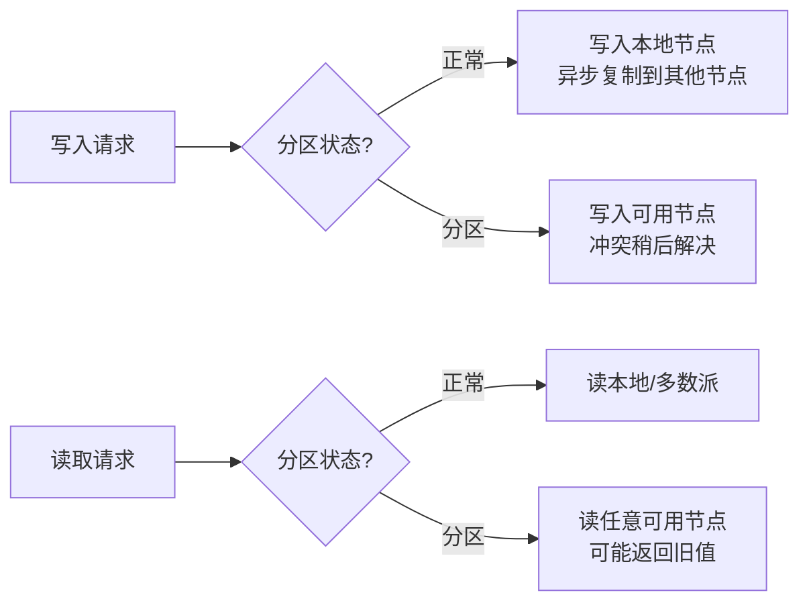

2019年，我们团队在搭建全球化服务时遇到了一个诡异的问题。

两个数据中心分别部署在美国和新加坡，同步延迟是 170ms。开发团队的工程师认为，只要把数据库换成支持强一致的分布式数据库，就能解决跨数据中心的数据一致性问题。

上线第一天就炸了：用户注册接口的 P99 延迟从 20ms 飙升到 400ms，大量请求超时。用户根本无法完成注册。

问题出在哪里？我们用 CAP 定理分析了一遍，发现 CAP 根本无法解释这个问题——没有发生网络分区，为什么延迟还是这么高？

这就是 CAP 定理的盲区。2012 年，Daniel Abadi 提出了 PACELC 模型，专门用来回答这个问题。

## 一、CAP 的盲区：没有分区时你在选什么？

CAP 定理只描述了**网络分区发生**时的行为。但生产环境里，分区不是常态，**正常网络条件下的延迟问题**才是。

```
CAP 定理只回答：分区期间，我选 C 还是选 A？
PACELC 回答：没有分区时，我在延迟和一致性之间选什么？
```

**PACELC** = **P**artition **A**vailability **C**onsistency **E**lse **L**atency **C**onsistency

核心洞察：**即使没有发生分区，你也无法同时获得低延迟和强一致性。**

### PACELC 的完整语义

```
如果发生网络分区（P）：
  → 选择可用性（A）还是一致性（C）？

否则（E，即没有分区时）：
  → 选择低延迟（L）还是一致性（C）？
```

这意味着，分布式系统在任何时刻都在做权衡：

| 场景 | 选择 | 代表系统 | 代价 |
| --- | --- | --- | --- |
| 分区期间选 A | AP | Cassandra、DynamoDB | 可能返回过期数据 |
| 分区期间选 C | CP | ZooKeeper、etcd、HBase | 分区期间拒绝服务 |
| 无分区选低延迟 | EL | DynamoDB 最终一致、Cassandra | 读可能返回稍旧数据 |
| 无分区选一致性 | EC | HBase、ZooKeeper、DynamoDB 强一致 | 每次读写都有额外延迟 |

【架构权衡】

PACELC 的关键设计启示：**一致性不是免费的。** 在跨机房、跨地域部署时，即使是"正常"网络条件下，强一致也会带来显著延迟。AWS 官方文档明确建议 DynamoDB 全局表的跨区域复制延迟约为 1 秒——这不是故障，是设计。

## 二、PACELC 的四种组合

### 2.1 PA/EC：分区可用 + 正常一致

**行为**：分区时选 A，正常时选 C。

```
系统运行时：强一致，每次读写都确认
分区发生时：允许读写，但数据可能不一致
```

代表系统：**DynamoDB（强一致读）**

```java
// DynamoDB 强一致读的 PACELC 定位
// 无分区：每次读都要 Leader 确认（EC）
// 有分区：Leader 不可达，读请求失败（CP）—— 但 DynamoDB 默认是最终一致读（PA）
```

这种系统看起来矛盾，实际上是在不同场景下做了不同选择。DynamoDB 的强一致读在分区时会失败，因为它需要写入和读取都经过同一个副本。

### 2.2 PA/EL：分区可用 + 正常低延迟

**行为**：分区时选 A，正常时也选低延迟。

```
系统运行时：最终一致，读写都快速返回
分区发生时：继续可用，但数据可能冲突
```

代表系统：**Cassandra、DynamoDB（最终一致读）**



### 2.3 PC/EC：分区一致 + 正常一致

**行为**：无论是否分区，都选一致性。

```
系统运行时：强一致，延迟较高
分区发生时：拒绝服务，保证数据不变
```

代表系统：**ZooKeeper、etcd、HBase**

```java
// ZooKeeper 的 PC/EC 行为
// 无分区：所有写操作必须通过 Leader（EC）
// 分区期间：非 Leader 节点停止服务（PC）

// 代价：Leader 选举期间，整个集群不可用（PA = 0）
// 这就是为什么 ZooKeeper 不适合跨地域部署
```

:::warning ⚠️
ZooKeeper 是 PC/EC 的典型代表。但很多人不知道的是：**ZooKeeper 的读操作不经过 Leader**，所以读是可以 AP 的。但写操作一定是 CP。面试时如果能说出这个细节，面试官会高看你一眼。
:::

### 2.4 PC/EL：分区一致 + 正常低延迟

**行为**：分区时选 C，正常时选低延迟。

这是一种比较罕见的组合，因为"正常时低延迟 + 分区时一致"意味着系统在正常和异常状态下的行为差异极大。

代表系统：**某些 MongoDB 配置**

```java
// MongoDB 的写关注（Write Concern）配置
// w: "majority" → 更强的一致性，但更慢
// w: 1 → 本地写入，快但可能丢数据

// PC/EL 的组合在 MongoDB 中的体现：
// 正常时用 w:1（低延迟）
// 关键业务用 w: "majority"（强一致）
```

## 三、生产场景中的 PACELC 决策

### 3.1 跨数据中心部署：必须接受延迟

```
场景：双活数据中心，主数据中心在北京，容灾在上海
物理延迟：光纤直连约 5~8ms（正常）
问题：网络抖动时可能达到 50ms+

PACELC 分析：
  → 正常时选低延迟（EL）：接受跨中心复制有延迟
  → 分区时选可用性（PA）：继续提供服务，数据最终一致
```

这是大多数互联网公司的选择：**在可用性和一致性之间，可用水位线更重要。** 跨地域双活的核心目标不是强一致，而是"任何一个数据中心挂了，另一个能接管"。

### 3.2 金融核心链路：选 EC 不妥协

```
场景：银行转账系统，账户余额必须精确
PACELC 分析：
  → 正常时选一致性（EC）：每次转账都要确认余额足够
  → 分区时选一致性（PC）：宁可停止服务也不能出现数据不一致

代价：
  - 跨数据中心延迟 20ms → 用户感知明显
  - 分区时服务不可用 → 必须有降级预案
```

【架构权衡】

金融系统的 PACELC 选择背后有一个重要原则：**数据不一致的代价远高于服务不可用的代价。** 一次双花事故可能涉及数百万资金，而服务不可用只是影响用户体验（客服可以介入）。

### 3.3 缓存系统：天然 PA/EL

```
场景：Redis 缓存，存用户 Session
PACELC 分析：
  → 一致性不是缓存的核心目标
  → 缓存挂了：降级到数据库，继续服务
  → 缓存和数据库短暂不一致：可接受

Redis Cluster 的设计哲学就是 PA/EL：
  - 正常时：低延迟写入本地节点
  - 分区时：主节点切换，从节点接管
```

## 四、PACELC 与 CAP 的关系

很多候选人把 PACELC 当成 CAP 的升级版，其实不对。**PACELC 是 CAP 的补充，不是替代。**

```
CAP：描述了分区时的二选一
PACELC：描述了在 CAP 之外，延迟和一致性的取舍

两者叠加，才是分布式系统的完整权衡图谱：
  分区时：选 C（CP）还是选 A（AP）？
  正常时：选 L（EL）还是选 C（EC）？

组合出四种模式：PA/EC、PA/EL、PC/EC、PC/EL
```

| 系统 | 分区行为 | 正常行为 | PACELC 定位 |
| --- | --- | --- | --- |
| Cassandra | A | L | PA/EL |
| DynamoDB（强一致） | C | C | PC/EC |
| DynamoDB（最终一致） | A | L | PA/EL |
| ZooKeeper | C | C | PC/EC |
| etcd | C | C | PC/EC |
| HBase | C | C | PC/EC |
| Redis Cluster | A | L | PA/EL |
| Kafka | C/A 混合 | L | 取决于配置 |

## 五、工程落地 Checklist

| 决策点 | 问题 | 答案示例 |
| --- | --- | --- |
| 是否跨地域部署？ | 如果是，延迟不可避免 | 接受 10~50ms 跨机房延迟 |
| 业务对一致性要求？ | 扣款/库存 vs Feed/评论 | 高一致性选 EC，最终一致选 EL |
| 能接受服务不可用吗？ | 金融 vs 社交 | 金融选 PC，普通业务选 PA |
| 读写比例是多少？ | 读多写少 vs 写多读少 | 读多可优化为 EL 读，写多需 EC |

:::tip 💡
选型时记住一个公式：**一致性成本 = 写入延迟 + 读取确认延迟**。每次强一致写入需要多数派确认，强一致读取需要检查数据新鲜度。这些确认步骤就是延迟的来源。
:::

## 六、常见面试题

**面试官问**："PACELC 定理解决了 CAP 定理的什么问题？"

**错误回答**："PACELC 是 CAP 的升级版，CAP 三选二不够用，PACELC 提供了更细粒度的选择。"

**问题诊断**：这个回答暴露了对 CAP 和 PACELC 关系的误解。PACELC 不是 CAP 的升级，而是**补充**。CAP 描述分区期间，PACELC 描述正常期间。两者叠加才是完整视图。

**正确回答**：CAP 只描述了网络分区发生时的行为，但没有回答"没有分区时我在选什么"。PACELC 补全了这个盲区，指出即使在正常网络条件下，系统也在延迟和一致性之间做取舍。例如，ZooKeeper 在正常时需要通过 Leader 写入（一致但延迟高），DynamoDB 最终一致读在正常时不需要多数派确认（延迟低但可能读到旧数据）。

---

**面试官追问**："为什么 MongoDB 不适合跨地域强一致部署？"

**标准答案**：MongoDB 的写操作需要 Primary 节点确认。如果主数据中心挂了，Secondary 升为主需要时间（PC 行为）。而且 MongoDB 的复制是异步的，跨地域时延迟极高。真正的跨地域强一致需要 Paxos/Raft 类共识算法，而不是简单的副本复制。
