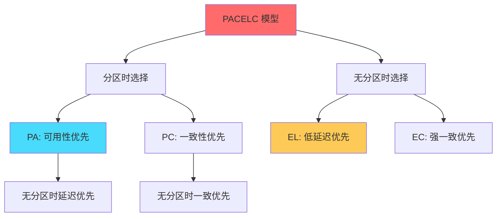
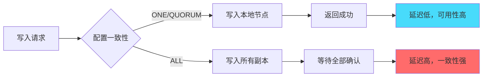
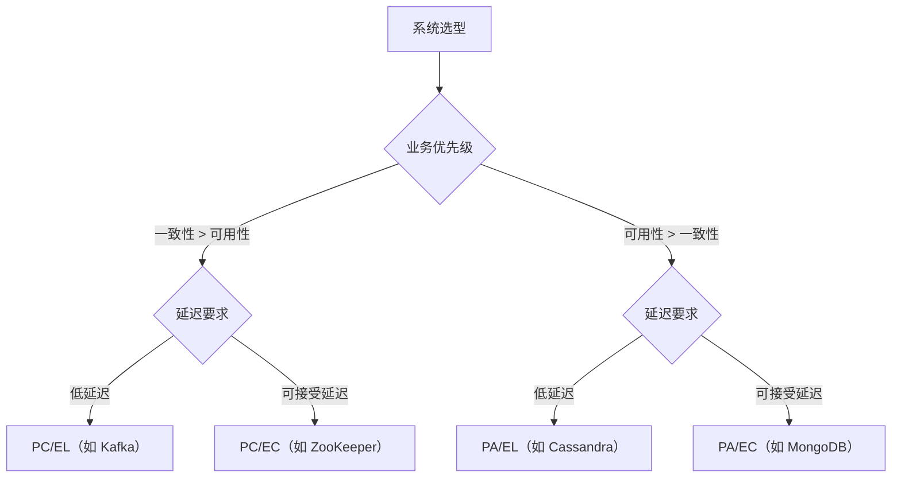

# PACELC 定理：更精确的分布式系统权衡模型

## 快速自测：面试官最关心的 3 个问题

> 🔴 **高频必考**，P7 架构设计面试常问

1. **PACELC 是哪四个单词的缩写？它解决了 CAP 的什么问题？**
2. **为什么说 DynamoDB 是 PA/EL 系统？Cassandra 呢？**
3. **如何用 PACELC 来指导系统选型？**

---

## 一、为什么需要 PACELC

### 1.1 CAP 的局限性

CAP 定理只描述了「分区发生时的选择」，但没有考虑「无分区时的延迟-一致性权衡」。

```
CAP 的问题：只告诉我们分区时选 C 还是 A
             没有告诉我们不分区时怎么选

PACELC 的改进：补充了「无分区时的选择」
               在任何情况下都有明确的权衡
```

### 1.2 PACELC 的核心思想

**PACELC = PArtition + A vs C + E + L vs C**

- **P**：分区发生时
- **A vs C**：选择可用性（Availability）还是一致性（Consistency）
- **E**：Else，无分区时
- **L vs C**：选择低延迟（Latency）还是强一致性（Consistency）



---

## 二、PACELC 的四种组合

### 2.1 PA/EL：优先可用性和低延迟

**代表系统**：Cassandra、DynamoDB

**特点**：

- 任何情况下都优先保证可用性和低延迟
- 接受数据冲突，通过向量时钟或时间戳解决
- 适合「先写再说」的业务场景

### 2.2 PA/EC：优先可用性和一致性

**代表系统**：MongoDB（部分配置）

**特点**：

- 分区时继续服务，无分区时保证一致性
- 通过多数派读取保证一致性
- 适合读多写少的场景

### 2.3 PC/EC：优先一致性和一致性

**代表系统**：ZooKeeper、Etcd、HBase

**特点**：

- 任何情况下都优先保证一致性
- 接受更高的延迟和可能的不可用
- 适合金融、配置中心等强一致场景

### 2.4 PC/EL：优先一致性和低延迟

**代表系统**：部分 CP 系统的读写优化

**特点**：

- 分区时保证一致，无分区时追求低延迟
- 通过读写分离实现延迟优化
- 适合对延迟敏感的强一致场景

---

## 三、常见系统的 PACELC 分析

### 3.1 Cassandra：PA/EL



**为什么是 PA/EL**：

1. **写入策略**：默认写入任意一个节点即可成功
2. **冲突解决**：通过 Last-Write-Wins 或用户自定义解决
3. **延迟优化**：通过协调节点就近写入，降低延迟

### 3.2 HBase：PC/EC

**为什么是 PC/EC**：

1. **写入流程**：数据先写 WAL，再写 MemStore，需要多数节点确认
2. **一致性保证**：强一致写入，读取总是返回最新数据
3. **延迟特点**：写入延迟较高，但数据可靠

### 3.3 DynamoDB：PA/EL

**为什么是 PA/EL**：

1. **可配置一致性**：可以根据业务选择强一致或最终一致
2. **默认模式**���最终一致读取，延迟极低
3. **冲突解决**：保留多版本数据，用户自行处理

---

## 四、PACELC 的实践应用

### 4.1 选型决策树



### 4.2 业务场景对应

| 业务场景 | 推荐 PACELC | 说明 |
|---------|-------------|------|
| 社交Feed流 | PA/EL | 写入快、延迟低，可接受最终一致 |
| 金融交易 | PC/EC | 强一致优先，延迟可接受 |
| 消息队列 | PC/EL | 一致性优先，部分场景需要低延迟 |
| 配置中心 | PC/EC | 强一致，任何场景不能出错 |
| 电商商品 | PA/EC | 读多写少，可配置一致性级别 |

---

## 五、面试题精讲

### 🔴 面试题 1：PACELC 解决了 CAP 的什么问题？

**答案要点**：

- **CAP 的局限**：只描述了分区时的选择，无法描述正常情况下的权衡
- **PACELC 的补充**：增加了「无分区时延迟 vs 一致性」的选择
- **实际意义**：可以更精确地描述系统特性，指导选型

**追问链**：

> **第一层**：PACELC 的四个字母分别代表什么？
> **第二层**：CAP 有什么局限性？
> **第三层**：为什么 DynamoDB 是 PA/EL 而不是 PA/EC？

### 🟡 面试题 2：用 PACELC 分析你熟悉的系统

**答案要点**：

| 系统 | PACELC | 分析 |
|------|--------|------|
| Cassandra | PA/EL | 任何情况都优先低延迟和可用性 |
| HBase | PC/EC | 任何情况都优先一致性 |
| ZooKeeper | PC/EC | 强一致，不可用的代价可接受 |
| Redis Cluster | PC/EC | 分区时部分不可用，保证一致 |

---

## 六、对比总结表

| 对比维度 | PA/EL | PA/EC | PC/EC | PC/EL |
|---------|-------|-------|-------|-------|
| **一致性** | 最终一致 | 强一致 | 强一致 | 强一致 |
| **可用性** | 高 | 高 | 低 | 低 |
| **延迟** | 低 | 中 | 中 | 低 |
| **代表系统** | Cassandra | MongoDB | ZooKeeper | Kafka |
| **适用场景** | 社交、日志 | 电商读多 | 金融、配置 | 消息队列 |

---

## 扩展阅读

如果本文档对你有帮助，建议继续阅读：

- [CAP 定理](/distributed/theory/cap)：CAP 基础理论
- [一致性模型对比](/distributed/theory/consistency-models)：强一致、最终一致等模型详解
- [Quorum 读写](/distributed/theory/quorum)：读写多数派的实现机制