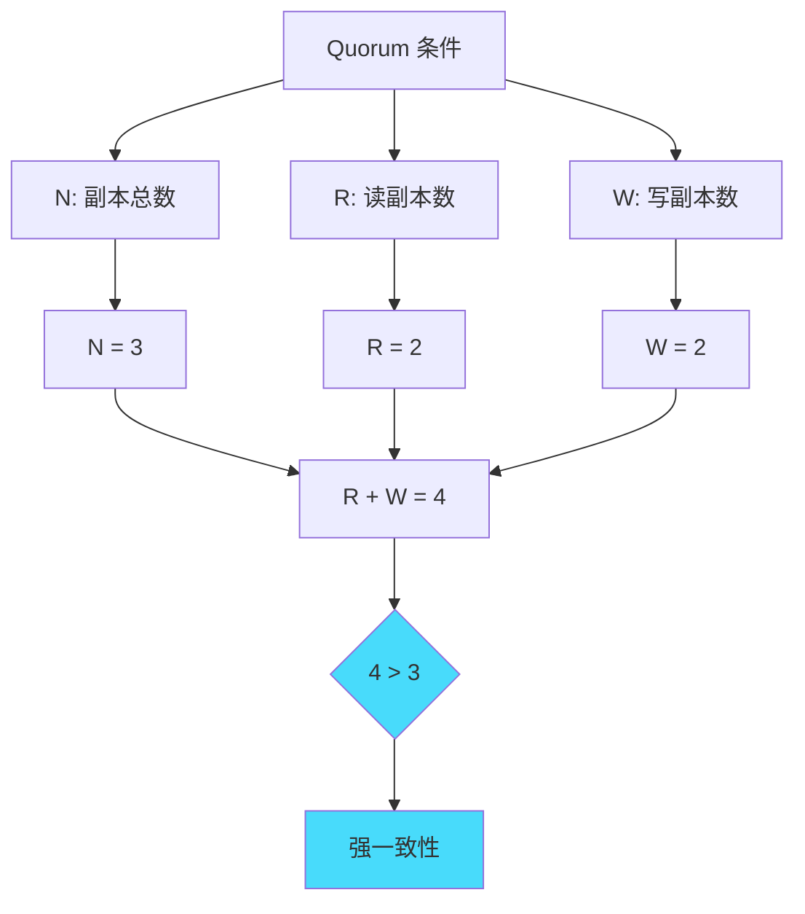
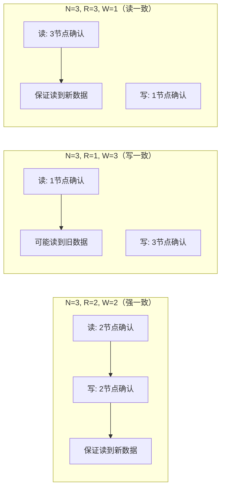
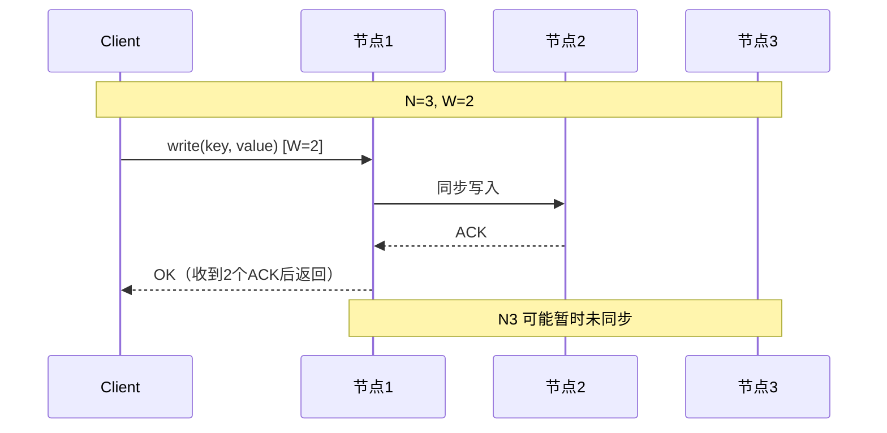
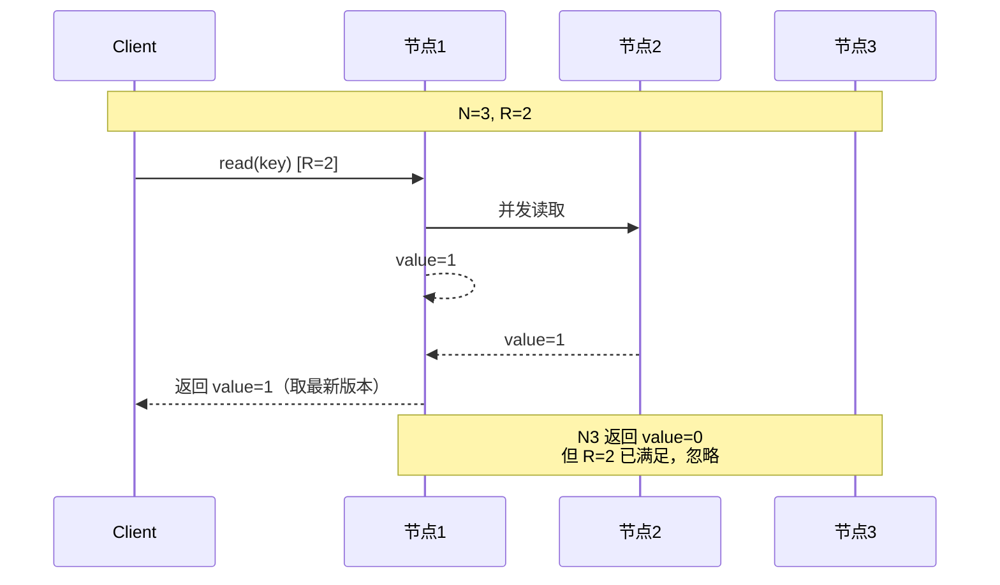
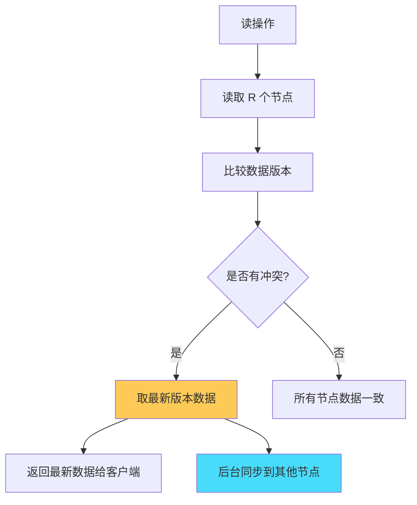
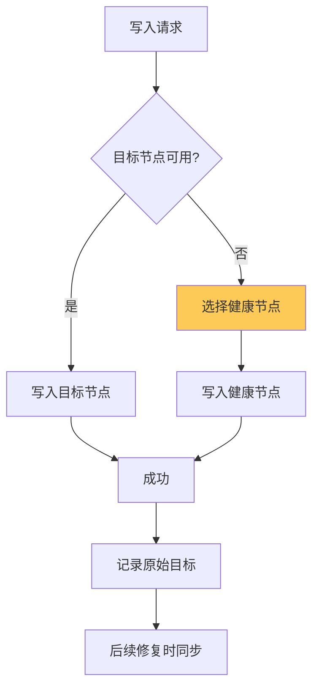

# Quorum 读写：实现强一致性的核心机制

## 快速自测：面试官最关心的 3 个问题

> 🟡 **中频常考**，P7 架构设计面试可能问

1. **什么是 Quorum 机制？如何设置读写副本数来实现强一致性？**
2. **N、R、W 三个参数的关系是什么？如何选择合适的值？**
3. **Quorum 机制有什么局限性？如何解决「写冲突」问题？**

---

## 一、Quorum 机制的核心概念

### 1.1 什么是 Quorum

Quorum（原意为「法定人数」）是一种分布式系统中的读写策略，通过设置读写操作的副本数来保证数据一致性。

**核心参数**：

| 参数 | 说明 |
|------|------|
| **N** | 副本总数（Number of replicas） |
| **R** | 读副本数（Read quorum） |
| **W** | 写副本数（Write quorum） |

### 1.2 Quorum 的基本规则

```
强一致性的读写条件：
R + W > N

这意味着：
- 每次读操作都能读到至少一个包含最新数据的节点
- 每次写操作都需要写入足够多的节点
```



---

## 二、N/R/W 的组合配置

### 2.1 常见配置组合

| 场景 | N | R | W | 特点 |
|------|---|----|----|------|
| **强一致** | 3 | 2 | 2 | 读写都需多数节点确认 |
| **读优化** | 3 | 1 | 3 | 读取快，写入慢 |
| **写优化** | 3 | 3 | 1 | 写入快，读取慢 |
| **均衡** | 5 | 2 | 3 | 读写均衡 |

### 2.2 配置对比图



### 2.3 不同配置的性能对比

| 配置 | 读延迟 | 写延迟 | 可用性 | 一致性 |
|------|--------|--------|--------|--------|
| R=1, W=N | 低 | 高 | 低 | 最终一致 |
| R=N, W=1 | 高 | 低 | 高 | 最终一致 |
| R=2, W=2 | 中 | 中 | 中 | 强一致 |

---

## 三、Quorum 的读写流程

### 3.1 写操作流程



### 3.2 读操作流程



### 3.3 冲突处理：读修复（Read Repair）



---

## 四、Quorum 的局限性与解决方案

### 4.1 局限性一：写入冲突

**问题**：当两个客户端同时写入同一 key 时，可能产生冲突。

```
示例：N=3, W=2
- 客户端 A 写入 [节点1, 节点2]
- 客户端 B 写入 [节点2, 节点3]

节点2 收到两个冲突的写入，应该保留哪个？
```

**解决方案**：版本向量（Vector Clock）

```java
// 带版本向量的写入
public class Replica {
    private String value;
    private VectorClock version;
    
    public void write(String value, VectorClock version) {
        if (this.version.happensBefore(version)) {
            // 新版本，覆盖
            this.value = value;
            this.version = version;
        } else if (this.version.isConcurrent(version)) {
            // 并发版本，冲突
            throw new ConflictException();
        }
        // 否则忽略（旧版本）
    }
}
```

### 4.2 局限性二：可用性降低

**问题**：当 W > N/2 时，部分节点故障可能导致写入失败。

**解决方案**：Sloppy Quorum（松散 Quorum）



### 4.3 局限性三：性能问题

**问题**：强一致性（N=3, R=2, W=2）的延迟较高。

**解决方案**：可配置的一致性级别

```java
// DynamoDB 的可配置一致性
DynamoDB db = DynamoDB.builder()
    .region(Region.US_EAST_1)
    .build();

// 强一致读
GetItemRequest strongRead = GetItemRequest.builder()
    .tableName("Orders")
    .consistentRead(true)
    .build();

// 最终一致读（性能更好）
GetItemRequest eventualRead = GetItemRequest.builder()
    .tableName("Orders")
    .consistentRead(false)
    .build();
```

---

## 五、常见系统的 Quorum 实现

### 5.1 Cassandra 的 Quorum

```java
// Cassandra 的可配置一致性
CONSISTENCY_LEVEL ONE = 1;      // 读 1 节点
CONSISTENCY_LEVEL QUORUM = 2;  // 读 N/2 + 1 节点
CONSISTENCY_LEVEL ALL = 3;      // 读所有节点
```

### 5.2 ZooKeeper 的 Quorum

```
ZooKeeper 的写入：
- 需要获得集群多数节点（Quorum）的同意
- N=3 时，W = 2（多数派）
- 读可以在任意节点完成（可能返回旧数据）
```

### 5.3 etcd 的 Quorum

```java
// etcd 的 Raft 协议
// 写入：
// 1. Leader 接收请求
// 2. 日志复制到多数节点
// 3. 提交后返回客户端

// 读取：
// 1. 默认从 Leader 读（线性一致）
// 2. 可以配置为串行化读（性能更好）
```

---

## 六、面试题精讲

### 🔴 面试题 1：N/R/W 三个参数的关系是什么？

**答案要点**：

1. **N**：副本总数
2. **R**：读操作需要确认的节点数
3. **W**：写操作需要确认的节点数
4. **强一致条件**：R + W `>` N

**追问链**：

> **第一层**：N/R/W 分别代表什么？
> **第二层**：为什么 R + W `>` N 才能保证强一致？
> **第三层**：如果 N=5，如何配置 R 和 W 来平衡性能和一致性？

### 🟡 面试题 2：如何用 Quorum 实现线性一致性？

**答案要点**：

1. 设置 R + W `>` N
2. 读操作读取 R 个节点，取最新版本
3. 写操作写入 W 个节点，等待确认
4. 通过读修复保证数据一致

---

## 七、实战思考题

### 思考题 1：Quorum 配置选择

某系统需要存储用户配置，要求：
1. 高可用（节点故障时仍可服务）
2. 允许最终一致（短暂不一致可接受）
3. 读多写少

请选择合适的 N/R/W 配置，并说明理由。

### 思考题 2：Sloppy Quorum

什么是 Sloppy Quorum？为什么需要它？

---

## 扩展阅读

如果本文档对你有帮助，建议继续阅读：

- [一致性模型对比](/distributed/theory/consistency-models)：各种一致性模型详解
- [线性一致性与顺序一致性](/distributed/theory/linearizable-sequential)：线性一致性详解
- [故障模型](/distributed/theory/failure-models)：分布式系统的故障类型