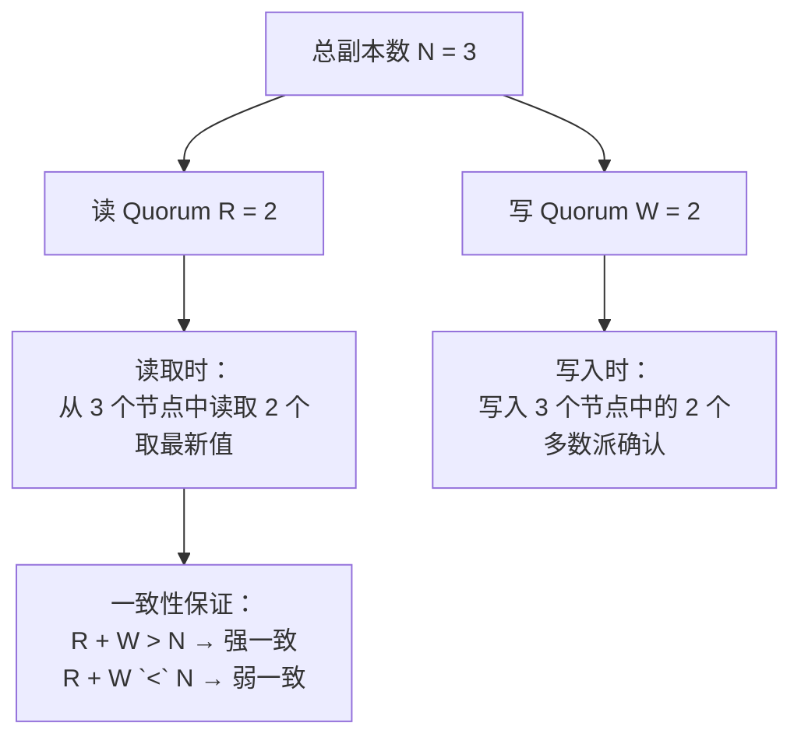
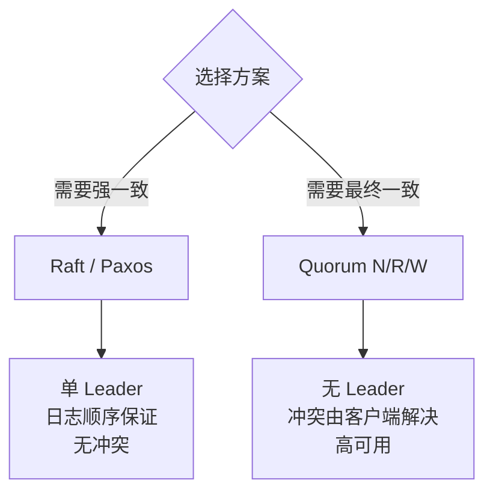

DynamoDB 的设计文档里有这么一句话：

> "Dynamo uses a Quorum-like protocol and a decentralized replica synchronization protocol to ensure data consistency."

但很多工程师只知道 DynamoDB 叫"最终一致"，不知道它的 Quorum 机制是怎么工作的。

今天，我们把 Quorum 读写机制从理论到实现彻底讲透。

## 一、Quorum 的核心思想

### 1.1 什么是 Quorum？

**Quorum**（法定人数）是一种广泛应用于分布式系统的投票机制。它的核心思想是：

> **只有当多数派节点确认了一个操作，这个操作才算成功。**

```
三个副本，Quorum = 2 意味着：
- 写入：至少 2 个节点写入成功 → 写入成功
- 读取：至少 2 个节点返回相同结果 → 读取成功
```

### 1.2 Quorum 的三剑客：N、R、W



| 参数 | 含义 | 典型值 |
| --- | --- | --- |
| **N** | 总副本数（Data Replicas） | 3, 5, 7 |
| **R** | 读 Quorum（读取时最少参与的节点数） | 1, 2, 3 |
| **W** | 写 Quorum（写入时最少确认的节点数） | 1, 2, 3 |

### 1.3 一致性公式

```
R + W > N → 强一致（每次读都能读到最新写入）
R + W <= N → 弱一致（可能读到旧数据）
```

```
示例分析（N = 3）：

R=1, W=3：
  写入：3 个节点全部确认（必须全部成功）
  读取：1 个节点返回即可
  R+W=4 > 3 → 强一致
  代价：写入慢（需全部确认），读取快

R=2, W=2：
  写入：至少 2 个节点确认
  读取：至少 2 个节点返回
  R+W=4 > 3 → 强一致
  代价：读写都需要多数派，性能均衡

R=1, W=1：
  写入：1 个节点确认即可
  读取：1 个节点返回即可
  R+W=2 = N → 弱一致
  代价：写入和读取都快，但可能读到旧数据

R=3, W=1：
  写入：1 个节点确认
  读取：3 个节点全部参与
  R+W=4 > 3 → 强一致
  代价：写入极快，但读取需要全部节点参与
```

:::tip 💡
DynamoDB 的默认配置是 **N=3, R=2, W=2**，即"两个节点确认才算写入成功，两个节点返回才算读取成功"。这意味着**读取一定能读到最近一次写入**（因为写入的节点和读取的节点必然有交集）。
:::

## 二、Quorum 的读写流程

### 2.1 写入流程

```java
public class QuorumWrite {
    // N=3, W=2, R=2
    private int N = 3;
    private int W = 2;

    public boolean write(String key, String value, VectorClock vc) {
        // 1. 找到 key 所属的 N 个副本节点
        List<Node> replicas = locator.getNodes(key, N);

        // 2. 并行写入所有副本
        List<Future<Boolean>> futures = new ArrayList<>();
        for (Node node : replicas) {
            futures.add(executor.submit(() -> {
                return node.put(key, value, vc);
            }));
        }

        // 3. 等待 W 个节点确认
        int successCount = 0;
        List<Exception> failures = new ArrayList<>();

        for (Future<Boolean> f : futures) {
            try {
                if (f.get(writeTimeout, TimeUnit.MILLISECONDS)) {
                    successCount++;
                }
            } catch (Exception e) {
                failures.add(e);
            }
        }

        // 4. 判断是否达到 Quorum
        if (successCount >= W) {
            return true; // 写入成功
        } else {
            // 写入失败，但数据可能已经在某些节点上了
            // 需要触发后续修复（Read Repair 或 Merkle Tree）
            triggerAsyncRepair(key, value, failures);
            return false;
        }
    }
}
```

### 2.2 读取流程

```java
public class QuorumRead {
    private int N = 3;
    private int R = 2;

    public ReadResult read(String key) {
        // 1. 找到 key 所属的 N 个副本节点
        List<Node> replicas = locator.getNodes(key, N);

        // 2. 并行读取 R 个节点
        List<Future<Version>> futures = new ArrayList<>();
        for (int i = 0; i < R; i++) {
            Node node = replicas.get(i);
            futures.add(executor.submit(() -> {
                return node.get(key);
            }));
        }

        // 3. 收集响应并解决冲突
        List<Version> versions = new ArrayList<>();
        for (Future<Version> f : futures) {
            try {
                versions.add(f.get(readTimeout, TimeUnit.MILLISECONDS));
            } catch (Exception e) {
                // 节点超时，继续收集其他响应
            }
        }

        if (versions.isEmpty()) {
            throw new ReadFailureException("无法读取到足够副本");
        }

        // 4. 冲突解决：取最新版本
        Version latest = resolveConflict(versions);
        return new ReadResult(latest.value, latest.vc);
    }
}
```

### 2.3 冲突解决（Conflict Resolution）

Quorum 读写最大的问题是：**当 W `<` N 时，写入可能成功但不是所有节点都写入了。**

```java
public class ConflictResolver {
    // 方式1：Last-Write-Wins（最常用）
    public Version resolveConflict(List<Version> versions) {
        return versions.stream()
            .max(Comparator.comparing(v -> v.timestamp))
            .orElse(versions.get(0));
    }

    // 方式2：向量时钟比较（保持因果）
    public Version resolveConflictByVC(List<Version> versions) {
        for (int i = 0; i < versions.size(); i++) {
            for (int j = i + 1; j < versions.size(); j++) {
                Relation r = compareVC(versions.get(i).vc, versions.get(j).vc);
                if (r == Relation.BEFORE) {
                    return versions.get(j);
                }
                if (r == Relation.AFTER) {
                    return versions.get(i);
                }
                // CONCURRENT：需要更高层次的冲突解决
            }
        }
        // 并发：使用时间戳作为最终裁决
        return versions.stream()
            .max(Comparator.comparing(v -> v.timestamp))
            .orElse(versions.get(0));
    }

    // 方式3：应用层合并（VectorSet / CRDT）
    public Set<String> mergeSet(List<Set<String>> versions) {
        Set<String> result = new HashSet<>();
        for (Set<String> set : versions) {
            result.addAll(set);
        }
        return result; // 并集合并（购物车场景适用）
    }
}
```

## 三、生产事故：Quorum 踩坑实录

### 3.1 事故一：W 设置过低导致数据丢失

```
场景：N=5, W=2, R=3
写入时：只等 2 个节点确认就返回成功
          剩下 3 个节点还没写入

发生问题：
T0: 节点A和B写入成功 → 返回客户端"成功"
T1: 节点C、D、E还没写入
T2: 节点C磁盘故障，数据丢失
T3: 节点A也故障
→ 原本以为写入成功的5个副本，剩下3个
→ 但其中1个节点（C）数据已丢失
→ 总副本数从5变成4，且有1个节点数据不完整

如果此时读取 R=3：
  - 从3个节点读，但只有2个节点有完整数据
  - 可能返回不完整的数据
```

:::warning ⚠️
Quorum 的 W 和 R 设置必须和副本数 N 配合。如果 N=5 但 W=2，意味着**写入只需要 40% 的节点确认**。一旦有节点故障，可能只有 3 个节点有数据（N - 2 = 3）。此时如果读取 R=3，可能刚好读到 3 个有数据的节点——但如果其中有节点损坏，读到的数据就不完整。
:::

### 3.2 事故二：读修复延迟导致短暂不一致

```
场景：N=3, R=1, W=2
读取：只读 1 个节点
写入：等 2 个节点确认

问题链条：
T0: 客户端A写入 key="x" → 等到节点1、2确认 → 成功
T1: 客户端B读取 key="x" → 只读节点3 → 返回旧值或报错
T2: 读修复触发：节点3收到修复数据 → 同步
T3: 客户端C读取 key="x" → 节点3现在有正确数据

窗口期：从 T0 到 T2，客户端B可能读到旧数据
```

Dynamo 的解决方案是 **Read Repair**：

```java
public class ReadRepair {
    public void readWithRepair(String key) {
        // 读取 R 个节点
        List<Version> versions = quorumRead(key);

        // 取最新版本
        Version latest = resolveConflict(versions);

        // 异步修复其他节点（不阻塞读请求）
        for (Node node : replicas) {
            if (!node.hasLatest(key, latest)) {
                asyncRepair(node, key, latest);
            }
        }

        return latest.value;
    }
}
```

### 3.3 事故三：网络分区期间的 Quorum 行为

```
场景：N=3, W=2, R=2
网络分区：节点A、B在分区一侧，节点C在另一侧

分区期间：
- 写入请求到达节点A：需要等待B确认 → 可以写入（2/3）
- 写入请求到达节点C：只能等C自己确认 → W=2，不够 → 写入失败

这就是 CAP 定理的 Quorum 体现：
  - 在多数派一侧：可用且一致（CA，但 P 表现为一侧可用）
  - 在少数派一侧：不可用（CP，无法满足 W=2）

如果改用 W=1：
  - 节点C也可以写入成功
  - 但 R+W=3 = N → 弱一致
  - 分区期间两侧都能写，但数据可能不一致
```

## 四、Quorum vs Raft：两种共识的对比

### 4.1 核心区别

| 维度 | Quorum（N/R/W） | Raft |
| --- | --- | --- |
| 协调方式 | 无中心，客户端协调 | 有 Leader，中心化协调 |
| 写入确认 | 客户端发送到 N 个节点 | Leader 转发到 Follower |
| 顺序保证 | 不保证顺序（除非用向量时钟）| 保证顺序（日志顺序）|
| 冲突处理 | 客户端做冲突解决 | 单 Leader 保证无冲突 |
| 适用场景 | 最终一致存储（DynamoDB）| 强一致存储（etcd）|



### 4.2 DynamoDB 的 Quorum vs etcd 的 Raft

```
DynamoDB（Quorum）：
  - 写入：客户端发送到 3 个副本中的 2 个
  - 读取：客户端从 3 个副本中读取 2 个
  - 冲突解决：向量时钟 + Last-Write-Wins
  - 一致性：可配置（强一致读 vs 最终一致读）

etcd（Raft）：
  - 写入：必须通过 Leader，日志复制到多数派
  - 读取：可以走 Leader（线性）或 Follower（顺序一致）
  - 冲突处理：无冲突（单 Leader 写）
  - 一致性：默认线性一致
```

【架构权衡】

Quorum 和 Raft 是互补的选择：

- **Quorum（N/R/W）**：适合"我要高可用和最终一致，允许冲突" 的场景，如 DynamoDB、Cassandra 的写路径
- **Raft**：适合"我要强一致，允许短暂不可用" 的场景，如 etcd、ZooKeeper（写路径）

## 五、Quorum 参数调优

### 5.1 调优公式

```
性能 = f(R, W, N)
  - R ↓ = 读取越快（需要参与的节点少）
  - W ↓ = 写入越快（需要确认的节点少）
  - 但 R 和 W 都小会导致一致性弱

最优配置（N=3）：
  高性能读取：R=1, W=2（写入等2个，读1个）
  高性能写入：R=2, W=1（写入1个，读2个）
  均衡：R=2, W=2（读写都等多数派）

极端配置：
  强一致但慢：R=3, W=3（所有节点都参与）
  极速但弱一致：R=1, W=1（只要1个节点）
```

### 5.2 场景化配置

```java
// 场景1：金融账户（强一致优先）
config.n = 5;
config.w = 4;  // 80% 确认才返回
config.r = 5;  // 全部节点读
// R+W=9 > 5 → 强一致，但慢

// 场景2：社交 Feed（写入快优先）
config.n = 3;
config.w = 1;  // 写入只要1个节点确认
config.r = 2;  // 读取至少2个
// R+W=3 = N → 最终一致，但写入极快

// 场景3：库存扣减（读取快优先）
config.n = 3;
config.w = 2;  // 写入等2个
config.r = 1;  // 读取只读1个（用版本号校验）
// 需要额外的乐观锁机制（版本号检测冲突）
```

## 六、生产避坑

### 6.1 坑一：节点数变化时 Quorum 计算错误

```
场景：集群从 3 节点扩展到 5 节点
旧配置：N=3, R=2, W=2 → R+W=4 > 3 → 强一致
新配置：N=5, R=2, W=2 → R+W=4 < 5 → 弱一致！

扩展节点后如果不调整 R 和 W：
  - 原本强一致的系统变成了弱一致
  - 写入可以更快，但一致性变弱了

正确做法：
  - 扩展到 5 节点后，调整 R=3, W=3
  - R+W=6 > 5 → 恢复强一致
```

### 6.2 坑二：超时设置不当导致假失败

```java
// ❌ 错误：超时设置过短
Future<Boolean> future = node.putAsync(key, value);
if (future.get(100, TimeUnit.MILLISECONDS)) { // 100ms 太短
    return true;
}
// 节点其实正在写入，只是网络慢了一点
// 标记为失败，但数据已经在 2 个节点上了 → 数据不一致

// ✅ 正确：超时要合理
int nodeCount = N;
long baseTimeout = 10; // 每个节点基础超时
long totalTimeout = baseTimeout * nodeCount; // 考虑并发
// 同时加上重试机制
```

## 七、工程代价评估

| 维度 | R=1, W=3 | R=2, W=2 | R=3, W=1 |
| --- | --- | --- | --- |
| 写入速度 | 最慢 | 中等 | 最快 |
| 读取速度 | 最快 | 中等 | 最慢 |
| 一致性 | 强 | 强 | 弱 |
| 可用性 | 最高 | 中 | 中 |
| 适用场景 | 读多写少 | 读写均衡 | 写多读少 |

【架构权衡】

Quorum 参数没有最优解，只有最适合业务的解。记住三个原则：

1. **R+W > N = 强一致**，代价是延迟
2. **R+W `<` N = 弱一致**，好处是延迟低
3. **W 越高 = 写入越慢 = 数据越安全**
4. **R 越高 = 读取越慢 = 读到正确数据的概率越高**

大多数互联网场景选 **R=2, W=2, N=3**（DynamoDB 默认）是最务实的选择。
