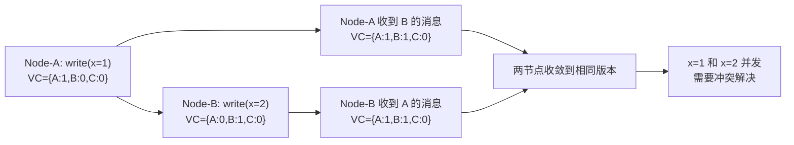

2019年某电商的 Cassandra 集群出现了一次诡异的事故：用户下单、支付、发货三个事件从不同数据中心写入，最终状态变成了"已支付"，但发货事件丢失了。

排查了两周，根因让所有人傻眼：三个事件并发写入时，由于时钟偏差，系统把"发货"事件当成了"旧版本"给覆盖了。研发团队以为是网络问题，但真正的问题是——**缺少因果关系追踪**。

向量时钟（Vector Clock）正是解决这类问题的方案。今天，我们把这个概念从原理到生产实践彻底讲透。

## 一、问题的本质：为什么需要因果追踪？

### 1.1 分布式系统的时钟困境

在单机系统里，物理时钟解决了"先后"问题。但在分布式系统里，物理时钟不可靠——网络延迟、机器时钟漂移、NTP 同步延迟，都会导致"时间戳"失真。

```
场景：三个数据中心各自处理同一订单

数据中心A：T=10:00:00 处理"下单"事件
数据中心B：T=10:00:01 处理"支付"事件（但网络延迟，实际是10:00:00.5发出的）
数据中心C：T=10:00:00.3 处理"发货"事件

如果用物理时钟排序：A → C → B（发货在支付之前！）
如果用向量时钟排序：A → B → C（因果正确：先支付才能发货）
```

这就是时钟困境：**物理时间不可信，必须用逻辑时间**。

### 1.2 因果关系的定义

**因果关系（causality）**：如果事件 B 依赖事件 A 的结果，则 A 和 B 有因果关系，记为 `A → B`。

```
场景：电商订单状态机

下单(xid=1001) → 支付(xid=1001) → 发货(xid=1001)

这三个事件有因果链：
  下单是支付的因（必须先下单才能支付）
  支付是发货的因（必须先支付才能发货）

如果发货事件覆盖了支付事件，因果链就断了
```

**并发（Concurrent）**：如果两个事件之间没有因果关系，则它们是并发的，可以以任意顺序处理。

```
用户A修改头像（无因果）
用户B修改收货地址（无因果）

这两个操作可以并行处理，谁先谁后无所谓
```

## 二、向量时钟原理

### 2.1 核心数据结构

向量时钟是一个逻辑时钟向量。**每个节点维护一个向量，每个向量元素记录了该节点已经看到的最大逻辑时间戳。**

```
假设有三个节点：Node-A、Node-B、Node-C

初始状态：
  VC_A = {A: 0, B: 0, C: 0}
  VC_B = {A: 0, B: 0, C: 0}
  VC_C = {A: 0, B: 0, C: 0}

Node-A 执行一次本地操作：
  VC_A[A]++ → {A: 1, B: 0, C: 0}

Node-B 执行一次本地操作：
  VC_B[B]++ → {A: 0, B: 1, C: 0}

Node-A 向 Node-B 发送消息（附带 VC_A）：
  Node-B 收到后合并：
    VC_B = max(VC_B, VC_A) → {A: 1, B: 1, C: 0}
  然后 VC_B[B]++ → {A: 1, B: 2, C: 0}
```

### 2.2 两条核心规则

向量时钟遵循两条规则：

**规则一（本地递增）**：节点执行本地操作后，将自己的时间戳加一。

```java
public class VectorClock {
    Map<String, Integer> clock = new HashMap<>();

    public void localEvent(String nodeId) {
        int current = clock.getOrDefault(nodeId, 0);
        clock.put(nodeId, current + 1);
    }
}
```

**规则二（消息合并）**：节点收到消息时，取两个向量每个分量的最大值，然后再递增自己的时间戳。

```java
public void onMessageReceived(Message msg, String myNodeId) {
    Map<String, Integer> receivedVC = msg.getVectorClock();

    // 合并：每个分量取 max
    for (String nodeId : allNodes) {
        int local = clock.getOrDefault(nodeId, 0);
        int remote = receivedVC.getOrDefault(nodeId, 0);
        clock.put(nodeId, Math.max(local, remote));
    }

    // 本地时间戳 +1
    clock.put(myNodeId, clock.get(myNodeId) + 1);
}
```

### 2.3 因果关系判断

给定两个向量时钟，如何判断它们的因果关系？

```java
public enum CausalityRelation {
    BEFORE,      // VC1 在 VC2 之前（VC1 是因）
    AFTER,       // VC1 在 VC2 之后（VC2 是因）
    EQUAL,       // 完全相同
    CONCURRENT,  // 并发（无因果关系）
}

public static CausalityRelation compare(
        Map<String, Integer> vc1,
        Map<String, Integer> vc2) {

    Set<String> allNodes = new HashSet<>(vc1.keySet());
    allNodes.addAll(vc2.keySet());

    boolean vc1AllLessOrEqual = true;
    boolean vc2AllLessOrEqual = true;

    for (String node : allNodes) {
        int v1 = vc1.getOrDefault(node, 0);
        int v2 = vc2.getOrDefault(node, 0);

        if (v1 < v2) vc1AllLessOrEqual = false;
        if (v2 < v1) vc2AllLessOrEqual = false;
    }

    if (vc1AllLessOrEqual && vc2AllLessOrEqual) return CausalityRelation.EQUAL;
    if (vc1AllLessOrEqual) return CausalityRelation.BEFORE;
    if (vc2AllLessOrEqual) return CausalityRelation.AFTER;
    return CausalityRelation.CONCURRENT;
}
```

```
示例分析：

VC1 = {A: 2, B: 1, C: 0}
VC2 = {A: 3, B: 0, C: 1}

比较：
  - A: 2 < 3 → VC1 不全小于 VC2
  - B: 1 > 0 → VC2 也不全小于 VC1
  → 并发关系（CONCURRENT）
  → 这两个操作互为独立，不能确定先后
```



## 三、向量时钟 vs Lamport 时钟

### 3.1 Lamport 时钟的局限性

Lamport 时钟是向量时钟的思想先驱，由 Leslie Lamport 于 1978 年提出。它的规则很简单：

```
规则1：本地操作后，时间戳 +1
规则2：发送消息时，附上当前时间戳
规则3：收到消息时，时间戳 = max(本地, 收到的) + 1
```

但 Lamport 时钟有一个致命缺陷：**它只能告诉你"先后"，不能告诉你"并发"**。

```
Lamport Clock 场景：

Node-A: L_A = 1 (执行操作X)
Node-B: L_B = 1 (执行操作Y)
Node-A 和 Node-B 互相不知道对方

此时 L_A = L_B = 1
你能判断 X 和 Y 是并发的吗？
  → 不能！Lamport 时钟只知道数字，不知道"谁见过谁"
```

### 3.2 向量时钟的优势

| 维度 | Lamport 时钟 | 向量时钟 |
| --- | --- | --- |
| 时间类型 | 单一标量 | N 维向量 |
| 并发判断 | 不能 | 能（通过比较向量） |
| 因果依赖追踪 | 不能 | 能 |
| 存储开销 | `O(1)` | `O(N)`（N = 节点数）|
| 代表系统 | 较少（早期系统）| DynamoDB、Cassandra |

【架构权衡】

Lamport 时钟是"轻量级工具"——存储小，但功能有限。向量时钟是"全功能工具"——能追踪完整因果图，但存储随节点数线性增长。实际工程中，小规模集群（小于 10 个节点）用向量时钟没问题；大规模系统需要用**版本向量**的有界版本做截断。

## 四、版本向量与向量时钟的区别

### 4.1 核心差异

这是面试和工程中经常混淆的概念。

| 维度 | 向量时钟 | 版本向量 |
| --- | --- | --- |
| 维度 | 固定 = 节点数 | 动态 = 有数据的副本数 |
| 语义 | 因果追踪（完整因果图）| 版本计数（记录更新次数）|
| 典型应用 | 理论模型、Cassandra | DynamoDB、Cassandra（有截断）|
| 可截断性 | 困难（截断会丢因果）| 容易（只截版本历史）|

```
向量时钟（理论上的完美版本）：

Node-A 处理 1000 次更新 → VC = {A:1000, B:5, C:3}
  → 1000 个维度中的 1 个是 1000，其他都很小
  → 存储效率极低

版本向量（工程中的实用版本）：

Node-A 处理 1000 次更新 → VV = {A:1000, B:5, C:3}
  → 结构相同，但可以截断：
  → 如果 A 超过阈值（比如 100），只保留最新值
  → VV_truncated = {A:1000}  （丢失了 B 和 C 的历史）
```

### 4.2 Cassandra 中的版本向量

Cassandra 使用**版本向量（Version Vector）** 而非严格意义上的向量时钟。每个副本节点在本地维护一个版本号，所有副本的版本号集合构成版本向量。

```
Cassandra 订单状态示例：

节点1（副本A）: VV = {A:3, B:2, C:1}
节点2（副本B）: VV = {A:2, B:3, C:1}

比较两个版本向量：
  - 节点1的VV > 节点2的VV？否（B:2 < B:3）
  - 节点2的VV > 节点1的VV？否（A:2 < A:3）
  → 并发！需要冲突解决
```

```java
// Cassandra 冲突解决：Last-Write-Wins（最常见）
public Version resolveConflict(Version v1, Version v2) {
    // 时间戳大的胜出
    if (v1.timestamp > v2.timestamp) {
        return v1;
    }
    return v2;
}
```

:::tip 💡
DynamoDB 的冲突解决策略是**可配置的**：可以用 Last-Write-Wins，也可以用应用层自定义合并（CRDT）。购物车场景用"并集合并"（ADD 操作合并），状态机场景用 Last-Write-Wins。
:::

## 五、Cassandra/DynamoDB 中的应用

### 5.1 写入冲突场景

```
场景：同一订单在不同数据中心并发更新

数据中心A：支付成功 → VC_A = {A:1, B:0, C:0}
数据中心B：发货成功 → VC_B = {A:0, B:1, C:0}
数据中心C：签收成功 → VC_C = {A:0, B:0, C:1}

三个事件互相不知道对方：
  VC_A 与 VC_B 比较 → 并发
  VC_B 与 VC_C 比较 → 并发
  VC_A 与 VC_C 比较 → 并发

结果：三个事件互为因果，需要冲突解决
```

### 5.2 冲突解决策略

**策略一：Last-Write-Wins（LWW）**

最简单，也是 DynamoDB/Cassandra 的默认策略。以时间戳作为最终裁决。

```java
public Object resolveByLWW(List<VersionedValue> versions) {
    return versions.stream()
        .max(Comparator.comparingLong(v -> v.timestamp))
        .orElseThrow();
}
```

:::warning ⚠️
LWW 的问题在于依赖物理时钟。如果两个事件时钟偏差大，可能出现"发货覆盖支付"这类因果颠倒的诡异问题。2019 年那次 Cassandra 事故，根因之一就是多数据中心时钟不同步。
:::

**策略二：向量合并（Merge）**

保留所有并发版本，通过向量时钟比较确定因果关系，只丢弃"被其他版本因果覆盖"的数据。

```java
public List<VersionedValue> mergeByCausality(List<VersionedValue> versions) {
    List<VersionedValue> result = new ArrayList<>();

    for (int i = 0; i < versions.size(); i++) {
        boolean dominated = false;
        for (int j = 0; j < versions.size(); j++) {
            if (i == j) continue;

            CausalityRelation r = compare(versions.get(i).vc, versions.get(j).vc);
            if (r == CausalityRelation.BEFORE) {
                dominated = true; // 被其他版本因果覆盖，丢弃
                break;
            }
        }
        if (!dominated) {
            result.add(versions.get(i));
        }
    }
    return result; // 只保留非被覆盖的版本
}
```

**策略三：CRDT（无冲突复制数据类型）**

对于特定数据类型（如 Set、Counter），可以用 CRDT 保证合并的正确性。

```
购物车场景（CRDT Set）：
  手机端：添加商品A
  电脑端：添加商品A（同一时间）

  CRDT Set 并集合并：{商品A} ∪ {商品A} = {商品A}
  → 不会重复，不会丢失

库存扣减场景（CRDT PN-Counter）：
  手机端：扣减库存1
  电脑端：扣减库存1（同一时间）

  PN-Counter：+1 -1 -1 = -1（两次扣减都生效）
  → 悲观处理，不会超卖
```

### 5.3 读修复与反熵

DynamoDB/Cassandra 使用两种机制修复副本间的数据不一致：

```java
// 读修复（Read Repair）：读取时主动修复
public class ReadRepair {
    public Version readWithRepair(String key) {
        // 1. 从 N 个副本读取
        List<Version> versions = quorumRead(key);

        // 2. 解决冲突
        Version latest = resolveConflict(versions);

        // 3. 异步修复过期副本（不阻塞读）
        for (Node node : replicas) {
            if (!node.has(latest)) {
                asyncRepair(node, key, latest);
            }
        }

        return latest;
    }
}

// 反熵（Anti-Entropy）：后台定期校验
public class AntiEntropy {
    // 使用 Merkle Tree 快速检测副本间差异
    // 差异部分进行增量同步

    public void verify(Node node1, Node node2) {
        MerkleTree tree1 = node1.buildMerkleTree();
        MerkleTree tree2 = node2.buildMerkleTree();

        // 比较 Merkle Tree 的哈希值
        // 不同子树代表需要同步的数据范围
    }
}
```

## 六、生产避坑

### 6.1 向量膨胀问题

向量时钟随节点数和更新次数线性增长。如果不做截断，内存会爆炸。

```
问题：
  1000 个节点的集群
  每个节点每天处理 100 万次更新
  → 每个版本的向量时钟大小 = 1000 维
  → 每秒内存增长 = 1000 * 1000000 / 86400 ≈ 11.5MB

一年后：
  每条数据的向量时钟 ≈ 365 * 11.5MB ≈ 4GB
  → 不可接受
```

**解决方案：有界向量时钟**

```java
public class BoundedVectorClock {
    private static final int MAX_ENTRIES = 10;
    private Map<String, Integer> vc = new LinkedHashMap<>(MAX_ENTRIES);

    // 按访问顺序保留最近 MAX_ENTRIES 个节点
    public void put(String nodeId, int value) {
        if (vc.size() >= MAX_ENTRIES && !vc.containsKey(nodeId)) {
            // 删除最旧的条目
            String oldest = vc.keySet().iterator().next();
            vc.remove(oldest);
        }
        vc.put(nodeId, value);
    }
}
```

Cassandra 的做法是：每个版本向量只记录"超过上次截断阈值"之后的版本，之前的版本用摘要表示。

### 6.2 时钟偏差导致的因果颠倒

```java
// ❌ 错误：完全依赖物理时钟
// 问题：NTP 延迟、时钟漂移导致时间戳失真

// ✅ 正确：使用混合逻辑时钟（HLC）
// Hybrid Logical Clock = 物理时间 + 逻辑计数器
public class HybridLogicalClock {
    long physical;   // 物理时间（来自本地时钟）
    int logical;      // 逻辑计数器

    public HybridLogicalClock receive(HybridLogicalClock remote) {
        this.physical = Math.max(this.physical, remote.physical) + 1;
        this.logical = (this.physical == remote.physical)
            ? Math.max(this.logical, remote.logical) + 1
            : 0;
        return this;
    }
}
```

Google Spanner 和 CockroachDB 使用 HLC（Hybrid Logical Clock）来解决时钟偏差问题。HLC 保证：因果关系由逻辑部分保证，物理部分提供可读性。

### 6.3 截断导致的部分因果丢失

```java
// ❌ 错误：无条件截断版本向量
// 问题：截断后，无法判断某些版本的因果关系

// ✅ 正确：基于阈值的有界截断
public class VersionVector {
    private Map<String, Long> vv = new HashMap<>();
    private static final long MAX_VERSION = 1000;

    public void increment(String replicaId) {
        long current = vv.getOrDefault(replicaId, 0L) + 1;
        vv.put(replicaId, current);

        // 只在超过阈值时才截断
        if (vv.size() > MAX_VERSION && current > MAX_VERSION) {
            // 保留摘要，丢弃详细历史
            this.summary = computeSummary(vv);
            this.vv.clear();
            this.vv.put(replicaId, current);
        }
    }
}
```

## 七、工程代价评估

| 维度 | 向量时钟 | 版本向量（有截断）|
| --- | --- | --- |
| 存储开销 | `O(N * M)`（N=节点数，M=版本数）| `O(N)`（有截断上限）|
| 消息大小 | `O(N)` | `O(N)` |
| 因果精度 | 完整 | 部分（截断后）|
| 实现复杂度 | 高 | 中 |
| 适用规模 | 小规模集群（`<` 20 节点）| 大规模集群（DynamoDB、Cassandra）|

【架构权衡】

向量时钟是理论上的完美方案，但在生产环境中必须做权衡：

1. **小规模系统**（小于 20 个节点）：用完整的向量时钟，精确追踪因果关系
2. **大规模系统**：用版本向量 + 有界截断，接受部分因果精度损失换取可扩展性
3. **高一致性要求**：用 HLC 替代物理时钟，避免时钟偏差导致的因果颠倒
4. **最终一致优先**：用 CRDT，在应用层保证合并的正确性，而不是在存储层

大多数分布式数据库（Cassandra、DynamoDB）选择的是"最终一致 + 可配置冲突解决"路线。向量时钟是实现手段，不是目的——**真正目的是让并发冲突可控可解决**。
