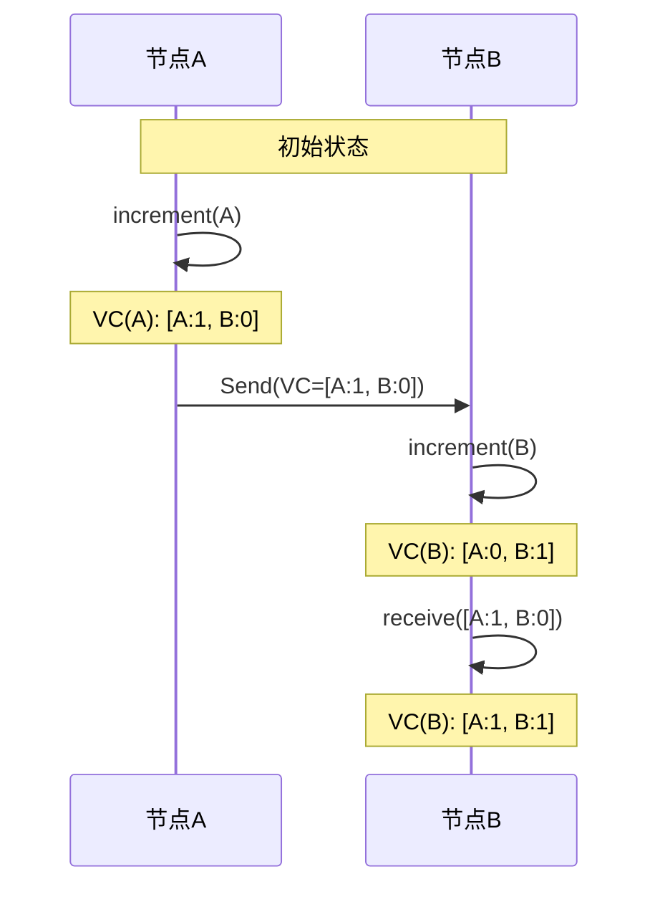
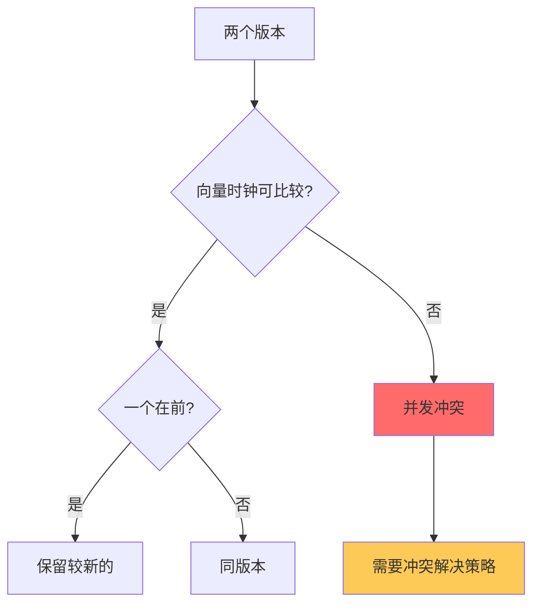

# 向量时钟：分布式系统中的因果追踪技术

## 快速自测：面试官最关心的 3 个问题

> 🟡 **中频常考**，P7 架构设计面试可能问

1. **向量时钟解决了什么问题？为什么需要向量时钟而不是简单的时间戳？**
2. **向量时钟的三个核心操作是什么？如何判断两个事件是否有序？**
3. **向量时钟的局限性是什么？如何解决「版本膨胀」问题？**

---

## 一、为什么需要向量时钟

### 1.1 物理时钟的问题

分布式系统中，不能用物理时钟判断事件顺序，因为：

1. **时钟不同步**：不同机器的时钟可能存在偏移
2. **时钟回拨**：NTP 同步可能导致时钟回拨
3. **分布式无全局时钟**：无法确定「真实」的事件顺序

```
物理时钟的不可靠性：

机器A: write(x, 1) at t=100
机器B: write(x, 2) at t=99

但实际上，机器B的操作可能发生在机器A之后！
因为时钟不同步，无法判断真实顺序。
```

### 1.2 Lamport 时钟的局限

Lamport 时钟可以保证「如果 A 导致 B，则 L(A) `<` L(B)」，但不能判断「A 是否导致 B」。

```
Lamport 时钟的问题：

事件1: A写入 -> L(A) = 1
事件2: B读取 -> L(B) = 2
事件3: B写入 -> L(B) = 3

问题：事件1和事件2真的有关系吗？
- 如果B读取了A写入的值，则有因果关系
- 如果B没读取，则无因果关系

Lamport 时钟无法区分这两种情况。
```

### 1.3 向量时钟的解决方案

向量时钟为每个节点维护一个向量，记录所有节点的逻辑时钟值。

```
向量时钟示例：

节点A: VC = [A:1, B:0, C:0]
节点B: VC = [A:0, B:1, C:0]
节点C: VC = [A:0, B:0, C:1]

通过比较向量，可以判断事件之间的因果关系。
```

---

## 二、向量时钟的核心操作

### 2.1 三个关键操作

| 操作 | 说明 | 示例 |
|------|------|------|
| **Increment** | 本地操作时，增加本地版本号 | VC[A]++ |
| **Send** | 发送消息时，附带当前向量时钟 | Send(VC) |
| **Receive** | 接收消息时，合并两个向量时钟 | VC = Max(Self, Received) |

### 2.2 向量时钟的操作实现

```java
public class VectorClock {
    private Map<NodeId, Long> clock;
    
    // 1. 本地操作：增加本地版本号
    public void increment(NodeId nodeId) {
        clock.merge(nodeId, 1L, Long::sum);
    }
    
    // 2. 发送消息：附带当前向量时钟
    public VectorClock send() {
        return this.copy();
    }
    
    // 3. 接收消息：合并向量时钟
    public void receive(VectorClock received) {
        for (NodeId nodeId : allNodes()) {
            long current = this.get(nodeId);
            long receivedValue = received.get(nodeId);
            this.set(nodeId, Math.max(current, receivedValue));
        }
    }
}
```

### 2.3 三个操作的时序图



---

## 三、因果关系的判断

### 3.1 三种关系

| 关系 | 定义 | 数学表示 |
|------|------|---------|
| **Happens-Before** | A 发生在 B 之前 | VC(A) `<` VC(B) |
| **Happens-After** | A 发生在 B 之后 | VC(A) `>` VC(B) |
| **Concurrent** | A 和 B 并发 | VC(A) 与 VC(B) 不可比较 |

### 3.2 判断规则

```java
public enum Comparison {
    BEFORE,      // A 在 B 之前
    AFTER,       // A 在 B 之后
    CONCURRENT   // A 和 B 并发
}

public Comparison compare(VectorClock v1, VectorClock v2) {
    boolean allLessOrEqual = true;
    boolean allGreaterOrEqual = true;
    boolean atLeastOneLess = false;
    boolean atLeastOneGreater = false;
    
    for (NodeId node : allNodes()) {
        long val1 = v1.get(node);
        long val2 = v2.get(node);
        
        if (val1 > val2) {
            allLessOrEqual = false;
            atLeastOneGreater = true;
        }
        if (val1 < val2) {
            allGreaterOrEqual = false;
            atLeastOneLess = true;
        }
    }
    
    if (allLessOrEqual && atLeastOneLess) return BEFORE;
    if (allGreaterOrEqual && atLeastOneGreater) return AFTER;
    return CONCURRENT;
}
```

### 3.3 判断示例

```
向量时钟比较示例：

VC1 = [A:1, B:2, C:0]
VC2 = [A:1, B:3, C:1]

判断：VC1 vs VC2

逐节点比较：
- A: 1 == 1
- B: 2 < 3
- C: 0 < 1

VC1 的所有分量都 <= VC2，且至少一个小于
=> VC1 happens-before VC2
```

```mermaid
graph LR
    A["VC1 = [A:1, B:2, C:0]"]
    B["VC2 = [A:1, B:3, C:1]"]
    
    A --> B
    Note over A,B: VC1 happens-before VC2
    
    C["VC3 = [A:2, B:0, C:0]"]
    D["VC4 = [A:0, B:2, C:1]"]
    
    C -.-> D
    D -.-> C
    Note over C,D: VC3 和 VC4 并发
    
    style A fill:#48dbfb
    style B fill:#48dbfb
```

---

## 四、向量时钟的冲突处理

### 4.1 冲突检测

当两个向量时钟无法比较时（即并发），说明存在冲突。



### 4.2 冲突解决策略

| 策略 | 说明 | 适用场景 |
|------|------|----------|
| **Last-Write-Wins** | 以时间戳为准，保留最新 | 简单场景 |
| **用户自定义** | 交给业务层处理 | 需要人工介入 |
| **多版本保留** | 保留所有冲突版本 | 需要完整历史 |
| **自动合并** | 基于业务规则合并 | 可合并的业务 |

### 4.3 Dynamo 的向量时钟实现

```java
public class DynamoVersion {
    private VectorClock clock;
    private byte[] value;
    
    // 获取所有因果前驱版本
    public Set<Version> getCausalPredecessors() {
        Set<Version> predecessors = new HashSet<>();
        for (Version v : allVersions) {
            if (this.clock.happensAfter(v.clock)) {
                predecessors.add(v);
            }
        }
        return predecessors;
    }
    
    // 判断是否为直接因果前驱
    public boolean isDirectSuccessor(Version other) {
        VectorClock merged = this.clock.merge(other);
        return merged.equals(this.clock);
    }
}
```

---

## 五、向量时钟的局限性

### 5.1 版本膨胀问题

向量时钟的大小与节点数成正比，当节点数增加时，存储开销也会增加。

```
问题：
- 1000 个节点的集群
- 每个对象需要存储 1000 维的向量
- 每次同步需要传输 1000 维的向量

解决方案：
1. 截断（Truncation）：只保留最近 N 个版本
2. 压缩（Compaction）：合并可以合并的版本
3. 时间戳混合：用物理时间戳 + 向量时钟
```

### 5.2 截断策略

```java
public class TruncatedVectorClock {
    private static final int MAX_SIZE = 10;
    private Map<NodeId, Long> clock;
    private long timestamp;
    
    // 当向量超过最大大小时，截断旧条目
    public void truncate() {
        if (clock.size() > MAX_SIZE) {
            // 保留最近的 MAX_SIZE 个条目
            // 并用物理时间戳作为兜底
            Map<NodeId, Long> recent = getMostRecent(MAX_SIZE - 1);
            recent.put("timestamp", timestamp);
            this.clock = recent;
        }
    }
}
```

### 5.3 其他局限性

| 问题 | 说明 | 解决方案 |
|------|------|----------|
| **存储开销** | 向量大小随节点数增长 | 截断、压缩 |
| **同步开销** | 每次同步传输完整向量 | 增量同步 |
| **复杂性** | 实现比时间戳复杂 | 使用成熟库 |

---

## 六、面试题精讲

### 🟡 面试题 1：向量时钟解决了什么问题？

**答案要点**：

1. **问题**：物理时钟不可靠，无法判断分布式系统中事件的因果顺序
2. **解决**：向量时钟为每个节点维护所有节点的逻辑时钟值
3. **优势**：可以精确判断两个事件是否有因果关系

**追问链**：

> **第一层**：为什么不能用物理时钟？
> **第二层**：向量时钟的三个核心操作是什么？
> **第三层**：如何判断两个事件是否并发？

### 🟡 面试题 2：向量时钟的局限性有哪些？

**答案要点**：

1. **版本膨胀**：向量大小随节点数增长
2. **存储开销**：每个版本都需要存储完整向量
3. **同步开销**：每次同步需要传输完整向量

---

## 七、实战思考题

### 思考题 1：Dynamo 的向量时钟实现

Dynamo 使用向量时钟来处理数据冲突。请分析 Dynamo 的冲突解决策略。

### 思考题 2：向量时钟 vs 版本向量

向量时钟（Vector Clock）和版本向量（Version Vector）有什么区别？

---

## 扩展阅读

如果本文档对你有帮助，建议继续阅读：

- [因果一致性](/distributed/theory/causal-consistency)：因果一致性详解
- [一致性模型对比](/distributed/theory/consistency-models)：各种一致性模型
- [Quorum 读写](/distributed/theory/quorum)：读写多数派机制