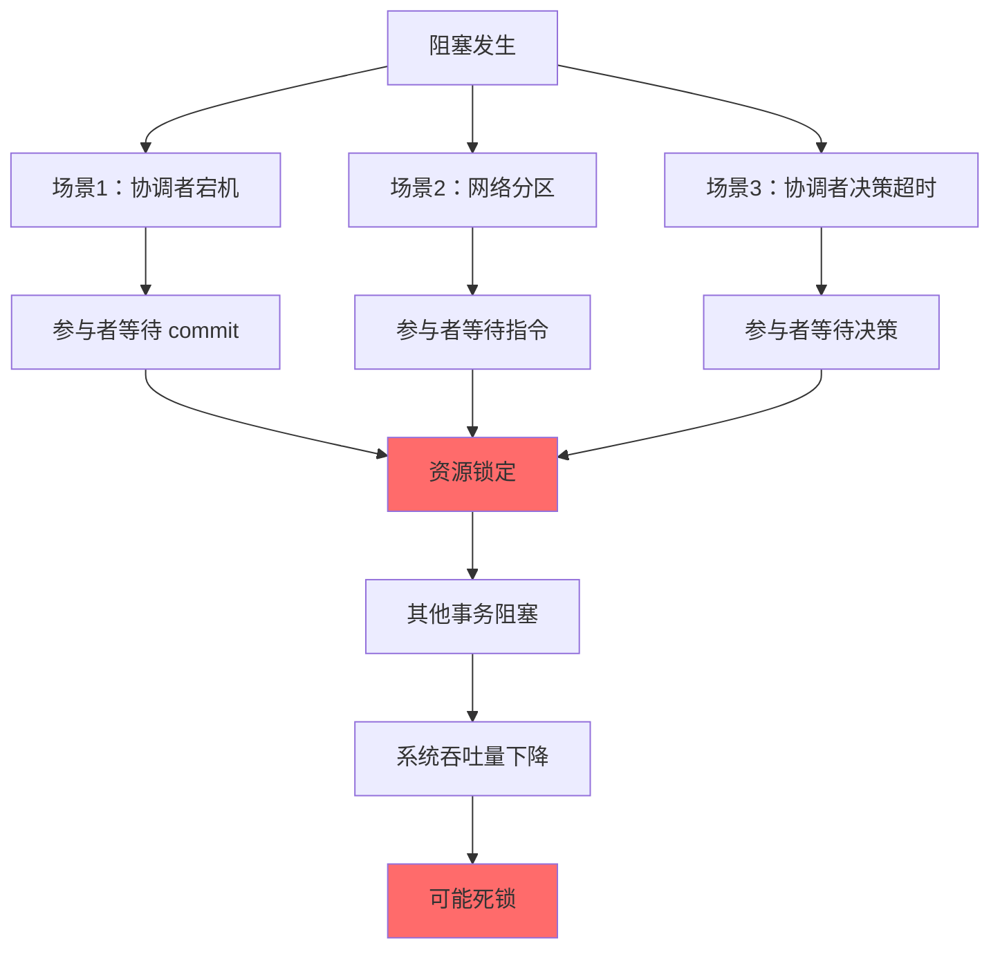
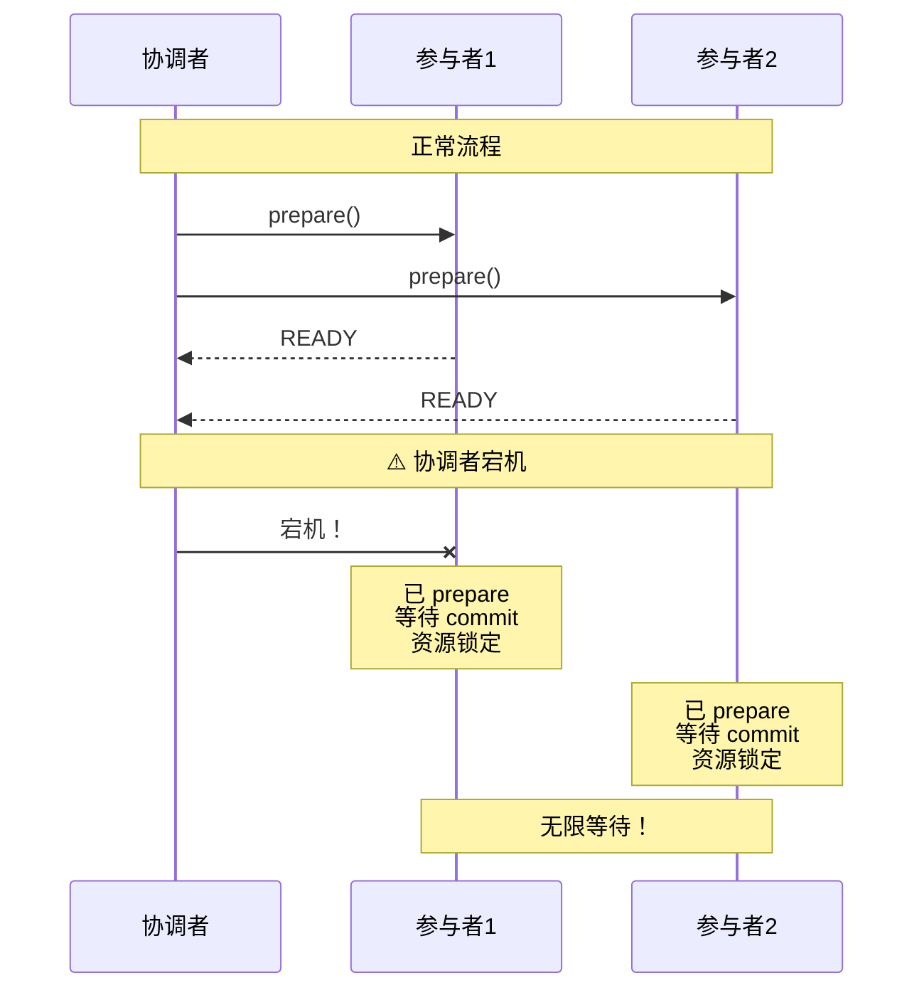
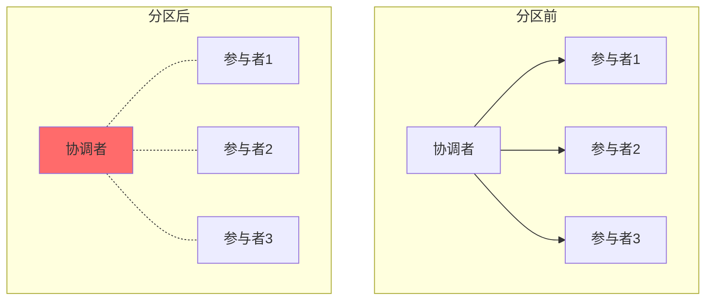
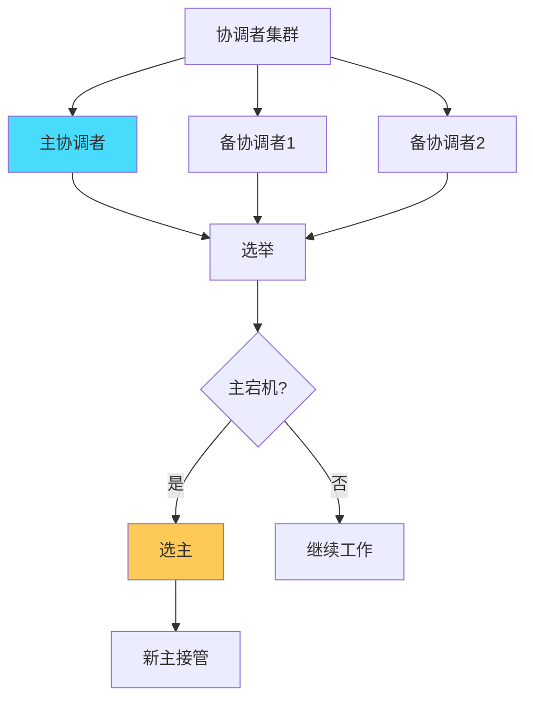
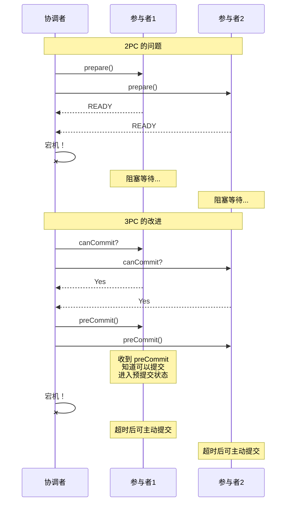

# 2PC 阻塞问题：分布式事务的核心困境

## 快速自测：面试官最关心的 3 个问题

> 🔴 **高频必考**，P6/P7 面试必问

1. **2PC 的阻塞是如何发生的？什么情况下会导致系统死锁？**
2. **协调者宕机和参与者宕机对 2PC 有什么不同的影响？**
3. **如何避免或解决 2PC 的阻塞问题？**

---

## 一、阻塞发生的根本原因

### 1.1 为什么 2PC 会阻塞

```
阻塞的本质：
参与者 prepare 成功后，必须等待协调者的最终指令
在等待期间，资源被锁定，无法释放

核心矛盾：
- 协调者决定需要时间（网络延迟 + 决策时间）
- 参与者等待需要资源（锁定期间无法被其他事务使用）
```

### 1.2 阻塞的场景



---

## 二、协调者宕机导致的阻塞

### 2.1 场景分析



### 2.2 问题分析

```
问题描述：
1. 所有参与者已返回 READY
2. 协调者发送 commit 前宕机
3. 参与者不知道是否应该提交
4. 资源被锁定，无法释放

后果：
- 参与者无法单方面决定提交或回滚
- 如果提交，数据可能不一致
- 如果回滚，可能违反协调者意图
```

### 2.3 解决方向

| 解决方案 | 说明 | 复杂度 |
|---------|------|--------|
| **等待协调者恢复** | 不处理，等待协调者重启 | 低 |
| **人工干预** | 人工检查并决定 | 低 |
| **协调者高可用** | 主备协调者 | 中 |
| **3PC** | 增加超时机制 | 高 |
| **Paxos 协调者** | 分布式协调者 | 高 |

---

## 三、网络分区导致的阻塞

### 3.1 分区场景



### 3.2 分区后的困境

```
分区场景：
- 协调者所在网络 与 参与者网络 断开
- 协调者无法发送 commit 到参与者

选择：
1. 等待分区恢复（可能无限等待）
2. 单方面决定（可能违反数据一致性）
```

### 3.3 CAP 视角下的阻塞

```
CAP 告诉我们：
- 分区时必须在 C（一致性）和 A（可用性）之间选择

2PC 的阻塞实际上是在选择 C（一致性）：
- 等待协调者指令，保证数据一致
- 但牺牲了可用性（资源锁定）

这正是 CAP 的体现：
- 阻塞 = 选择一致性
- 不阻塞 = 可能选择可用性（但数据可能不一致）
```

---

## 四、参与者宕机导致的阻塞

### 4.1 场景分析

```mermaid
sequenceDiagram
    participant C as 协调者
    participant P1 as 参与者1
    participant P2 as 参与者2
    
    Note over C,P2: 参与者2宕机
    
    C->>P1: prepare()
    C->>P2: prepare()
    
    P1-->>C: READY
    P2-x C: 无响应（宕机）
    
    Note over C,P2: 协调者无法确定如何决策
    
    C --> C1["等待 P2 恢复?"}
    C --> C2["单方面回滚?"}
    C --> C3["单方面提交?"}
    
    Note over C1: 可能无限等待
    Note over C2: P2 可能已提交（数据不一致）
    Note over C3: P2 可能已回滚（数据不一致）
```

### 4.2 问题分析

```
参与者宕机的影响：
1. 协调者不知道宕机参与者是否已 prepare
2. 无法确定是提交还是回滚
3. 只能等待参与者恢复

参与者恢复后的处理：
1. 查询协调者获取事务状态
2. 根据状态决定提交或回滚
3. 协调者需要持久化事务状态
```

---

## 五、超时机制与阻塞

### 5.1 参与者的超时策略

```java
// 参与者超时处理
public class Participant {
    
    public void onPrepare(PrepareRequest request) {
        // 1. 执行业务，准备资源
        prepareResources();
        
        // 2. 记录事务状态（用于恢复）
        saveTransactionState(request.getXid(), "PREPARED");
        
        // 3. 发送 READY
        sendReady(request.getXid());
        
        // 4. 等待协调者指令
        waitForCommitOrRollback();
    }
    
    // 等待超时的处理
    private void waitForCommitOrRollback() {
        try {
            // 等待协调者的 commit/rollback
            // 如果超时，需要有策略处理
            Response response = waitForResponse(TIMEOUT_MS);
            
            if (response.isCommit()) {
                commit();
            } else {
                rollback();
            }
        } catch (TimeoutException e) {
            // ⚠️ 超时后如何处理？
            // 不能直接回滚，因为协调者可能已发送 commit
            handleTimeout();
        }
    }
    
    private void handleTimeout() {
        // 可能的处理策略：
        // 1. 询问协调者（需要协调者高可用）
        // 2. 查询其他参与者（可能被欺骗）
        // 3. 一直等待（阻塞）
        // 4. 回滚（可能导致数据不一致）
    }
}
```

### 5.2 协调者的超时策略

```java
// 协调者超时处理
public class Coordinator {
    
    private Map<String, TransactionState> transactions = new ConcurrentHashMap<>();
    
    // 等待参与者 prepare 超时
    public void onPrepareTimeout(String xid, Set<String> notResponded) {
        // 有参与者未响应，决定回滚
        abort(xid);
    }
    
    // 发送 commit 后等待参与者确认超时
    public void onCommitTimeout(String xid, Set<String> notConfirmed) {
        // ⚠️ 参与者可能已 commit
        // 需要重新发送 commit
        // 或者记录状态，等待恢复后确认
        resendCommit(xid);
    }
}
```

---

## 六、阻塞问题的解决方案

### 6.1 协调者高可用



**问题**：仍然需要解决新协调者如何获取事务状态。

### 6.2 事务状态持久化

```java
// 协调者持久化事务状态
public class PersistentCoordinator {
    
    // 事务状态表结构
    // xid | status | created_at | updated_at | participants
    // -----------+---------+-------------+-------------+----------
    // 001 | PREPARE | 10:00:00 | 10:00:05 | [P1, P2, P3]
    // 002 | COMMIT  | 10:01:00 | 10:01:10 | [P1, P2]
    
    public void beginTransaction(String xid, Set<String> participants) {
        // 持久化事务开始状态
        saveTransaction(xid, "BEGIN", participants);
    }
    
    public void onParticipantReady(String xid, String participant) {
        // 更新参与者状态
        updateParticipantStatus(xid, participant, "READY");
        
        // 检查是否所有参与者都 ready
        if (allParticipantsReady(xid)) {
            // 记录决策
            updateTransactionStatus(xid, "DECIDED_COMMIT");
        }
    }
    
    public void commit(String xid) {
        // 持久化 commit 决策
        updateTransactionStatus(xid, "COMMITTING");
        
        // 发送 commit 到所有参与者
        sendCommitToParticipants(xid);
        
        // 等待确认
        waitForAllConfirmations(xid);
        
        // 更新最终状态
        updateTransactionStatus(xid, "COMMITTED");
    }
}
```

### 6.3 3PC：增加超时阶段

3PC 在 2PC 的基础上增加了「PreCommit」阶段，让参与者可以在协调者超时后主动推进。



---

## 七、面试题精讲

### 🔴 面试题 1：2PC 的阻塞是如何发生的？

**答案要点**：

1. **原因**：参与者 prepare 成功后，必须等待协调者的 commit/rollback 指令
2. **阻塞**：等待期间，资源被锁定，无法被其他事务使用
3. **场景**：协调者宕机、网络分区、协调者决策超时

**追问链**：

> **第一层**：为什么 2PC 会阻塞？
> **第二层**：协调者宕机和参与者宕机分别会导致什么问题？
> **第三层**：3PC 是如何解决阻塞问题的？

### 🔴 面试题 2：如何解决 2PC 的阻塞问题？

**��案要点**：

1. **协调者高可用**：主备协调者，宕机后自动切换
2. **事务状态持久化**：协调者持久化事务状态，宕机后可恢复
3. **3PC**：增加超时机制，让参与者可以在协调者宕机后主动推进
4. **业务层处理**：人工干预或定时检查

---

## 八、实战思考题

### 思考题 1：协调者宕机后如何恢复？

假设协调者在发送 commit 前宕机，恢复后如何确定事务状态？

### 思考题 2：3PC 真的解决了阻塞问题吗？

3PC 虽然增加了超时机制，但参与者超时后应该提交还是回滚？

---

## 扩展阅读

如果本文档对你有帮助，建议继续阅读：

- [3PC 三阶段提交](/distributed/transaction/3pc)：解决 2PC 阻塞的方案
- [2PC vs 3PC](/distributed/transaction/2pc-vs-3pc)：两者的详细对比
- [CAP 定理](/distributed/theory/cap)：CAP 与阻塞问题的关系