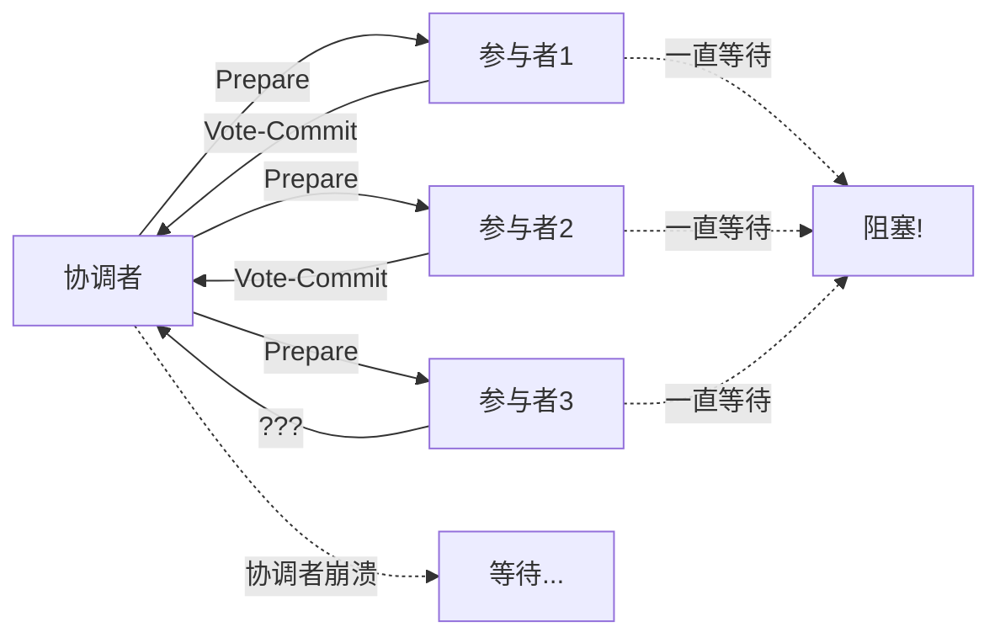
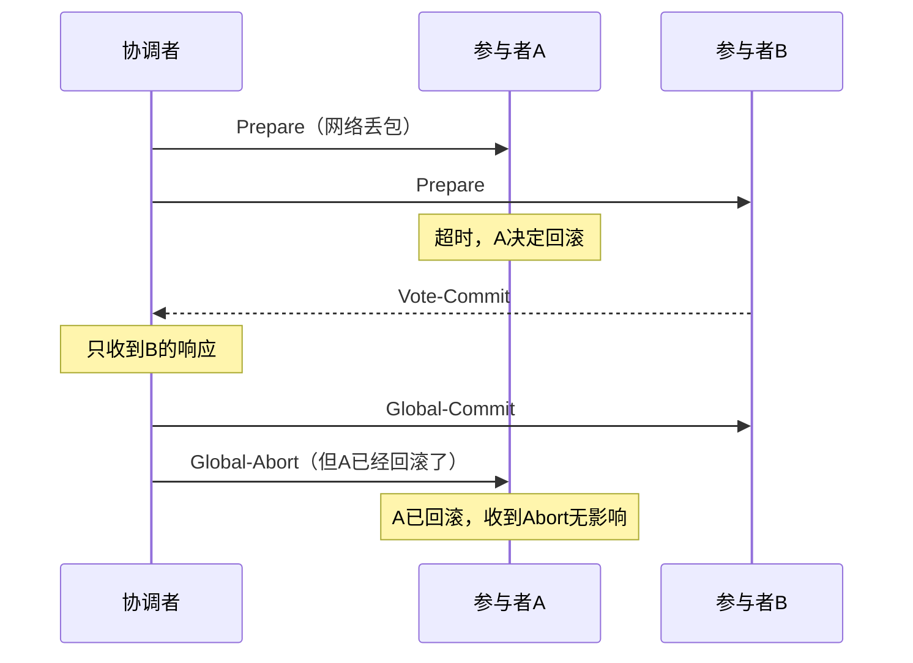
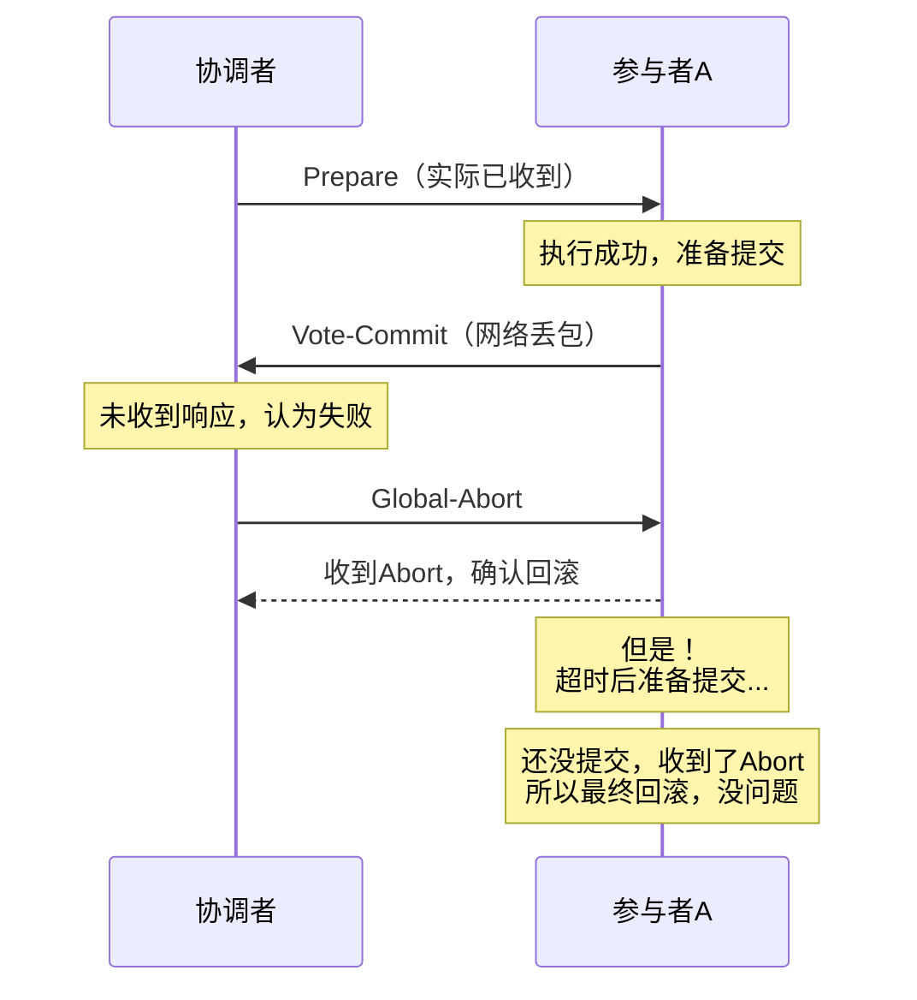

2021年618大促前夜，团队做了最后一次压测。

测试环境一切正常，上了生产后悲剧发生了：凌晨0点流量上来，数据库开始出现大量锁等待。5分钟后，数据库连接池全部耗尽，所有涉及跨库事务的请求全部超时。

事后复盘，压测用的是单库，XA 事务的参与者只有 1 个，测试时根本没测出 2PC 的阻塞问题。生产环境真实参与者有 4 个，加上网络延迟，Prepare 阶段的平均耗时从 20ms 变成 180ms。赶上流量高峰，锁等待超时像多米诺骨牌一样倒下。

这个案例告诉我们：**2PC 的问题，不看生产流量永远测不出来。**

## 一、阻塞问题的根因

先说结论：**2PC 的阻塞，根源是"单点决策+同步等待"的设计。**

在 Prepare 阶段，参与者执行完本地事务后，不提交，只等协调者的指令。这个"等"是同步阻塞的。如果协调者在这段时间内崩溃、宕机、或者网络丢包，参与者就会一直等下去。



参与者被锁住后会发生什么？

1. 数据库行锁被持有，其他事务无法修改这些行
2. 阻塞的事务越多，锁等待队列越长
3. 数据库连接被占用，新请求拿不到连接
4. 连接池耗尽，应用层开始报错
5. 如果有服务依赖这个数据库，级联故障开始蔓延

【架构权衡】

有人会说："让参与者加超时机制就好了，超时就回滚。"

事情没那么简单。超时回滚的前提是"参与者自己决定回滚"。但 2PC 协议里，**一旦 Prepare 成功，参与者的命运就交给协调者了**。如果超时后参与者自行回滚，而协调者那边认为事务已经提交，数据就彻底乱了。

这就是 2PC 设计上的两难：**等下去会死（阻塞），不等也会死（脑裂）。**

## 二、三种经典阻塞场景

### 2.1 协调者崩溃

这是教科书里讲得最多的场景。协调者发了 Prepare 后崩溃，参与者都在等 Commit/Rollback。

**参与者侧能做什么？**

在标准 2PC 协议里，参与者什么都不做，只能等。等待协调者恢复。

**工程上的缓解措施**：

1. **协调者高可用**：主备切换，MySQL + ZooKeeper 做选主。Seata 的 TC（Transaction Coordinator）支持集群部署。
2. **事务日志持久化**：协调者崩溃前把事务状态写入持久化存储（如数据库表）。恢复后读取日志继续执行。ShardingSphere 的 XA 事务就是这种思路。
3. **超时自动回滚**：给参与者设置超时时间，超时后自动回滚。这是 3PC 的改进方向，但引入了新问题（后面讲 3PC 时细说）。

### 2.2 部分参与者网络超时

更隐蔽的场景：协调者发给参与者 A 的 Prepare 超时了，发给 B 的没超时。协调者认为 A 失败了，发了全局回滚。但 A 的超时只是网络抖动，A 实际执行成功了，却收到了回滚指令。



这个场景还好，A 刚好在超时前已经回滚了。如果 A 在超时后才收到协调者的 Global-Commit 呢？



这个场景下，最终结果是正确的。但问题是：**A 在超时后、在收到 Abort 前，到底在做什么？** 它的状态是"已执行，提交或不提交取决于是否超时"。这暴露了 2PC 在网络不确定性下的脆弱性。

### 2.3 协调者与参与者对"事务状态"的认知不一致

这是最可怕的情况。协调者认为事务提交了，但参与者 A 因为网络问题没收到 Commit。参与者 A 超时后回滚了。但数据库里，其他参与者已经提交了。

这就是**数据不一致**，且没有任何日志记录这场灾难是怎么发生的。

:::warning
Commit 阶段的失败是 2PC 的阿喀琉斯之踵。一旦参与者收到了 Commit 请求并执行，事务就不可逆了。如果协调者在 Commit 发送后崩溃，参与者已经提交了，协调者不知道是否成功——这就是"单点决策"的诅咒。
:::

## 三、阻塞问题的量化分析

阻塞问题的严重程度可以用一个简单公式估算：

```
阻塞时间 = 协调者故障恢复时间 + 网络恢复时间 + 人工干预时间
```

| 场景 | 预期阻塞时间 |
| --- | --- |
| 协调者进程崩溃，自动重启 | 几秒到几十秒 |
| 协调者机器宕机，主备切换 | 几十秒到几分钟 |
| 协调者所在机房断电，UPS接管 | 几分钟到十几分钟 |
| 协调者需要人工恢复（数据损坏） | 十几分钟到几小时 |

对于高频交易系统，几秒钟的阻塞就可能导致消息堆积、连接池耗尽、用户体验断崖式下降。这就是为什么金融系统用 2PC 但必须配合完善的监控和应急预案。

## 四、Commit 阶段的不确定性

2PC 的 Prepare 阶段是确定性的：要么所有人都同意提交，要么有人申请回滚。但 Commit 阶段不是。

### 4.1 提交失败

参与者收到 Commit 请求后，执行提交时可能失败：
- 磁盘满了，写不进去
- 数据库崩溃了
- 机器断电了

MySQL XA 事务在提交阶段失败了会怎样？根据 MySQL 官方文档，XA Commit 失败时，MySQL 会返回错误，但**事务状态已经部分提交了**（redo log 正在写入）。这种情况下需要人工介入恢复。

```sql
-- MySQL XA 提交失败后，需要检查状态
xa recover;
-- 会列出所有处于 PREPARED 状态的 XA 事务
-- 然后根据情况手动 xa commit 或 xa rollback
```

### 4.2 提交后的通知丢失

协调者成功发送了 Commit，参与者也成功执行了。但向协调者返回"提交成功"这个消息丢了。

协调者认为提交失败了（没收到响应），又发了一遍 Commit——重复提交。但因为数据库有自己的幂等机制，重复 Commit 不会造成数据问题。

**关键点**：2PC 的 Commit 阶段天然需要幂等性保障。参与者必须能处理重复的 Commit 请求。

【架构权衡】

为什么 2PC 的 Commit 阶段无法做到原子性？因为 Commit 本身需要写磁盘，而写磁盘需要多轮 I/O。任何需要 I/O 的操作都无法保证原子性——这是物理限制，不是协议缺陷。

3PC 试图通过"提前提交"来减少这个窗口，但代价是引入了新的问题。

## 五、为什么说协调者单点是最大的坑

很多人认为 2PC 的问题是"阻塞"。但从工程角度，**协调者单点才是最核心的坑**。

协调者崩溃 -> 参与者阻塞 -> 锁无法释放 -> 后续事务全部失败 -> 数据库连接池耗尽 -> 应用报错 -> 用户体验下降

这是一个典型的级联故障（cascading failure）。起点只是一个进程崩溃，终点是整个系统不可用。

解决方案不是让协调者更可靠（硬件冗余、更好的监控），而是**重新审视架构**：是否真的需要 2PC？参与者是否太多了？

:::tip
如果你的系统里 2PC 的参与者超过 5 个，基本可以确定架构设计有问题。好的微服务拆分，应该让跨服务的事务尽量少参与者的短事务。
:::

## 六、生产排障方法论

当生产环境出现 2PC 导致的阻塞时，按这个顺序排查：

### 6.1 第一步：确认阻塞范围

```sql
-- MySQL 查看当前锁等待
SELECT * FROM information_schema.INNODB_LOCK_WAITS;
-- 查看当前活跃事务
SELECT * FROM information_schema.INNODB_TRX WHERE trx_state = 'LOCK WAIT';
```

如果发现大量 `LOCK WAIT` 状态的事务，且这些事务涉及跨库操作，很可能是 XA 事务阻塞。

### 6.2 第二步：定位悬空 XA 事务

```sql
-- MySQL 查看 PREPARED 状态的 XA 事务
xa recover;
-- 输出格式：
-- formatID gtrid bqual state
-- 1 'gtrid' 'bqual' 'PREPARED'
```

如果看到 PREPARED 状态的事务，说明协调者崩溃了，这些事务需要手动处理。

### 6.3 第三步：分析根因

| 现象 | 可能原因 |
| --- | --- |
| 突然出现大量 PREPARED 事务 | 协调者进程崩溃 |
| 持续出现 PREPARED 事务 | 协调者逻辑有 bug，长时间不提交 |
| 部分节点 PREPARED，部分已提交 | 网络分区，协调者只给部分节点发了 Commit |

### 6.4 第四步：应急处理

```sql
-- 保守方案：全部回滚（如果业务允许数据回退）
xa rollback 'gtrid';

-- 激进方案：查看日志，确认提交是否成功，然后手动提交
-- 仅在你确定其他参与者已提交时使用
xa commit 'gtrid';
```

## 七、工程代价评估

| 维度 | 评估 |
| --- | --- |
| 运维成本 | 高。需要监控 XA 事务状态、Prepared 队列、锁等待情况。 |
| 排障复杂度 | 极高。涉及多个数据库节点、网络状态、事务日志的综合分析。 |
| 扩展性 | 差。每增加一个参与者，事务耗时线性增长。 |
| 可用性 | 低。协调者单点是致命弱点。 |
| 适用规模 | 极小规模、高一致性要求、低并发。 |

【架构权衡】

2PC 的问题是系统性设计问题，不是打补丁能解决的。它的阻塞和单点问题来自协议本身的假设：在分布式环境里，**不可能同时做到强一致、高可用和分区容错**。

所以回到最根本的问题：**你的业务真的需要强一致吗？**

如果答案是"不一定"，那就别硬上 2PC。Saga、TCC、本地消息表，这些最终一致方案虽然在理论上不如 2PC 优雅，但在工程上更可靠、更易维护。

:::tip
如果你在做一个新系统，不确定是否需要 2PC，答案是"不需要"。99%的分布式事务场景，最终一致方案足够应付。把 2PC 留给真正的金融核心链路。
:::
