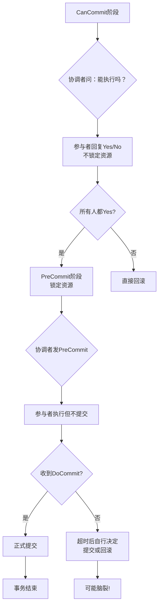
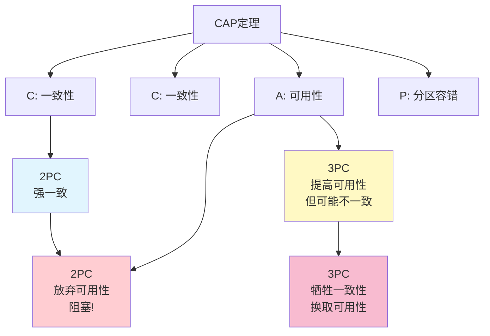
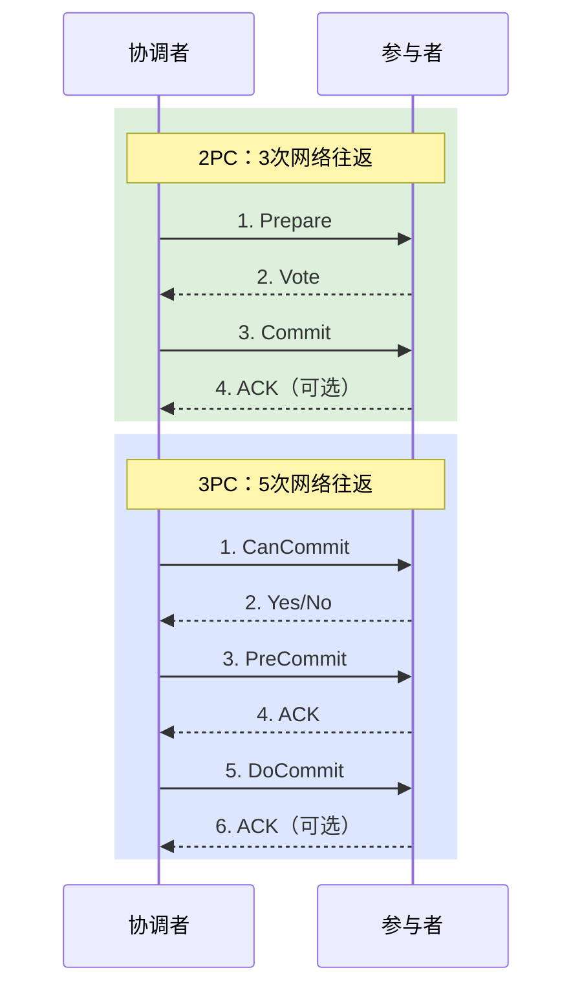

面试官问："2PC 和 3PC 的核心区别是什么？"

大多数候选人会背："2PC 有阻塞问题，3PC 解决了阻塞。"

面试官追问："3PC 解决了阻塞问题，那它引入了什么新问题？"

一半的候选人开始支支吾吾。

面试官继续追问："既然 3PC 更好，为什么生产环境里用 3PC 的案例极少？"

能回答到点上的，不到 20%。

这道题的本质，不是考你记没记住协议流程，而是考你**是否理解 CAP 定理在工程实践里的权衡**。

## 一、协议设计哲学对比

### 1.1 2PC：悲观锁思维

2PC 骨子里是悲观的：**先锁定资源，再问能不能提交。**

```mermaid
graph TD
    A[协调者向所有参与者发Prepare] --> B{参与者执行本地事务<br/>锁定相关资源}
    B --> C{锁定成功?}
    C -->|是| D[回复Vote-Commit]
    C -->|否| E[回复Vote-Abort]
    D --> F[等待协调者最终指令]
    E --> G[协调者发全局回滚]
    F --> H{收到指令?}
    H -->|收到Commit| I[提交，释放锁]
    H -->|超时| J[一直等待...阻塞!}
    I --> K[事务结束]
```

Prepare 阶段，参与者就锁定了资源。**锁从锁定到释放，中间可能有几秒到几分钟的不确定性。** 这段时间内，其他事务无法修改这些行。

### 1.2 3PC：乐观超时思维

3PC 骨子里是乐观的：**先用超时兜底，再决定怎么处理。**



3PC 把"锁定资源"推迟到第二阶段，并且引入了超时机制。参与者不再傻等，而是有自主决策能力。

【架构权衡】

两种设计哲学对应两种业务假设：

- **2PC 假设**：网络分区是小概率事件，宁可阻塞也要保证强一致
- **3PC 假设**：网络分区不可避免，宁可冒脑裂风险也要保证可用性

哪个对？取决于业务需求。金融核心链路的假设更像 2PC，普通互联网业务的假设更像 3PC。

## 二、一致性维度对比

### 2.1 CAP 定理下的定位

在 CAP 定理框架下，2PC 和 3PC 的定位不同：



- **2PC**：CP 系统。选择强一致，代价是网络分区时阻塞（不可用）。
- **3PC**：部分 AP 系统。试图在可用性和一致性之间找平衡，但在分区时可能牺牲一致性。

### 2.2 数据一致性保证

| 一致性场景 | 2PC | 3PC |
| --- | --- | --- |
| 协调者正常，所有参与者正常 | 强一致 | 强一致 |
| 协调者崩溃，部分参与者 Prepare 成功 | 阻塞 | PreCommit 的参与者可能提交（脑裂） |
| 网络分区，部分参与者与协调者失联 | 失联侧阻塞 | 可能脑裂 |
| Commit 阶段丢包 | 协调者认为失败，重试 | 参与者超时后自行决定 |

2PC 的不一致场景只有一个（Commit 丢包）。3PC 的不一致场景更多（PreCommit 阶段的分区）。

## 三、性能维度对比

### 3.1 网络开销



3PC 比 2PC 多 2 次网络往返（CanCommit + PreCommit 的 ACK）。在跨机房、跨地域的分布式事务里，这多出的往返时间可能超过 100ms。

### 3.2 锁持有时间

| 阶段 | 2PC 锁持有时间 | 3PC 锁持有时间 |
| --- | --- | --- |
| CanCommit | 不存在 | 无锁 |
| PreCommit | 整个 Prepare 阶段 | 从 PreCommit 到 DoCommit |
| 总计 | 长（从 Prepare 到 Commit） | 短（从 PreCommit 到 DoCommit） |

3PC 的锁持有时间更短，这是它性能优于 2PC 的主要原因。

【架构权衡】

性能差异的实际影响：

- 单次事务：3PC 慢约 30%~50%（多了 2 次网络往返）
- 高并发场景：3PC 可能更快（锁持有时间短，减少了锁竞争）

但这个性能差异在大多数场景下不是决定因素。**真正的瓶颈往往是参与者数量**，而不是协议本身。

## 四、工程实践对比

### 4.1 数据库支持

| 数据库 | 2PC/XA | 3PC |
| --- | --- | --- |
| MySQL | 原生支持（`XA PREPARE/COMMIT`） | 无原生支持 |
| PostgreSQL | 原生支持（`PREPARE TRANSACTION`） | 无原生支持 |
| Oracle | 原生支持 | 无原生支持 |
| MongoDB | 支持（4.2+） | 无支持 |

**没有任何主流数据库原生支持 3PC。** 这意味着用 3PC 必须自己实现所有逻辑，工程量巨大。

### 4.2 运维复杂度

| 维度 | 2PC | 3PC |
| --- | --- | --- |
| 监控指标 | PREPARED 事务数量、锁等待 | 多阶段状态、超时计数、脑裂标记 |
| 故障排查 | 相对简单（看 XA 事务状态） | 极其复杂（需要判断在哪个阶段超时） |
| 数据修复 | 人工提交或回滚 | 人工判断哪边是正确的，然后修复 |
| 标准化程度 | 高（XA 协议、JTA 标准） | 无标准，各家实现不同 |

### 4.3 生产故障对比

**2PC 生产故障**：

```
现象：大量 PREPARED 状态的 XA 事务，数据库连接池耗尽
原因：协调者崩溃或网络超时，参与者等待指令
处理：恢复协调者，手动 xa commit/rollback
时长：几分钟到几小时
```

**3PC 生产故障**：

```
现象：多地数据中心数据不一致
原因：PreCommit 阶段网络分区，一部分提交了，一部分超时回滚了
处理：无法自动恢复，需要人工判断哪边是"正确"的数据
时长：几小时到几天
```

3PC 的故障比 2PC 难处理得多。**2PC 的故障至少知道"数据是一致的，只是一致在某个中间状态"。3PC 的故障意味着"数据已经不一致了"。**

## 五、选型决策矩阵

【架构权衡】

| 维度 | 2PC | 3PC | 推荐 |
| --- | --- | --- | --- |
| 一致性要求 | 强一致 | 弱一致 | 按需 |
| 可用性要求 | 低（能接受阻塞） | 高 | 按需 |
| 参与者数量 | `< 5` | `< 3` | 更倾向 Saga/TCC |
| 网络质量 | 好（同机房） | 好（低延迟） | 更倾向 Saga/TCC |
| 工程能力 | 中等 | 高（需要自研） | 按能力 |
| 数据库支持 | 原生 | 需自研 | 2PC |
| 故障恢复 | 简单（状态明确） | 复杂（可能脑裂） | 2PC |

**选 2PC 的场景**：
- 跨库转账、清结算等强一致场景
- 参与者数量少（`< 5`）
- 能接受协调者高可用的运维成本

**选 3PC 的场景**：
- 几乎没有。绝大多数场景用 TCC 或 Saga 代替。

:::tip
如果你正在评估 3PC，大概率是在用错误的方式解决一个问题。**2PC 的阻塞问题不在协议本身，而在你选择了不适合的业务拆分。** 减少参与者数量、把长事务拆成短事务、用最终一致方案——这些架构层面的改进远比换一个协议有效。
:::

## 六、面试回答范式

面试时遇到 2PC vs 3PC 的问题，按这个结构回答：

```
回答结构：
1. 核心区别（1句话）
   "2PC 是悲观锁思维，先锁资源再提交；3PC 是乐观超时思维，
    引入超时机制让参与者能自主决策。"

2. 解决了什么问题（2句话）
   "3PC 解决了 2PC 的阻塞问题——协调者崩溃后参与者不再无限等待，
    可以通过超时机制自行决定下一步。"

3. 引入了什么问题（3句话）
   "代价是可能发生脑裂。当 PreCommit 阶段发生网络分区时，
    一部分参与者收到 DoCommit 提交了，另一部分超时后也提交了，
    导致数据不一致。"

4. 为什么工程上用得少（2句话）
   "第一，没有任何主流数据库原生支持 3PC，需要自研，工程量巨大；
    第二，3PC 的故障（脑裂）比 2PC 的故障（阻塞）更难处理。
    实践中不如用 TCC 或 Saga 在业务层做补偿更可控。"

5. 选型建议（1句话）
   "大多数场景用 2PC 或最终一致方案，3PC 几乎不做为首选项。"
```

【架构权衡】

最后记住一个核心观点：**协议层面的改进，不如架构层面的改进有效。**

2PC 的阻塞问题，根因是"参与者太多+锁持有时间长"。解决方案不是换一个"改进版"协议，而是：
1. 减少参与者数量（服务拆分合理化）
2. 缩短锁持有时间（改用最终一致方案）
3. 在业务层做幂等和补偿（不依赖协议保证）

:::tip
面试加分项：能说出"3PC 在 1983 年提出，但至今没有主流数据库支持"这个事实。这说明你不只看了理论，还关注了工程现实。
:::
