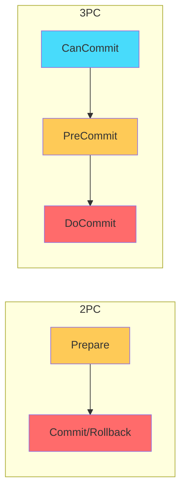
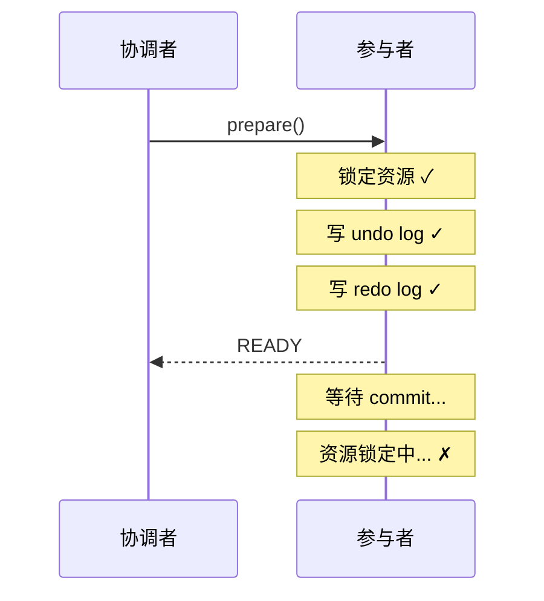
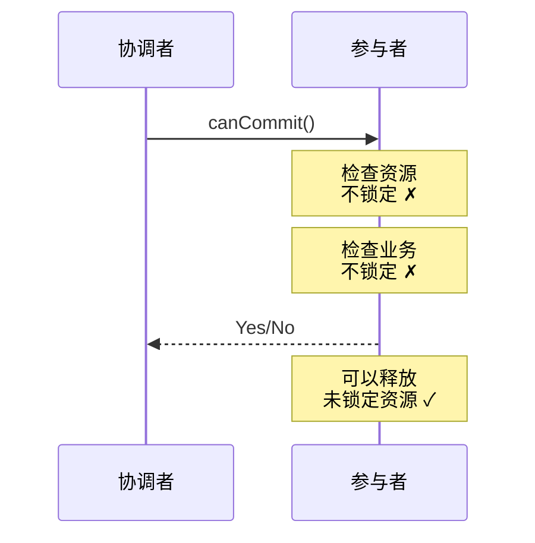
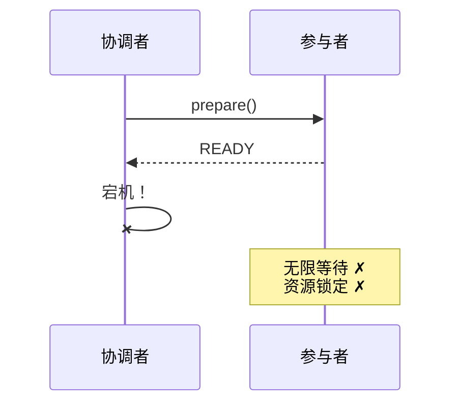
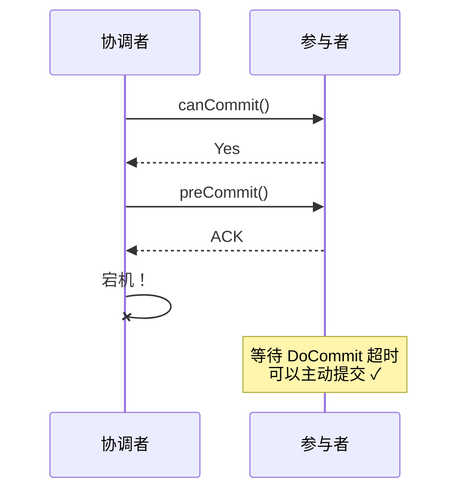
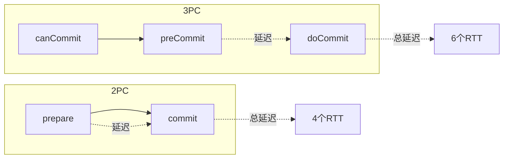
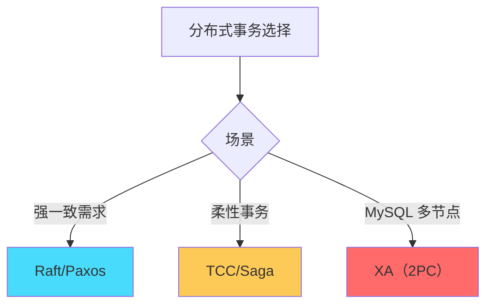

# 2PC vs 3PC：两阶段与三阶段提交的深度对比

## 快速自测：面试官最关心的 3 个问题

> 🟡 **中频常考**，P6/P7 面试可能问

1. **2PC 和 3PC 的核心区别是什么？为什么需要增加一个阶段？**
2. **3PC 在哪些场景下比 2PC 更好？又在哪些场景下不如 2PC？**
3. **为什么在实际工程中，2PC 比 3PC 更常用？**

---

## 一、核心区别总览

### 1.1 阶段对比



### 1.2 详细对比表

| 维度 | 2PC | 3PC |
|------|-----|-----|
| **阶段数** | 2 | 3 |
| **资源锁定时机** | Prepare 阶段 | PreCommit 阶段 |
| **阻塞时间** | 长 | 短 |
| **协调者宕机处理** | 阻塞 | 超时后可推进 |
| **网络分区处理** | 不完善 | 不完善（但有改进） |
| **性能开销** | 较高 | 更高 |
| **实现复杂度** | 中 | 高 |
| **实际应用** | 多（MySQL XA） | 少 |

---

## 二、Prepare vs CanCommit：资源锁定的时机

### 2.1 2PC 的 Prepare 阶段



**关键点**：2PC 的 Prepare 阶段锁定资源，如果协调者后续决定回滚，资源才会释放。

### 2.2 3PC 的 CanCommit 阶段



**关键点**：3PC 的 CanCommit 阶段只做检查，不锁定资源。

---

## 三、阻塞时间对比

### 3.1 2PC 的阻塞时间

```mermaid
gantt
    title 2PC 阻塞时间分析
    dateFormat X
    
    section 2PC
    Prepare（锁定资��）: 0, 10
    等待协调者决策: 10, 30
    Commit: 30, 40
    释放资源: 40, 50
    
    note Prepare: 0-10
    note 阻塞: 10-40
    note 释放: 40-50
```



```
阻塞时间 = Prepare 到 Commit 的时间
如果协调者宕机，阻塞可能无限长
```

### 3.2 3PC 的阻塞时间

```mermaid
gantt
    title 3PC 阻塞时间分析
    dateFormat X
    
    section 3PC
    CanCommit（检查）: 0, 10
    PreCommit（锁定）: 10, 30
    等待DoCommit: 30, 40
    DoCommit: 40, 50
    释放资源: 50, 60
    
    note CanCommit: 0-10
    note 阻塞: 10-40
    note 改进: 超时可提交
```



```
阻塞时间 = PreCommit 到 DoCommit 的时间
因为 CanCommit 阶段不锁定，所以阻塞时间更短
```

### 3.3 阻塞时间对比表

| 场景 | 2PC 阻塞时间 | 3PC 阻塞时间 | 改进 |
|------|-------------|-------------|------|
| **正常流程** | Prepare 到 Commit | PreCommit 到 DoCommit | 减少 |
| **协调者宕机** | 可能无限 | PreCommit 后超时可提交 | 改进 |
| **网络分区** | 阻塞 | 部分场景可超时推进 | 部分改进 |

---

## 四、故障处理能力对比

### 4.1 协调者宕机

**2PC**：



**3PC**：



### 4.2 参与者宕机

| 场景 | 2PC 处理 | 3PC 处理 |
|------|---------|---------|
| **Prepare 前宕机** | 影响小（未锁定资源） | 影响小（未锁定资源） |
| **CanCommit 后宕机** | - | 影响小（未锁定资源） |
| **PreCommit 后宕机** | 影响大（已锁定资源） | 影响大（已锁定资源） |
| **恢复后处理** | 查询协调者状态 | 查询协调者状态 |

### 4.3 网络分区

**两者都有问题**：

```
网络分区时的问题：

1. 分区内节点继续处理
2. 分区外节点等待
3. 分区恢复后可能出现数据不一致

3PC 的改进（不完美）：
- 参与者收到 preCommit 后，超时可以主动提交
- 但如果分区内有两个协调者，仍可能产生数据不一致
```

---

## 五、性能对比

### 5.1 网络往返次数

| 操作 | 2PC | 3PC | 增加 |
|------|-----|-----|------|
| 协调者 → 参与者 | 1 次（prepare） | 2 次（canCommit + preCommit） | +1 |
| 参与者 → 协调者 | 1 次（响应） | 2 次（响应 + ACK） | +1 |
| 总计 | 2 次 | 3 次 | +1 |

### 5.2 延迟分析



### 5.3 性能对比表

| 维度 | 2PC | 3PC | 说明 |
|------|-----|-----|------|
| **网络往返** | 2 | 3 | 3PC 多一次 |
| **消息数量** | 2N | 3N | N 为参与者数量 |
| **端到端延迟** | 4 RTT | 6 RTT | RTT = 往返延迟 |
| **资源锁定时间** | 长 | 短 | 3PC 更短 |

---

## 六、为什么实际应用中 2PC 更常用

### 6.1 实际应用场景

| 系统 | 使用协议 | 原因 |
|------|---------|------|
| **MySQL XA** | 2PC | 数据库原生支持，性能可接受 |
| **PostgreSQL** | 2PC | 同上 |
| **Oracle RAC** | 2PC | 企业级场景，XA 支持好 |
| **Atomikos** | 2PC | JTA 实现，主流选��� |
| **Narayana** | 2PC/3PC | JBoss 事务管理器 |

### 6.2 不用 3PC 的原因

```
不用 3PC 的原因：

1. 性能收益不明显
   - 减少了阻塞时间
   - 但增加了网络开销
   - 总体性能提升有限

2. 实现复杂度高
   - 需要管理更多状态
   - 需要处理更多边界情况
   - 测试难度增加

3. 共识协议更优
   - Raft/Paxos 已经是成熟的共识方案
   - 可以用 Raft 代替 2PC/3PC
   - 社区和工具支持更好

4. 2PC 够用
   - 在可控网络环境下，2PC 足够可靠
   - 通过协调者高可用，可以避免单点故障
   - 通过超时检测，可以处理大部分异常
```

### 6.3 现代分布式系统的选择



---

## 七、面试题精讲

### 🔴 面试题 1：2PC 和 3PC 的核心区别是什么？

**答案要点**：

1. **阶段数**：2PC 有两个阶段，3PC 有三个阶段
2. **资源锁定时机**：2PC 在 Prepare 阶段锁定，3PC 在 PreCommit 阶段锁定
3. **阻塞时间**：3PC 的阻塞时间更短
4. **故障处理**：3PC 在协调者宕机时可以让参与者超时推进

**追问链**：

> **第一层**：2PC 和 3PC 有哪些阶段？
> **第二层**：3PC 是如何减少阻塞时间的？
> **第三层**：为什么 3PC 没有在实际中得到广泛应用？

### 🟡 面试题 2：如何选择 2PC 还是 3PC？

**答案要点**：

1. **如果需要高性能**：考虑 3PC（但实际应用中，Raft/Paxos 更优）
2. **如果需要简单实现**：选择 2PC
3. **如果是 MySQL 多节点**：使用 XA（2PC）

---

## 八、实战思考题

### 思考题 1：3PC + 协调者高可用

如果同时使用 3PC 和协调者高可用，是否就能完全解决 2PC/3PC 的问题？

### 思考题 2：与 Raft/Paxos 的对比

为什么 Raft/Paxos 可以替代 2PC/3PC？它们有什么本质区别？

---

## 扩展阅读

如果本文档对你有帮助，建议继续阅读：

- [2PC 两阶段提交](/distributed/transaction/2pc)：2PC 详解
- [3PC 三阶段提交](/distributed/transaction/3pc)：3PC 详解
- [故障模型](/distributed/theory/failure-models)：分布式系统的故障类型