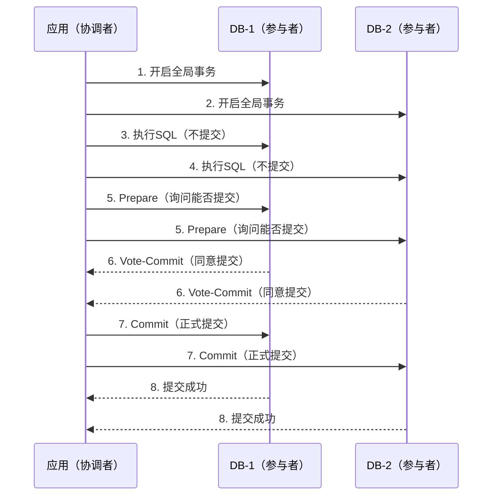

2019年，某银行的核心账务系统上线新功能，用户转账时偶发"系统繁忙"错误。

排查了两周，发现是增加了新表后，XA事务的覆盖范围变大了。一次普通转账操作，涉及的事务参与者从 2 个变成 5 个。2PC 的两轮投票耗时从 50ms 飙升到 800ms，数据库连接池被大量占用，最终触发超时。

那次事故之后，团队彻底重新评估了 XA 事务的使用边界。这个案例至今是架构评审课上的经典反面教材。

## 一、2PC 的核心思想

2PC（Two-Phase Commit，两阶段提交）是分布式事务领域最经典的协议。它的核心思想朴素：**先投票，再落子。**

```
第一阶段（Prepare）：协调者问所有参与者：“你们准备好了吗？”
第二阶段（Commit/Rollback）：所有人都说好了，那就一起提交；有一个没说好，全部回滚。
```

这就像开会表决：先让大家举手示意意见，等所有人都表态了，再统一执行。逻辑简单粗暴，但细节全是坑。

### 1.1 角色划分

2PC 里有两类角色：

- **协调者（Coordinator/TM）**：负责发起事务、收集投票、决定提交还是回滚。通常由应用服务器担任。
- **参与者（Participant/RM）**：负责执行具体操作（读写数据库）、响应投票请求。通常是数据库本身。



### 1.2 第一阶段：Prepare

协调者向所有参与者发送 `Prepare` 请求。每个参与者执行本地事务操作，但**不提交**——只锁定相关资源（如行锁），然后回复 `Vote-Commit`（同意提交）或 `Vote-Abort`（申请回滚）。

关键点：**Prepare 阶段，参与者已经把要做的操作执行了，但还没落盘。** 数据还在内存里，通过锁保证其他事务不会看到这些未提交的数据。

### 1.3 第二阶段：Commit

协调者收到所有参与者的响应后，做最终决定：

- **全部 Vote-Commit**：协调者向所有参与者发送 `Global-Commit`，所有人正式提交本地事务，释放锁。
- **任何一个 Vote-Abort**：协调者向所有参与者发送 `Global-Abort`，所有人回滚本地事务，释放锁。

【架构权衡】

2PC 的强一致性来源于它的设计：**要么全成功，要么全失败，没有中间状态。** 所有参与者在 Prepare 阶段就已经"准备好执行"了，第二阶段只是"确认执行"。一旦投票通过，理论上所有人都必须提交——没有退路。

这种设计保证了数据一致性，但代价是参与者必须**长时间持有锁**。在 Prepare 和 Commit 之间，参与者的锁是被占用的，其他事务无法修改这些行。如果协调者在这期间崩溃，参与者必须**一直等待**，这就是臭名昭著的"阻塞问题"。

## 二、XA 协议：2PC 的工程实现

光有协议不行，还得有工程实现。XA（eXtended Architecture）是 Open Group 制定的分布式事务标准，定义了协调者和参与者之间的通信接口。

主流数据库（MySQL、PostgreSQL、Oracle）都支持 XA 协议，Java 里的标准实现是 **JTA（Java Transaction API）**。

### 2.1 Java JTA 代码示例

```java
// 1. 获取 JTA 事务管理器（通常由应用服务器提供）
UserTransaction utx = (UserTransaction) new InitialContext().lookup("java:comp/UserTransaction");

// 2. 开启全局事务
utx.begin();

// 3. 操作 DB-1
DataSource ds1 = (DataSource) new InitialContext().lookup("java:comp/env/jdbc/ds1");
Connection conn1 = ds1.getConnection();
// 执行SQL...

// 4. 操作 DB-2
DataSource ds2 = (DataSource) new InitialContext().lookup("java:comp/env/jdbc/ds2");
Connection conn2 = ds2.getConnection();
// 执行SQL...

// 5. 提交全局事务（触发 2PC）
utx.commit();
```

`utx.commit()` 内部做了什么？它会向两个数据库分别发送 Prepare，确认都返回成功后再发送 Commit。这就是 2PC 的 JTA 实现。

### 2.2 MySQL XA 实战

```sql
-- MySQL 支持 XA 事务语法
-- 第一阶段：Prepare
XA START 'tx-global-id';
INSERT INTO orders (id, amount) VALUES (1, 100);
XA END 'tx-global-id';
XA PREPARE 'tx-global-id';

-- 第二阶段：Commit
XA COMMIT 'tx-global-id';
-- 或者回滚：
XA ROLLBACK 'tx-global-id';
```

MySQL 5.7+ 对 XA 事务有完整支持。`XA PREPARE` 会把事务信息写入 binlog，确保即使 MySQL 重启也能恢复事务状态。

:::tip
MySQL 的 XA 事务有 `xa_recover` 命令可以查看处于 PREPARE 状态的事务，这在排查"数据库连接泄漏"类问题时非常有用。
:::

## 三、2PC 的代码实现：从零实现一个简易协调者

光看协议不够，看一个最简实现来理解细节：

```java
public class SimpleCoordinator {
    private final List<Participant> participants = new CopyOnWriteArrayList<>();

    public boolean commit() {
        // 第一阶段：收集投票
        List<Future<Boolean>> votes = new ArrayList<>();
        for (Participant p : participants) {
            votes.add(executor.submit(() -> p.prepare()));
        }

        // 等待所有响应
        boolean allPrepared = true;
        for (Future<Boolean> vote : votes) {
            try {
                if (!vote.get(timeout, TimeUnit.MILLISECONDS)) {
                    allPrepared = false;
                    break;
                }
            } catch (Exception e) {
                allPrepared = false;
                break;
            }
        }

        // 第二阶段：决定提交还是回滚
        if (allPrepared) {
            // 全部成功，提交
            for (Participant p : participants) {
                try {
                    p.commit();
                } catch (Exception e) {
                    // 提交失败，需要补偿（这是2PC最大的坑）
                    log.error("Participant {} commit failed, need compensation", p, e);
                }
            }
            return true;
        } else {
            // 有失败，全部回滚
            for (Participant p : participants) {
                try {
                    p.rollback();
                } catch (Exception e) {
                    log.error("Participant {} rollback failed", p, e);
                }
            }
            return false;
        }
    }
}
```

这个最简实现暴露了一个关键问题：**Commit 失败怎么办？**

在 2PC 协议里，Commit 阶段失败意味着"协调者要求提交，但参与者没收到或执行失败"。此时参与者处于一种尴尬状态——它认为自己应该提交，但没有收到协调者的最终指令。更糟糕的是，如果协调者在这个时间点崩溃，**没有人知道该怎么做**。

## 四、2PC 的核心缺陷

### 4.1 阻塞问题（最严重）

这是 2PC 最著名的问题。参与者执行完 Prepare 后，必须等待协调者的 Commit/Rollback 指令。在这段时间内，参与者持有的锁无法释放。

如果协调者崩溃了怎么办？参与者不知道该提交还是回滚，只能一直等——这就是**阻塞**。极端情况下，参与者可能永远等下去，导致数据库连接泄漏、锁超时等问题。

【架构权衡】

有人说，3PC 可以解决阻塞问题。没错，但 3PC 引入了新问题（后面会详细说）。更务实的解法是：**用幂等性和补偿事务兜底，而不是追求完美的事务协议。**

### 4.2 协调者单点

协调者是整个 2PC 的中心节点。如果协调者崩溃，参与者会陷入"不知道该怎么做"的困境。

解决方案是协调者本身做高可用：主备切换、日志持久化。JBoss/JTA 用数据库表记录事务状态，Seata 用日志服务器。但这些方案都增加了系统复杂度。

### 4.3 脑裂问题

网络分区时，协调者和部分参与者失联，但和其他参与者仍然连通。此时：
- 失联一侧的参与者等待协调者指令（阻塞）
- 连通一侧的参与者在执行提交
- 两个"分区"的数据状态不一致

CAP 定理告诉我们：网络分区不可避免，2PC 在 CP 和 AP 之间选择了 CP，但它的 P 是不完整的——分区时不是完全不可用，而是"部分不可用 + 部分阻塞"。

:::warning
2PC 的 Commit 阶段不保证原子性！如果 Commit 请求在网络传输中丢失，参与者不知道该提交还是回滚。MySQL XA 用 `xa_recover` 可以查询 PREPARE 状态的事务，但恢复过程需要人工介入或额外的恢复脚本。
:::

## 五、生产避坑指南

### 5.1 锁超时设置

2PC 的 Prepare 阶段会锁住资源。如果事务持续时间长，锁会阻塞其他操作。

**生产配置建议**：

```properties
# XA 事务超时（秒）
TransactionTimeout=30

# XA 最大活跃事务数
xa.maxActiveTransactions=100
```

锁超时设置要权衡。太短：事务还没执行完就超时回滚，数据不一致。太长：锁占用时间过长，阻塞其他请求。

### 5.2 连接池泄漏

如果 2PC 事务未正确提交/回滚，数据库连接会被一直占用。监控连接池活跃连接数，如果发现连接数持续增长但未释放，很可能是悬空 XA 事务。

```sql
-- MySQL 排查悬空 XA 事务
xa recover;
```

### 5.3 性能问题

2PC 需要两轮网络通信（Prepare + Commit），加上锁等待时间，事务耗时是单库事务的 2~5 倍。压测时务必关注 P99 延迟。

如果 P99 延迟超过 200ms，基本可以判断 2PC 成了性能瓶颈。要么优化业务拆分（减少参与者数量），要么换最终一致方案。

## 六、工程代价评估

| 维度 | 评估 |
| --- | --- |
| 运维成本 | 中等。需要监控 XA 事务状态、连接池水位、悬空事务恢复。 |
| 排障复杂度 | 高。XA 事务出问题往往涉及多个数据库，需要分布式链路追踪。 |
| 扩展性 | 差。参与者越多，性能越差；超过 5 个参与者时延迟显著。 |
| 回滚风险 | 低。但 Commit 失败时的补偿操作复杂。 |
| 适用规模 | 小规模（参与者 `<` 5）、低并发、对一致性要求极高的场景。 |

【架构权衡】

2PC 是分布式事务的"正确解法"——它从理论上保证了强一致。但工程实践告诉我们：正确的解法不一定是最优的解法。

在大多数互联网场景里，用户体验比强一致更重要。一笔订单创建后"处理中"比"报错"好得多。所以 **2PC 通常只用于核心金融链路**，其他场景用最终一致方案更务实。

:::tip
选 2PC 前问自己三个问题：(1) 参与者数量是否小于等于 5？(2) 事务平均耗时是否小于 200ms？(3) 是否能接受单点协调者的可用性风险？如果任何一个答案是"否"，考虑换方案。
:::
