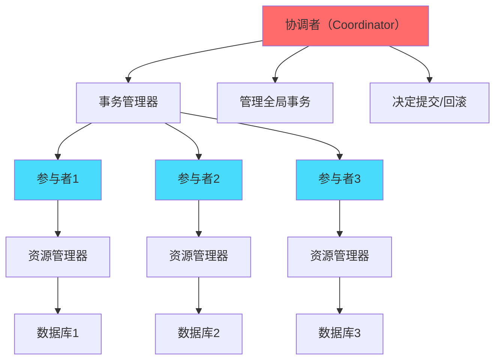
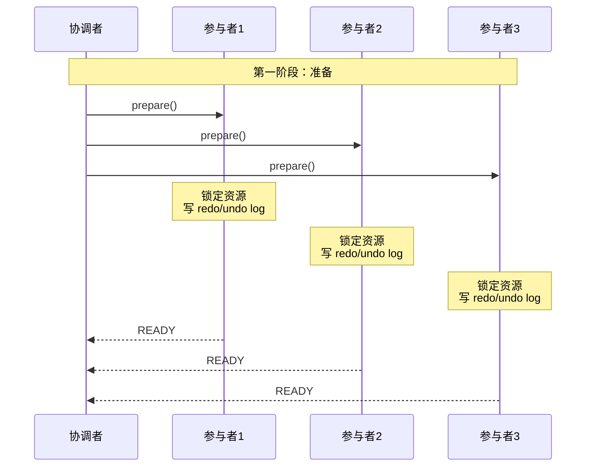
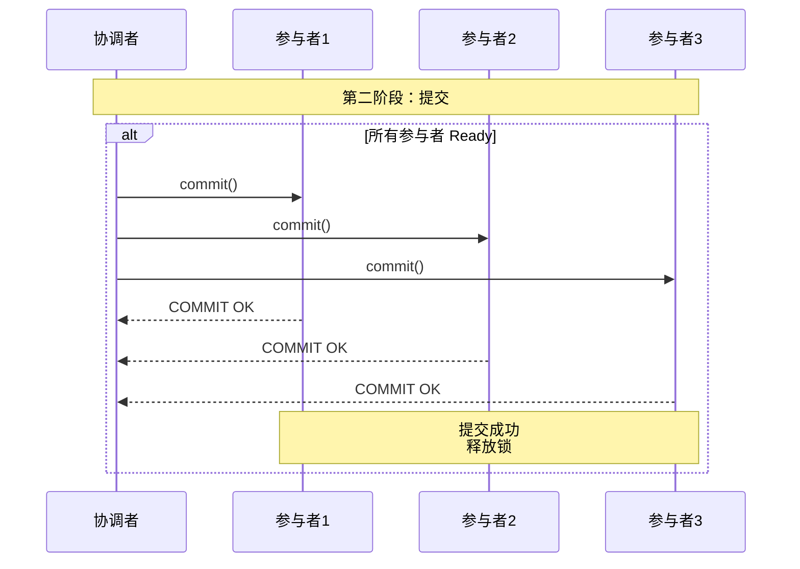
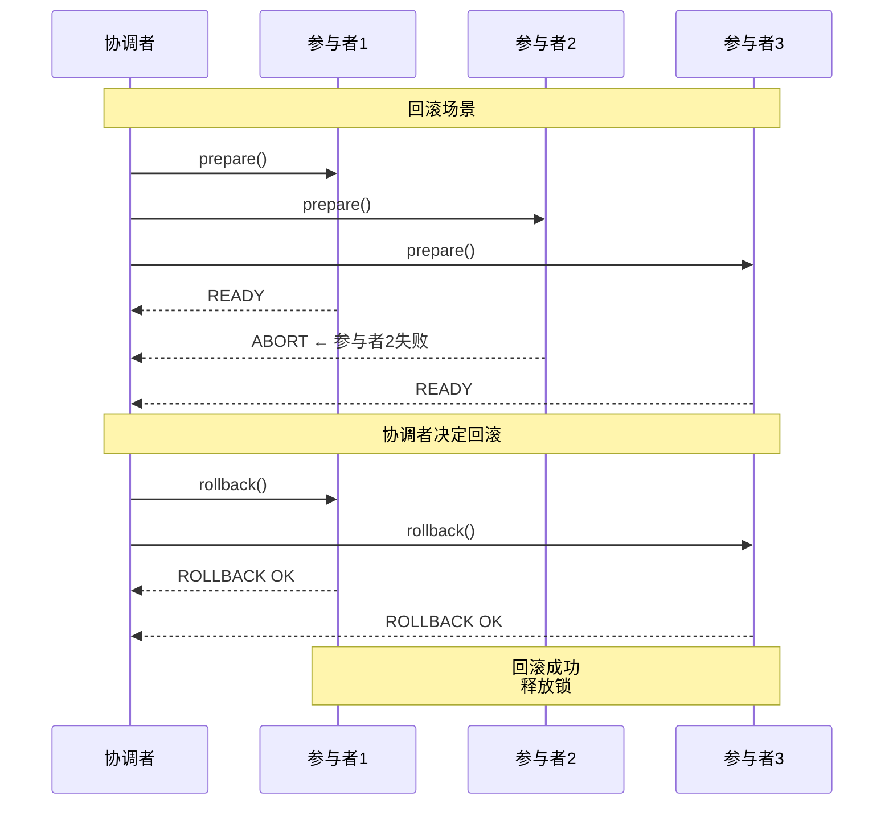
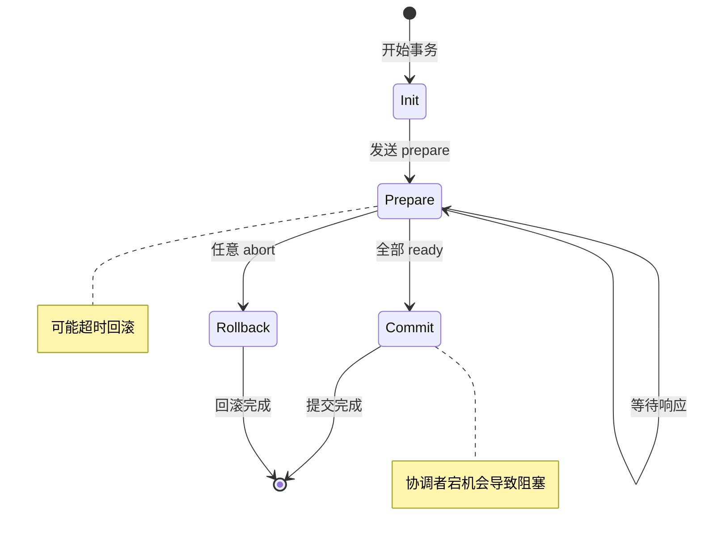
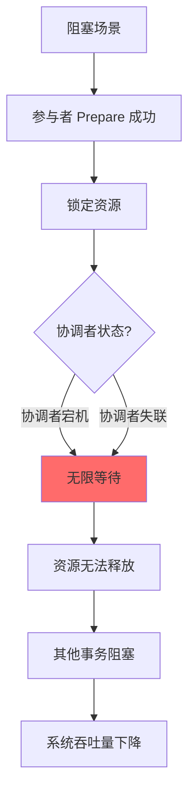

# 2PC 两阶段提交：强一致分布式事务协议

## 快速自测：面试官最关心的 3 个问题

> 🔴 **高频必考**，P6/P7 面试必问

1. **2PC 的两个阶段是什么？协调者和参与者分别做什么？**
2. **2PC 有什么问题？为什么说 2PC 是阻塞协议？**
3. **MySQL 的 XA 事务是如何实现的？它解决了什么问题？**

---

## 一、2PC 的基本原理

### 1.1 什么是 2PC

2PC（Two-Phase Commit）是一种强一致的分布式事务协议，通过「准备」和「提交」两个阶段来保证跨节点事务的原子性。

```
核心思想：
1. 第一阶段（准备）：所有参与者都准备好提交
2. 第二阶段（提交）：所有参与者同时提交或回滚

类比：
- 类似于多人用餐结账
- 服务员先问所有人：「准备好了吗？」
- 等所有人确认后，再统一结账
```

### 1.2 2PC 的角色



| 角色 | 职责 | 组件 |
|------|------|------|
| **协调者** | 管理全局事务，决定提交或回滚 | Transaction Manager |
| **参与者** | 执行业务操作，响应协调者 | Resource Manager |

---

## 二、2PC 的两个阶段

### 2.1 第一阶段：准备（Prepare）



**参与者收到 prepare 后的操作**：

```
1. 锁定事务涉及的资源
2. 写入 undo log（用于回滚）
3. 写入 redo log（用于恢复）
4. 返回协调者「READY」
```

### 2.2 第二阶段：提交（Commit）



### 2.3 回滚场景



---

## 三、2PC 的状态机



---

## 四、2PC 的问题

### 4.1 协调者宕机问题

**问题**：如果协调者在提交阶段宕机，参与者将一直等待。

```
场景：
1. 所有参与者返回 READY
2. 协调者发送 commit 前宕机
3. 参与者不知道是否应该提交
4. 资源被锁定，系统阻塞
```

### 4.2 阻塞问题

**问题**：参与者prepare 成功后，会一直等待协调者的指令，无法释放资源。



### 4.3 单点故障

**问题**：协调者是单点，协调者故障会导致事务无法完成。

| 问题 | 说明 | 影响 |
|------|------|------|
| **协调者宕机** | 提交阶段宕机，参与者阻塞 | 系统不可用 |
| **协调者失联** | 网络问题导致失联 | 参与者无法决策 |
| **数据丢失** | 协调者未记录事务状态 | 无法恢复 |

---

## 五、MySQL XA 事务实现

### 5.1 XA 协议简介

MySQL 通过 XA 协议实现 2PC，支持跨多个 MySQL 实例的分布式事务。

```
MySQL XA 事务：
- XA OPEN：开始 XA 事务
- XA PREPARE：准备阶段
- XA COMMIT：提交阶段
- XA ROLLBACK：回滚阶段
```

### 5.2 MySQL XA 事务代码示例

```java
// MySQL XA 事务示例
public class MySQLXATransaction {
    
    private DataSource ds1; // 账户A数据库
    private DataSource ds2; // 账户B数据库
    
    @Transactional
    public void transfer(String from, String to, BigDecimal amount) {
        Connection conn1 = null;
        Connection conn2 = null;
        
        try {
            // 获取 XA 连接
            conn1 = ds1.getConnection();
            conn2 = ds2.getConnection();
            
            // 开启 XA 事务
            ((XAConnection) conn1).getXAResource().start(
                new XidImpl(1, "from".getBytes(), "from".getBytes()), 
                XAResource.TMNOFLAGS
            );
            
            conn1.createStatement().execute(
                "UPDATE account SET balance = balance - " + amount + " WHERE name = '" + from + "'"
            );
            
            ((XAConnection) conn1).getXAResource().end(
                new XidImpl(1, "from".getBytes(), "from".getBytes()), 
                XAResource.TMSUCCESS
            );
            
            // 同样处理 conn2...
            
            // 准备
            ((XAConnection) conn1).getXAResource().prepare(
                new XidImpl(1, "from".getBytes(), "from".getBytes())
            );
            
            // 提交
            ((XAConnection) conn1).getXAResource().commit(
                new XidImpl(1, "from".getBytes(), "from".getBytes()), 
                false
            );
            
        } catch (XAException e) {
            // 回滚
            ((XAConnection) conn1).getXAResource().rollback(xid);
            throw e;
        }
    }
}
```

### 5.3 XA 事务的优缺点

| 优点 | 缺点 |
|------|------|
| 强一致保证 | 性能开销大 |
| 无需业务层实现 | 锁定资源时间长 |
| 数据库原生支持 | 协调者宕机会阻塞 |
| 跨数据库实例 | MySQL XA 有 bug（5.7 之前） |

---

## 六、面试题精讲

### 🔴 面试题 1：2PC 的两个阶段是什么？

**答案要点**：

1. **准备阶段（Prepare）**：
   - 协调者向所有参与者发送 prepare 请求
   - 参与者锁定资源，写入 undo/redo log
   - 参与者返回 READY 或 ABORT

2. **提交阶段（Commit）**：
   - 如果所有参与者返回 READY，协调者发送 commit
   - 如果任意参与者返回 ABORT，协调者发送 rollback
   - 参与者提交或回滚，释放资源

**追问链**：

> **第一层**：2PC 的两个阶段是什么？
> **第二层**：如果参与者在 prepare 后宕机，会发生什么？
> **第三层**：如何解决协调者宕机导致的阻塞问题？

### 🔴 面试题 2：2PC 有什么问题？

**答案要点**：

1. **阻塞问题**：参与者 prepare 成功后一直锁定资源，等待协调者指令
2. **单点故障**：协调者宕机会导致事务无法完成
3. **数据不一致风险**：如果协调者在发送 commit 时宕机

**追问链**：

> **第一层**：2PC 有什么问题？
> **第二层**：为什么说 2PC 是阻塞协议？
> **第三层**：3PC 是如何解决 2PC 的问题的？

### 🟡 面试题 3：MySQL 的 XA 事务是如何实现的？

**答案要��**：

1. **XA 协议**：MySQL 支持 XA 分布式事务
2. **两阶段提交**：prepare + commit
3. **Xid**：全局唯一事务 ID
4. **限制**：长时间锁定资源，不适合高并发场景

---

## 七、实战思考题

### 思考题 1：2PC vs 单机事务

为什么分布式场景下 2PC 比单机事务的代价更高？

### 思考题 2：3PC 的改进

3PC 在 2PC 的基础上增加了什么机制？解决了哪些问题？

---

## 扩展阅读

如果本文档对你有帮助，建议继续阅读：

- [2PC 阻塞问题](/distributed/transaction/2pc-problems)：2PC 的阻塞详解
- [3PC 三阶段提交](/distributed/transaction/3pc)：解决 2PC 阻塞的方案
- [2PC vs 3PC](/distributed/transaction/2pc-vs-3pc)：两者的详细对比