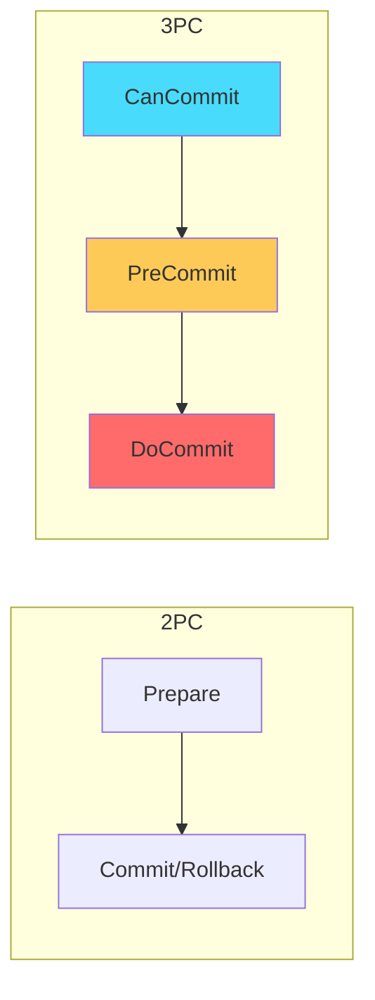
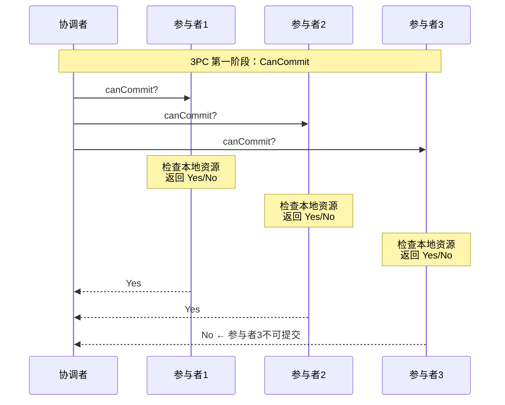
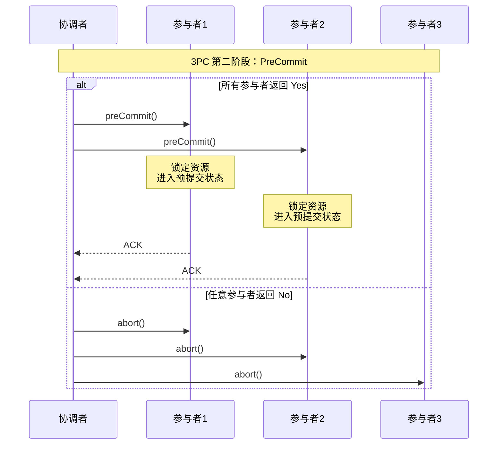
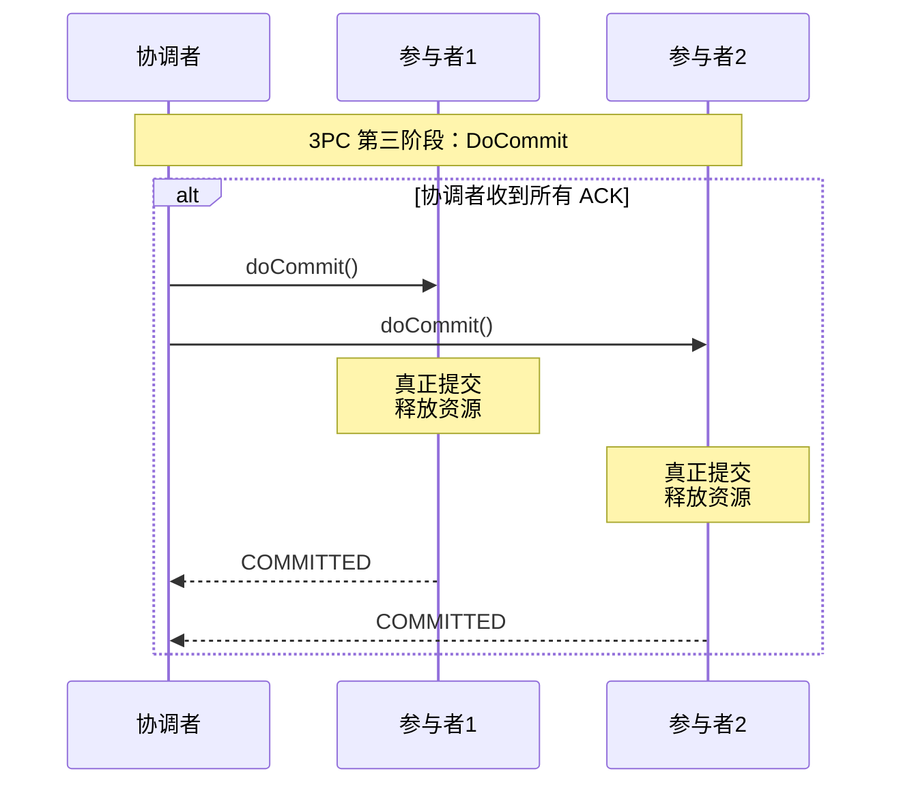
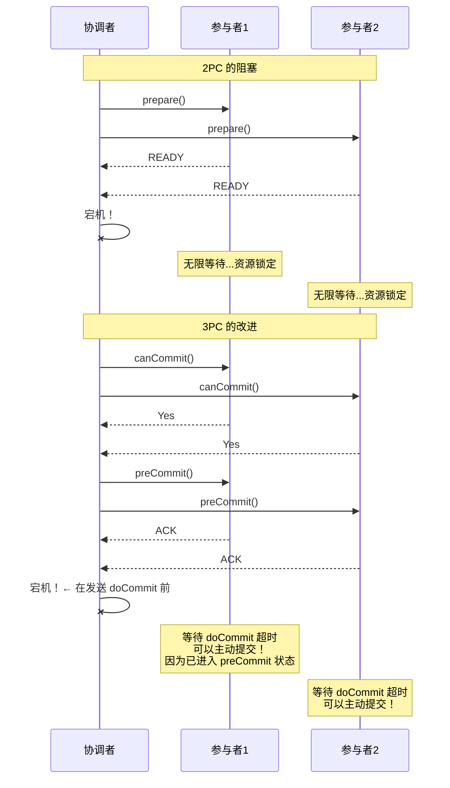
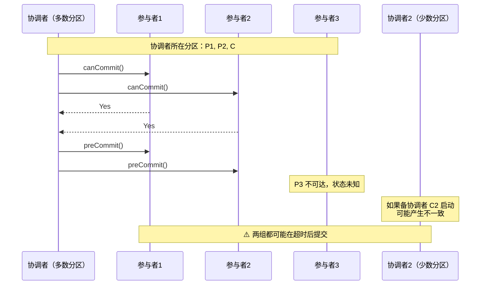
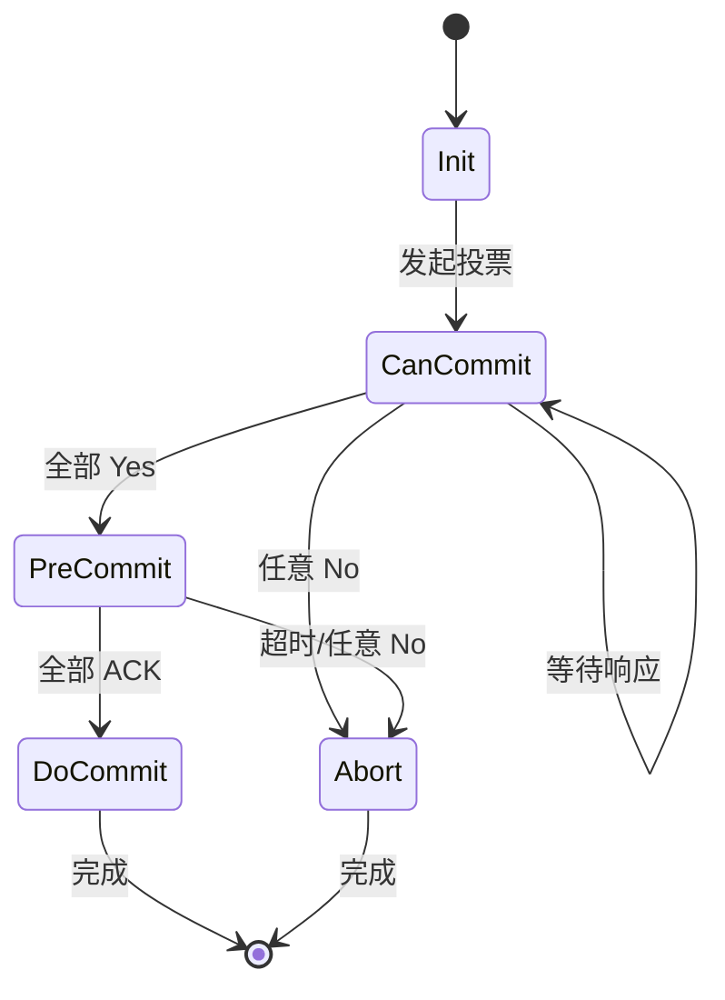
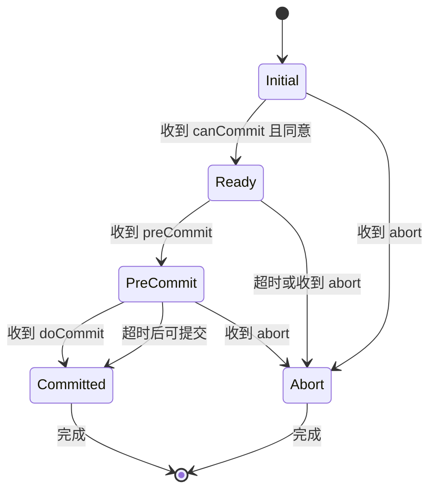

# 3PC 三阶段提交：解决 2PC 阻塞的改进方案

## 快速自测：面试官最关心的 3 个问题

> 🟡 **中频常考**，P7 架构设计面试可能问

1. **3PC 在 2PC 的基础上增加了什么阶段？每个阶段的作用是什么？**
2. **3PC 是如何解决 2PC 的阻塞问题的？它真的完全解决了吗？**
3. **3PC 相比 2PC 有什么新问题？为什么实际应用不多？**

---

## 一、3PC 的基本原理

### 1.1 什么是 3PC

3PC（三阶段提交）在 2PC 的基础上增加了「CanCommit」阶段，用于提前确认参与者是否可以提交，从而避免长时间锁定资源。

```
3PC 的三个阶段：

1. CanCommit：询问是否可提交
   - 协调者询问所有参与者：「可以提交吗？」
   - 参与者返回 Yes/No

2. PreCommit：准备提交
   - 如果所有参与者返回 Yes，协调者发送 preCommit
   - 参与者锁定资源，进入预提交状态

3. DoCommit：真正提交
   - 协调者发送 doCommit
   - 参与者提交或回滚
```

### 1.2 3PC 与 2PC 的对比



| 阶段 | 2PC | 3PC |
|------|-----|-----|
| **第一阶段** | Prepare（锁定资源） | CanCommit（询问） |
| **第二阶段** | Commit/Rollback | PreCommit（准备） |
| **第三阶段** | - | DoCommit（执行） |

---

## 二、3PC 的详细流程

### 2.1 第一阶段：CanCommit



**关键点**：CanCommit 阶段不锁定资源，只做检查。

### 2.2 第二阶段：PreCommit



**关键点**：PreCommit 阶段锁定资源，但参与者知道「最终会提交」。

### 2.3 第三阶段：DoCommit



---

## 三、3PC 如何解决 2PC 的阻塞

### 3.1 协调者宕机场景



**核心改进**：

```
2PC 问题：
- 参与者不知道协调者的决策
- 只能无限等待

3PC 改进：
- 参与者收到 preCommit 后知道「一定会提交」
- 超时后可以主动提交
```

### 3.2 超时机制的改进

```java
// 3PC 参与者的超时处理
public class Participant3PC {
    
    public void onPreCommit(PreCommitRequest request) {
        // 锁定资源，进入预提交状态
        lockResources();
        saveState("PRE_COMMITTED");
        
        // 发送 ACK
        sendACK(request.getXid());
        
        // 等待 doCommit
        // 如果超时，可以主动提交
        try {
            waitForDoCommit(TIMEOUT_MS);
        } catch (TimeoutException e) {
            // 3PC 改进：超时后可以主动提交
            // 因为已经进入 preCommit 状态
            doCommit();
        }
    }
    
    public void onDoCommit(DoCommitRequest request) {
        doCommit();
    }
    
    public void onAbort(AbortRequest request) {
        // 无论什么状态，收到 abort 都必须回滚
        rollback();
        releaseResources();
    }
}
```

---

## 四、3PC 的问题与局限性

### 4.1 3PC 的新问题：网络分区

**问题**：3PC 假设网络分区是短暂且可恢复的，但在真正的网络分区下仍可能出问题。



### 4.2 3PC 无法完全解决的问题

| 问题 | 2PC | 3PC | 说明 |
|------|-----|-----|------|
| **协调者宕机** | 完全阻塞 | 部分解决 | 超时后可提交 |
| **网络分区** | 可能不一致 | 可能不一致 | 仍然有问题 |
| **数据不一致** | 可能 | 可能 | 网络分区时都可能出现 |
| **性能开销** | 高 | 更高 | 多了一个阶段 |

### 4.3 为什么实际应用不多

```
实际应用较少的原因：

1. 协议更复杂
   - 多一个阶段意味着更多网络开销
   - 更多状态需要管理

2. 假设不一定成立
   - 3PC 假设网络分区是短暂的
   - 但真正的网络分区可能导致长时间不可达

3. 性能收益不明显
   - 虽然减少了阻塞时间
   - 但增加了网络往返次数

4. 实际系统选择其他方案
   - Raft/Paxos 已经是解决共识的好方案
   - 不需要再使用 3PC
```

---

## 五、3PC 的状态机

### 5.1 协调者状态机



### 5.2 参与者状态机



---

## 六、3PC 与 2PC 的对比总结

### 6.1 详细对比表

| 维度 | 2PC | 3PC |
|------|-----|-----|
| **阶段数** | 2 | 3 |
| **准备阶段** | 锁定资源 | 检查但不锁定 |
| **阻塞时间** | 长（prepare 到 commit） | 短（preCommit 到 doCommit） |
| **协调者宕机** | 完全阻塞 | 部分解决 |
| **性能开销** | 高 | 更高 |
| **实现复杂度** | 中 | 高 |
| **数据一致性风险** | 有 | 有（网络分区时） |

### 6.2 面试回答模板

```
面试问题：2PC 和 3PC 的区别是什么？

回答要点：
1. 3PC 在 2PC 的基础上增加了 CanCommit 阶段
2. CanCommit 阶段用于提前确认是否可提交，不锁定资源
3. 3PC 的改进：参与者收到 preCommit 后，超时可以主动提交
4. 但 3PC 也有问题：网络分区时仍可能产生数据不一致
5. 实际应用中，3PC 使用较少，因为 Raft/Paxos 是更好的共识方案
```

---

## 七、面试题精讲

### 🔴 面试题 1：3PC 在 2PC 的基础上增加了什么？

**答案要点**：

1. **CanCommit 阶段**：询问参与者是否可提交，不锁定资源
2. **PreCommit 阶段**：准备提交，锁定资源
3. **DoCommit 阶段**：真正提交

**追问链**：

> **第一层**：3PC 有哪三个阶段？
> **第二层**：3PC 是如何解决 2PC 的阻塞问题的？
> **第三层**：3PC 有什么新问题？为什么实际应用不多？

### 🟡 面试题 2：3PC 真的完全解决了阻塞问题吗？

**答案要点**：

1. **部分解决**：协调者宕机时，参与者超时后可以主动提交
2. **未完全解决**：网络分区时仍可能产生数据不一致
3. **实际应用少**：协议复杂，性能收益不明显

---

## 八、实战思考题

### 思考题 1：3PC 与 Paxos 的关系

3PC 和 Paxos 都能解决共识问题，它们有什么区别？

### 思考题 2：3PC 的适用场景

什么样的场景适合使用 3PC？什么样的场景不适合？

---

## 扩展阅读

如果本文档对你有帮助，建议继续阅读：

- [2PC 两阶段提交](/distributed/transaction/2pc)：2PC 详解
- [2PC vs 3PC](/distributed/transaction/2pc-vs-3pc)：两者的详细对比
- [FLP 不可能性](/distributed/theory/flp)：分布式共识的理论边界