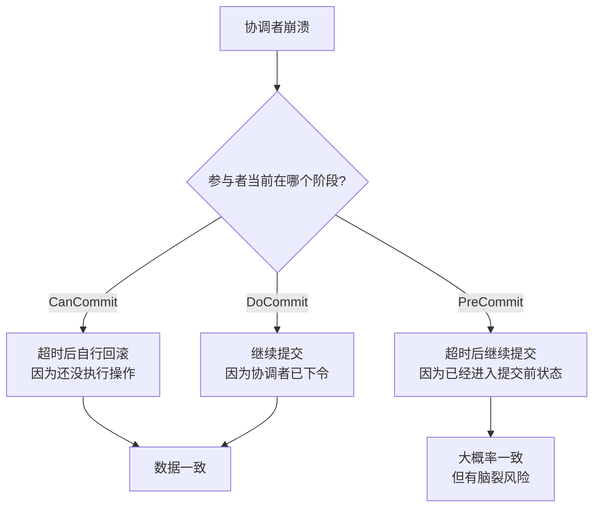
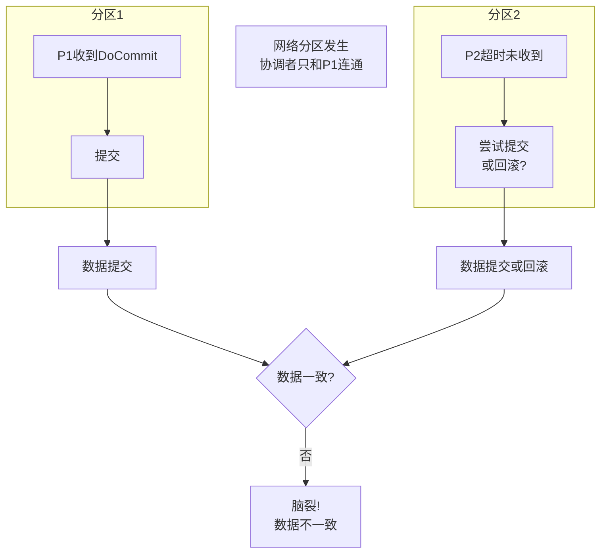

2019年，我在带团队复盘那次 XA 事务锁死事故时，有个工程师提议："我们换成 3PC 吧，听说它解决了阻塞问题。"

当时我问他："3PC 解决了阻塞问题，但引入了什么新问题？"

他愣了一下，说："应该...更可靠吧？"

这个回答代表了很多人的误解：把 3PC 当成 2PC 的升级版。实际上，3PC 是在"解决 2PC 阻塞"和"引入脑裂风险"之间做权衡，并没有绝对的优劣之分。

## 一、3PC 的核心改进

3PC（Three-Phase Commit，三阶段提交）由 Doug Schmidt 在 1983 年提出，比 2PC 多了两个东西：**超时机制**和**预提交**。

### 1.1 三阶段划分

```mermaid
sequenceDiagram
    participant C as 协调者
    participant P1 as 参与者1
    participant P2 as 参与者2

    rect rgb(220, 240, 220)
        Note over C,P2: 第一阶段：CanCommit
        C->>P1: CanCommit（询问能否执行）
        C->>P2: CanCommit（询问能否执行）
        P1-->>C: Yes
        P2-->>C: Yes
    end

    rect rgb(220, 230, 255)
        Note over C,P2: 第二阶段：PreCommit
        C->>P1: PreCommit（准备提交）
        C->>P2: PreCommit（准备提交）
        P1锁定资源
        P2锁定资源
        P1-->>C: ACK
        P2-->>C: ACK
    end

    rect rgb(255, 230, 220)
        Note over C,P2: 第三阶段：DoCommit
        C->>P1: DoCommit（正式提交）
        C->>P2: DoCommit（正式提交）
        P1提交并释放锁
        P2提交并释放锁
        P1-->>C: 提交成功
        P2-->>C: 提交成功
    end
```

对比 2PC：

| 阶段 | 2PC | 3PC |
| --- | --- | --- |
| 第一阶段 | Prepare（执行+锁定） | CanCommit（只问能不能，不执行） |
| 第二阶段 | Commit/Rollback | PreCommit（执行但不提交）+ DoCommit |
| 超时机制 | 无 | 有（每个阶段都有超时自动执行） |

### 1.2 为什么 3PC 能缓解阻塞

2PC 的阻塞发生在 Prepare 之后、Commit 之前。参与者执行了操作但不知道该提交还是回滚，只能一直等。

3PC 的关键改进是：**把"执行"从第一阶段移出去了。**

- **CanCommit 阶段**：只问"你们准备好了吗"，不执行任何操作
- **PreCommit 阶段**：才真正执行，但提交前等待
- **DoCommit 阶段**：协调者下令提交

这样，即使协调者崩溃，参与者也可以根据超时决定下一步——因为参与者知道协调者已经进了哪个阶段。



【架构权衡】

3PC 的超时机制是"乐观"的：参与者假设"如果协调者让我进了 PreCommit，那大概率是要提交的"。这个假设在网络正常时是对的，但**在网络分区时会导致脑裂**——两个分区各自认为应该提交或回滚，数据不一致。

## 二、3PC 的代码实现

```java
public class ThreePhaseCoordinator {
    private final List<Participant> participants = new CopyOnWriteArrayList<>();
    private volatile Phase currentPhase = Phase.CAN_COMMIT;

    public boolean commit() {
        // ===== 第一阶段：CanCommit =====
        currentPhase = Phase.CAN_COMMIT;
        List<Future<Boolean>> votes = new ArrayList<>();
        for (Participant p : participants) {
            votes.add(executor.submit(() -> p.canCommit()));
        }

        boolean allCanCommit = waitForAllResponses(votes, timeout);
        if (!allCanCommit) {
            abortAll();
            return false;
        }

        // ===== 第二阶段：PreCommit =====
        currentPhase = Phase.PRE_COMMIT;
        for (Participant p : participants) {
            try {
                p.preCommit();
            } catch (Exception e) {
                abortAll();
                return false;
            }
        }

        // 等待所有 ACK
        boolean allAcked = waitForAllAcks(timeout);
        if (!allAcked) {
            // 等待超时，此时参与者可能自行提交或回滚
            return false;
        }

        // ===== 第三阶段：DoCommit =====
        currentPhase = Phase.DO_COMMIT;
        for (Participant p : participants) {
            try {
                p.doCommit();
            } catch (Exception e) {
                log.warn("Participant {} commit failed", p, e);
            }
        }
        return true;
    }

    // 参与者侧的超时处理
    public void onTimeout(Phase phase) {
        switch (phase) {
            case CAN_COMMIT:
                // 没收到协调者指令，默认回滚（还没执行操作，没损失）
                rollback();
                break;
            case PRE_COMMIT:
                // 已执行但未提交，尝试提交（乐观假设）
                // ⚠️ 这里可能导致脑裂
                tryCommit();
                break;
            case DO_COMMIT:
                // 正在提交中，继续等待
                break;
        }
    }
}
```

## 三、3PC 解决了什么问题

### 3.1 协调者崩溃，参与者不会无限等待

2PC 里，协调者崩溃后参与者只能等。在 3PC 里，参与者根据超时决定：

- 在 CanCommit 阶段超时：回滚（还没执行操作）
- 在 PreCommit 阶段超时：**尝试提交**（已执行，有损失）

关键改进：参与者不再盲目等待，而是有**自主决策能力**。

### 3.2 减少了锁定资源的时间

3PC 的 CanCommit 阶段不锁定资源。只有进入 PreCommit 后才锁定。这意味着在协调者和参与者通信的过程中，其他事务不会被阻塞。

2PC 的阻塞从 Prepare 开始。3PC 的阻塞从 PreCommit 开始，中间的等待时间更短。

### 3.3 失败检测更快

3PC 每个阶段都有超时，不依赖协调者的主动通知。协调者故障后，参与者最多等待一个阶段超时就知道出问题了。

## 四、3PC 引入了什么新问题

### 4.1 脑裂问题（最严重）

3PC 的 PreCommit 阶段，参与者已经执行了操作（数据库写入了），但还没提交。如果此时协调者崩溃，网络分区导致部分参与者收不到 DoCommit，部分参与者收到了：



分区1的 P1 收到了 DoCommit，正常提交。分区2的 P2 超时了，进入"尝试提交"逻辑。两个节点数据不一致。

**这就是 3PC 的代价**：用"可能脑裂"换"不会无限阻塞"。

:::warning
3PC 解决了 2PC 的阻塞问题，但引入了脑裂风险。在 CAP 定理的框架下，2PC 选择 CP（阻塞但一致），3PC 实际上在某些场景下退化为 AP（有可用但可能不一致）。这不是进步，是权衡转移。
:::

### 4.2 网络往返增加

3PC 多了 CanCommit 和 DoCommit 两个阶段，比 2PC 多 1.5 倍的网络开销。在高延迟网络环境里，这个开销不可忽视。

```java
// 2PC vs 3PC 网络开销对比
// 2PC: Prepare -> Vote -> Commit = 3次网络往返（理想情况）
// 3PC: CanCommit -> Yes -> PreCommit -> ACK -> DoCommit -> Success = 6次网络往返
```

### 4.3 参与者复杂度增加

3PC 要求参与者能处理三种超时场景（每个阶段不同的超时处理逻辑），比 2PC 复杂得多。一旦出现脑裂，排障复杂度极高。

## 五、3PC 的实际应用

说了这么多，3PC 实际用得多吗？

**很少。**

原因很简单：3PC 的优点（解决阻塞）在大多数场景下不够突出，缺点（脑裂风险）却让人难以接受。业界更常见的做法是**在应用层实现超时和补偿逻辑**（TCC 的思路），而不是依赖 3PC 协议。

【架构权衡】

| 对比维度 | 2PC | 3PC |
| --- | --- | --- |
| 一致性 | 强一致 | 弱一致（可能脑裂） |
| 可用性 | 低（阻塞） | 中（可能脑裂） |
| 性能 | 差（长时间锁） | 中（锁时间缩短） |
| 复杂度 | 低 | 高 |
| 工程实践 | 较多 | 很少 |

如果你需要比 2PC 更好的可用性，直接用 **TCC 或 Saga**。这两个方案在业务层做补偿，灵活度远高于 3PC。

:::tip
3PC 在教科书里是"比 2PC 更好的协议"，但在工程实践里几乎没人用。记住这句话就够了：**协议层面的改进往往不如架构层面的改进有效。** 与其依赖一个"改进版"的协议，不如在应用层设计好幂等和补偿逻辑。
:::

## 六、生产避坑指南

### 6.1 为什么 3PC 落地难

在生产环境里落地 3PC，面临几个实际问题：

1. **数据库原生支持少**：MySQL、PostgreSQL 没有原生 3PC 实现。要用 3PC 必须自己实现协调者和参与者的超时逻辑，工作量巨大。
2. **脑裂后的数据修复复杂**：一旦脑裂，需要人工判断哪些数据是"正确"的，然后做数据修复。成本极高。
3. **运维复杂度**：需要监控每个事务处于哪个阶段、超时了多少个、协调者和参与者的状态是否一致。监控系统的复杂度可能超过业务本身。

### 6.2 什么场景可以考虑 3PC

3PC 理论上适合这些场景：
- 网络质量相对可靠，脑裂概率极低
- 参与者数量少（`< 3`），人工修复成本可控
- 对可用性要求高，不能接受长时间阻塞

但实际上，这些场景用 TCC 或 Saga 往往更简单。

### 6.3 如果你决定用 3PC

```java
// 参与者的超时处理逻辑必须非常严谨
public class ThreePhaseParticipant {
    private volatile Phase currentPhase;
    private final ScheduledExecutorService scheduler = Executors.newScheduledThreadPool(1);

    public void onReceiveMessage(Message msg) {
        switch (msg.getType()) {
            case CAN_COMMIT:
                currentPhase = Phase.CAN_COMMIT;
                sendYes();
                break;
            case PRE_COMMIT:
                currentPhase = Phase.PRE_COMMIT;
                executeLocalTransaction(); // 执行操作
                sendAck();
                // 启动超时任务
                scheduleTimeout(PRE_COMMIT_TIMEOUT);
                break;
            case DO_COMMIT:
                currentPhase = Phase.DO_COMMIT;
                commitLocalTransaction();
                cancelTimeout();
                break;
        }
    }

    public void onTimeout(Phase phase) {
        // ⚠️ 这里必须有非常严谨的逻辑，否则脑裂
        if (phase == Phase.PRE_COMMIT && !hasReceivedDoCommit()) {
            // 只有在 PreCommit 阶段且未收到 DoCommit 时才能自行提交
            // 但这仍然可能导致脑裂
            doCommit();
        }
    }
}
```

## 七、工程代价评估

| 维度 | 评估 |
| --- | --- |
| 运维成本 | 极高。需要监控多阶段状态、超时处理、脑裂检测。 |
| 排障复杂度 | 极高。脑裂后的数据修复极其困难。 |
| 扩展性 | 差。参与者越多，脑裂概率越高。 |
| 回滚风险 | 高。脑裂场景下的数据修复需要人工介入。 |
| 实际使用 | 极少。几乎没有生产级标准实现。 |

【架构权衡】

3PC 是一个理论上优美但工程上尴尬的协议。它试图在 2PC 的"阻塞但一致"和"高可用但可能不一致"之间找到平衡点，但在实际工程中，这个平衡点很难踩准。

**我的建议是：不要用 3PC。**

如果 2PC 的阻塞问题你无法接受，直接考虑 TCC 或 Saga。这些方案在业务层做一致性保障，比依赖协议更可控、更灵活。

:::tip
面试时如果被问到 3PC，重点讲清楚"3PC 解决了 2PC 的阻塞，但引入了脑裂风险"。能说出这个权衡点的候选人，已经超过 90% 的人了。
:::
