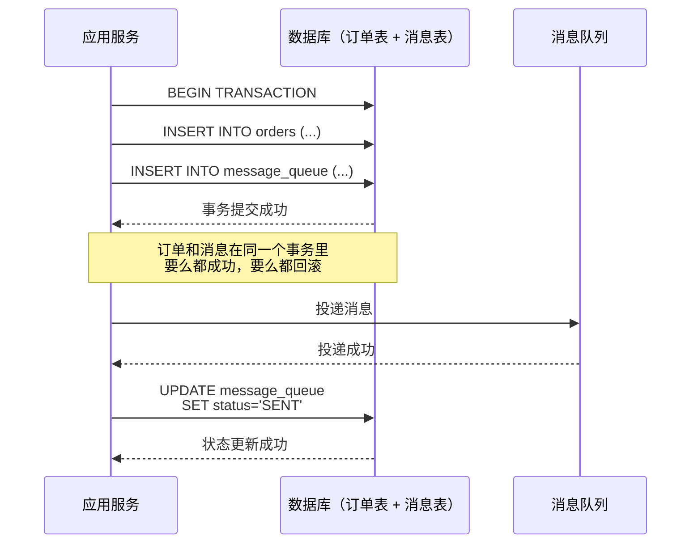
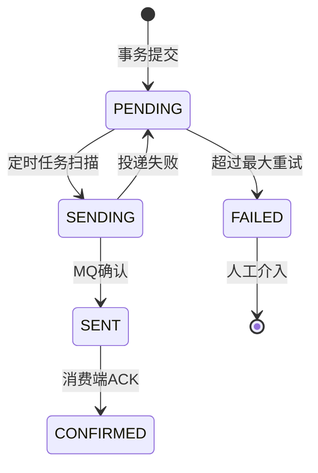
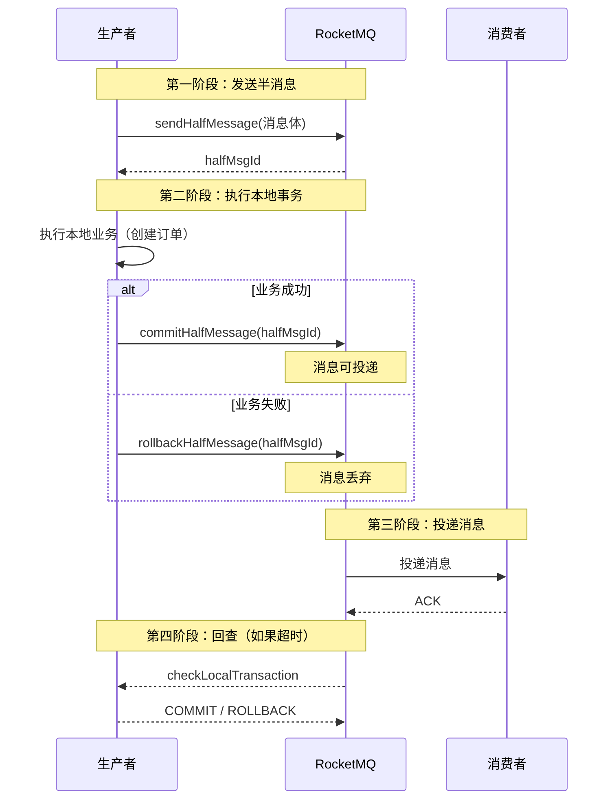

2020年双十一，团队的订单系统出现了数据不一致：用户下单成功了，但库存没扣减。

排查发现：订单服务在创建订单后，发送了一条 MQ 消息给库存服务，通知库存扣减。但 MQ 消息在网络传输中丢了——消息没到库存服务，库存自然没扣。

更诡异的是，订单已经创建了，用户也收到了下单成功的响应。用户以为买到了，结果第二天客服收到一堆"为什么订单没发货"的投诉。

复盘发现：订单服务用的是"先创建订单，再发 MQ 消息"的简单方案。问题在于：创建订单和发消息不在同一个事务里——订单创建成功提交了，但发消息失败了（或者消息丢了），导致数据不一致。

这就是分布式系统里最经典的**可靠消息投递**问题。本地消息表，就是为了解决这个问题。

## 一、本地消息表的核心思想

### 1.1 问题根源

订单创建和消息发送，为什么不能分开？

因为它们不是原子的：
- 先创建订单，再发消息：订单创建成功，消息发送失败或丢失，数据不一致
- 先发消息，再创建订单：消息发送成功，订单创建失败，库存扣了但没订单

```mermaid
graph LR
    A[订单服务] --> B[数据库<br/>订单表]
    A --> C[MQ]

    B -->|事务提交| D[订单数据落盘]
    C -->|消息投递| E[库存服务]

    A -.->|网络不稳定| F[消息丢失!]
    F --> G[库存未扣减<br/>但订单已创建]

    Note over A,G: 问题：创建订单和发消息不是原子的
```

### 1.2 解决思路：放在同一个事务里

本地消息表的核心思路是：**把消息投递和业务操作放在同一个本地数据库事务里。**

如果业务操作和消息投递在同一个事务里，那么：
- 事务成功提交 -> 消息一定落库了 -> 一定可以被投递
- 事务回滚 -> 消息也没落库 -> 不会投递



### 1.3 消息状态机

本地消息表的核心是**消息状态机**。每条消息有多个状态：

| 状态 | 含义 | 后续状态 |
| --- | --- | --- |
| `PENDING` | 待发送，事务已提交 | `SENDING` |
| `SENDING` | 发送中，投递到 MQ | `SENT` 或回退到 `PENDING` |
| `SENT` | 已发送，消费端已确认 | 终态 |
| `FAILED` | 发送失败，需要重试 | `SENDING` 或人工介入 |
| `CONFIRMED` | 已确认，消息被正确消费 | 终态 |



## 二、代码实现

### 2.1 消息表设计

```sql
CREATE TABLE LOCAL_MESSAGE (
    id BIGINT PRIMARY KEY AUTO_INCREMENT,
    message_id VARCHAR(64) NOT NULL UNIQUE COMMENT '消息唯一ID',
    business_key VARCHAR(128) COMMENT '业务关联键（如订单ID）',
    topic VARCHAR(64) NOT NULL COMMENT 'MQ Topic',
    tag VARCHAR(64) COMMENT 'MQ Tag',
    message_body TEXT NOT NULL COMMENT '消息体JSON',
    status TINYINT NOT NULL DEFAULT 0 COMMENT '状态：0=待发送, 1=发送中, 2=已发送, 3=已确认, 4=失败',
    retry_count INT DEFAULT 0 COMMENT '重试次数',
    max_retry INT DEFAULT 5 COMMENT '最大重试次数',
    create_time TIMESTAMP DEFAULT CURRENT_TIMESTAMP,
    update_time TIMESTAMP DEFAULT CURRENT_TIMESTAMP ON UPDATE CURRENT_TIMESTAMP,
    send_time TIMESTAMP COMMENT '发送时间',
    confirm_time TIMESTAMP COMMENT '确认时间',
    error_msg TEXT COMMENT '最后错误信息',
    INDEX idx_status_create (status, create_time),
    INDEX idx_business_key (business_key),
    INDEX idx_message_id (message_id)
) ENGINE=InnoDB DEFAULT CHARSET=utf8mb4 COMMENT='本地消息表';
```

### 2.2 事务内写入消息

```java
@Service
public class OrderService {

    @Autowired
    private OrderMapper orderMapper;
    @Autowired
    private LocalMessageMapper messageMapper;
    @Autowired
    private MQProducer mqProducer;

    /**
     * 创建订单：业务操作和消息投递在同一事务
     */
    @Transactional(rollbackFor = Exception.class)
    public Order createOrder(OrderDTO orderDTO) {
        // 1. 创建订单
        Order order = new Order();
        order.setId(UUID.randomUUID().toString());
        order.setUserId(orderDTO.getUserId());
        order.setAmount(orderDTO.getAmount());
        order.setStatus(OrderStatus.CREATED);
        order.setGmtCreate(new Date());
        orderMapper.insert(order);

        // 2. 写入本地消息表（和订单在同一事务！）
        LocalMessage message = new LocalMessage();
        message.setMessageId(UUID.randomUUID().toString());
        message.setBusinessKey(order.getId());
        message.setTopic("inventory扣减库存");
        message.setTag("order-created");
        message.setMessageBody(JSON.toJSONString(new InventoryDeductMessage(order.getId(), orderDTO.getGoodsId(), orderDTO.getCount())));
        message.setStatus(MessageStatus.PENDING);
        message.setCreateTime(new Date());
        messageMapper.insert(message);

        // 3. 事务提交后，消息一定在消息表里
        // 定时任务会扫描 PENDING 消息，投递到 MQ
        return order;
    }
}
```

### 2.3 定时轮询投递

定时任务扫描 `PENDING` 状态的消息，投递到 MQ：

```java
@Service
public class Message投递Service {

    @Autowired
    private LocalMessageMapper messageMapper;
    @Autowired
    private MQProducer mqProducer;
    @Autowired
    private MQConsumer mqConsumer;

    @Scheduled(fixedDelay = 1000) // 每秒扫描一次
    public void scanAnd投递() {
        // 1. 查找待发送消息（最多100条，避免单次扫描过多）
        List<LocalMessage> pending = messageMapper.selectPending(100);

        for (LocalMessage msg : pending) {
            processMessage(msg);
        }
    }

    private void processMessage(LocalMessage msg) {
        // 2. 更新状态为"发送中"（乐观锁，防止重复投递）
        int updated = messageMapper.updateStatusToSending(msg.getId(), msg.getVersion());
        if (updated == 0) {
            // 已经被其他线程处理了，跳过
            return;
        }

        try {
            // 3. 投递到 MQ
            SendResult result = mqProducer.send(msg.getTopic(), msg.getTag(), msg.getMessageBody());

            // 4. 投递成功，更新状态为"已发送"
            messageMapper.updateStatusToSent(msg.getId(), result.getMsgId());

            // 5. 注册回调：消费端确认后更新为 CONFIRMED
            mqConsumer.awaitConfirmation(result.getMsgId(), msg.getId(), 30000);

        } catch (Exception e) {
            // 6. 投递失败，更新错误信息，状态回退
            log.error("消息投递失败，messageId={}", msg.getMessageId(), e);
            messageMapper.updateStatusToFailed(msg.getId(), e.getMessage());
        }
    }
}
```

### 2.4 消费端确认

消费端收到消息并处理成功后，发送确认：

```java
@Service
public class InventoryService {

    @Autowired
    private InventoryMapper inventoryMapper;
    @Autowired
    private MQConsumer mqConsumer;
    @Autowired
    private LocalMessageConfirmMapper confirmMapper;

    @PostConstruct
    public void init() {
        mqConsumer.subscribe("inventory扣减库存", "order-created", this::handleInventoryDeduct);
    }

    public boolean handleInventoryDeduct(String messageBody) {
        InventoryDeductMessage msg = JSON.parseObject(messageBody, InventoryDeductMessage.class);

        try {
            // 1. 执行业务：扣减库存
            inventoryService.deduct(msg.getGoodsId(), msg.getCount());

            // 2. 发送确认（RPC 回调用来更新消息表状态）
            confirmMapper.confirm(msg.getMessageId());

            return true;
        } catch (Exception e) {
            log.error("库存扣减失败，messageId={}", msg.getMessageId(), e);
            return false; // 返回 false，MQ 会重试投递
        }
    }
}
```

### 2.5 定时确认与回查

如果消息状态是 `SENT` 但长时间（超过阈值）没有变成 `CONFIRMED`，说明消费端可能没收到或处理失败了。定时任务负责：

1. 扫描 `SENT` 状态但超时的消息
2. 主动回查消费端的状态
3. 重新投递或告警

```java
@Service
public class Message确认Service {

    @Autowired
    private LocalMessageMapper messageMapper;

    @Scheduled(fixedDelay = 30000) // 每30秒执行一次
    public void confirmSentMessages() {
        // 查找"已发送"超过5分钟但未确认的消息
        long timeout = System.currentTimeMillis() - 5 * 60 * 1000;
        List<LocalMessage> sent = messageMapper.selectSentButNotConfirmed(timeout);

        for (LocalMessage msg : sent) {
            // 回查消费端状态
            boolean consumed = checkConsumerStatus(msg);

            if (consumed) {
                // 消费端确认了，更新状态
                messageMapper.updateStatusToConfirmed(msg.getId());
            } else {
                // 消费端未确认，重试投递
                log.warn("消息未确认，重试投递，messageId={}", msg.getMessageId());
                messageMapper.updateStatusToPending(msg.getId()); // 退回待发送
            }
        }
    }

    private boolean checkConsumerStatus(LocalMessage msg) {
        // RPC 调用消费端，确认消息是否已处理
        // 或者查询消费端的本地表（有的话）
        return confirmMapper.isConfirmed(msg.getMessageId());
    }
}
```

## 三、生产中的坑

### 3.1 扫描频率与性能

定时扫描消息表会带来数据库压力。如果每秒扫描一次，每次查 100 条，对于日均百万消息的系统还好，但如果消息量更大，扫描会成为瓶颈。

**优化方案**：

1. **分桶扫描**：按消息 ID 哈希分桶，多个线程并行扫描不同桶
2. **时间窗口**：每 10 秒扫描一次，每次扫描时间窗口内的消息
3. **事件驱动**：不用定时扫描，改用数据库的 `AFTER INSERT` 触发器或 CDC（Change Data Capture）

```java
// 分桶扫描：减少单次扫描的数据量
public List<LocalMessage> scanPendingByBucket(int bucketId, int totalBuckets, int limit) {
    // 按 hash(message_id) % totalBuckets 分桶
    // bucketId=0 只扫描 hash(message_id) % 5 == 0 的消息
    return messageMapper.selectPendingByBucket(bucketId, totalBuckets, limit);
}

// 5个线程，每个线程扫描不同的桶
for (int i = 0; i < 5; i++) {
    final int bucket = i;
    executor.submit(() -> scanAnd投递(bucket, 5));
}
```

### 3.2 消息重复投递

MQ 在网络不稳定时可能重复投递消息。消费端必须能处理重复消息——**幂等性**。

```java
@Service
public class InventoryService {

    @Autowired
    private InventoryDeductLogMapper deductLogMapper;

    public boolean handleInventoryDeduct(String messageBody) {
        InventoryDeductMessage msg = JSON.parseObject(messageBody, InventoryDeductMessage.class);

        // 1. 幂等检查：消息是否已处理过
        if (deductLogMapper.exists(msg.getMessageId())) {
            log.info("消息已处理过，跳过，messageId={}", msg.getMessageId());
            return true; // 返回 true，MQ 认为已处理
        }

        try {
            // 2. 执行业务
            inventoryService.deduct(msg.getGoodsId(), msg.getCount());

            // 3. 记录处理日志（用于幂等性检查）
            InventoryDeductLog log = new InventoryDeductLog();
            log.setMessageId(msg.getMessageId());
            log.setOrderId(msg.getOrderId());
            log.setStatus(1);
            log.setGmtCreate(new Date());
            deductLogMapper.insert(log);

            // 4. 发送确认
            confirmMapper.confirm(msg.getMessageId());

            return true;
        } catch (DuplicateKeyException e) {
            // 并发情况下，可能有另一个线程同时处理了这条消息
            log.info("消息正在被其他线程处理，messageId={}", msg.getMessageId());
            return true;
        } catch (Exception e) {
            log.error("库存扣减失败，messageId={}", msg.getMessageId(), e);
            return false;
        }
    }
}
```

### 3.3 事务回查的复杂性

如果生产端的业务操作和消息写入不在同一个事务里（比如跨库情况），本地消息表就失效了。此时需要**事务回查**（Transaction Lookup）机制：

1. 先发一条"半消息"（Half Message）到 MQ
2. 执行本地业务
3. 根据业务结果决定提交还是回滚半消息

这就是 RocketMQ 事务消息的核心思想。

:::warning
本地消息表有一个致命的前提：**消息表和业务表必须在同一个数据库实例里。** 如果业务表在 DB-A，消息表在 DB-B，那事务一致性就无法保证了。跨库场景下，本地消息表不适用，需要用 RocketMQ 事务消息。
:::

## 四、与 RocketMQ 事务消息的对比

RocketMQ 4.3+ 引入了**事务消息**（Transactional Message），本质上是在 MQ 层面实现了"半消息 + 回查"的机制，等价于把本地消息表的逻辑封装进了 MQ。

### 4.1 RocketMQ 事务消息原理



### 4.2 对比表格

| 维度 | 本地消息表 | RocketMQ 事务消息 |
| --- | --- | --- |
| 实现位置 | 数据库 | MQ 内部 |
| 依赖组件 | 数据库 + MQ | 只需 MQ |
| 跨库支持 | 不支持（同库） | 支持 |
| 开发成本 | 高（需自己实现扫描、确认、回查） | 低（MQ SDK 提供） |
| 运维成本 | 高（消息表、扫描任务、确认表） | 低（MQ 原生支持） |
| 消息可靠性 | 高（数据库持久化） | 高（MQ 持久化 + 回查） |
| 性能 | 中（定时扫描有延迟） | 高（异步回调无延迟） |
| 适用场景 | MQ 不支持事务消息时 | MQ 支持事务消息时 |

### 4.3 RocketMQ 事务消息实现

```java
@Service
public class OrderServiceWithRocketMQ {

    @Autowired
    private OrderMapper orderMapper;
    @Autowired
    private TransactionMQProducer producer;

    public void createOrder(OrderDTO orderDTO) {
        // 1. 构造消息
        Order order = new Order();
        order.setId(UUID.randomUUID().toString());
        order.setUserId(orderDTO.getUserId());
        order.setAmount(orderDTO.getAmount());

        InventoryDeductMessage msg = new InventoryDeductMessage(
            order.getId(), orderDTO.getGoodsId(), orderDTO.getCount()
        );

        // 2. 发送事务消息（半消息）
        TransactionSendResult result = producer.sendMessageInTransaction(
            new Message("inventory扣减库存", JSON.toJSONString(msg).getBytes()),
            (msg1, arg) -> {
                // 执行本地事务：创建订单
                try {
                    order.setStatus(OrderStatus.CREATED);
                    orderMapper.insert(order);
                    return LocalTransactionState.COMMIT_MESSAGE; // 提交，消息可投递
                } catch (Exception e) {
                    return LocalTransactionState.ROLLBACK_MESSAGE; // 回滚，消息丢弃
                }
            },
            order.getId()
        );
    }
}

// RocketMQ 事务监听器
@RocketMQTransactionListener
public class OrderTransactionListener implements RocketMQLocalTransactionListener {

    @Autowired
    private OrderMapper orderMapper;

    @Override
    public RocketMQLocalTransactionState executeLocalTransaction(Message msg, Object arg) {
        String orderId = (String) arg;
        try {
            // 查询订单是否创建成功
            Order order = orderMapper.selectById(orderId);
            if (order != null && order.getStatus() == OrderStatus.CREATED) {
                return RocketMQLocalTransactionState.COMMIT;
            } else {
                return RocketMQLocalTransactionState.ROLLBACK;
            }
        } catch (Exception e) {
            return RocketMQLocalTransactionState.UNKNOWN;
        }
    }

    @Override
    public RocketMQLocalTransactionState checkLocalTransaction(Message msg) {
        // 回查：MQ 主动查询本地事务状态
        String orderId = new String(msg.getBody());
        Order order = orderMapper.selectById(orderId);
        if (order != null) {
            return RocketMQLocalTransactionState.COMMIT;
        } else {
            return RocketMQLocalTransactionState.ROLLBACK;
        }
    }
}
```

【架构权衡】

本地消息表 vs RocketMQ 事务消息，核心区别是**"自己造轮子"还是"用现成的"**：

| 场景 | 推荐方案 |
| --- | --- |
| MQ 不支持事务消息（如 Kafka） | 本地消息表 |
| MQ 支持事务消息（RabbitMQ、T rocketMQ） | 事务消息（开发成本更低） |
| 业务表和消息表在同一数据库 | 本地消息表或事务消息都可以 |
| 业务表和消息表在不同数据库 | 必须用事务消息 |
| 有定制化需求（如消息追踪、复杂确认逻辑） | 本地消息表（更灵活） |

:::tip
选型建议：能用 RocketMQ 事务消息就用事务消息，开发成本和运维成本都低。只有在 MQ 不支持事务消息、或者有特殊定制需求时，才考虑本地消息表。
:::

## 五、消息消费一致性

本地消息表解决的是"可靠投递"问题，但"可靠消费"还需要额外保障。

### 5.1 消费端的幂等性

MQ 消息可能被重复投递，消费端必须能处理重复消息：

```java
public class IdempotentConsumer {

    @Autowired
    private OperationLogMapper logMapper;

    public boolean process(Message msg) {
        // 幂等检查：查日志表
        if (logMapper.exists(msg.getId())) {
            log.info("消息已处理，messageId={}", msg.getId());
            return true;
        }

        // 业务处理
        doBusiness(msg);

        // 记录日志
        logMapper.insert(new OperationLog(msg.getId(), "PROCESSED"));

        return true;
    }
}
```

### 5.2 消费失败的处理

消息消费失败后，通常有三种处理方式：

| 处理方式 | 适用场景 | 风险 |
| --- | --- | --- |
| 直接重试 | 瞬时故障（网络抖动） | 可能导致消息积压 |
| 重试 N 次后死信 | 持久故障（业务数据错误） | 消息永久丢失，需人工处理 |
| 重试 N 次后转入死信队列 | 持久故障，但需要后续处理 | 需要额外处理死信队列 |

```java
public class DeadLetterHandler {

    @Autowired
    private DeadLetterQueueMapper dlqMapper;

    public void handleFailedMessage(Message msg, Exception e, int retryCount) {
        if (retryCount >= MAX_RETRY) {
            // 超过最大重试次数，移入死信队列
            DeadLetter dlq = new DeadLetter();
            dlq.setOriginalTopic(msg.getTopic());
            dlq.setOriginalTag(msg.getTag());
            dlq.setMessageBody(new String(msg.getBody()));
            dlq.setErrorMessage(e.getMessage());
            dlq.setRetryCount(retryCount);
            dlq.setGmtCreate(new Date());
            dlqMapper.insert(dlq);

            log.error("消息移入死信队列，messageId={}", msg.getMessageId(), e);
        } else {
            // 继续重试
            throw e;
        }
    }

    // 定时处理死信队列
    @Scheduled(cron = "0 0 2 * * ?") // 每天凌晨2点
    public void processDeadLetter() {
        List<DeadLetter> dlqs = dlqMapper.selectUnprocessed(100);
        for (DeadLetter dlq : dlqs) {
            try {
                // 分析死信原因，尝试修复
                resolveAndReprocess(dlq);
            } catch (Exception e) {
                log.error("处理死信失败，dlqId={}", dlq.getId(), e);
            }
        }
    }
}
```

## 六、工程代价评估

| 维度 | 评估 |
| --- | --- |
| 运维成本 | 中等。需要监控消息表状态、扫描任务、死信队列。 |
| 排障复杂度 | 中等。消息状态清晰，问题定位相对容易。 |
| 扩展性 | 中等。扫描任务可能成为瓶颈，需要分桶优化。 |
| 回滚风险 | 低。消息持久化在数据库，可追溯。 |
| 业务改造 | 低~中。只需在事务内写消息表，不需要改业务逻辑。 |

【架构权衡】

本地消息表是**最终一致方案里最朴素的实现**。它的优点是：

1. **可靠性高**：消息存在数据库里，不会丢（除非数据库挂了）
2. **可追溯**：消息表记录了所有消息的状态，出问题可以查表
3. **业务侵入低**：只需在事务内写消息表，不需要改业务代码

缺点是：
1. **延迟**：定时扫描有延迟，不适合实时性要求高的场景
2. **复杂度**：需要自己实现扫描、确认、回查、死信处理
3. **数据库压力**：扫描消息表会带来额外的数据库负载

所以本地消息表适合的场景是：**实时性要求不高（秒级可接受）、MQ 不支持事务消息、但对消息可靠性要求高的场景。**

:::warning
本地消息表有一个隐含的风险：**消息表和业务表共用数据库资源。** 如果消息量大，扫描任务会占用大量数据库连接和 CPU，可能影响业务操作。建议把消息表和业务表分表存储，或者把消息表放在单独的数据库实例里。
:::

## 七、面试回答范式

面试时本地消息表相关问题的回答结构：

```
1. 解决的问题（1句话）
   "解决可靠消息投递问题：把消息投递和业务操作放在同一个本地事务里，
    事务成功提交则消息一定落库，事务失败则消息不投递。"

2. 核心原理（1句话）
   "消息有状态机：待发送 -> 发送中 -> 已发送 -> 已确认。
    定时任务扫描待发送消息投递，投递后等待消费端确认，
    超时未确认则重新投递或告警。"

3. 关键点（1句话）
   "消费端必须幂等，因为消息可能重复投递。
    幂等可以用消息ID做去重，也可以用乐观锁/版本号。"

4. 和 RocketMQ 事务消息的区别（1句话）
   "RocketMQ 事务消息是把本地消息表的逻辑封装进了 MQ，
    用半消息 + 回查机制实现，开发和运维成本更低。
    本地消息表是'自己造轮子'，适合 MQ 不支持事务消息的场景。"
```
