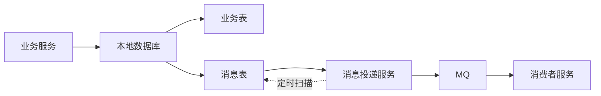

# 本地消息表：可靠消息实现最终一致

## 快速自测：面试官最关心的 3 个问题

> 🟡 **中频常考**，P6/P7 面试可能问

1. **什么是本地消息表？它和 MQ 的事务消息有什么区别？**
2. **本地消息表如何保证消息可靠发送？如何实现最终一致性？**
3. **本地消息表的实现原理是什么？有哪些关键点需要注意？**

---

## 一、本地消息表的核心思想

### 1.1 什么是本地消息表

本地消息表将消息发送和业务操作放在同一个数据库事务中，通过定时任务或轮询机制确保消息被可靠发送。

```
核心思想：

1. 业务操作 + 消息写入同一个本地事务
2. 消息发送成功后，标记消息为已发送
3. 定时任务补偿未发送的消息
4. 通过消息驱动实现最终一致
```

### 1.2 架构图



---

## 二、本地消息表的实现

### 2.1 消息表设计

```sql
-- 消息表结构
CREATE TABLE local_message (
    id BIGINT PRIMARY KEY AUTO_INCREMENT,
    message_id VARCHAR(64) NOT NULL UNIQUE,  -- 消息唯一 ID
    topic VARCHAR(128) NOT NULL,             -- MQ Topic
    tag VARCHAR(64),                         -- MQ Tag
    payload TEXT NOT NULL,                   -- 消息内容
    status VARCHAR(16) NOT NULL DEFAULT 'PENDING',  -- 状态
    retry_count INT DEFAULT 0,               -- 重试次数
    max_retry INT DEFAULT 3,                 -- 最大重试
    error_message TEXT,                      -- 错误信息
    created_at TIMESTAMP DEFAULT CURRENT_TIMESTAMP,
    updated_at TIMESTAMP DEFAULT CURRENT_TIMESTAMP ON UPDATE CURRENT_TIMESTAMP,
    INDEX idx_status_created (status, created_at)
);
```

### 2.2 业务代码示例

```java
@Service
public class OrderService {
    
    @Autowired
    private DataSource dataSource;
    
    @Autowired
    private JdbcTemplate jdbcTemplate;
    
    @Transactional
    public void createOrder(OrderDTO order) {
        // 1. 执行业务操作
        orderDao.insert(order);
        
        // 2. 扣减库存
        inventoryService.deduct(order.getProductId(), order.getQuantity());
        
        // 3. 写入消息表（在同一个事务中）
        String messageId = UUID.randomUUID().toString();
        LocalMessage message = LocalMessage.builder()
            .messageId(messageId)
            .topic("order-created")
            .payload(JSON.toJSONString(order))
            .status("PENDING")
            .build();
        localMessageDao.insert(message);
        
        // 4. 事务提交后，消息一定会被发送（或等待重试）
    }
}
```

### 2.3 消息投递服务

```java
@Service
public class MessageDispatchService {
    
    @Autowired
    private LocalMessageDao localMessageDao;
    
    @Autowired
    private RocketMQTemplate rocketMQTemplate;
    
    private static final int BATCH_SIZE = 100;
    private static final int MAX_RETRY = 3;
    
    /**
     * 定时扫描并发送消息
     */
    @Scheduled(fixedDelay = 1000)
    public void dispatchPendingMessages() {
        // 1. 批量查询待发送消息
        List<LocalMessage> messages = localMessageDao.findPendingMessages(
            BATCH_SIZE, MAX_RETRY);
        
        for (LocalMessage message : messages) {
            try {
                // 2. 发送到 MQ
                rocketMQTemplate.asyncSend(
                    message.getTopic() + ":" + message.getTag(),
                    message.getPayload(),
                    new SendCallback() {
                        @Override
                        public void onSuccess(SendResult result) {
                            // 3. 发送成功，标记消息为已发送
                            localMessageDao.updateStatus(
                                message.getMessageId(), "SENT");
                        }
                        
                        @Override
                        public void onException(Throwable e) {
                            // 4. 发送失败，增加重试次数
                            handleSendFailure(message, e);
                        }
                    }
                );
            } catch (Exception e) {
                handleSendFailure(message, e);
            }
        }
    }
    
    private void handleSendFailure(LocalMessage message, Throwable e) {
        int newRetryCount = message.getRetryCount() + 1;
        if (newRetryCount >= message.getMaxRetry()) {
            // 超过最大重试，标记为失败
            localMessageDao.updateStatus(
                message.getMessageId(), "FAILED", e.getMessage());
        } else {
            // 增加重试次数
            localMessageDao.incrementRetryCount(
                message.getMessageId(), newRetryCount);
        }
    }
}
```

---

## 三、消费者幂等性保证

### 3.1 为什么需要幂等

```
消费者的幂等性：

1. 消息可能重复发送
   - 发送方重试
   - MQ 重试投递

2. 重复消费会导致数据错误
   - 重复扣减库存
   - 重复发放积分

3. 必须保证幂等性
```

### 3.2 幂等实现方案

```java
@Service
public class OrderConsumerService {
    
    @Autowired
    private ConsumerLogDao consumerLogDao;
    
    @Autowired
    private InventoryService inventoryService;
    
    @Autowired
    private PointsService pointsService;
    
    /**
     * 处理订单创建消息
     */
    public void handleOrderCreated(String messageId, OrderDTO order) {
        // 1. 检查是否已处理（幂等）
        ConsumerLog log = consumerLogDao.findByMessageId(messageId);
        if (log != null && "PROCESSED".equals(log.getStatus())) {
            return; // 已处理，直接返回
        }
        
        // 2. 尝试插入处理记录（防止并发）
        try {
            consumerLogDao.insert(ConsumerLog.builder()
                .messageId(messageId)
                .status("PROCESSING")
                .build());
        } catch (DuplicateKeyException e) {
            // 已有记录，说明正在处理或已处理
            return;
        }
        
        // 3. 执行业务逻辑
        try {
            // 发放积分
            pointsService.grantPoints(order.getUserId(), order.getAmount());
            
            // 更新处理状态
            consumerLogDao.updateStatus(messageId, "PROCESSED");
        } catch (Exception e) {
            consumerLogDao.updateStatus(messageId, "FAILED", e.getMessage());
            throw e;
        }
    }
}
```

---

## 四、与事务消息的对比

### 4.1 对比表

| 维度 | 本地消息表 | 事务消息（RocketMQ） |
|------|-----------|---------------------|
| **实现复杂度** | 中 | 中 |
| **消息可靠性** | 高 | 高 |
| **需要 MQ** | 任意 MQ | 需要支持事务消息的 MQ |
| **性能** | 中 | 中 |
| **事务操作** | 本地事务 | MQ 半消息 |
| **补偿机制** | 定时任务 | MQ 自身补偿 |

### 4.2 选择建议

```
本地消息表适用场景：
- 已有 RabbitMQ/Kafka，不支持事务消息
- 需要自己控制补偿逻辑
- 有定制化需求

事务消息适用场景：
- 使用 RocketMQ
- 希望 MQ 自身保证可靠性
- 不想自己实现补偿机制
```

---

## 五、面试题精讲

### 🔴 面试题 1：本地消息表如何保证消息可靠发送？

**答案要点**：

1. **事务保证**：业务操作和消息写入在同一个本地事务
2. **定时扫描**：消息投递服务定时扫描待发送消息
3. **重试机制**：发送失败后重试，超过最大次数后标记失败
4. **幂等保证**：消费者实现幂等性，防止重复消费

### 🟡 面试题 2：本地消息表和事务消息有什么区别？

**答案要点**：

1. **本地消息表**：自己实现补偿逻辑，需要定时任务
2. **事务消息**：MQ 原生支持半消息机制，自己会补偿

---

## 扩展阅读

如果本文档对你有帮助，建议继续阅读：

- [RocketMQ 事务消息](/distributed/transaction/rocketmq-transaction)：事务消息详解
- [分布式事务方案选型](/distributed/transaction/selection)：完整选型指南