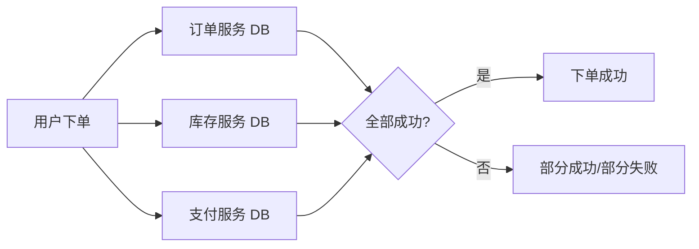

2023年双十一，我们交易系统的对账数据对不上——涉及 47 万笔订单，金额差异高达 820 万元。

复盘发现，问题出在一个"分布式下单流程"：用户下单时，需要同时在订单服务创建订单、库存服务扣减库存、支付服务扣款。这三个操作分散在三个数据库实例上，任何一个环节失败都需要回滚其他两个。

当时团队用的方案是"手动补偿"——出问题后运维同学凌晨三点爬起来人工对账。第二天 CTO 发了全员邮件，那封邮件至今还贴在工位墙上。

这就是分布式事务问题的缩影。在微服务架构下，一次业务操作往往涉及多个服务、多个数据库，任何一个环节的失败都可能导致数据不一致。而"怎么保证跨服务、跨数据库的数据一致性"，是每个后端工程师必须啃下来的硬骨头。

## 一、为什么分布式事务是个伪命题

在说解决方案之前，先搞清楚问题的本质。

单机数据库的事务是怎么实现的？ACID。原子性、一致性、隔离性、持久性，由数据库引擎统一管理，一条 SQL 要么提交要么回滚，数据库自己搞定。

但到了分布式环境，事情变了：

三个服务，三套数据库，没有一个"全局协调者"能一口气把三个数据库的事务都提交或回滚。这不是技术问题，是**物理问题**——网络延迟、分区故障、节点宕机，这些在分布式系统里是常态，不是例外。

### CAP 定理的物理约束

分布式系统领域有个著名的 CAP 定理，由 Eric Brewer 在 2000 年提出，2002 年被 Gilbert 和 Lynch 形式化证明：

- **C（Consistency）**：一致性，每次读取要么拿到最新数据，要么报错
- **A（Availability）**：可用性，每个请求都能收到非错误响应
- **P（Partition tolerance）**：分区容错，系统在网络分区时仍能运行

三条只能同时满足两条。大多数业务系统选择 **CP**——在网络分区时放弃可用性，保证数据一致。为什么？因为数据不一致的代价往往比服务不可用更大。金融、订单、库存，这些场景里，一条错误数据可能导致资损、客诉甚至法律风险。

但 CAP 里的"P"是必须满足的——网络分区在分布式系统里不可避免。所以本质上，我们只能在 C 和 A 之间做权衡，没有银弹。

【架构权衡】

这引出了分布式事务最核心的设计哲学：**不要追求强一致，而是追求最终一致。**

强一致意味着所有节点在同一时刻看到相同的数据，这需要同步等待，在分布式环境下代价极高（后面讲 2PC 时会细说）。最终一致则允许短暂的数据不一致，但在有限时间内收敛到一致状态。

大多数互联网业务场景，最终一致就够了。用户在电商下单后看到"处理中"，过几秒变成"已支付"——用户感知不到底层的数据同步过程，但最终状态是正确的。这叫**业务最终一致**，也叫**柔性事务**。

那什么场景必须强一致？转账、扣款、库存锁定——涉及资金和稀缺资源的操作。这类场景用强一致方案（2PC/3PC），但要接受其性能和可用性代价。

## 二、分布式事务的典型失败场景

理解了背景，再看具体场景。分布式事务的坑主要有三类：

### 2.1 协调者崩溃

事务管理器（Transaction Manager, TM）向各参与者（Resource Manager, RM）发送 Prepare 后崩溃。此时各参与者处于"已 Prepare 但未提交"状态，既不能提交也不能回滚——**处于悬空状态**。

这是 2PC 最著名的问题：**阻塞问题**。参与者必须等待协调者恢复才能决定下一步。如果协调者永远不恢复，这些资源就永远锁死了。

### 2.2 部分参与者失败

假设订单服务 Prepare 成功、库存服务 Prepare 成功，但支付服务 Prepare 失败。协调者要求前两者回滚。但如果此时网络丢包，库存服务的回滚请求没送到——库存扣了但没扣款，数据直接乱了。

### 2.3 时钟漂移与网络超时

分布式系统里没有全局时钟。两个节点对"当前时间"的理解可能差几百毫秒。这导致基于超时的决策不可靠——你以为是超时，其实是对方还在处理。

【架构权衡】

为什么这些场景特别难处理？因为它们违反了"异步网络"的假设。大多数开发者写代码时，默认"发出去的消息一定会送到"、"调用一定会返回"。但在工程现实里，网络是不可靠的：

| 故障类型 | 发生概率 | 后果 |
| --- | --- | --- |
| 网络丢包 | 较高 | 消息丢失，请求重复 |
| 节点宕机 | 中等 | 事务悬空，资源锁死 |
| 网络分区 | 较低但不可避免 | 部分节点不可达 |
| 时钟漂移 | 累积性 | 超时判断失效 |

分布式事务的每一种解决方案，都是在**这些故障假设**下做工程权衡。理解了这些故障，才能理解每种方案的适用场景和代价。

## 三、分布式事务解决方案全景图

目前业界主流的分布式事务解决方案，按强一致程度可以分为几类：

### 3.1 两阶段提交家族

**2PC（Two-Phase Commit）**：强一致，但有严重的阻塞问题。适合对一致性要求极高、并发不高的场景，如跨行转账。

**3PC（Three-Phase Commit）**：在 2PC 基础上加了 CanCommit 和 PreCommit 阶段，用超时机制避免协调者崩溃后的阻塞。代价是网络往返更多，一致性反而更弱（可能脑裂）。

### 3.2 TCC 模式

Try-Confirm-Cancel，把数据库操作拆成三个阶段：
- **Try**：预留资源（冻结库存）
- **Confirm**：确认执行（真正扣库存）
- **Cancel**：撤销操作（解冻库存）

业务侵入性强，但性能好，不阻塞资源。适合性能敏感且能改造业务接口的场景。

### 3.3 Saga 模式

把长事务拆成一连串本地事务，每个本地事务有对应的补偿操作。正向恢复（失败后重试正向）和反向恢复（失败后执行补偿）。

适合长流程、可异步化的场景，如订单履约链路。

### 3.4 最终一致方案

**本地消息表**：把消息和业务操作放在同一个本地事务里，保证消息一定会发送。

**事务消息**：利用 MQ 的半消息机制，RocketMQ、Kafka 都有支持。先发半消息，执行本地事务，提交或回滚消息。

这类方案不保证强一致，但实现简单，性能高，适合大多数互联网场景。

【架构权衡】

| 方案 | 一致性 | 性能 | 业务侵入 | 复杂度 | 适用场景 |
| --- | --- | --- | --- | --- | --- |
| 2PC | 强一致 | 低 | 低 | 中 | 跨库转账、低并发场景 |
| 3PC | 强一致（弱化） | 中 | 低 | 高 | 不推荐 |
| TCC | 最终一致 | 高 | 高 | 高 | 高并发、资源预留 |
| Saga | 最终一致 | 高 | 中 | 高 | 长流程、可补偿 |
| 本地消息表 | 最终一致 | 中 | 中 | 中 | 异步解耦 |
| 事务消息 | 最终一致 | 中 | 中 | 中 | 异步解耦 |

选型逻辑很简单：**先问自己，需不需要强一致？**

- 金融支付、跨行转账：强一致，选 2PC 或 TCC
- 普通订单、库存扣减：最终一致，选 Saga 或事务消息
- 长链路履约流程：Saga，本地消息表或事务消息解耦

## 四、本章小结

分布式事务没有银弹。CAP 定理从物理上决定了强一致和高可用不可兼得。大多数业务场景，最终一致是更务实的选择。

选型的核心问题是：**你的业务能接受多长时间的"数据不一致"？**

如果用户下完单等两秒才能看到确认，这通常可以接受。如果账户余额扣了但订单没生成，那问题就大了。

后面几章，我们逐一拆解每种方案，从原理到源码，从坑点到选型，把分布式事务这个体系彻底打通。

:::tip
选型优先级建议：先评估业务对一致性的真实需求，再评估性能要求，最后评估改造成本。90%的场景最终一致方案就够了，不要过度设计。
:::
