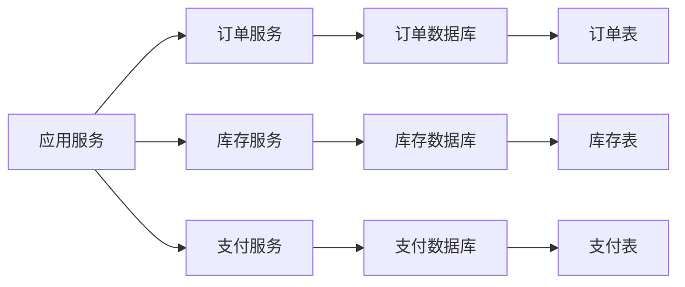
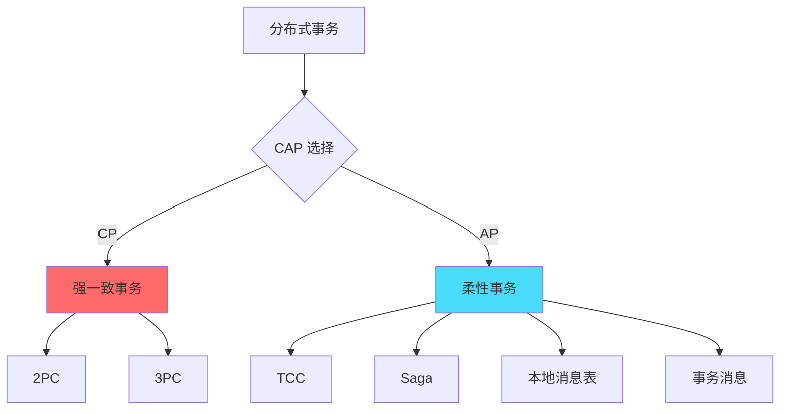
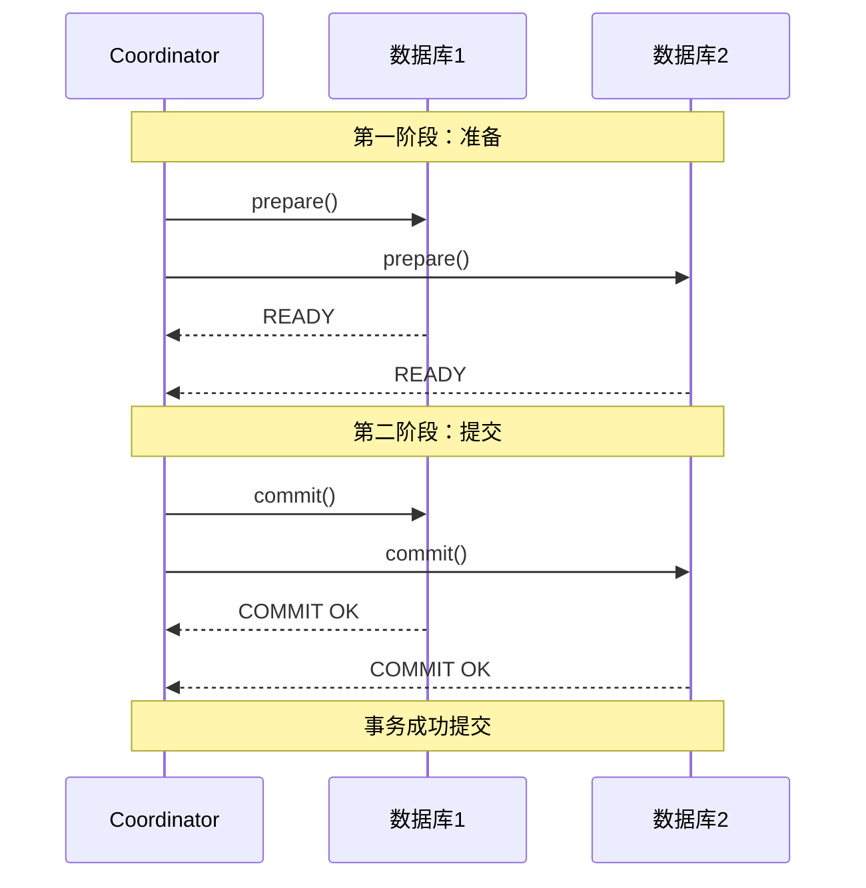
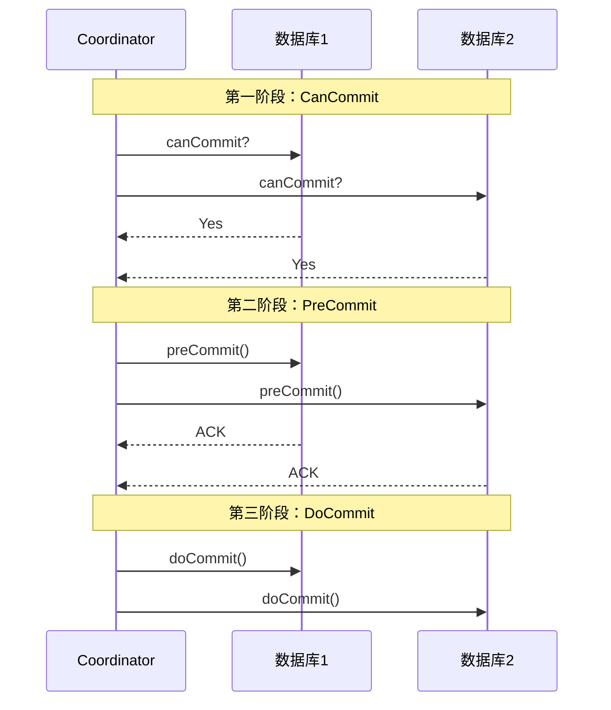
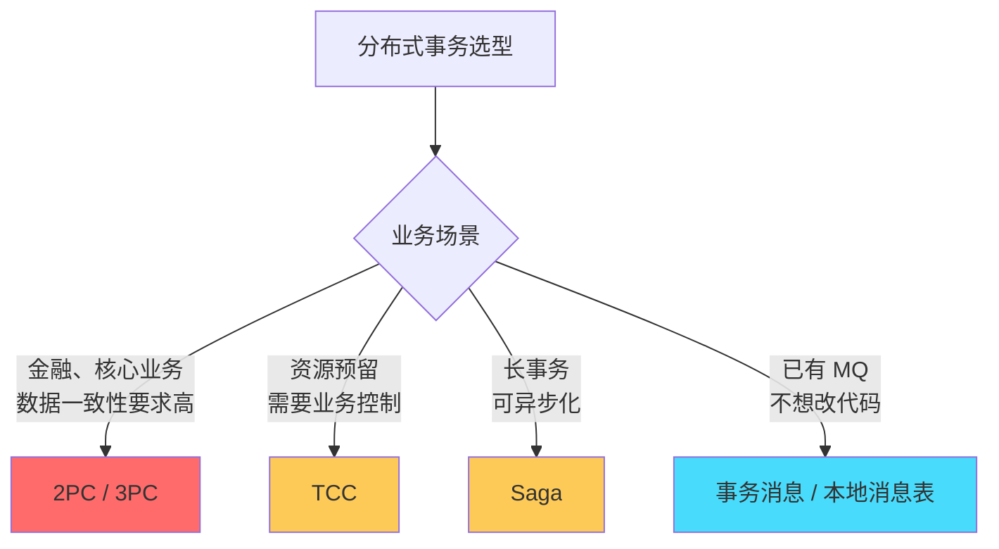

# 分布式事务概述：从本地事务到分布式事务

## 快速自测：面试官最关心的 3 个问题

> 🔴 **高频必考**，P6/P7 面试必问

1. **什么是分布式事务？为什么单体架构下的 ACID 事务无法满足分布式场景？**
2. **分布式事务有哪些解决方案？2PC/TCC/Saga/本地消息表/事务消息各自的特点是什么？**
3. **如何根据业务场景选择合适的分布式事务方案？**

---

## 一、为什么需要分布式事务

### 1.1 从本地事务到分布式事务

在单体架构中，所有操作都在同一个数据库实例中完成，ACID 事务可以轻松保证数据一致性：

```mermaid
graph LR
    A["应用服务"] --> B["单个数据库"]
    
    B --> C["账户A: 1000"]
    B --> D["账户B: 2000"]
    
    A --> C["扣减100"]
    A --> D["增加100"]
    
    Note over A: 本地事务保证原子性
```

但随着业务发展，系统需要跨越多个数据库实例、多个服务，甚至多个数据中心：



### 1.2 分布式事务的问题

**跨服务操作无法用本地事务保证一致性**：

```
问题场景：用户下单

1. 创建订单（订单服务）
2. 扣减库存（库存服务）
3. 扣减余额（支付服务）

如果第 2 步成功，第 3 步失败：
- 订单已创建 ✓
- 库存已扣减 ✓
- 余额未扣减 ✗

数据不一致！
```

### 1.3 CAP 视角下的分布式事务



---

## 二、分布式事务的解决方案全景

### 2.1 方案对比总览

| 方案 | 一致性 | 性能 | 复杂度 | 适用场景 | 代表框架 |
|------|--------|------|--------|---------|---------|
| **2PC** | 强一致 | 低 | 高 | 对数据要求严格的场景 | XA |
| **3PC** | 强一致 | 中 | 高 | 对可用性有一定要求 | - |
| **TCC** | 最终一致 | 中 | 高 | 业务需要预留资源 | Seata TCC |
| **Saga** | 最终一致 | 高 | 中 | 长事务、异步场景 | Seata Saga |
| **本地消息表** | 最终一致 | 中 | 中 | 可异步化的场景 | RabbitMQ |
| **事务消息** | 最终一致 | 中 | 中 | MQ 场景 | RocketMQ |

### 2.2 一致性级别对比

| 方案 | 一致性级别 | 是否实时一致 | 需要业务补偿 |
|------|-----------|------------|-------------|
| **2PC** | 强一致 | 是 | 否 |
| **3PC** | 强一致 | 是 | 否 |
| **TCC** | 最终一致 | 否 | 是（Confirm/Cancel） |
| **Saga** | 最终一致 | 否 | 是（补偿） |
| **本地消息表** | 最终一致 | 否 | 是（定时任务） |
| **事务消息** | 最终一致 | 否 | 否（MQ 自身保证） |

---

## 三、强一致性方案：2PC 与 3PC

### 3.1 2PC（两阶段提交）

2PC 是最经典的强一致分布式事务协议，通过「准备」和「提交」两个阶段来保证跨节点事务的一致性。



### 3.2 3PC（三阶段提交）

3PC 在 2PC 的基础上增加了「PreCommit」阶段，用于解决协调者宕机导致的阻塞问题。



---

## 四、柔性事务方案��TCC、Saga、消息事务

### 4.1 TCC（Try-Confirm-Cancel）

TCC 是一种应用层的柔性事务模式，需要业务方实现三个接口。

```java
// TCC 接口定义
public interface TCCService {
    
    // Try：预留资源
    void tryOperation(@BusinessContext BusinessActionContext ctx);
    
    // Confirm：确认执行
    boolean confirm(BusinessActionContext ctx);
    
    // Cancel：回滚
    boolean cancel(BusinessActionContext ctx);
}
```

**TCC 的三个阶段**：

```
Try：业务检查 + 预留资源
     - 检查业务可行性
     - 预留业务资源（如冻结库存、锁定余额）
     
Confirm：确认执行
     - 使用 Try 阶段预留的资源
     - 执行业务操作
     
Cancel：取消/回滚
     - 释放 Try 阶段预留的资源
     - 恢复业务状态
```

### 4.2 Saga 模式

Saga 将长事务拆分为多个本地事务，通过正向和逆向补偿实现最终一致。


### 4.3 本地消息表

将分布式事务拆分为「本地事务」+「消息发送」，通过定时任务或 MQ 保证最终一致。

```
架构：
1. 业务操作 + 消息写入本地库（同库本地事务）
2. 消息投递服务扫描消息表，发送到 MQ
3. 消费者收到消息后执行业务操作
4. 定时任务补偿未成功发送的消息
```

### 4.4 事务消息

RocketMQ 等 MQ 框架原生支持事务消息，提供半消息机制保证本地事务和消息发送的一致性。

```java
// RocketMQ 事务消息示例
@Transactional
public void createOrder(OrderDTO order) {
    // 1. 执行业务（本地事务）
    orderService.createOrder(order);
    
    // 2. 发送半消息（此时不可见）
    producer.sendMessageInTransaction(
        topic, 
        order.toJson(), 
        new TransactionListener() {
            @Override
            public LocalTransactionState executeLocalTransaction(Message msg, Object arg) {
                // 本地事务成功后，提交消息
                return LocalTransactionState.COMMIT_MESSAGE;
            }
            
            @Override
            public LocalTransactionState checkLocalTransaction(MessageExt msg) {
                // 检查本地事务状态，决定提交或回滚
                return checkTransactionStatus(orderId);
            }
        }
    );
}
```

---

## 五、如何选择分布式事务方案

### 5.1 选型决策树



### 5.2 选型决策表

| 决策因素 | 2PC | TCC | Saga | 消息事务 |
|---------|-----|-----|------|----------|
| **一致性要求** | 强一致 | 最终一致 | 最终一致 | 最终一致 |
| **业务侵入** | 低 | 高 | 中 | 低 |
| **性能开销** | 高 | 中 | 低 | 中 |
| **需要补偿** | 否 | 是 | 是 | 否 |
| **支持回滚** | 是 | 是 | 是 | 否 |
| **代码改造** | 小 | 大 | 中 | 中 |

### 5.3 实际案例

**案例 1：电商下单系统**

```
业务场景：
- 创建订单
- 扣减库存
- 扣减余额
- 发放积分

推荐方案：TCC

原因：
1. 库存和余额需要预留（冻结）
2. 业务逻辑清晰（Try-Confirm-Cancel）
3. 可以接受最终一致性
```

**案例 2：金融转账系统**

```
业务场景：
- 转账双方账户在不同银行
- 数据一致性要求极高
- 延迟可接受

推荐方案：2PC / XA

原因：
1. 金融场景不允许数据不一致
2. 延迟可接受（几秒钟）
3. 需要强一致保证
```

**案例 3：异步对账系统**

```
业务场景：
- 每日对账
- 允许延迟
- 量大

推荐方案：本地消息表 / Saga

原因：
1. 对延迟不敏感
2. 可以批量处理
3. 实现简单
```

---

## 六、面试题精讲

### 🔴 面试题 1：分布式事务有哪些解决方案？

**答案要点**：

1. **2PC/3PC**：通过协调者控制全局事务，强一致但性能差
2. **TCC**：业务层实现 Try-Confirm-Cancel，需要补偿
3. **Saga**：正向/逆向补偿，适合长事务
4. **本地消息表**：本地事务 + 消息队列，需要定时补偿
5. **事务消息**：MQ 原生支持半消息机制

**追问链**：

> **第一层**：分布式事务有哪些解决方案？
> **第二层**：2PC 的原理是什么？有什么问题？
> **第三层**：TCC 和 Saga 有什么区别？

### 🟡 面试题 2：TCC 的空回滚和防悬挂是什么？

**答案要点**：

1. **空回滚**：Try 未执行时，Cancel 不应回滚
2. **防悬挂**：Try 超时未返回时，Cancel 先执行，后续 Try 不应再执行
3. **解决**：通过事务状态表记录状态

---

## 七、实战思考题

### 思考题 1：分布式事务的 CAP 选择

为什么大多数分布式事务方案选择 BASE 而不是强一致？

### 思考题 2：Seata 的 AT 模式

Seata 的 AT 模式和 TCC 模式有什么区别？

---

## 扩展阅读

如果本文档对你有帮助，建议继续阅读：

- [2PC 两阶段提交](/distributed/transaction/2pc)：强一致事务协议
- [TCC 原理](/distributed/transaction/tcc)：应用层柔性事务
- [Saga 事务](/distributed/transaction/saga)：补偿型事务
- [分布式事务方案选型](/distributed/transaction/selection)：完整的选型指南